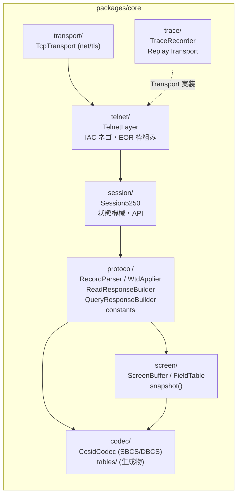
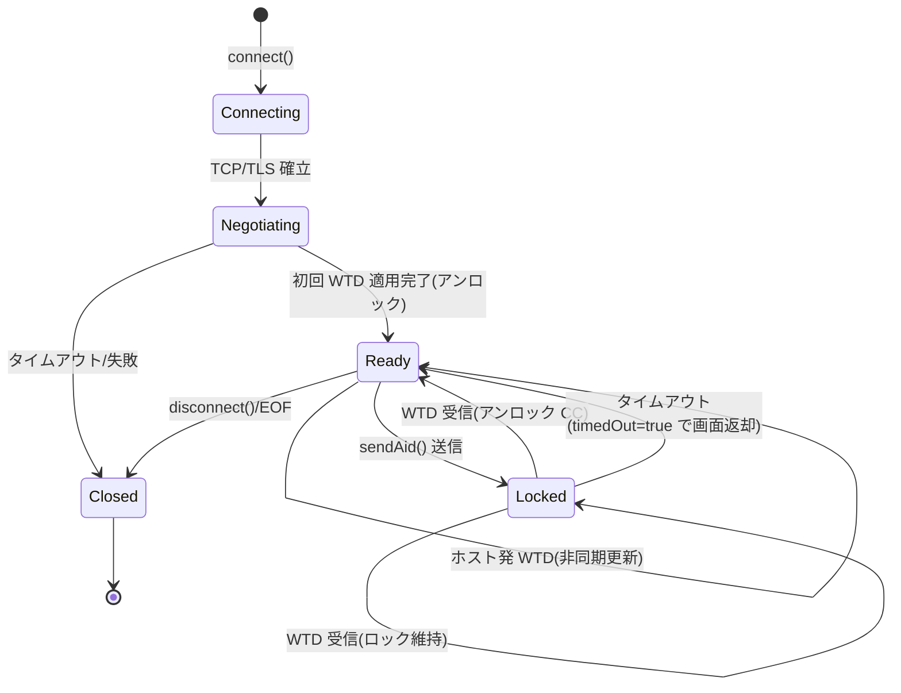
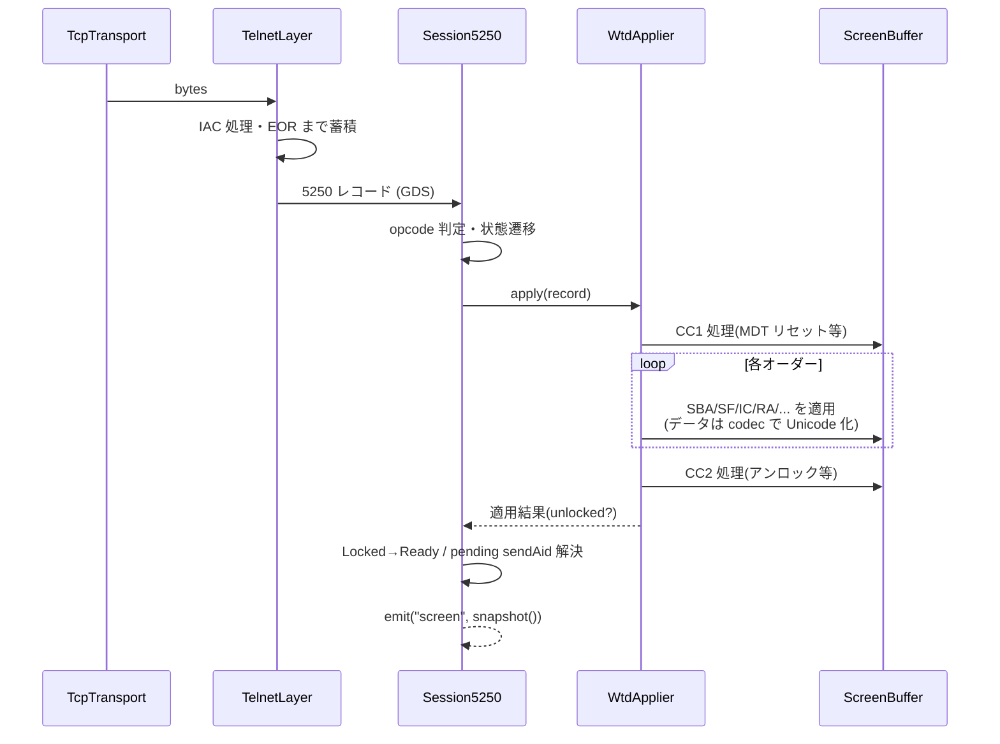

# 設計: AS400 5250 MCP サーバー ＋ Web エミュレーター

作成日: 2026-07-15。spec.md（承認済み）の設計判断 D1〜D10 を前提とする。

## アーキテクチャ概要

3 パッケージ（core / server / web-ui）＋生成ツール（tools/gen-tables）。
本書は主に **core の内部構造**（プロトコル実装の分割）と **server / web-ui のモジュール分割**を固める。

core の設計原則:

1. **ピュアロジックと I/O の分離**: パーサ・画面モデル・変換は Node API 非依存の純粋モジュールとし、
   socket 依存は `Transport` 実装 1 か所に閉じ込める。テストはモック Transport（リプレイ）で回す。
2. **単一方向のデータフロー**: bytes → (telnet 分離) → 5250 レコード → (パース) → 画面モデル更新 →
   snapshot イベント。逆方向（送信）は 画面モデル＋AID → Read 応答ビルド → レコード → bytes。
3. **画面モデルが唯一の真実**: セルは Unicode で保持し、送信時に再エンコードする
   （EBCDIC 生バッファの並行保持はしない。理由は「設計判断」参照）。

## コンポーネント / モジュール

### packages/core

| モジュール | 責務 | 依存 |
|---|---|---|
| `transport/` | `Transport` インターフェース（`send(bytes)` / `onData` / `close`）と `TcpTransport`（net/tls、TLS オプション処理）。**Node 依存はここだけ** | node:net, node:tls |
| `telnet/TelnetLayer` | IAC コマンド処理（DO/WILL ネゴ状態機械: BINARY/EOR/SGA/TERMINAL-TYPE/NEW-ENVIRON）、IAC 0xFF エスケープ解除/付与、IAC EOR によるレコード切り出し。出力=完全な 5250 レコード | transport |
| `protocol/constants` | コマンド/オーダー/AID/FFW/FCW/属性バイトの定数と型（SC30-3533-04 の名前をそのまま使う） | なし |
| `protocol/ByteReader` `ByteWriter` | レコードの逐次読み書き（GDS ヘッダ: LL・レコード種別・opcode） | なし |
| `protocol/WtdApplier` | WTD/CLEAR/SAVE/RESTORE 等のコマンド＋オーダー（SBA/SF/SOH/IC/RA/EA/TD/MC）を解釈し **ScreenBuffer に適用**する。CC1/CC2 制御文字（キーボードアンロック・MDT リセット等）の解釈を含む | constants, screen, codec |
| `protocol/ReadResponseBuilder` | カーソルアドレス＋AID＋MDT フィールドから Read MDT Fields 応答レコードを構築（Unicode→EBCDIC 再エンコード、DBCS は SO/SI 付与） | screen, codec |
| `protocol/QueryResponseBuilder` | WSF 5250 QUERY への Query Reply（画面サイズ・DBCS 能力の広告） | constants |
| `screen/ScreenBuffer` | cells 固定グリッド（Cell[]）、バッファアドレス⇔行/桁変換、24x80/27x132 切替、カーソル、`FieldTable`（SF で構築、setField 検証、MDT 管理）、`snapshot()`（マスク適用・イミュータブル化） | codec（DBCS 幅計算） |
| `codec/CcsidCodec` | CCSID ごとの EBCDIC⇔Unicode。SBCS 単純表引き＋EBCDIC_STATEFUL（SO/SI）ストリームデコーダ/エンコーダ。生成テーブル（`tables/ibm37.ts` 等）を注入 | tables |
| `session/Session5250` | 全体のオーケストレーション。状態機械（下記）、`connect/setField/sendAid/disconnect/snapshot`、`waitForScreen()`（screen イベント＋条件マッチャ。wait_screen の実体）、イベント発火（screen/closed）、タイムアウト管理、`fetchJobInfo()`（SysReq→「3」→DSPJOB 画面のラベル走査で抽出→F3 復帰・復帰検証・キャッシュ。実行中は他操作をブロック） | 全部 |
| `trace/` | `TraceRecorder`（方向付き JSONL、送信レコードの入力データ伏字化）、`ReplayTransport`（JSONL を Transport として再生。テスト用） | transport IF |

### packages/server

| モジュール | 責務 |
|---|---|
| `SessionManager` | sessionId(UUID)→Session5250 の Map、上限（既定 8）、アイドルタイマー（既定 30 分）、全クローズ。**readOnly フラグ**をセッション単位で保持し、set_fields/signon/run_steps と PageUp/Down 以外の AID を `READ_ONLY_SESSION` で拒否（MCP/WS 共通の入口ゲート） |
| `audit` | 監査ログ（D14）: 全 MCP ツール呼び出し・WS 操作を pino/stderr に構造化記録（操作種別・sessionId・フィールド**座標のみ**・結果・所要時間。値は記録しない）。mcp/ と ws/ の共通ミドルウェア |
| `profiles` | profiles.json の読込・zod 検証・`passwordEnv` 解決。API 露出用のサニタイズ（name/host のみ） |
| `signon` | 自動サインオンヒューリスティック（最初の非 hidden 入力欄=user、最初の hidden=password → Enter）。明示座標指定対応。失敗時は無害スキップ。**open_session（profile 指定時）と `signon` ツールの両方から共用**（D13: 資格情報はこのモジュール内で解決し、外に返さない） |
| `format/screenText` | ScreenSnapshot → MCP テキスト形式（spec の固定フォーマット）。cells 平坦化＋フィールド一覧 |
| `mcp/` | McpServer 生成、**10 ツール**登録（open/close/list_sessions・get_screen・**wait_screen**・set_fields・send_key・**run_steps**・**signon**・get_job_info。zod 入力スキーマ＋outputSchema）、text+structuredContent 応答組み立て（include/rows の体裁絞り込みは format/screenText に実装）。HTTP 側は `@hono/mcp` の StreamableHTTPTransport、stdio 側は SDK 内蔵 StdioServerTransport |
| `ws/` | Hono の `upgradeWebSocket`（`@hono/node-server` 内蔵、内部は ws の noServer）ハンドラ。1 接続 1 セッション、open/key/close 処理、screen push、切断時クリーンアップ |
| `app` | **Hono** アプリ組み立て（serve-static・/api/profiles・/mcp（@hono/mcp）・/ws upgrade、`@hono/zod-validator`）、CLI（`--http [port]` / `--stdio` / `--profiles <path>`）、stderr ロガー（pino、stdout 禁止） |

### packages/web-ui

Vue 3（Composition API・`<script setup>`）で構成する（D7 改訂 2026-07-15）。

| モジュール | 責務 |
|---|---|
| `stores/sessions` | **セッションごと**の状態（ScreenSnapshot、ローカル編集 fieldIndex→value、カーソル位置、接続状態、専用 ws-client インスタンス）を `Map<sessionId, SessionState>` で保持。アクティブビュー（接続画面 ⇄ ワークスペース）も管理（Pinia は入れない） |
| `stores/workspace` | **分割ツリー**（ノード = 縦/横分割（比率）or タブグループ（sessionId[]＋アクティブタブ））、フォーカスペイン、D&D 進行状態（ドラッグ中タブ・ドロップ候補領域）。狭幅時は単一グループへ自動フォールバック |
| `stores/settings` | ブラウザ保存の接続設定（localStorage 永続化・読込時に zod 検証・**認証情報は保持しない**）。作成/編集/複製/削除、最終接続日時の記録 |
| `stores/log` | 操作ログのリングバッファ（500 件・全セッション共有）。各エントリに **sessionId タグ**を付与。ws-client の送受信フックから記録し、**hidden フィールド値は格納前に伏字化**。key→screen の往復時間算出、JSONL エクスポート |
| `ws-client` | WS 接続・再接続なし（切断=セッション終了表示）、メッセージ型定義（server と共有: core の型を import）。送受信を stores/log へフック |
| `components/Workspace` | 分割ツリーを flex ネストで描画。ディバイダの Pointer Events ドラッグで比率更新、タブの D&D（中央=グループ移動 / 上下左右端=新規分割。5 領域ドロップハイライトのオーバーレイ表示）。タッチは長押しドラッグ |
| `components/PaneTabs` | 各ペイン上部のタブバー（セッション名・切断状態表示・閉じる・ドラッグハンドル）。タブから **SessionInfo ポップオーバー**を開く |
| `components/SessionInfo` | セッション情報ポップオーバー: 受動情報（デバイス名・ユーザー・ホスト/TLS・CCSID・接続時刻・送受信数）＋「ジョブ情報を取得」ボタン（WS 経由で `fetchJobInfo` を要求、結果 `番号/ユーザー/ジョブ名` を表示・コピー・stores/sessions にキャッシュ。keyboardLocked 中は無効） |
| `components/ScreenGrid` | snapshot→行コンポーネント（`v-for` + 行データの参照同一性 / `v-memo` で未変更行の再評価を抑止）。行内は ``(出力ラン)/`<input>`(フィールド) のインライン生成。属性→CSS class、DBCS `2ch` 幅、SO/SI・属性桁はスペース span。**ペイン幅に応じたフォントサイズ自動フィット**（`paneWidth/cols` 起点・ResizeObserver 監視・下限未満は横スクロール）。**フィールド `<input>` は v-model 禁止**: `:value`＋`beforeinput`（バイト長/型検証・拒否）＋`compositionstart/end`（IME 変換中はホスト push の DOM 反映を保留）で手動制御 |
| `components/CursorOverlay` | ブロックカーソルのオーバーレイ表示・クリック/矢印キーでの移動 |
| `composables/useTheme` | テーマ切替（`system`/`light`/`dark`・localStorage 永続・`prefers-color-scheme` 追従）。ルート要素の `data-theme` 属性と CSS カスタムプロパティのトークン差替えで実現。5250 の 7 色はテーマ別トークン（ダーク=フォスファ既定配色 / 通常=ペーパー調・暗色系 7 色）。切替ボタンはセッションバー右端に配置 |
| `composables/useKeymap` | キーイベント→AID（Enter / F1-F24（Shift+F1-12=F13-24）/ PageUp/Down）、Home/End/矢印/Tab のローカルカーソル・フィールド操作、**ローカル編集キー**（Field Exit=右詰め調整含む / Erase EOF / Erase Input。バインドは設定可能）、AID 時に `{key, cursor, fields(変更分)}` を送出。**捕捉対象は常にフォーカス中ペインのセッションのみ** |
| `components/ConnectView` | 接続画面: サーバープロファイル（`GET /api/profiles`・読み取り専用・自動サインオンバッジ）とブラウザ保存設定（stores/settings）の統合一覧（出所バッジ・最終接続日時順）＋新規/編集フォーム（**周辺 UI は v-model 使用可**） |
| `components/StatusBar` | OIA 相当のステータス行（接続状態・keyboardLocked・カーソル位置・画面サイズ・TLS）とタッチ用ファンクションキーバー（F1–F12 / ⇧で F13–24 面切替） |
| `components/LogPanel` | 画面下部の折りたたみドロワー。stores/log の表示・フィルタ（送信/受信/エラー・**セッション別**）・往復時間表示・JSON 展開・クリア/JSONL ダウンロード |

キーイベントの捕捉方針（spec「Web UI の描画方式」の要件）:

- web-ui は**単一ページの SPA**（Vite の単一 index.html＋WS 駆動の DOM 更新。ページ遷移・リロードなし）。
- 画面エリア（グリッドおよび内部の `<input>`）にフォーカスがある間、keymap が `keydown` を
  capture フェーズで捕捉し、対象キー（F1-F24・Enter・PageUp/PageDown・Home・End・Tab・矢印）は
  `preventDefault()` してブラウザ既定動作（F1 ヘルプ・F5 リロード・スクロール等）を抑止する。
- ホスト送信: F1-F24（Shift+F1-12=F13-24）・Enter・PageUp/PageDown → AID。
  ローカル処理: Home（ホームポジション＝最初の入力フィールド先頭へ）・End（フィールド内入力末尾へ）・
  Tab/Shift+Tab（フィールド巡回）・矢印（カーソル移動）。
- 画面エリア外（接続フォーム等）にフォーカスがある間は捕捉しない（通常のブラウザ操作を妨げない）。

### tools/gen-tables

- 入力: リポジトリ同梱の `.ucm`（ibm-37 / 930 / 939 / 1399、Unicode License V3 表記を LICENSE に併記）。
- 出力: `packages/core/src/codec/tables/*.ts`。SBCS は長さ 256 の `Uint16Array`（EBCDIC→UTF-16）＋逆引き `Map`、
  DBCS はコードポイント→2 バイトの `Map`（ソースは number リテラル配列で生成しサイズ抑制）。
- 実行: `npm run gen:tables`（生成物はコミットする。ビルド毎の再生成は不要、.ucm 更新時のみ）。

## インターフェース / データモデル

主要型は spec.md で確定済み（ScreenSnapshot / Cell / Field / ConnectOptions / AidKey / WS メッセージ）。
design での追加確定:

- **共有型の置き場所**: ScreenSnapshot 等の型と WS メッセージ型は core からエクスポートし、
  server / web-ui が import する（web-ui は型のみ import。core の実装コードはバンドルしない）。
- **バッファアドレス**: 内部は 0 始まりの線形アドレス（`addr = row*cols + col`）。
  対外 API（snapshot/MCP/WS）は 1 始まりの row/col。変換は ScreenBuffer 内に閉じる。
- **Cell は構造体プール不要**: 27x132=3564 セル程度。snapshot 毎にプレーンオブジェクト生成で十分
  （早すぎる最適化をしない）。snapshot は `structuredClone` ではなく生成時に新規構築。
- **エラー**: `class Tn5250Error extends Error { code: ErrorCode }`。ErrorCode は spec の
  SCREAMING_SNAKE 一覧。server はこれを MCP `isError` / WS `error` に変換する共通ヘルパを持つ。

## 処理フロー / シーケンス

### セッション状態機械

- `setField` は Ready でのみ許可。Locked 中は `KEYBOARD_LOCKED`。
- Locked 中もホストからの WTD は画面に適用し続ける（複数レコードで画面が組まれるケース）。
- sendAid の完了判定は「キーボードアンロックを指示する CC を含む WTD の適用完了」。

### 受信経路（1 レコードの処理）

### 送信経路（sendAid）

1. `fields`（あれば）を `setField` で反映（検証込み）→ 2. カーソル移動（指定時）→
3. `ReadResponseBuilder` が「カーソルアドレス(2B)＋AID(1B)＋MDT フィールド（SBA＋再エンコード済みデータ）」を構築 →
4. TelnetLayer が IAC エスケープ＋EOR 付与して送信 → 5. 状態 Locked、アンロック WTD 待ち（タイムアウト付き）。

## 設計判断

| 判断 | 採用 | 退けた代替案と理由 |
|---|---|---|
| 画面データの保持形式 | **Unicode セルのみ**（送信時再エンコード） | EBCDIC 生バッファ並行保持: 二重管理で不整合リスク。入力値はそもそも Unicode で来るため、往復変換の非可逆性は「未変更フィールドは送らない（MDT）」ことで実害なし |
| パーサの構え | **手続き型の逐次リーダ**（ByteReader＋switch） | ジェネレータ/宣言的パーサコンビネータ: 5250 はレコード完結・可変長バイナリで、素直な switch が最も追いやすく SC30-3533 との対照レビューが容易 |
| Transport 抽象 | **interface + TcpTransport/ReplayTransport** | socket 直結: リプレイテスト（D10）が成立しない。抽象は 3 メソッドの薄さに留める |
| telnet とプロトコルの分離 | **TelnetLayer が完全な 5250 レコードだけを渡す** | 一体実装: IAC エスケープとレコード解釈が混ざるとテスト不能。RFC 1205（telnet 層）と SC30-3533（データストリーム層）の文書境界に一致させる |
| HTTP フレームワーク | **Hono**（`@hono/node-server`＋公式 `@hono/mcp`＋内蔵 WebSocket＋serve-static）〔2026-07-15 改訂〕 | express: 「MCP SDK サンプルが express 前提」が採用理由だったが、公式 `@hono/mcp` の存在で消滅。Hono は ESM/TS ファーストで方針と整合し、MCP/WS/静的配信/zod が 1 つに揃う。@hono/mcp のステートレス志向は、セッションを自前 SessionManager で持つ本設計と競合しない。Fastify: 同前（性能要件なし） |
| 入力スキーマ検証 | **zod**（MCP SDK v1 の標準）を server 全域（profiles/WS メッセージ=@hono/zod-validator）に使う | ajv 等の併用: 依存を増やさない |
| web-ui フレームワーク | **Vue 3 + Composition API**〔2026-07-15 改訂〕。グリッド入力は v-model 禁止（`:value`＋beforeinput＋composition イベント手動制御） | 素の TS＋自前 store: 当初案。グリッド描画だけなら足りるが、周辺 UI・状態管理は Vue が簡潔。懸念だった再描画は 3.5k セル規模で問題なし。v-model をグリッドに使わないのは、IME 変換中のホスト push による DOM パッチで未確定文字列が壊れる・beforeinput 検証と方向が合わない・snapshot/編集差分の分離が崩れるため |
| web-ui の状態管理 | **Vue reactive の小さな store 群**（sessions / workspace / settings / log。Pinia なし） | Pinia: この規模に対して過剰。store はプレーンな reactive オブジェクト＋関数で足りる |
| ペイン分割の実装 | **自作の分割ツリー**（flex ネスト＋Pointer Events。ディバイダ・タブ D&D・ドロップ判定を一体実装）〔2026-07-15 追加〕 | splitpanes 等: リサイズしか提供せず、タブのドック D&D は結局自作になる。golden-layout: 重量級で Vue 3 ネイティブでなく、5250 グリッドのフィット制御と噛み合わない。必要な機能は「2 種のノードを持つ木＋比率」だけで小さい |
| マルチセッションの WS | **1 WS = 1 セッションを維持**し、ペイン数だけ並列接続〔2026-07-15 追加〕 | 1 本への多重化: フレームにセッション ID を載せる独自プロトコル層が増える割に、同時 8 セッション規模では接続数は問題にならない。切断の影響もセッション単位に隔離される |
| グリッド再描画 | **画面更新毎に行単位で再構築**（行コンポーネント＋参照同一性/`v-memo`） | セル単位差分更新: 5250 は画面単位更新が基本で、3.5k セルの再構築は十分速い。複雑さに見合わない |
| テーブル生成物 | **コミットする**（gen は .ucm 更新時のみ） | ビルド毎生成: クローン直後のビルドを単純化。生成物のレビュー可能性も確保 |
| テスト | **vitest**（モノレポ共通）、core はリプレイ JSONL による回帰が主軸 | jest: ESM/TS 設定コスト。vitest は Vite（web-ui）と設定を共有できる |
| ビルド | core/server=**tsc**（ESM）、web-ui=**Vite**。Node >= 20 | tsup/esbuild バンドル: 配布形態が未定の段階では素の tsc で十分 |

## 横断的関心事

- **ロガー**: pino を stderr destination 固定で core/server 共通ラッパ（`log.ts`）経由に統一。
  レベルは `LOG_LEVEL` 環境変数。**console.log 禁止**（lint ルール `no-console` で強制）。
- **秘匿情報**: パスワードは (1) profiles の passwordEnv 参照 (2) signon 実行時の setField
  （hidden フィールド）(3) trace の伏字化、の 3 点でのみ触れる。ログ出力オブジェクトに
  value を含めない規約（Field のログは index/座標/長さのみ）。
- **ESM 統一**: 全パッケージ `"type": "module"`。core は `exports` マップで型と実装を公開。

## plan への申し送り

1. **実装順序**（依存順・research 示唆と一致）:
   ① モノレポ scaffold（workspaces/tsconfig/vitest/lint）
   ② gen-tables＋codec（ibm-37 SBCS のみ先行）
   ③ transport＋TelnetLayer（ネゴシエーション、実機 PUB400 で疎通確認＋trace 採取）
   ④ protocol constants＋ByteReader＋WtdApplier＋ScreenBuffer（SBCS・trace リプレイでテスト）
   ⑤ Session5250 状態機械＋ReadResponseBuilder（サインオン→メニュー遷移が通る）
   ⑥ server: SessionManager＋MCP 6 ツール（stdio）→ **受け入れ基準の MCP 系 3 項目がここで検証可能**
   ⑦ WS＋web-ui（グリッド描画・キー操作）→ Web 系基準の検証
   ⑧ DBCS（930/939/1399 テーブル・SO/SI セル・DBCS 入力・IBM-5555 端末タイプ）
   ⑨ TLS・27x132・QUERY 応答・カラー/属性の網羅
   ⑩ 自動サインオン・プロファイル・Streamable HTTP・仕上げ（受け入れ基準残り）
2. **subtask 分割の候補**（規模が大きく 1 PR 想定なら schema 3 の subtask 化を plan で判定）:
   `01-core-sbcs`（②〜⑤）/ `02-server-mcp`（⑥）/ `03-web`（⑦）/ `04-dbcs-tls`（⑧⑨）/ `05-signon-polish`（⑩）。
   依存は直列（01→02→03→04→05。04 は 02 完了後なら 03 と並行可）。
3. **早期に実機 trace を採る**こと（③ の時点で PUB400 サインオン画面の JSONL を確保）。
   以降の④⑤はオフラインで進められ、PUB400 の接続制限・週次再起動の影響を受けない。
4. DBCS 端末タイプ名（IBM-5555-x0x）の最終確定は ⑧ の冒頭で RFC 4777 表＋PUB400 受理確認で行う
   （spec の残課題。却下されたら 3477/3179＋CCSID のみで DBCS を試す代替経路も試す）。
5. web-ui の等幅 CJK フォントスタックは ⑦ で実測選定（全角=半角×2 が崩れるフォントの除外）。
