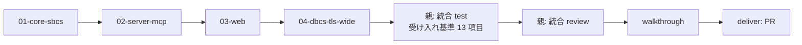

# 計画: AS400 5250 MCP サーバー ＋ Web エミュレーター（親メタ計画）

作成日: 2026-07-15。spec.md（D1〜D14）・design.md（承認済み）を前提とする。

## 実装方針

- **subtask 分割（schema 3）で 1 PR のまま漸進実装する**。規模（core だけで 6〜10 人週規模）と
  結合度（server→core、web→server、DBCS は横断）から、「相互依存で共同検証のみ可・大規模」に該当
  （protocol 2.8）。ユーザー承認済み（2026-07-15、4 分割案）。
- **trace ファースト戦略**: 01 の序盤で PUB400 実機からデータストリーム trace（JSONL）を採取し、
  以降のパーサ・画面モデル開発はリプレイテストでオフライン駆動する（PUB400 の接続制限・週次再起動の回避）。
- SBCS（英語）で縦に貫通させてから（01→02→03）、DBCS/TLS/ワイド画面を横断適用する（04）。

## subtask 構成（割れ目の凍結 — 子 plan は scope を再決定しない）

| # | subslug | scope（これが唯一の境界定義） | 依存 |
|---|---------|------|------|
| 01 | `01-core-sbcs` | モノレポ scaffold（workspaces/tsconfig/vitest/eslint(no-console)/pino ラッパ）、tools/gen-tables（.ucm→TS。**ibm-37 のみ**）、codec（SBCS）、transport/TcpTransport（**平文のみ**。TLS は 04）、telnet/TelnetLayer（ネゴ・EOR・IAC。端末タイプ IBM-3179-2 固定）、protocol（constants/ByteReader/Writer/WtdApplier の SBCS サブセット/ReadResponseBuilder）、screen/ScreenBuffer（24x80 のみ）、session/Session5250（状態機械・connect/setField/sendAid/disconnect/snapshot。**waitForScreen/fetchJobInfo は 02**）、trace/TraceRecorder＋ReplayTransport、**PUB400 サインオン画面 trace の採取**。検証=リプレイ回帰＋PUB400 で SBCS サインオン→メニュー遷移 | なし |
| 02 | `02-server-mcp` | core 追補: `waitForScreen()`・`fetchJobInfo()`（SysReq→DSPJOB 抽出→F3 復帰）。server パッケージ全体: SessionManager（上限・アイドル・**readOnly ゲート**）、profiles（zod・passwordEnv）、signon（共用モジュール・D13）、audit（D14）、format/screenText（include/rows 絞り込み込み）、Hono app（serve-static/healthz/version/api/profiles・CLI・stderr ロガー統合）、**MCP 10 ツール**（stdio＋@hono/mcp Streamable HTTP）。検証=ユニット＋MCP クライアント（stdio）で PUB400 サインオン→メニュー E2E（受け入れ基準の MCP 系） | 01 |
| 03 | `03-web` | server: ws/ ハンドラ（open/key/jobinfo/close・screen push・readOnly）。web-ui パッケージ全体: Vue3 scaffold（Vite）、stores（sessions/workspace/settings/log）、ScreenGrid（v-memo・フォント自動フィット・v-model 禁止規約・IME ガード）、CursorOverlay、Workspace（分割ツリー・D&D・ディバイダ）、PaneTabs、SessionInfo、ConnectView、StatusBar（OIA＋F キーバー）、LogPanel（マスク・JSONL）、useKeymap（捕捉・ローカル編集キー Field Exit/Erase EOF/Erase Input）、useTheme（通常/ダーク・7 色×2 トークン）。検証=コンポーネントテスト＋ブラウザで PUB400 操作（受け入れ基準の Web 系 SBCS 分） | 02 |
| 04 | `04-dbcs-tls-wide` | codec: ibm-930/939/1399 テーブル生成＋EBCDIC_STATEFUL（SO/SI）、screen: SO/SI・DBCS セル（kind/2 桁）、DBCS フィールド入力（バイト長検証・FCW）、端末タイプ IBM-5555 系（RFC 4777 表＋PUB400 受理確認。冒頭で実施）、transport: TLS（証明書検証既定 ON）、27x132（CLEAR UNIT ALTERNATE・IBM-3477-FC）、WSF QUERY 応答、web: CJK 等幅フォント実測選定・2ch 描画検証、MCP テキストの DBCS 桁維持確認、**core フィールド入力内容検証（型/コードページ）・SO/SI 表示トグル**（04 decisions D4） | 03 |
| 05 | `05-field-edit-keyboard` | 〔2026-07-15 追加・04 decisions D4〕web フィールド編集の忠実化: 自前編集モデル（上書き既定・Insert トグル・5250 流バックスペース・DBCS バイト長厳密化・入力中 SO/SI 桁維持）、キーバインド編集、カタカナ⇔英小文字の表示トグル | 04 |
| 06 | `06-gui-controls` | 〔2026-07-15 追加・親 decisions D2〕拡張 5250 GUI コントロール: Query Reply で enhanced 広告、WSF GUI 構造体（Define Selection Field=ラジオ/チェック/プッシュボタン、Create Window、Define Scroll Bar、Menu Bar）の解析・HTML 描画・入力送信 | 05 |
| 07 | `07-screen-links` | 〔2026-07-15 追加・親 decisions D2〕画面テキストのリンク化（Web のみ）: メール→mailto、URL→`<a>` リンク | 03 |

- 順序は **01→02→03→04 の直列**（producer→consumer）。
- 境界の補足: ws/ ハンドラは 03（UI と一体で検証するため）。fetchJobInfo は core 実装だが消費者（MCP/WS）駆動のため 02。
  DBCS に触るものはすべて 04（01〜03 では CCSID 37 固定・DBCS 分岐は TODO コメントではなく型で閉じる）。

## 作業順序と依存関係

1. 01-core-sbcs の plan→coding→test→review（依存: なし）
2. 02-server-mcp の同サイクル（依存: 01 の review 承認）
3. 03-web の同サイクル（依存: 02 の review 承認）
4. 04-dbcs-tls-wide の同サイクル（依存: 03 の review 承認）
5. 05-field-edit-keyboard の同サイクル（依存: 04 の review 承認）〔2026-07-15 追加〕
6. 06-gui-controls の同サイクル（依存: 05 の review 承認）〔2026-07-15 追加〕
7. 07-screen-links の同サイクル（依存: 03 の review 承認）〔2026-07-15 追加〕
8. 親の統合 test（PUB400 E2E・受け入れ基準 13 項目）→ 統合 review → walkthrough → deliver（PR 1 本）

## リスク / 留意点

- **DBCS（04）が最大の技術リスク**（research）。01〜03 で cells/kind・dbcsType 等の**データモデルだけは先に敷いてある**
  （spec 確定済み）ため、04 は実装の追加であって作り直しにならない。
- **PUB400 依存**: 接続数制限・週次再起動（日曜 09:00 UTC）・初回パスワード変更。01 で trace を採取し
  オフライン開発に切替える。実機テストは直列・少接続。アカウントは事前に手動作成・初回サインオン済みにしておく。
- **DSPJOB 画面のレイアウト差**（02 の fetchJobInfo）: ラベル走査で吸収。PUB400 で実画面を確認して合わせる。
- **D&D（03）の複雑さ**: 分割ツリーは自作（設計判断済み）。Workspace は先にキーボード/タブのみで動かし、
  D&D を後付けする順序で子 plan を組むこと（03 の子 plan への指示）。
- **subtask 間の巻き戻り**: 親統合 test で結合起因の不具合が出たら該当 subtask の coding へ差し戻す（protocol 2.8）。

## テスト方針

- **子 subtask の test = 単独検証可能な範囲に限定**（protocol 2.8）: ユニット・trace リプレイ回帰・
  モック WS/MCP クライアント。PUB400 実機は「その subtask の受け入れ範囲の疎通」まで。
- **親の統合 test に集約**: 受け入れ基準 13 項目の全数検証（MCP×Web 同時セッション、DBCS 表示・入力、
  TLS、27x132、カーソル位置 F4、SO/SI 桁位置、カラー再現、自動サインオン）。
  DBCS 検証手順: `CHGJOB CCSID(1399)` → IGCDTA(*YES) ソース PF 作成 → SEU で日本語編集・表示。
- リプレイ資産（JSONL）は `packages/core/test/fixtures/` にコミットし回帰資産とする（伏字化確認済みのもののみ）。
