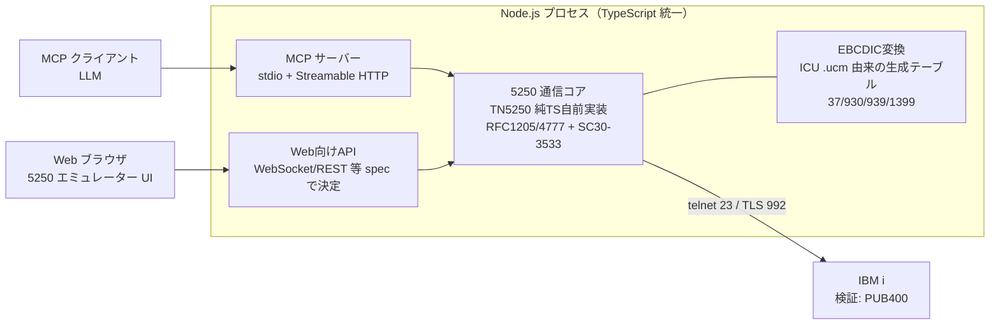

# 調査: 5250 MCP サーバー ＋ Web エミュレーターの実現方式

調査日: 2026-07-15（Web 調査をサブエージェント4本に委譲して実施）

## 調査の問い

- Q1: ACS（IBM i Access Client Solutions）の jar を 5250 通信バックエンドとして利用できるか（ライセンス・ヘッドレス・Node 連携）。
- Q2: Node/TypeScript で使える既存 TN5250 ライブラリはあるか。無い場合の自前実装の規模感と参照実装は。
- Q3: PUB400.com を検証環境として使えるか（接続条件・TLS・日本語 DBCS）。
- Q4: Node.js で日本語 EBCDIC（CCSID 930/939/1399 等）⇔ Unicode 変換をどう実現するか。MCP TypeScript SDK の現状は。

## 判明した事実

### F1: ACS jar は法的・技術的に利用不可（→ 却下）

- acsbundle.jar はプロプライエタリ（LPP 5733-XJ1）。取得にエンタイトルメント同意が必須で、
  **第三者アプリへの同梱・再配布は不可**（Service Pack 条項「Proof of Entitlement を持つ
  Program の一部としてでなければ使用不可」、Toolkit の再配布禁止明文）。
  [IBM: Obtaining ACS](https://www.ibm.com/support/pages/obtaining-ibm-i-access-client-solutions) /
  [IBM: ACS updates](https://www.ibm.com/support/pages/ibm-i-access-acs-updates)
- 公開 API・SDK・Javadoc は存在しない。IBM が認める外部 IF は **EHLLAPI（Windows 専用ブリッジ・
  GUI 起動前提）と HOD マクロ（GUI セッション内）のみ**。ヘッドレス 5250 は非サポート。
  [IBM: ACS 5250 automation support](https://www.ibm.com/support/pages/ibm-i-acs-5250-personal-communications-hacl-automation-object-programming-support) /
  [IBM: EHLLAPI with ACS](https://www.ibm.com/support/pages/ehllapi-access-client-solutions-emulator)
- CLI（`/PLUGIN=5250`）は GUI ウィンドウの表示制御であり、画面内容の取得手段は無い。
- 参考: JTOpen/jt400（IBM Public License 1.0・再配布可）には **5250 表示エミュレーション機能は
  含まれない**（JDBC/IFS/コマンド実行等のみ）。[JTOpen](https://github.com/IBM/JTOpen)

### F2: 実用可能な npm の TN5250 ライブラリは存在しない（→ 純 TS 自前実装が必要）

- npm レジストリに実用レベルの TN5250 クライアントは無し（`tn5250` パッケージは 404、
  PoC が1件、UI コンポーネントのみが1件）。日本語 DBCS 対応の変換パッケージも皆無。
- 参照実装:
  - **GNU tn5250（C・LGPL-2.1）**: 2025 年も活動あり。lib5250 としてパーサ分離。**ポート元の第一候補**。
    [tn5250/tn5250](https://github.com/tn5250/tn5250)
  - **tn5250j（Java・GPL-2.0）**: 0.8.0-beta で **CCSID 930 の実験的 DBCS 対応**。DBCS 実装の
    仕様参考として最有力（GPL のためコード直移植は不可、挙動の参考に留める）。
    [tn5250j releases](https://github.com/tn5250j/tn5250j/releases)
  - IBM の tnz（Python・Apache-2.0）は **3270 専用で 5250 非対応**（除外）。
- プロトコル一次資料: [RFC 1205](https://www.rfc-editor.org/rfc/rfc1205.html)（5250 telnet、
  ネゴシエーション・ヘッダ・オペコード）、[RFC 4777](https://www.rfc-editor.org/rfc/rfc4777.html)
  （TN5250E: デバイス名・自動サインオン・DBCS 端末。RFC 2877 を置換）、
  [SC30-3533-04](https://bitsavers.org/pdf/ibm/5494/SC30-3533-04_5494_Remote_Control_Unit_Functions_Reference_Rel_3.1_1995.pdf)
  （5250 データストリーム完全リファレンス: WTD・各オーダー・FFW/FCW・WSF・DBCS SO/SI・画面サイズ）。
- 自前実装の規模感（推定）: 経験者1名で **6〜10人週**。「サインオン〜メニュー操作（SBCS）」までなら
  2〜3人週。**最大の難所は DBCS**（変換テーブル・SO/SI レイアウト・DBCS フィールド入力規則・
  カーソル制御で 2〜4人週）。WSF/GUI 拡張は Query 応答（端末能力の広告）以外スキップ可能。
  端末タイプは 24x80=IBM-3179-2、27x132=IBM-3477-FC、DBCS=IBM-5555 系を名乗る。

### F3: PUB400 は検証環境として利用可能（DBCS は限定的）

- 無料・メールのみで登録可。サードパーティ 5250 クライアントの利用は公式に想定された形態。
  ホスト `pub400.com`、**ポート 23（telnet）/ 992（TLS）**。TLS 証明書は Sectigo DV
  （CN=pub400.com、2026-09-29 まで有効。openssl で実測確認済み）。
  [pub400.com](https://pub400.com/) / [welcome.pdf](https://pub400.com/welcome.pdf)
- **サインオン画面は標準 QDSIGNON ではなくカスタム**（Your user name / Password の2欄のみ）。
  フィールド位置固定を前提にした自動化は不可 → フィールド検出ベースで操作すること。
- 日本語 DBCS: プロファイルの CCSID 恒久変更は不可（*PGMR 権限）だが、
  **`CHGJOB CCSID(1399)` でセッション中の日本語入出力の動作実績あり**
  （IGCDTA(*YES)・CCSID 1399 のソース PF を自作して検証する）。
  システムメニュー・サインオンは英語のまま。
  [Qiita: PUB400 日本語対応](https://qiita.com/You_name_is_YU/items/b79d8c78a917fe8c2961)
- 制約: 単一 IP からの接続数制限（数値非公開）、毎週日曜 09:00 UTC に再起動（最長2時間）、
  初回サインオンでパスワード変更強制（自動テストは要ハンドリング）。

### F4: EBCDIC 変換は ICU .ucm テーブルからの純 TS 生成が本命。MCP SDK は成熟

- iconv-lite は EBCDIC 全滅（[PR #112](https://github.com/ashtuchkin/iconv-lite/pull/112) が10年放置）。
  node-iconv（libiconv）も日本語 EBCDIC（IBM-930/939/1399）は非対応。glibc iconv は対応するが Linux 限定。
- **ICU 公式の .ucm マッピングテーブル**（[unicode-org/icu-data](https://github.com/unicode-org/icu-data)
  の charset/data/ucm）に `ibm-930_P120-1999.ucm` / `ibm-939_P120-1999.ucm` / `ibm-1399_P110-2003.ucm`
  が存在（IBM 公式 RPMAP 由来・EBCDIC_STATEFUL・SBCS/DBCS 両マッピング完備）。
  **ライセンスは Unicode License V3（パーミッシブ）で同梱・再配布可**。
  ビルド時に .ucm → 純 TS テーブル生成が最も実用的（ネイティブ依存ゼロ・全 OS/ブラウザ動作）。
- CCSID エイリアス: ibm-939 = 931 = **5035**、ibm-930 = 5026、ibm-1399 の DBCS 部 = JIS X 0213。
  → 930/939/1399/37 の4テーブルで主要 CCSID をカバー。
- MCP TypeScript SDK: `@modelcontextprotocol/sdk` **v1.29.0 が本番安定版**（v2 は 2026-07-28 GA 予定・
  ベータ中）。トランスポートは **stdio と Streamable HTTP** が標準（HTTP+SSE は deprecated）。
  ツール結果は text / image（base64 PNG 可）に加え **outputSchema + structuredContent を正式サポート**。
  stdio と HTTP サーバの同一プロセス並走は確立パターン（注意点は stdout 汚染禁止＝ログは stderr のみ）。
  [typescript-sdk](https://github.com/modelcontextprotocol/typescript-sdk) /
  [MCP spec: transports](https://modelcontextprotocol.io/specification/2025-06-18/basic/transports)

## 影響範囲

新規プロジェクトのため既存コードへの影響は無し。本調査の結論はアーキテクチャの根幹
（通信層の実装方式・文字変換方式・API 構成）を確定させる。

## 実現性 / リスク

- **実現性: あり**。ACS jar 案は却下となるが、TN5250 は公開プロトコル（RFC + IBM 公開資料）で、
  純 TypeScript 自前実装に必要な一次資料・参照実装・変換テーブルはすべて揃っている。
- リスク:
  - **DBCS 実装が最大の工数リスク**（SO/SI レイアウト・DBCS フィールド入力・変換テーブル生成）。
    OSS 参照は tn5250j の実験的実装のみ。段階実装（SBCS 先行 → DBCS）でリスクを分離できる。
  - **PUB400 での DBCS 検証は限定的**（CHGJOB + 自作ソース PF レベル。日本語 NLV 画面は不可）。
    データストリームのキャプチャ再生によるオフラインテストを併用すべき。
  - PUB400 の接続数制限・週次再起動 → 自動テストは直列・少接続で設計。
  - tn5250j は GPL のため**コードの直移植は禁止**（挙動・仕様の参考のみ。ライセンス汚染に注意）。

## spec への申し送り

1. **通信方式の決定**: ACS jar は却下。**TN5250 プロトコルの純 TypeScript 自前実装**とする
   （requirement の「ACS jar 優先」は本調査により棄却が確定）。
2. **文字変換**: ICU .ucm（ibm-37/930/939/1399、Unicode License V3）からビルド時に TS テーブルを
   生成する方式。EBCDIC_STATEFUL のステートマシン（SO=0x0E/SI=0x0F）を自前実装。
3. **MCP**: `@modelcontextprotocol/sdk` v1.x（安定版）。stdio + Streamable HTTP の両対応。
   画面情報は outputSchema + structuredContent、必要なら image content も返せる。
   **stdout 汚染禁止**（ログは stderr）を設計規約に。
4. **実装順序の示唆**: telnet ネゴシエーション → SBCS 画面（サインオン〜メニュー）→ AID/入力 →
   DBCS → TLS の段階実装。WSF は Query 応答のみ実装（27x132/DBCS 能力の広告に必須）。
5. **PUB400 前提の設計**: サインオン画面はカスタムレイアウト → 画面操作はフィールド検出ベースで。
   検証手順に CHGJOB CCSID(1399) と IGCDTA ソース PF 作成を含める。
6. 端末タイプ名: 24x80=IBM-3179-2 / 27x132=IBM-3477-FC / DBCS=IBM-5555 系（RFC 1205/4777 の表に従う）。
7. フィールド編集規則（FFW/FCW）は表示系操作に必要なサブセット（bypass/MDT/field type）から実装。
8. 残る未確定（spec で決定）: Web 向け API 形式（WebSocket/REST/SSE）、MCP ツールの画面テキスト表現、
   モノレポ構成・ビルドツール。
