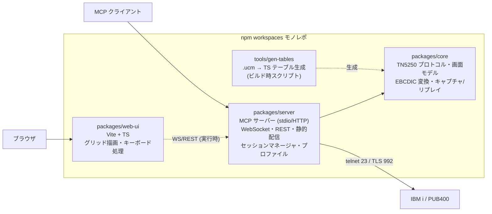
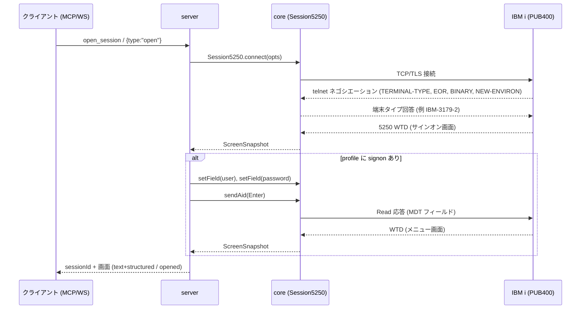

# 仕様: AS400 5250 MCP サーバー ＋ Web エミュレーター

作成日: 2026-07-15（requirement / research 承認済みを前提とする）

## 概要

TN5250 プロトコルを **純 TypeScript で自前実装**した共通通信コア（`core`）の上に、

- **MCP サーバー**（stdio + Streamable HTTP）— LLM から 5250 画面をテキスト＋構造化データで取得・操作
- **Web エミュレーター**（WebSocket + ブラウザ UI）— 人間がブラウザで 5250 画面を表示・操作

の 2 つのフロントを載せる。DBCS（日本語 EBCDIC）は ICU 公式 .ucm テーブルから
ビルド時に生成する純 TS 変換テーブルで対応する。検証環境は PUB400.com。

## 設計方針

research の結論と grilling（2026-07-15、ユーザー承認済み）で確定した決定事項:

| # | 決定 | 理由 |
|---|------|------|
| D1 | 通信層は **TN5250 純 TS 自前実装**（RFC 1205 / RFC 4777 / SC30-3533-04 準拠） | ACS jar はライセンス・技術両面で利用不可（research F1）。実用的 npm ライブラリも不在（F2） |
| D2 | 文字変換は **ICU .ucm（ibm-37/930/939/1399）→ ビルド時 TS テーブル生成** | Unicode License V3 で同梱可。ネイティブ依存ゼロで全 OS・ブラウザで動作（F4） |
| D3 | MCP は **`@modelcontextprotocol/sdk` v1.x（安定版）**、stdio + Streamable HTTP 両対応 | v1.29 が本番安定版。HTTP+SSE は deprecated（F4） |
| D4 | Web 向け API は **WebSocket**（セッション管理の補助のみ REST） | 5250 はステートフル対話型で、ホスト発の非同期画面更新の即時 push と低遅延往復が必要 |
| D5 | MCP の画面情報は **テキスト＋構造化（structuredContent）の併用** | LLM の直感的読解（テキストグリッド）と機械処理（フィールド座標 JSON）を両立 |
| D6 | リポジトリは **npm workspaces モノレポ**（core / server / web-ui） | 通信コアの共有境界を型で強制し、依存方向を明確化 |
| D7 | フロントエンドは **Vite + Vue 3（Composition API）**〔2026-07-15 改訂: 当初「素の TS」→ design 段階レビューで変更〕。ただし**グリッド内の入力フィールドは v-model を使わず** `:value`＋イベント手動制御（IME composition 中のホスト push によるパッチ破壊の回避、beforeinput でのバイト長/型検証、snapshot とローカル編集差分の分離のため。周辺 UI は v-model 可） | 周辺 UI・状態管理の見通しが向上。再描画コストは 3.5k セル規模で問題にならない |
| D8 | 自動サインオンは **RFC 4777 NEW-ENVIRON 方式**（`USER`＋`IBMRSEED` ゼロシード＋`IBMSUBSPW` 非暗号化パスワード）を第一とする。画面フィールド自動入力はフォールバック。**暗号化サインオン（非ゼロシード DES/SHA）は将来拡張**〔2026-07-15 改訂: 01-core-sbcs T13 実機検証で判明。decisions.md D3〕 | 実機（PUB400 / IBM i 7.5）で画面フィールド方式は**バイト一致でも拒否**され、ACS/tn5250j が使う NEW-ENVIRON 自動サインオン（＋WSF Query Reply）が必須と判明。ゼロシードでパスワードは平文送信のため暗号実装は不要。暗号化のみ将来拡張 |
| D9 | ログは **stderr のみ**（stdout は stdio MCP 専用） | stdio トランスポートの stdout 汚染禁止（F4） |
| D10 | 生データストリームの**キャプチャ/リプレイ機構**を core に内蔵 | PUB400 の DBCS 検証が限定的なため、オフライン再生テストを一級市民にする（research リスク対策） |
| D11 | server の HTTP 基盤は **Hono**（`@hono/node-server` + 公式 `@hono/mcp` + 内蔵 WebSocket + serve-static + `@hono/zod-validator`）〔2026-07-15 追加: 当初 express → design 段階レビューで変更〕 | ESM/TS ファーストで方針と整合。MCP・WS・静的配信・zod 検証が 1 フレームワークに揃う。セッション状態は自前 SessionManager 管理のため @hono/mcp のステートレス志向と競合しない |
| D12 | Web UI は**マルチセッションワークスペース**（タブ＋ペイン分割の分割ツリー、D&D で移動・リサイズ）〔2026-07-15 追加〕。WS は 1 接続 = 1 セッションを維持しペイン数だけ並列に張る（多重化しない） | 5250 は画面が小さく、複数セッションの同時視認（監視・突合）ニーズが強い。多重化は複雑化に見合う利点がない（同時 8 セッション規模） |
| D13 | **認証境界原則**〔2026-07-15 追加〕: 認証情報（パスワード）を MCP/WS のツール引数・応答・ログのいずれにも載せない。サインオンは (1) サーバー側プロファイル参照（`open_session {profile}` / `signon` ツール）(2) Web の手動画面入力、の 2 経路に限定 | LLM 経由の `set_fields` でパスワードを渡すと会話履歴・MCP ログに平文が残る。資格情報はサーバープロセス内（passwordEnv）で完結させる |
| D14 | **監査ログ**〔2026-07-15 追加〕: 全 MCP ツール呼び出し・WS 操作を stderr に構造化記録（操作種別・sessionId・対象フィールド座標・結果。**フィールド値は記録しない**） | LLM に業務画面を操作させる以上「誰が何をしたか」の証跡は必須。pino/stderr（D9）の具体化でコスト小 |

## 対象範囲

新規モノレポ。パッケージ構成と依存方向:



- `packages/core`: telnet ネゴシエーション、5250 データストリームパーサ/ビルダ、画面モデル、
  EBCDIC⇔Unicode 変換（SBCS/DBCS ステートフル）、セッション状態機械、キャプチャ/リプレイ。
  **Node 依存は socket 層のみに隔離**（パーサ・画面モデルはピュアロジック）。
- `packages/server`: MCP ツール定義、WebSocket ハンドラ、REST（プロファイル一覧等）、
  web-ui ビルド成果物の静的配信、セッションマネージャ、設定プロファイル読込。
- `packages/web-ui`: 5250 画面のグリッド描画、フィールド入力、キーボード/クリック処理、WS クライアント。
- `tools/gen-tables`: ICU .ucm（リポジトリに同梱: ibm-37/930/939/1399）から TS テーブルを生成。

## インターフェース / データ構造

### 画面スナップショット（共通データモデル）

core が生成し、MCP・WebSocket の両方がそのまま使う唯一の画面表現。

```typescript
interface ScreenSnapshot {
  sessionId: string;
  rows: 24 | 27;                 // 画面サイズ（24x80 / 27x132）
  cols: 80 | 132;
  cursor: { row: number; col: number };   // 1 始まり
  keyboardLocked: boolean;       // ホスト応答待ち中は true
  cells: Cell[][];               // [row][col] 固定グリッド。全セル必ず存在
  fields: Field[];               // 入力フィールド一覧（画面順）
  systemMessage?: string;        // オペレータエラー行（行 25/28）の内容
}

interface Cell {
  char: string;      // 表示文字 1 文字。DBCS 1 文字目 = その文字、2 文字目 = ""（continuation）
  kind: "sbcs" | "dbcs-lead" | "dbcs-tail" | "so" | "si" | "attr";
                     // so/si = シフト制御桁（表示は空白・桁は必ず占有）
                     // attr = 属性バイト桁（表示は空白）
  color: ScreenColor;            // green/white/red/turquoise/yellow/pink/blue
  reverse: boolean;
  underline: boolean;
  blink: boolean;
  columnSeparator: boolean;
  nonDisplay: boolean;           // true のとき char は常に " "（マスク済み）
}

interface Field {
  index: number;                 // get_screen 時点の連番（1 始まり）
  row: number; col: number;      // フィールド先頭（属性バイトの次の桁）
  length: number;
  protected: boolean;            // 入力不可
  hidden: boolean;               // 非表示（パスワード等）。value は常に "" で返す
  numeric: boolean;              // FFW の数字専用シフト
  dbcsType?: "pure" | "open" | "either";  // DBCS フィールド種別（FCW 由来）
  mdt: boolean;                  // 変更済みフラグ
  value: string;                 // 現在値（hidden の場合は空文字固定）
}
```

不変条件:

- `cells[r]` は常に `cols` 個。**SO/SI 桁・属性バイト桁も 1 セルとして保持**し、
  どの行でも桁位置が 1:1 対応する（requirement の SO/SI 桁維持要件）。
- `nonDisplay` セル・`hidden` フィールドの内容は、スナップショット生成時点でマスク済み。
  **core より外側（MCP/WS/ログ）に平文が出る経路を持たない**。

### core のセッション API

```typescript
interface ConnectOptions {
  host: string;
  port?: number;                 // 既定: tls ? 992 : 23
  tls?: boolean | { rejectUnauthorized?: boolean; ca?: string };
  ccsid?: number;                // 既定 37。930/939/1399 で DBCS 有効
  screenSize?: "24x80" | "27x132";   // 既定 24x80
  deviceName?: string;           // RFC 4777 デバイス名（省略時ホスト採番）
}

class Session5250 extends EventEmitter {
  static connect(opts: ConnectOptions): Promise<Session5250>;
  readonly id: string;
  snapshot(): ScreenSnapshot;
  setField(target: { index: number } | { row: number; col: number }, value: string): void;
      // ローカル編集のみ（ホスト送信なし）。protected/長さ超過/型不一致は例外
  sendAid(key: AidKey, cursor?: { row: number; col: number }): Promise<ScreenSnapshot>;
      // MDT フィールド＋カーソル位置を送信し、キーボードアンロックまで待って新画面を返す
  disconnect(): Promise<void>;
  waitForScreen(opts?: { timeoutMs?: number; until?: { text: string; row?: number } }): Promise<ScreenSnapshot>;
      // 次の画面更新（until 指定時は条件成立）まで待つ。wait_screen ツールの実体
  fetchJobInfo(refresh?: boolean): Promise<JobInfo>;
      // SysReq→DSPJOB 自動操作でジョブ番号/ユーザー/ジョブ名を取得（キャッシュ付き。「ジョブ情報の取得」参照）
  on(event: "screen", fn: (s: ScreenSnapshot) => void): this;   // ホスト発更新を含む全描画
  on(event: "closed", fn: (reason: string) => void): this;
}

interface JobInfo { number: string; user: string; name: string }   // 例 123456 / TARO / WEBEMU01

type AidKey = "Enter" | "F1" | ... | "F24" | "PageUp" | "PageDown"
            | "Clear" | "Help" | "Print" | "SysReq" | "Attn";
```

### MCP ツール

全ツールが `outputSchema` を持ち、画面を返すツールは
**text content（下記テキスト形式）と structuredContent（ScreenSnapshot 派生 JSON）を併記**する。

| ツール | 入力 | 出力（要点） |
|--------|------|--------------|
| `open_session` | `{ profile?: string, readOnly?: boolean }` または `{ host, port?, tls?, ccsid?, screenSize?, readOnly? }` | `{ sessionId }` ＋ 接続直後の画面。profile 指定時は自動サインオンまで実行。`readOnly: true` は**閲覧専用セッション**（下記） |
| `signon` | `{ sessionId, profile: string }` | 接続済みセッションの現在画面に、サーバー側プロファイルの資格情報でフィールド自動入力＋Enter を実行（D8 と同じ検出ロジック）。**パスワードは MCP 境界を越えない**（D13） |
| `close_session` | `{ sessionId }` | 切断結果 |
| `list_sessions` | なし | `{ sessions: [{ sessionId, host, connectedAt, screenSize, keyboardLocked, deviceName, user? }] }`（user は自動サインオン時のみ確定） |
| `get_job_info` | `{ sessionId }` | `{ job: { number, user, name }, cached: boolean }`。**SysReq→「3」（現行ジョブ表示）→ DSPJOB 画面から抽出 → F3 復帰**の画面自動操作で取得（下記「ジョブ情報の取得」）。取得済みならキャッシュを返す（`refresh: true` で再取得） |
| `get_screen` | `{ sessionId, include?: ("grid"\|"fields")[], rows?: {from,to} }` | 現在画面（テキスト＋構造化）。`include`/`rows` でグリッド・フィールド一覧の取捨や行範囲を絞り、応答トークンを節約できる（既定は全部） |
| `wait_screen` | `{ sessionId, timeoutMs?, until?: { text: string, row?: number } }` | **ホスト発の遅延更新を待つ**: 画面が変化する（`until` 指定時は指定テキストが出現する）まで待って新画面を返す。タイムアウト時は `{ timedOut: true }`＋現画面（バッチ完了メッセージ待ち等のポーリング撲滅） |
| `set_fields` | `{ sessionId, fields: [{ field: index or {row,col}, value }] }` | ローカル反映後の画面。**ホスト送信はしない** |
| `send_key` | `{ sessionId, key, cursor?: {row,col}, fields?: [同上], include?, rows? }` | fields を反映 → カーソル設定 → AID 送信 → **更新後画面**（体裁は get_screen と同じく絞り込み可）。`cursor` 指定が F4 プロンプト等のユースケースに対応 |
| `run_steps` | `{ sessionId, steps: [{ fields?, key, cursor?, expect?: { text, row? } }] (最大 20), include?, rows? }` | 複数ステップを順次実行。各ステップ後に `expect` を検証し、**不一致または エラーで中断**して「実行済みステップ数＋中断理由＋その時点の画面」を返す。定型ナビゲーションの往復削減用 |

- **readOnly セッション**（A4・誤操作ガード）: `readOnly: true` のセッションでは `set_fields` / `signon` /
  `run_steps` と、PageUp / PageDown **以外**の AID 送信を `READ_ONLY_SESSION` エラーで拒否する
  （閲覧・ページングのみ許可。監視用途で LLM に「見るだけ」をさせるため）。Web の WS `open` にも同オプションを設ける。
- `send_key` の `fields` 同時指定により「入力して Enter」を 1 往復で行える（LLM のツール呼び出し回数削減）。
- 応答待ちは keyboardLocked 解除まで（既定タイムアウト 30 秒、`timeoutMs` で変更可）。
  タイムアウト時はエラーではなく `{ timedOut: true }`＋その時点の画面を返す（画面は取得可能なため）。

#### MCP テキスト画面形式

LLM 可読性を優先した固定フォーマット（get_screen / send_key 等の text content）:

```
=== Screen 24x80  cursor=(6,53)  keyboard=unlocked ===
  1|                        PUB400.COM  *  your public IBM i server
  ...
  6|  Your user name . . . . . . [__________]
  7|  Password  . . . . . . . . [**********]
 24| F3=Exit   F12=Cancel
=== Fields ===
#1 (6,31) len=10 input        value=""
#2 (7,31) len=10 input hidden value=(masked)
```

- 行番号は右寄せ 3 桁＋`|`。グリッド本体は snapshot の cells をそのまま平坦化
  （SO/SI・属性桁は半角スペース）するため、**テキスト上でも桁位置がズレない**。
- 入力フィールド領域は `[` `]` で囲まず**グリッドはそのまま**とし、フィールド一覧で座標を示す
  （グリッドへの記号挿入は桁ズレの原因になるため行わない。上記例の `[ ]` はフィールド一覧側の説明であり、
  実際のグリッドには挿入しない）。hidden フィールドはグリッド上 `*` またはブランク（ホスト指示どおり）。

### Web 向けプロトコル（WebSocket + REST）

エンドポイント（server が単一ポートで提供、既定 3400）:

- `GET /` … web-ui 静的配信
- `GET /api/profiles` … プロファイル一覧（**名前とホストのみ。認証情報は返さない**）
- `GET /healthz` … ヘルスチェック（200 + `{ status, sessions: n }`）
- `GET /api/version` … サーバー/コアのバージョン情報
- `POST /mcp` … MCP Streamable HTTP
- `GET /ws` … WebSocket（1 接続 = 1 セッション）

WebSocket メッセージ（JSON、`type` で判別）:

```typescript
// client → server
{ type: "open", profile?: string, host?: string, port?, tls?, ccsid?, screenSize? }
{ type: "key",  key: AidKey, cursor: {row,col}, fields: [{ field, value }] }
{ type: "jobinfo", refresh?: boolean }        // fetchJobInfo() を要求
{ type: "close" }

// server → client
{ type: "opened", sessionId: string, screen: ScreenSnapshot }
{ type: "screen", screen: ScreenSnapshot }     // key 応答・ホスト発更新の両方
{ type: "jobinfo", job: { number, user, name }, cached: boolean }
{ type: "error",  code: string, message: string, fatal: boolean }
{ type: "closed", reason: string }
```

- **複数セッションは WS 接続を並列に張る**（1 接続 = 1 セッションを維持。多重化しない。D12）。
- フィールド編集はブラウザ内でローカルに行い、AID キー送信時に変更分（MDT 相当）だけを `key` に載せる。
- ホスト発の非同期更新（メッセージ割り込み等）は `screen` として即 push する。
- WS 切断でセッションも切断する（再接続・セッション再アタッチは将来拡張）。

### Web UI の描画方式

- requirement の第一候補どおり、**出力テキストと入力要素のインライン配置**を採用する。
  行ごとに `<span>`（出力ラン）と `<input>`（入力フィールド）を桁順に並べ、
  等幅フォント＋ `ch` 単位のサイズ指定で固定グリッドを維持する。
- DBCS は 2 桁分の幅（`2ch`）を占有させる。SO/SI 桁・属性桁は 1 桁分のスペース `<span>`。
  フォントは等幅・全角=半角×2 が保証されるもの（例: モノスペース CJK フォールバックスタック）を指定する。
- 属性（color/reverse/underline/blink/nonDisplay）はセル単位で CSS class にマップする。
  5250 標準 7 色（green/white/red/turquoise/yellow/pink/blue）のパレットを CSS カスタムプロパティで定義。
- web-ui は**単一ページの SPA**（Vite ビルドの単一 index.html。画面更新は WS 経由の DOM 更新のみで
  ページ遷移・リロードを行わない）。
- カーソルは該当セルへのオーバーレイ（ブロックカーソル）。クリックで移動、矢印キーで移動。
- **キー捕捉**: エミュレーター画面エリアにフォーカスがある間は、F1〜F24（Shift+F1..F12=F13..F24）、
  Enter、PageUp/PageDown、Home、End、Tab、矢印キーを `preventDefault` で捕捉し、
  **ブラウザ既定動作（F1 ヘルプ・F5 リロード・PageUp スクロール等）より 5250 操作を優先**する。
  F1〜F24・Enter・PageUp/PageDown は AID としてホストへ送信し、Home（ホームポジションへの
  カーソル移動）・End（フィールド内末尾へ移動）・Tab（フィールド巡回）・矢印はローカルの
  カーソル/フィールド操作とする。ファンクションキー押下時は現在カーソル位置を `key.cursor` として送信する。
- **ローカル編集キー**〔2026-07-15 追加〕: Field Exit（フィールド確定＋次フィールドへ。数字右詰めフィールドの
  右寄せ・残り桁ブランク化を含む）、Erase EOF（カーソル位置からフィールド末尾まで消去）、
  Erase Input（全入力フィールド消去）を keymap に用意する（キーバインドは実装時に確定・変更可能にする）。

### Web UI の画面構成（接続画面・操作ログ）〔2026-07-15 追加〕

SPA は **接続画面 ⇄ エミュレーター画面** の 2 ビュー構成（状態遷移のみ・ページ遷移なし）。

- **接続画面（設定一覧）**: 出所の異なる 2 種類の接続設定を 1 つの一覧に統合表示する（最終接続日時順・出所バッジ付き）。
  - **サーバープロファイル**: `GET /api/profiles` から取得（読み取り専用）。自動サインオン付きはバッジ表示。
    認証情報が API 応答に含まれない規約は従来どおり。UI からの編集は不可
    （パスワードがブラウザを経由する経路を作らない）。
  - **ブラウザ保存の接続設定**: localStorage に保存し、UI から作成・編集・複製・削除できる。
    項目は 名称 / ホスト / ポート / TLS / CCSID / 画面サイズ / デバイス名。
    **認証情報は保存しない**（サインオンは接続後に画面で入力する。自動サインオンが必要な接続は
    サーバープロファイル側に定義する、という役割分担）。
- **マルチセッションワークスペース（タブ＋ペイン分割）**〔2026-07-15 追加・D12〕:
  エミュレータービューは複数セッションを**分割ツリー**（ノード = 縦/横分割（比率付き）またはタブグループ
  （複数セッション＋アクティブタブ））で配置する。
  - **D&D 操作**（Pointer Events。タッチは長押しドラッグ）:
    タブを別ペイン**中央**へドロップ = そのグループへ移動 /
    ペインの**上下左右端**へドロップ = その方向に新規分割（5 領域のドロップハイライトを表示）/
    **ディバイダ**のドラッグ = 比率リサイズ。
  - **フィット表示**: 各ペインは 80（/132）桁がペイン幅に収まるようフォントサイズを自動算出。
    下限を割る場合はペイン内横スクロールにフォールバック。
  - **フォーカス**: キーボード捕捉はフォーカス中の 1 ペインのみ。OIA・Fキーバーはフォーカスセッションを対象とする。
    非フォーカスペインもホスト発の画面更新はライブ反映する（監視用途）。
  - **狭幅フォールバック**: 狭い画面ではペイン分割を無効化し、単一ペイン＋タブのみで表示する。
- **セッション情報ポップオーバー**〔2026-07-15 追加〕: 各ペインのタブ（またはセッションバー）から開く。
  受動情報（デバイス名・ユーザー・ホスト・TLS・CCSID・画面サイズ・接続時刻・送受信レコード数）を常時表示し、
  「ジョブ情報を取得」ボタンで `fetchJobInfo()` を実行して完全なジョブ識別子
  （`番号/ユーザー/ジョブ名`）を表示・キャッシュする（keyboardLocked 中はボタン無効）。
  取得済みジョブ識別子はコピー可能にする（WRKJOB 等での調査用）。
- **テーマ切替（通常/ダーク）**〔2026-07-15 追加〕: ヘッダ（セッションバー）に切替ボタンを配置する。
  - **ダークモード**: フォスファグリーン基調の現行配色（既定のデザイン）。
  - **通常モード**: ペーパー調の明色パレット。5250 の 7 色は明背景でのコントラストを確保した暗色系に差し替える
    （7 色×2 テーマを CSS カスタムプロパティのトークンとして定義し、切替は端末グリッドを含む全 UI に適用）。
  - 既定は OS 設定（`prefers-color-scheme`）に追従し、ユーザーの選択は localStorage に永続する
    （`system` / `light` / `dark` の 3 状態）。
- **操作ログパネル**: エミュレーター画面下部の折りたたみドロワー。
  - 記録対象: WebSocket の送受信（open/opened/key/screen/error/closed）と接続イベント。
  - 表示: 時刻（ms 精度）・方向（送信/受信/イベント）・種別・要約。key→screen の**往復時間（ms）**を受信側に併記。
    エントリ選択で整形 JSON を展開。
  - 保持と操作: リングバッファ 500 件、フィルタ（送信/受信/エラー）、クリア、JSONL ダウンロード。
  - **マスキング規約**: hidden フィールドの入力値は**ログストアへ格納する前に**伏字化する
    （送信メッセージの生 JSON には平文が含まれるため、ログに平文を載せない）。
  - スコープ: これは Web UI 側の通信ログ。サーバープロセスのログは従来どおり pino / stderr（D9）。

### 設定プロファイル

`profiles.json`（server 起動ディレクトリまたは `--profiles <path>`）:

```jsonc
{
  "profiles": [
    {
      "name": "pub400",
      "host": "pub400.com",
      "port": 992,
      "tls": true,
      "ccsid": 1399,
      "screenSize": "24x80",
      "signon": {                        // 省略時は手動サインオン
        "user": "MYUSER",
        "passwordEnv": "PUB400_PASSWORD" // 環境変数名。平文 "password" キーも許容するが非推奨
      }
    }
  ]
}
```

- 自動サインオン（D8）: 接続後の初回画面で入力フィールドを検出し、
  **最初の非 hidden 入力フィールドにユーザー、最初の hidden 入力フィールドにパスワード**を設定して
  Enter を送信する。ヒューリスティックで解決できない画面の場合は自動サインオンを中止し、
  画面をそのまま返す（エラーにしない）。フィールド位置の明示指定（`signon.userField: {row,col}` 等）も
  オプションで用意する。
- パスワードは `passwordEnv`（環境変数参照）を推奨形とし、ログ・API 応答・画面スナップショットの
  いずれにも出さない。

## 振る舞いの詳細

### 接続シーケンス



### telnet ネゴシエーション（RFC 1205 / RFC 4777）

- 対応オプション: BINARY・EOR・SGA・TERMINAL-TYPE・NEW-ENVIRON（デバイス名 `DEVNAME` 送出）。
- 端末タイプは設定から決定（RFC の端末タイプ表に従う）:
  - SBCS 24x80 → `IBM-3179-2`、SBCS 27x132 → `IBM-3477-FC`
  - DBCS（ccsid 930/939/1399）→ `IBM-5555-C01`（24x80）/ `IBM-5555-B01` 系（仕様確定は実装時に RFC 表で照合）
- レコード境界は IAC EOR。データ内 IAC (0xFF) のエスケープ処理を送受で行う。
- ネゴシエーション完了（最初の 5250 レコード受信）まで既定 15 秒でタイムアウト。

### 5250 データストリーム解釈

SC30-3533-04 準拠。初期スコープで実装するコマンド/オーダー:

- **コマンド**: WRITE TO DISPLAY (WTD)、CLEAR UNIT / CLEAR UNIT ALTERNATE、
  READ INPUT FIELDS、READ MDT FIELDS、SAVE/RESTORE SCREEN、
  WRITE STRUCTURED FIELD（**5250 QUERY 応答のみ**＝27x132・DBCS 能力の広告に必須）、
  READ SCREEN（イミディエイト）。
- **オーダー**: SBA（バッファアドレス設定）、SF（フィールド開始: FFW/FCW＋属性）、
  SOH（ヘッダ: オペレータエラー行等）、IC（カーソル挿入）、RA（アドレスまで繰返し）、
  EA（アドレスまで消去）、TD（透過データ）、MC（カーソル移動）。
- **FFW**（Field Format Word）: bypass（protected）、MDT、シフト/型（英数・数字専用・DBCS）、
  non-display、auto-enter、field-exit-required、mandatory-fill は**保持・公開**する
  （初期実装で挙動まで強制するのは protected / non-display / 長さ。他は Field の属性として公開し、
  Web UI・MCP クライアント側の入力制御は段階導入）。
- **FCW**（Field Control Word）: DBCS フィールド種別（pure/open/either）を解釈。他は読み飛ばし（保持のみ）。
- **属性バイト**（0x20–0x3F）: カラー・reverse・underline・blink・column separator・non-display に
  デコードする。SEU のソース行内カラー切替は属性バイトの解釈で自然に再現される
  （属性桁自体は空白 1 桁として保持）。
- 未実装コマンド/オーダー受信時: 解析エラーとしてセッションを落とさず、**警告ログ（stderr）＋
  当該レコードの hex ダンプをトレースに記録**し、可能な範囲で読み飛ばす（回復不能時のみ切断）。

### AID 送信と Read 応答

- `sendAid` は「カーソルアドレス（指定があればそれ、なければ現在位置）＋ AID コード＋
  MDT の立った全フィールドの内容」を READ MDT FIELDS 応答形式でホストへ送る。
- 送信後 keyboardLocked=true とし、ホストからの WTD（キーボードアンロック指示を含む）受信で解除。
- ロック中の `setField`/`sendAid` は `KEYBOARD_LOCKED` エラー。
- ローカル AID（Field Exit 等）は初期スコープ外（Tab 移動はクライアント側 UI の責務）。

### DBCS / 文字変換

- EBCDIC_STATEFUL ステートマシン: SO (0x0E) で DBCS モード、SI (0x0F) で SBCS モードへ遷移。
  受信時: SO/SI をそれぞれ `kind: "so"` / `"si"` のセル（表示は空白・1 桁占有）として配置し、
  DBCS 2 バイトを 1 文字にデコードして lead/tail の 2 セルに割り付ける。
- 送信時（DBCS フィールド入力）: フィールド値の Unicode → 対象 CCSID の DBCS バイト列に変換し、
  SO/SI で囲んでフィールドバッファに配置する。**フィールド長（バイト）超過は事前検証**
  （SO/SI の 2 バイトを含めて計算）し、超過時は `FIELD_OVERFLOW` エラー。
- open フィールドでの SBCS/DBCS 混在は SO/SI 切替で表現。pure フィールドは DBCS のみ許容。
- 変換テーブル: `tools/gen-tables` が .ucm の SBCS/DBCS 両セクションから
  「EBCDIC→Unicode」「Unicode→EBCDIC」の双方向 Map を TS ソースとして生成。
  未定義コードポイントは U+FFFD（受信）/ SUB 0x3F（送信）に落とし、警告ログを出す。
- 対応 CCSID: 37（既定・英語）、930 / 939（= 931/5035 エイリアス）/ 1399（日本語）。

### 画面サイズ

- 24x80 / 27x132 は接続時オプションで決定し、端末タイプ名で広告する。
  ホストが CLEAR UNIT ALTERNATE を送った場合は 27x132 バッファに切替える
  （27x132 指定時のみ許容。24x80 端末に対する ALTERNATE はプロトコルエラーとして警告）。
- スナップショットの rows/cols は現在のアクティブバッファに追従する。

### ジョブ情報の取得〔2026-07-15 追加〕

5250 プロトコルはジョブ情報をクライアントへ通知しないため、2 段構えで提供する。

- **受動情報（常時）**: デバイス名（`ConnectOptions.deviceName` で明示指定 = ジョブ名部分が確定）、
  自動サインオン時のユーザー、ホスト/ポート/TLS/CCSID/画面サイズ/接続時刻/送受信レコード数。
- **完全なジョブ識別子（オンデマンド）**: `fetchJobInfo()` が画面自動操作で取得する。
  1. keyboardLocked 中・自動操作中はエラー（`JOB_INFO_BUSY`）。実行中は当該セッションの他操作をブロック。
  2. SysReq AID 送信 → システム要求入力行に「3」を入力して Enter（現行ジョブの表示 = DSPJOB）。
  3. DSPJOB 初期画面から**ラベル走査**（`Job:` / `User:` / `Number:` 相当。行位置固定に依存しない。
     日本語 NLV のラベルも考慮）でジョブ番号/ユーザー/ジョブ名を抽出。
  4. F3 で元画面へ復帰し、復帰後の画面が自動操作前と一致することを確認（不一致なら警告付きで現画面を返す）。
  5. 結果はセッションに **キャッシュ**（ジョブ識別子は接続中不変）。`refresh` 指定時のみ再実行。
  - 抽出失敗（想定外の画面・SysReq 抑止環境）はエラー `JOB_INFO_UNAVAILABLE` とし、F3/F12 で可能な限り復帰する。
  - **自動では実行しない**（ユーザー/MCP クライアントの明示要求時のみ。画面状態を一時的に変えるため）。

### セッション管理・並行性

- server 内の `SessionManager` が `Map<sessionId, Session5250>` を保持。
  sessionId は UUID v4。MCP と WebSocket は**同じマネージャを共有**する
  （MCP から `list_sessions` すると Web のセッションも見える。操作は所有者を問わない＝
  初期スコープではアクセス制御なし。ローカル/信頼環境での利用を前提とし、README に明記）。
- 上限セッション数は設定可能（既定 8。PUB400 の同一 IP 接続数制限への配慮）。
- アイドルタイムアウト（既定 30 分無操作で切断）を設け、PUB400 のリソースを占有しない。

### キャプチャ / リプレイ（テスト基盤）

- `ConnectOptions.trace: <path>` 指定で、送受信の生レコード（方向・タイムスタンプ付き）を
  JSONL に記録する。**記録前に telnet ネゴシエーション以降のデータをそのまま残す**が、
  READ 応答（送信）内のフィールドデータは `--trace-mask-input` で伏字化できる（既定 ON。
  パスワードを含む Read 応答の平文保存を防ぐ）。
- テストではこの JSONL をモックソケットで再生し、パーサ・画面モデル・変換を
  実ホストなしで回帰テストする（DBCS 画面のオフライン検証手段。research リスク対策）。

## ドメイン固有の考慮

- **PUB400 前提**: サインオン画面はカスタム 2 欄（Your user name / Password）。
  自動サインオンはフィールド検出ベース（D8）で、標準 QDSIGNON 位置を前提にしない。
  週次再起動（日曜 09:00 UTC）・接続数制限があるため、実機テストは直列・少接続で設計する。
  初回サインオンのパスワード変更強制は手動で済ませておく（自動テストの前提条件として文書化）。
- **日本語検証手順**: PUB400 では `CHGJOB CCSID(1399)` ＋ IGCDTA(*YES) の自作ソース PF で
  DBCS 表示・入力を検証する（システム画面は英語のまま）。この手順は test 工程の手順書に含める。
- **tn5250j は GPL**: 挙動・仕様の参考のみに留め、コードの移植・翻訳をしない（ライセンス汚染防止）。
  実装の根拠は常に RFC 1205/4777・SC30-3533-04 に置く。
- **stdout 規律**: stdio MCP モードでは stdout に MCP プロトコル以外を一切書かない。
  ロガーは全パッケージ共通で stderr 固定とする（D9）。

## エラー処理 / 異常系

| 事象 | 扱い |
|------|------|
| TCP/TLS 接続失敗・ネゴシエーションタイムアウト | `open_session` / `open` がエラー（`CONNECT_FAILED` / `NEGOTIATION_TIMEOUT`）。セッションは作られない |
| TLS 証明書検証失敗 | 既定は拒否（`TLS_CERT_INVALID`）。`rejectUnauthorized: false` は明示オプトイン |
| ホスト切断（EOF/RST） | セッションを closed とし、MCP は次回操作時に `SESSION_CLOSED`、WS は `closed` を即 push |
| protected フィールドへの入力 / 長さ・型違反 / DBCS バイト超過 | `setField` 時点で同期エラー（`FIELD_PROTECTED` / `FIELD_OVERFLOW` / `FIELD_TYPE`）。ホストへは送らない |
| keyboardLocked 中の操作 | `KEYBOARD_LOCKED` エラー（現在画面を添付） |
| AID 応答タイムアウト | エラーにせず `timedOut: true`＋現時点画面を返す（ホスト遅延と区別できないため） |
| 未知の 5250 コマンド/オーダー | 警告ログ＋トレース記録して読み飛ばし。回復不能（レコード境界喪失）時のみ `PROTOCOL_ERROR` で切断 |
| 不正な sessionId | `SESSION_NOT_FOUND` |
| readOnly セッションへの入力・キー送信 | `READ_ONLY_SESSION`（PageUp/PageDown は許可） |
| run_steps の expect 不一致 | エラーにせず中断し、実行済みステップ数＋理由＋現画面を返す |
| ジョブ情報取得中の他操作 / ロック中の取得要求 | `JOB_INFO_BUSY` |
| ジョブ情報の抽出失敗（想定外画面・SysReq 抑止） | `JOB_INFO_UNAVAILABLE`（F3/F12 で可能な限り復帰） |
| 変換不能文字 | 受信 U+FFFD / 送信 SUB に置換し警告ログ（セッションは継続） |
| オペレータエラー（ホストのエラー行表示） | エラーではなく `systemMessage` として画面に含める |

エラー応答形式: MCP は `isError: true`＋`{ code, message }`、WS は `error` メッセージ。
コードは上記の SCREAMING_SNAKE を共通定義（core からエクスポート）する。

## 受け入れ基準との対応

| requirement 完了条件 | 実現箇所 |
|---|---|
| MCP で PUB400 接続・サインオン画面取得 | `open_session` → telnet ネゴ＋WTD 解釈 → テキスト＋構造化応答 |
| MCP でユーザー/パスワード入力＋Enter → メニュー画面 | `send_key { fields, key: "Enter" }`（1 往復）または `set_fields`＋`send_key` |
| MCP で F キー・ページキー送信 → 画面遷移 | `send_key` の AidKey 全種（F1–F24/PageUp/Down 等） |
| Web で表示・入力・Enter/F キー遷移 | web-ui グリッド描画＋WS `key` メッセージ |
| 日本語（DBCS）画面が Web・MCP 両方で正しく表示 | ICU .ucm 由来テーブル＋EBCDIC_STATEFUL 変換（共通 core のため両者同一結果） |
| フィールド属性（マスク・入力可否）とカラーの Web 反映 | Cell/Field 属性 → CSS class マッピング。nonDisplay は core 段階でマスク |
| 24x80 / 27x132 で崩れない | 端末タイプ広告＋CLEAR UNIT ALTERNATE 対応＋固定グリッド描画（ch 単位） |
| TLS 接続 | `tls: true`（既定ポート 992・証明書検証既定 ON） |
| MCP と Web のセッション同時・独立操作 | 共有 SessionManager＋sessionId 分離（上限・アイドル管理付き） |
| 設定プロファイルで自動サインオン | profiles.json＋フィールド検出ベース自動サインオン（D8） |
| カーソル位置指定で F4 → プロンプト表示 | `send_key.cursor` / WS `key.cursor` → READ 応答のカーソルアドレスに反映 |
| SEU 等の制御コードによる文字色再現 | 属性バイト（0x20–0x3F）のカラーデコード＋セル単位描画 |
| SO/SI 桁を含む行の桁位置不一致なし | SO/SI・属性桁を 1 セルとして常時保持（cells 不変条件）＋MCP テキストも cells 平坦化 |

## 将来拡張（今回スコープ外・記録のみ）〔2026-07-15 分析で棚卸し〕

- 画面の画像（PNG）返却（MCP image content。レンダラ依存が重いため見送り）
- サブファイル全ページ自動収集ヘルパ（read all pages）
- MCP resources / subscription による画面購読
- Web の画面履歴ビュー（スクリーンヒストリー）
- RFC 4777 暗号化自動サインオン（D8 の将来拡張として記載済み）
- マクロ記録・再生（requirement の対象外として記載済み）

## 残課題（plan / design へ）

- パーサ・画面モデルの内部モジュール分割、バッファアドレッシングの実装詳細、
  DBCS 端末タイプ名の最終確定（RFC 4777 の表と PUB400 実機での受理確認）→ design/plan で。
- 実装順序は research の示唆どおり段階実装（ネゴ → SBCS 画面 → AID/入力 → DBCS → TLS →
  27x132/QUERY 応答）を plan のタスク分解の基礎とする。
