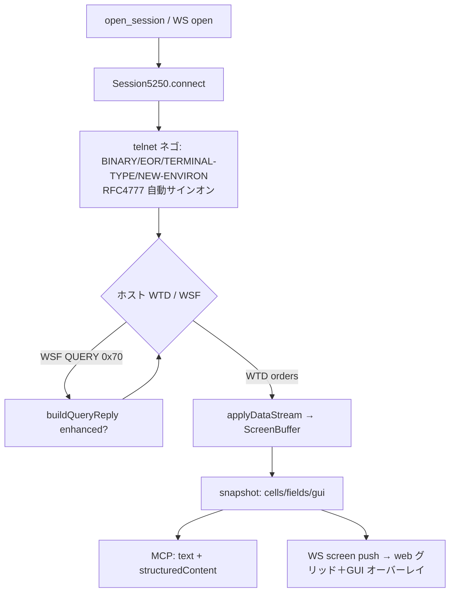
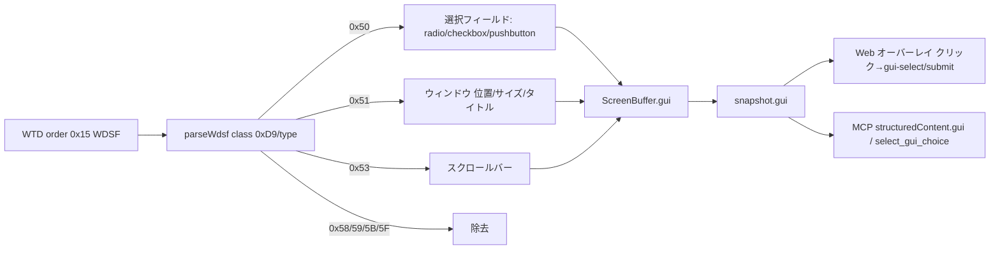

# レビューガイド: AS400 5250 MCP サーバー ＋ Web エミュレーター

## 変更概要 / 目的

IBM i（AS400）の 5250 画面を **MCP サーバー**と **Web エミュレーター**の 2 フロントから操作するツール群を、
TN5250 プロトコルの純 TypeScript 実装として新規構築（外部 5250 ライブラリ・ACS jar 非依存）。npm workspaces
モノレポ（`packages/core` / `packages/server` / `packages/web-ui` / `tools/gen-tables`）、ESM、Node ≥20。

実装本体 ≈24k LOC。7 つの subtask を **1 PR** に集約（親 decisions D1/D2）:
01 core(SBCS) → 02 server/MCP → 03 web → 04 DBCS/TLS/wide → 05 フィールド編集 → 06 拡張 5250 GUI → 07 リンク化。

検証は **trace-first**（PUB400 実機トレースを採取しリプレイ回帰）＋実機 E2E。受け入れ基準 13 項目 + GUI/リンクを
自動 239 テスト＋実機 E2E 6 本で確認済み。

## 重要ポイント（特に見てほしい所）

- **RFC 4777 自動サインオン**（`decisions` D3）: フィールド方式が PUB400 で拒否（CPF1120）されたため、
  NEW-ENVIRON で `IBMRSEED`（ゼロシード＝非暗号化）＋`IBMSUBSPW`（平文パスワード）を送る方式に到達。
  `packages/core/src/telnet/telnet.ts:196`。
- **単一の画面表現 `ScreenSnapshot`**: core が唯一の画面モデルを定義し、MCP（text＋structuredContent）と
  Web（グリッド）が同一 snapshot を消費 → 両フロントの表示が定義上一致。`packages/core/src/screen/types.ts`。
- **DBCS ステートフル変換と桁維持**（04）: EBCDIC_STATEFUL（SO=0x0E/SI=0x0F）を状態機械で解釈し、SO/SI・
  属性桁・DBCS lead/tail を**常に 1 セルとして保持**（桁ズレ不変条件）。`wtd-applier.ts:166` / `screen/buffer.ts`。
- **拡張 5250 GUI**（06）: GUI 構造体は top-level WSF(0xF3) ではなく **WTD オーダー 0x15(WDSF)** で届く
  （`decisions` 06/D1）。`applyWdsf`（`wtd-applier.ts:260`）が Create Window / Define Selection Field /
  Scroll Bar / Remove 群を解析し `snapshot.gui` に露出。enhanced 広告はオプトイン（06/D2）で既存の非 GUI
  画面に回帰なしを実機確認済み。
- **ブラウザ安全な codec サブパス**: web-ui が `@as400web/core` ルート import で pino/node 依存を巻き込む問題を、
  `@as400web/core/codec` サブパス export で回避。`packages/core/package.json` の exports。
- **Vue の Boolean prop 既定値の落とし穴**（07・review S1 で修正）: 未指定の Boolean prop は false に
  キャストされるため `withDefaults` で linkify 既定 ON を明示。さらに `v-memo` に `linkEnabled` を含めて
  トグル再描画を担保。`packages/web-ui/src/components/ScreenGrid.vue`。

## 処理フロー

### 接続〜画面配信〜2 フロント

### 拡張 5250 GUI 構造体（06）

## 主要な変更箇所

- `packages/core/src/telnet/telnet.ts:196` — RFC 4777 IBMRSEED/IBMSUBSPW 自動サインオン。
- `packages/core/src/session/session.ts:384` — QUERY 応答（enhanced 広告を条件分岐）。
- `packages/core/src/protocol/wtd-applier.ts:166` — DBCS ステートフル解釈（SO/SI 桁維持）。
- `packages/core/src/protocol/wtd-applier.ts:260` — `applyWdsf`（WDSF GUI ルーティング・破損は警告読み飛ばし）。
- `packages/core/src/protocol/wdsf-parser.ts` — GUI 構造体パーサ（tn5250 準拠・GPL 非移植）。
- `packages/core/src/screen/buffer.ts` — GUI 構造体保持・選択状態・snapshot 露出。
- `packages/server/src/mcp-tools.ts` — MCP 12 ツール（GUI の `select_gui_choice`/`submit_gui_selection` 含む）。
- `packages/server/src/ws-handler.ts` — WS `gui-select`/`gui-submit`・enhanced 伝播。
- `packages/web-ui/src/components/ScreenGrid.vue` — フィールド編集（自前上書きモデル）・GUI オーバーレイ・
  リンク化描画。
- `packages/web-ui/src/composables/linkify.ts` — URL/メール検出（スキーム allowlist）。

## リスク / 確認してほしい点

- **enhanced 広告の影響範囲**: 既定 OFF のオプトイン。実機で非 GUI 回帰なしを確認済みだが、ホスト依存の
  データストリーム差には引き続き注意（06/D2）。
- **サブセットの既知の制約**（PR 本文の「既知の制約」へ）:
  - 選択肢テキストの DBCS・REM の厳密ヒットテストは主要サブセット外（06/D3/D4）。
  - PUB400 標準画面に GUI が無く、GUI 実機疎通は合成 trace を正とする。
  - 「MCP×Web 同時 2 フロント」統合スクリプト・カーソル F4 プロンプト/SEU カラーの実機明示スクリプトは
    未整備（session 分離は unit、各フロントは個別実機で確認）。
- **セキュリティ**: リンク化 href は http/https/mailto の allowlist（正規表現）＋`rel="noopener noreferrer"`。
  MCP は認証情報を引数に取らず profile 経由（D13）、監査ログは値を出さない（D14）。
