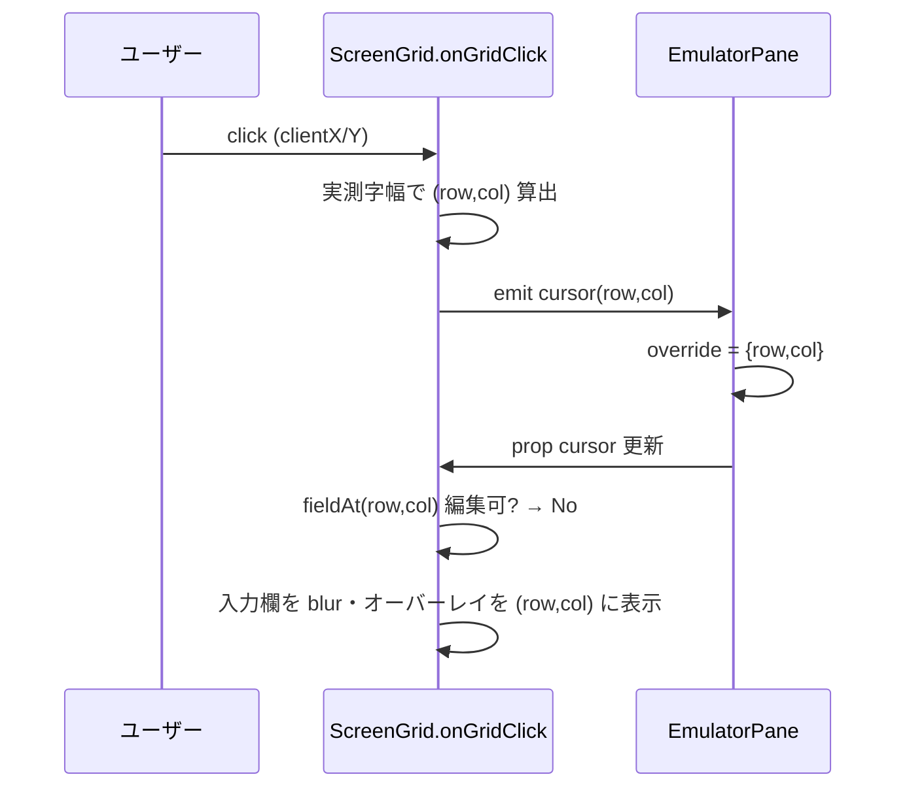
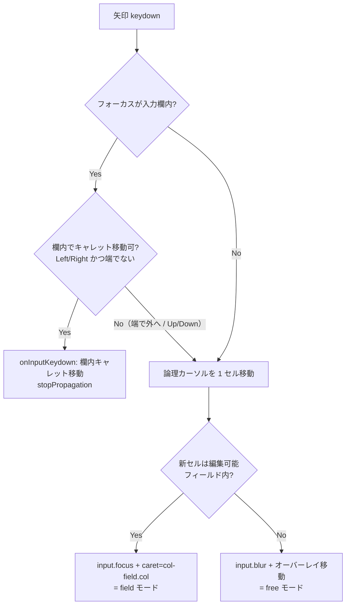
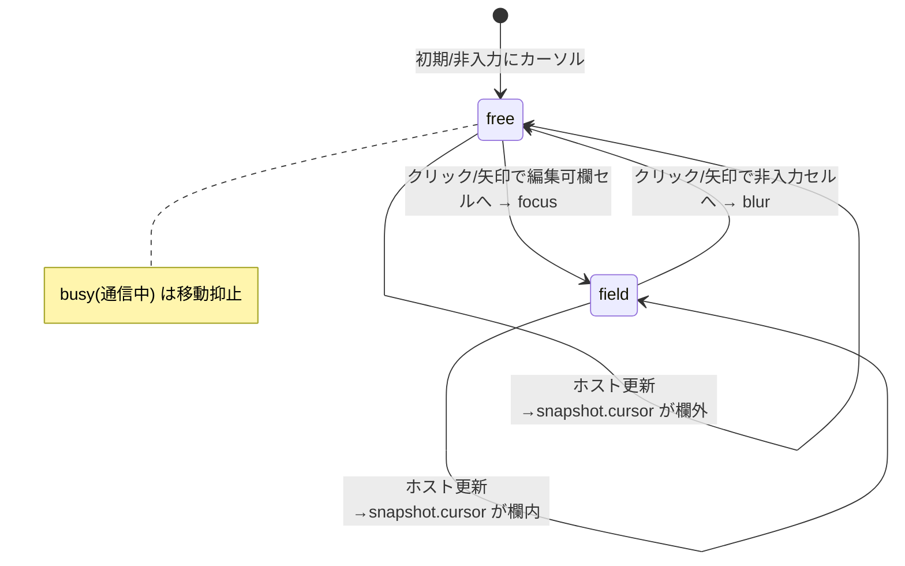

# 設計: 画面全体の自由カーソル

## アーキテクチャ概要

論理カーソル `(row, col)` を単一の真実（source of truth）とし、そこから「表示（オーバーレイ or native キャレット）」
「入力欄フォーカス」「AID 送信位置」を導出する。カーソルは 2 つの**表現モード**を行き来する:

- **field モード**: カーソルが編集可能フィールドのセル上。該当 `<input>` にフォーカスし、native キャレットが
  カーソルを表す（オーバーレイは隠す）。文字入力・欄内編集が可能。
- **free モード**: カーソルが非入力/保護セル上。入力欄は blur し、オーバーレイ（ブロックカーソル）が
  カーソルを表す。文字入力はしない（AID 送信・移動のみ）。

per-char span は導入しない。位置計算は固定等幅グリッドの座標変換（実測字幅・行高）で行う。

```mermaid
flowchart LR
  A[論理カーソル (row,col)<br/>useCursor: override ?? snapshot.cursor] --> B{セルは編集可能<br/>フィールド内?}
  B -->|Yes| F[field モード<br/>input.focus + caret=col-field.col]
  B -->|No| R[free モード<br/>input.blur + オーバーレイ表示]
  A --> C[AID 送信位置]
```

## コンポーネント / モジュール

- **`composables/useCursor.ts`（新規）**: カーソル状態と純粋な移動/判定ロジック。DOM 非依存でテスト可能に。
  - `moveCursor(cur, dir, rows, cols)`, `fieldAt(row, col, fields)`, `cellToCaret(field, col)` 等。
- **`EmulatorPane.vue`**: 論理カーソルの保持（override）とホスト更新でのリセット、矢印キーのセル移動＋モード調停、
  AID 送信位置の供給。Tab/ホイール/busy は既存。
- **`ScreenGrid.vue`**: 有効カーソルを prop で受け、オーバーレイをそこに描画（field モード時は隠す）。
  `onGridClick` の座標精度化、クリック時の focus/blur・キャレット反映。編集モデル（`edit`）は既存を踏襲。
  実測字幅の提供（描画済みセルの実幅 or 測定要素）。

## インターフェース / データモデル

```ts
type Dir = "up" | "down" | "left" | "right";

// 純関数（useCursor）
function moveCursor(cur: {row:number;col:number}, dir: Dir, rows: number, cols: number): {row:number;col:number};
//  left:  col-1、col<1 なら前行末尾（row>1 のとき）
//  right: col+1、col>cols なら次行先頭（row<rows のとき）
//  up/down: 同 col で row∓1（範囲外はクランプ）
function fieldAt(row: number, col: number, fields: Field[]): Field | undefined; // 編集可否は呼び出し側で判定
function caretInField(field: Field, col: number): number; // clamp(col - field.col, 0, field.length)
```

- `ScreenGrid` props 追加: `cursor: {row:number; col:number}`（＝有効カーソル）。オーバーレイ位置に使う。
  field モードでオーバーレイを隠す判定は「cursor セルが編集可能フィールド内 かつ その input が activeElement」。
- 有効カーソル: `EmulatorPane` の `cursor = computed(() => override.value ?? snapshot.cursor)` を **論理カーソルの
  唯一の出力**とし、AID 送信・ScreenGrid prop の両方に供給（現状は AID のみ）。

## 処理フロー / シーケンス

### クリック（非入力セル）



### 矢印キー（field/free の調停）



### 状態遷移（表現モード）



## 設計判断

- **論理カーソルを単一の真実にする**（採用）: 現状はオーバーレイ=`snapshot.cursor`、AID=`cursorOverride` と
  二重で不整合。両者を有効カーソルに統一し、ScreenGrid に prop で渡す。→ retro「カーソル/編集モデル一元化」に整合。
  - 代替: per-char span 化（却下）。2000–3500 要素で `v-memo` 設計と性能を損なう。
- **移動ロジックを純関数（useCursor）に切り出す**（採用）: DOM 依存の focus 調停と分離し、境界/ラップ/クランプを
  ユニットテストで担保。EmulatorPane/ScreenGrid は薄い結線に。
- **矢印は「欄内はキャレット、端で外へ/上下はセル移動」**（採用）: 既存の欄内編集（onInputKeydown）を壊さず、
  自由移動を足す最小の調停。Tab は従来どおりフィールド間ジャンプ（役割分担）。
- **実測字幅**（採用）: クリック精度のため描画済みセルの実幅を測る。オーバーレイは `ch` 単位で既に正確。

## plan への申し送り

- 分割単位（例）: ①有効カーソルの一元化＋オーバーレイ追従（まず「クリックで見える」）→ ②onGridClick 精度化＋
  クリック時 focus/blur 調停 → ③矢印のセル移動＋モード調停 → ④`useCursor` 純関数＋ユニットテスト →
  ⑤コンポーネントテスト（クリック/矢印/非回帰）。
- 非分割（単一 tasks.md）で十分な規模（web-ui 単一パッケージ・相互依存）。subtask 化はしない。
- テスト: `useCursor` のユニット（移動/境界/ラップ/fieldAt）、`ScreenGrid`/`EmulatorPane` のコンポーネント
  （クリックで非入力にカーソル、矢印でセル移動、field⇄free 遷移、AID にカーソル反映、既存非回帰）。
