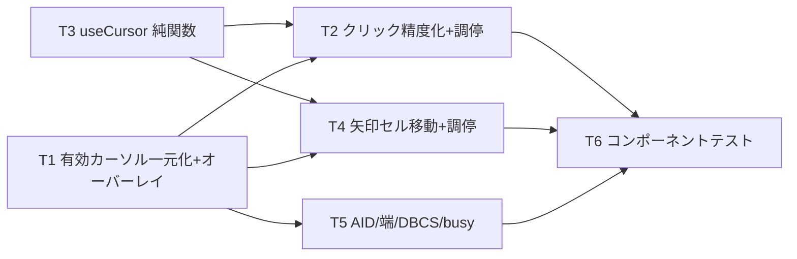

# 計画: 画面全体の自由カーソル

spec.md / design.md を前提。web-ui 単一パッケージ・相互依存のため **subtask 分割はしない**（単一 tasks.md）。

## 実装方針

design の分割単位に沿って、下から積む:

1. **純関数（useCursor）** を先に作りユニットで固める（DOM 非依存の移動/境界/判定）。
2. **有効カーソルの一元化** — オーバーレイを `snapshot.cursor` 固定から「有効カーソル」に。まず「クリックで
   カーソルが見える」を最短で通す（受け入れ基準 1 の可視部）。
3. **クリック精度化＋モード調停**（field/free の focus/blur・キャレット）。
4. **矢印のセル移動＋調停**（欄内キャレット／端で外へ・上下はセル移動）。
5. **AID・端・DBCS・busy** の細部を仕上げ、コンポーネントテストで受け入れ基準を通す。

既存の編集モデル（`edit`）・Tab 移動・ホイール・遷移後フォーカスは壊さない（矢印の欄内挙動は端でのみ委譲）。

## 作業順序と依存関係

## リスク / 留意点

- **native caret と論理カーソルの同期**が最大の難所（field⇄free、focus/blur/keydown/snapshot 更新のタイミング）。
  過去に同種のバグ（caret が末尾へ飛ぶ等）を踏んでいるため、T2/T4 でフォーカス移動時の caret 明示設定を丁寧に。
- **矢印の役割変更**（従来フィールド間ジャンプ→セル移動）で既存 pane-nav テストが変わる。Tab は据え置き、
  上下/左右のセル移動に合わせてテストを更新する（非回帰の線引きを明確化）。
- 実測字幅の取得はレイアウト確定後（`nextTick`/ResizeObserver 後）に行う。
- busy 中はカーソル移動も抑止（既存プロテクトに合わせる）。

## テスト方針

- **ユニット（useCursor）**: `moveCursor` の 4 方向・行送り/戻し・上下クランプ、`fieldAt`、`caretInField`。
- **コンポーネント（ScreenGrid/EmulatorPane）**:
  - クリックで非入力セルにカーソル（オーバーレイ位置・focus/blur）
  - 矢印でセル単位移動、編集可欄で field モード、非入力で free モード
  - field⇄free の遷移でフォーカス調停
  - AID 送信に有効カーソルが載る（F キー）
  - **非回帰**: 欄内編集（上書き/任意桁）・Tab・ホイール・遷移後フォーカス
- 実機での目視確認（F4 プロンプト位置・非入力エリアへのカーソル）は最後に。
