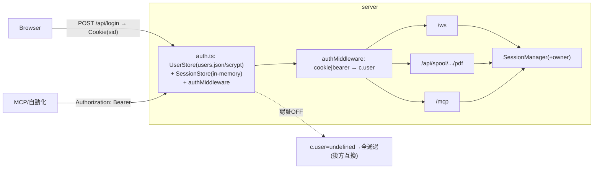

# 設計: 認証・per-user 分離（PR 1）

## アーキテクチャ概要


## コンポーネント / データモデル

### auth.ts（server 新規）
```ts
type Role = "admin" | "user";
interface AuthUser { username: string; role: Role; }
interface UserRecord { username: string; role: Role; passwordHash: string; tokenHashes?: string[]; }

interface AuthConfig { enabled: boolean; cookieSecure?: boolean; sessionTtlMs?: number; }

class UserStore {                 // users.json をロード
  static fromFile(path): UserStore;
  verifyPassword(username, password): AuthUser | undefined;   // scrypt + timingSafeEqual
  findByToken(token): AuthUser | undefined;                    // token の sha256 を timingSafe 比較
}

// scrypt: `${saltHex}:${hashHex}`。verify は scrypt(pw,salt) と timingSafeEqual
function hashPassword(pw): string;
function verifyHash(pw, stored): boolean;

class SessionStore {              // in-memory の Cookie セッション
  create(user): string;           // sid = randomBytes(32).hex、TTL 付き
  get(sid): AuthUser | undefined;  // 期限切れは破棄
  destroy(sid): void;
}
```
- **authMiddleware(cfg, users, sessions)**: enabled=false なら素通り。enabled=true は
  `Authorization: Bearer <token>`（→ users.findByToken）または Cookie `sid`（→ sessions.get）で `c.set("user", u)`。
  どちらも無ければ 401。**/api/login と静的配信・/healthz は除外**。
- **ルート**: `POST /api/login` {username,password} → 成功で httpOnly Cookie(sid) 設定＋`{user}` 返す。
  `POST /api/logout` → セッション破棄＋Cookie 削除。`GET /api/me` → `{ enabled, user? }`（web-ui のログイン状態把握用）。

### 所有者分離（SessionManager）
```ts
interface SessionEntry { …; owner?: string; }   // 表示
interface PrinterEntry { …; owner?: string; }   // プリンター
// open/openPrinter の opts に owner?: string を追加。
// 取得ヘルパ: assertOwner(entryOwner, user): user 未定義(認証OFF)なら許可、admin なら許可、
//   owner===user.username なら許可、それ以外は Tn5250Error("FORBIDDEN")。
```
- **HTTP PDF**: `c.get("user")` で `assertOwner(entry.owner, user)`。
- **MCP**: `/mcp` ハンドラで `c.get("user")` を **per-request の ToolDeps.user** に注入。tools は
  session を触る前に assertOwner。list_sessions/list_spools は owner でフィルタ（admin は全件）。
- **WS**: `onOpen`/open 時に owner=接続ユーザーを刻む。1 接続 = 1 セッションなので取得は自分のみ。

### プリンター ID 推測不能化
- `PrinterConnectOptions` に `id?: string` を追加、`PrinterSession` は `opts.id ?? "prt-"+seq`。
  SessionManager.openPrinter は `randomUUID()` を id に渡す（表示と対称。core は node 依存を持たない）。

## 認証 on/off
- 設定は `AuthConfig`。ソースは users.json の有無 or CLI/env（`--auth` / `AUTH_ENABLED`）。
  **users.json 指定かつ enabled のときだけ**保護。未指定/OFF は現状どおり（無認証・owner 未強制）。
- CLI 補助: `--hash-password <pw>` で scrypt ハッシュを出力（users.json 作成の補助）。

## エラー処理 / セキュリティ
- パスワード/トークンは平文保存しない（scrypt/sha256）。比較は timingSafeEqual。
- Cookie: httpOnly・SameSite=Lax・（TLS 時）Secure。sid は 256bit 乱数・server 側で失効可能。
- 401（未認証）/403 FORBIDDEN（他人資源）を区別。users.json はコミットしない（.gitignore）。
- 認証 OFF は完全後方互換（既存テスト・挙動不変）。

## plan への申し送り（PR 1 の分解）
1. auth.ts（UserStore/scrypt/SessionStore/hashPassword）＋単体。
2. authMiddleware＋login/logout/me＋app 配線（on/off）＋単体。
3. SessionManager owner＋assertOwner、printer id=randomUUID。
4. HTTP PDF・MCP・WS に owner 強制（MCP は per-request user 注入）＋単体。
5. CLI `--hash-password`、users.json.example、.gitignore、docs。
※ 管理者 UI（ユーザー CRUD/セッション管理/ログ）は PR 2（別作業）。
