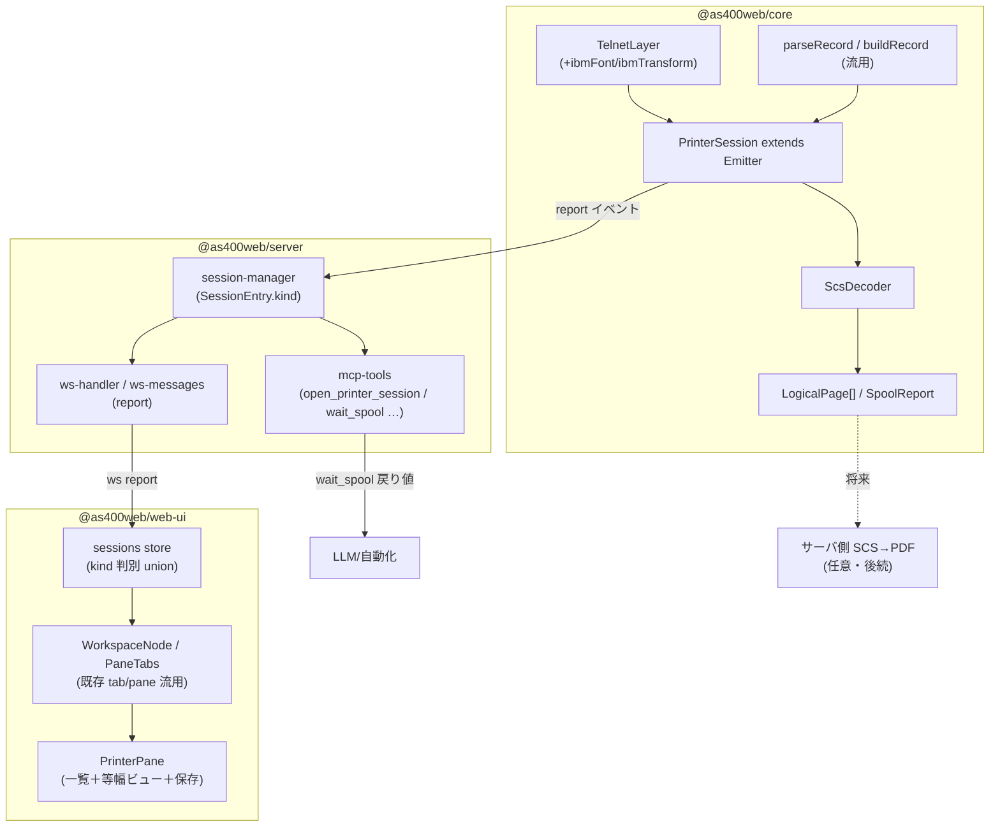
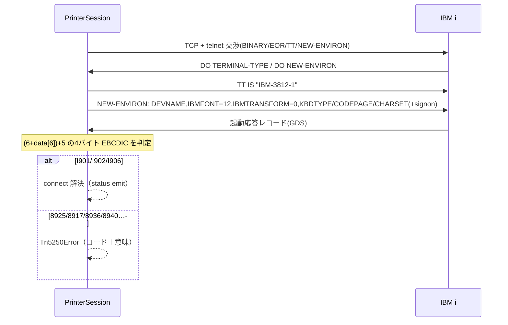
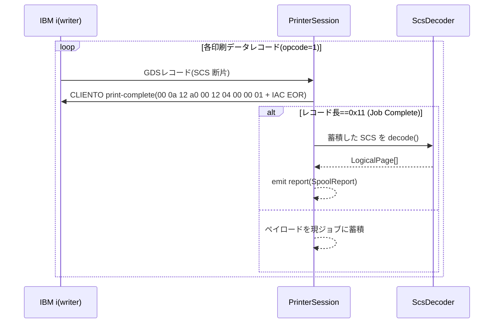

# 設計: TN5250E プリンターセッション

spec.md を実装可能な構造に落とす。core（PrinterSession/ScsDecoder）を単一の真実とし、
web-ui・MCP・（将来）サーバ側 PDF がその上に乗る。既存の Emitter/Transport/registerTool 慣習に合わせる。

## アーキテクチャ概要


## コンポーネント / モジュール

| モジュール | 責務 | 依存 |
|---|---|---|
| `core/telnet/telnet.ts` | NEW-ENVIRON に `IBMFONT`/`IBMTRANSFORM` USERVAR を追加（無いと 8925） | — |
| `core/session/terminal-type.ts` | `terminalTypeFor` にプリンター分岐（SBCS=`IBM-3812-1`、DBCS=後続で確定） | — |
| `core/session/printer-session.ts`（新） | 交渉→起動応答判定→印刷データ受信→print-complete 応答→Job Complete で SpoolReport を emit | TelnetLayer, parseRecord, ScsDecoder |
| `core/protocol/scs.ts`（新） | SCS バイト列→`LogicalPage[]`。カーソル・改ページ・桁移動・EBCDIC 変換。未対応オーダーは安全スキップ | codecForCcsid |
| `server/session-manager.ts` | `SessionEntry` に `kind: "display"｜"printer"`。printer は PrinterSession を保持 | core |
| `server/ws-messages.ts` / `ws-handler.ts` | `open.kind`、server→client `report`/`printer-status` を追加・push | session-manager |
| `server/mcp-tools.ts` | `open_printer_session`/`wait_spool`/`list_spools`/`get_spool`（close は既存流用） | session-manager |
| `web-ui/stores/sessions.ts` | `SessionState` を kind 判別 union に。printer は reports[]/selectedReportId | ws-client |
| `web-ui/components/PrinterPane.vue`（新） | スプール一覧（左）＋等幅帳票ビュー（右）＋保存ツールバー | sessions store |
| `web-ui/components/ConnectView.vue` | セッション種別（display/printer）選択を追加 | — |

## インターフェース / データモデル

### core 型
```ts
// 論理ページ（等幅グリッド1ページ）。改ページ単位。
interface LogicalPage { rows: number; cols: number; lines: string[]; } // lines[r]=桁詰め1行（全角=2桁）
interface SpoolReport {
  id: string;              // クライアント採番（"spool-1" 等）
  pages: LogicalPage[];
  raw: Uint8Array;         // 受信 SCS 生バイト（保存/将来PDF）。ws には既定で載せない（下記 D5）
  splfName?: string;       // 取得できれば
}
type SessionKindCore = "display" | "printer";

interface PrinterConnectOptions {
  host?: string; port?: number; tls?: boolean | TlsOpts;
  deviceName?: string; user?: string; password?: string;
  ccsid?: number;                    // SBCS=37/273…、DBCS=1399（後続）
  connectTimeoutMs?: number; negotiationTimeoutMs?: number;
  transport?: Transport;             // テスト注入（ReplayTransport）
  warn?: (w: string) => void;
}
interface PrinterSessionEvents extends Record<string, unknown[]> {
  report: [SpoolReport];             // ジョブ完了ごと1件
  status: [{ startupCode: string; connected: boolean }];
  closed: [string];
}
class PrinterSession extends Emitter<PrinterSessionEvents> {
  static connect(opts: PrinterConnectOptions): Promise<PrinterSession>; // I90x まで待つ。失敗コードは Tn5250Error
  get startupCode(): string;
  reports(): readonly SpoolReport[];
  disconnect(): void;
}
```

### ScsDecoder（状態機械）
```ts
class ScsDecoder {
  constructor(ccsid: number);
  // 1ジョブ分の SCS を論理ページ列へ。ジョブ境界（Job Complete）は PrinterSession が切って渡す
  decode(scs: Uint8Array): LogicalPage[];
}
```
- 内部状態: `row`,`col`（1 起点）、`page`（現在ページのグリッド）、`pageW/pageH`（SPPS/SLD/SCD から）、
  （DBCS 後続）`shift: "sbcs"｜"dbcs"`。
- 単バイト: NL/RNL/LF→行送り、CR→桁1、FF/RFF→改ページ（page を確定して次へ）、PP(0x34)+副種→AHPP/AVPP/RRPP/RDPP。
- `0x2B` 多バイト: 先頭長で全体スキップしつつ、SPPS/SLD/SSLD/SCD だけ幾何に反映。未知は長さ分スキップ（D3）。
- 文字: `codecForCcsid(ccsid)` で EBCDIC→Unicode。（DBCS 後続）SO/SI で shift 切替、`decodeDbcsPair` で全角。

### server（ws / MCP）
```ts
// ws open に kind:"printer"、server→client:
type WsServerMessage =
  | /* 既存 */ …
  | { type: "report"; sessionId: string; report: SpoolReportWire } // pages(lines)+meta。raw 非同梱
  | { type: "printer-status"; sessionId: string; status: { startupCode: string; connected: boolean } };
interface SpoolReportWire { id: string; pages: { rows: number; cols: number; lines: string[] }[]; splfName?: string; }

// MCP（registerTool + zod）
open_printer_session { host?, deviceName?, ccsid?, user?, password?, tls? } -> { sessionId, startupCode }
wait_spool          { sessionId, timeoutMs? } -> { spoolId, pages: string[], text, receivedAt? } // 既受信あれば即返す
list_spools         { sessionId } -> { spools: { spoolId, pages, splfName? }[] }
get_spool           { sessionId, spoolId } -> { pages: string[], text }
// close は既存 close_session を流用（kind 非依存）
```

### web-ui 状態（kind 判別 union）
```ts
type SessionKind = "display" | "printer";
type SessionState = DisplaySessionState | PrinterSessionState; // 既存は Display 側へ
interface PrinterSessionState {
  sessionId: string; label: string; kind: "printer";
  connected: boolean; client: WsClient;
  reports: SpoolReportWire[]; selectedReportId?: string;
  autoPdf?: boolean; // 任意（初期未実装）
}
// workspace（tab=sessionId）は kind 非依存で不変。ペイン内容が kind で分岐（display→EmulatorPane / printer→PrinterPane）
```

## 処理フロー / シーケンス

### 接続〜起動応答


### 印刷データ受信〜レポート化

消費側: server は `report` を購読し ws `report`（web-ui）へ push／`wait_spool`（MCP）で解決。

## 設計判断
- **D1: PrinterSession は Session5250 と別クラス**（継承しない）。理由: Session5250 は全 opcode を表示
  `applyDataStream` に通す前提で、状態機械（ready/locked）もキーボード入力向き。プリンターは受信専用・
  データ経路が SCS で全く別。telnet/GDS/print-complete は関数レベルで共有し、二重化を避ける。
- **D2: 出力は「論理ページ中間表現」を必ず経由**。理由: web-ui（等幅 HTML）・MCP（テキスト）・将来 PDF の
  3 消費者が同じ表現から派生でき、SCS 解釈を 1 箇所に閉じ込められる。代替（SCS を各消費者で直接解釈）は
  三重化・不整合を生むため却下。
- **D3: 未対応 SCS オーダーは破棄して継続**（例外にしない）。理由: 帳票は「読めれば良い」。厳密全解釈は
  スコープ過大。長さを持つ `0x2B` 系は長さ分スキップして同期を保つ。ログに残す。
- **D4: session `kind` はセッションストアの判別 union に載せる**（別スト���ア新設をしない）。理由: workspace の
  タブは sessionId で参照するので、1 つの id→state 対応に統一する方が tab/pane/D&D 機構をそのまま使える。
- **D5: `raw`（生 SCS）は ws で web-ui に送らない**（既定）。理由: 等幅表示に不要でトラフィック増。raw は
  server 側に保持し、将来のサーバ側 PDF/ダウンロードで使う。MCP も text/pages を返し raw は返さない。
- **D6: DBCS は SBCS 完成後の増分**。理由: 参照実装なし＋実 SCS 未採取（research F5）。SBCS で core/consumer の
  骨格を実機で固めてから、ScsDecoder に SO/SI・`decodeDbcsPair` を足し CCSID 1399 で採取・検証する。
- **D7: フォーム問い合わせ（CPA3394）はクライアント非制御**。writer 側の運用（`FORMTYPE(*ALL)` 等）で自動化。
  UI/README で「ホスト応答待ちの可能性」を示す。プリンタークライアントには応答機能を持たせない。

## plan への申し送り（分割単位・テスト戦略）
- **分割の目安（seam）**（split 要否は plan で判定）:
  1. **core**: TelnetLayer 拡張 ＋ terminalTypeFor ＋ ScsDecoder ＋ PrinterSession。**単独で検証可能**
     （下記 golden fixture＋ReplayTransport）。
  2. **server+MCP**: session-manager kind ＋ ws report ＋ mcp-tools。core に依存。
  3. **web-ui**: sessions kind union ＋ PrinterPane ＋ ConnectView。core 型・ws に依存。
  高結合ではなく producer→consumer の順依存なので、**subtask 分割より「順序付き単一 plan」でも収まる可能性**。
  plan で規模を見て判断（過剰分割を避ける）。
- **テスト戦略（重要）**:
  - **ScsDecoder は golden fixture でオフライン単体テスト**: 採取済み `artifacts/scs-capture-sbcs.bin` を
    入力に、期待する論理ページ（行テキスト）を固定化。ホスト不要・決定論的。
  - **PrinterSession は `ReplayTransport` で録画再生**: 起動応答＋印刷データ＋Job Complete の録画を流し、
    `report` が 1 件出ること・print-complete を返すことを検証。
  - **実機統合は `scripts/verify-printer.mjs`** に育てる（`artifacts/probe-printer-*.mjs` が種）。SBCS で
    I902→受信→論理ページ、を実機で回す。**スプール生成はジョブ OUTQ 経由で自分のデバイスにのみ回し、
    CPA3394 に応答**（研究プローブと同じ・ホストを汚さない範囲）。
- **未確定（DBCS フェーズで解消）**: DBCS 端末型番、DBCS スプールの実 SCS（SO/SI 列）、CCSID 1399 採取物。
