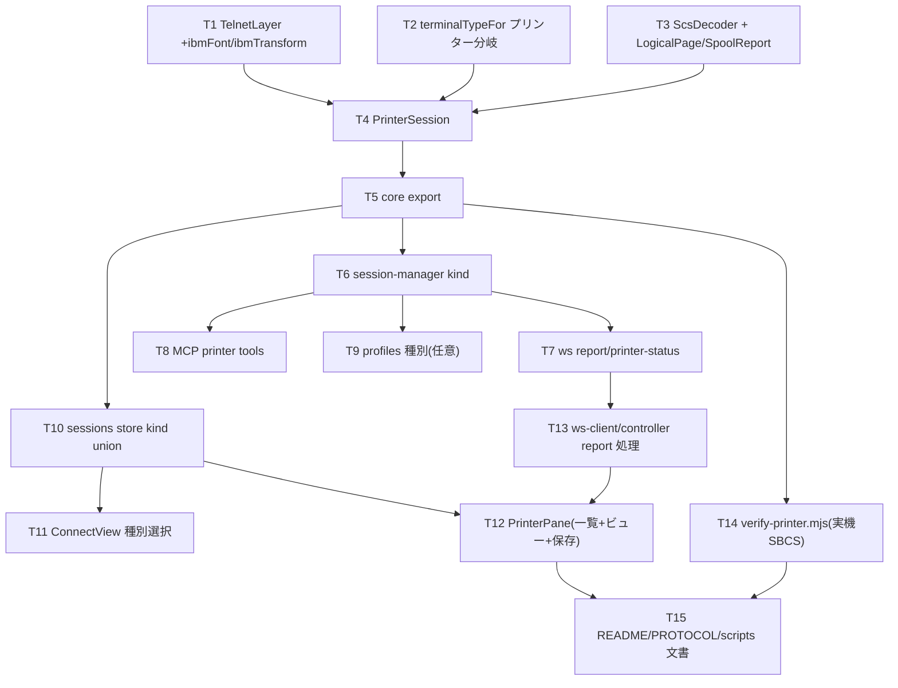

# 計画: TN5250E プリンターセッション（SBCS end-to-end・1PR）

design.md を SBCS 範囲で 1 本の順序付きタスクに分解する（ユーザー確定: subtask 分割せず単一 plan）。
DBCS（SO/SI・CCSID 1399）と自動 PDF/自動印刷は**別 work（後続）**とし、本 work では扱わない。

## 実装方針
producer→consumer の順に積む: **core（土台）→ server/MCP（受け口）→ web-ui（表示）→ 実機検証・文書**。
core は golden fixture（`artifacts/scs-capture-sbcs.bin`）と `ReplayTransport` でホスト非依存に単体検証できるため、
先に固めて手戻りを防ぐ。各層は design の seam（低結合）どおり順に載せる。

## 作業順序と依存関係

## リスク / 留意点
- **8925 回避**: TelnetLayer に IBMFONT/IBMTRANSFORM を確実に載せる（research F1）。実機 verify で担保。
- **ScsDecoder のオーダー網羅不足**: 未対応は破棄して継続（D3）。golden fixture で最低限の実データを通す。
  実帳票で崩れる箇所は verify で観測し、必要オーダーを足す。
- **CPA3394**: 実機 verify はプローブ同様「自分のデバイスに回して I 応答」で完結させる（ホストを汚さない）。
- **web-ui の jsdom 限界**: PrinterPane はロジック（論理ページ→行）中心に単体テスト。等幅表示の見た目は
  必要なら実ブラウザ確認（既存 `verify-browser-*` の系譜。本 work では必須にしない）。
- **kind union の破壊的変更**: 既存 display セッション状態を壊さないよう、既存フィールドは display 側に閉じる。

## テスト方針
- **単体（ホスト不要）**:
  - ScsDecoder: `artifacts/scs-capture-sbcs.bin` を入力に論理ページ（行テキスト・改ページ数）を golden 化。
  - PrinterSession: `ReplayTransport` に起動応答(I902)＋印刷データ＋Job Complete(0x11) の録画を流し、
    `report` 1 件・print-complete 送出・失敗コードで例外、を検証。
  - TelnetLayer: NEW-ENVIRON 応答に IBMFONT/IBMTRANSFORM USERVAR が載ることをバイト検証。
  - MCP tools / ws: 既存テストの様式で、注入セッションに対する戻り値形を検証。
- **実機統合**: `scripts/verify-printer.mjs`（SBCS）。I902→スプール受信→論理ページ、CPA3394 応答込み。
- **回帰**: 既存 452 相当の単体・lint をグリーンに保つ（表示セッションを壊さない）。

## 本 work のスコープ外（後続 work 候補）
- **DBCS プリンター**（SO/SI・CCSID 1399・端末型番確定・DBCS フォント）: 実 SCS 採取が前提。別 work。
- **サーバ側自動 PDF（指定フォルダ蓄積）／自動印刷**: 任意機能。別 work（design に実現手段を記録済み）。
- これらは deliver 後に `aidev-util-propose` で起票する想定。
