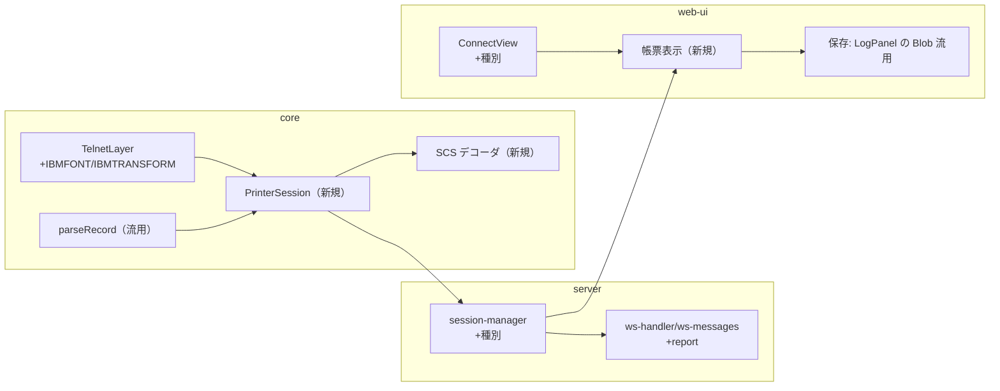

# 調査: TN5250E プリンターセッション（実現性・プロトコル・SCS/PDF・統合点）

requirement.md の未確定事項（PUB400 実現性・SCS 必要範囲・出力形式・HPT 要否・DBCS）を、
tn5250 C ソース（`lp5250d`/`printsession.c`/`scs.c`/`scs2pdf.c`）と **PUB400 実機プローブ**で事実確認した。

## 調査の問い
- Q1: PUB400 で TN5250E プリンターセッションを張れるか（仮想デバイス生成・スプール経路・**実機検証可否**）。
- Q2: プリンター交渉の正確な仕様（端末タイプ・NEW-ENVIRON 変数・データ封筒・印刷完了応答）。
- Q3: SCS の必要範囲と「PDF 帳票」の実装参照。
- Q4: DBCS プリンターの扱い（参照実装の有無）。
- Q5: 既存コードの統合点と、ブラウザ保存の既存機構。

## 判明した事実

### F1 (Q1) — PUB400 でプリンターセッションは張れる（実機実証済み）
- `IBM-3812-1` ＋ NEW-ENVIRON（**`IBMFONT=12` / `IBMTRANSFORM=0`** ＋ RFC2877 `KBDTYPE/CODEPAGE/CHARSET`）で
  接続すると、起動応答レコードが **`I902`「Session successfully started」** を返す。
  - **named DEVNAME（例 `MP86832`）も host 採番（`QPADEV002`）も受理**。自動サインオン有無どちらでも成立。
  - デバイスは**自動生成**され、同名の出力キュー（`QUSRSYS/MP…`）と**プリンターライターが自動起動**する。
- **重要な落とし穴**: `IBMFONT`/`IBMTRANSFORM` を欠くと **`8925`「Creation of device failed」で拒否**される。
  これは端末側ハンドシェイクの不足であり、ホストのポリシー拒否（`8940` 等）ではない。
  現行 `TelnetLayer` は `IBMFONT`/`IBMTRANSFORM` を送らないため、そのままではプリンター接続は 8925 で落ちる。
  → 最初のプローブ（core の TelnetLayer 相当）は 8925、tn5250 準拠に IBMFONT/IBMTRANSFORM を足した生プローブで I902 に転じた。
- 根拠: 実機プローブ `scratchpad/probe-printer-raw.mjs`（生 telnet 交渉、応答コード表 = `printsession.c:33-67`）。

### F2 (Q1) — スプール受信は end-to-end で成立（実 SCS を採取）
- 表示セッションから `CHGJOB OUTQ(<dev>)` → `DSPLIBL OUTPUT(*PRINT)` でスプールを device OUTQ に回すと、
  ライターがスプールを **`MSGW`** にして待つ。原因は **`CPA3394`（Inquiry）「Load form type '*STD' …」**
  ＝用紙タイプのオペレーター問い合わせ。**protocol エラーではなく通常の IBM i ライター挙動**。
- この問い合わせに **`I`（Ignore＝現用紙で印刷）** を返信すると、ライターが **778 バイトの実 SCS を送出**、
  末尾レコード長 **`0x11` が Job Complete マーカー**（`printsession.c:322`）。採取物 `scratchpad/scs-capture.bin`。
- 各印刷データレコードは `opcode=1`。受信ごとに **CLIENTO print-complete**（`00 0a 12 a0 00 12 04 00 00 01` ＋ `IAC EOR`）
  を返してチェーンを進める（`printsession.c:316-320`）。
- 運用知見: ライターは form-type 問い合わせを上げるため、**受信の自動化には CHGWTR/STRPRTWTR の
  `FORMTYPE(*ALL)` 等でメッセージを抑止するか、応答処理が要る**（製品側の考慮点）。
- 根拠: end-to-end プローブ `scratchpad/probe-printer-e2e.mjs`。

### F3 (Q2) — 交渉・封筒・応答の仕様（tn5250 一次資料）
- **端末タイプ**: `IBM-3812-1`（SBCS IPDS ページプリンタ）。tn5250 が設定する唯一のプリンター型番（`lp5250d.c:119`）。
- **TN5250E = BINARY + EOR + TERMINAL-TYPE + NEW-ENVIRON**。専用の「TN5250E」telnet オプションは無い
  （`telnetstr.c:497-556`）。**我々の `TelnetLayer` が既に合意する 4 つ（＋SGA）と一致**。
- **データ封筒は表示と同じ 10 バイト GDS ヘッダ**（`LL, 12 A0, …, varHdr, flags, opcode`）。
  **既存 `parseRecord`（gds.ts）がそのまま使える**（`telnetstr.c:860-895`）。
- **起動応答コード**: レコード内オフセット `(6 + data[6]) + 5` の **4 バイト EBCDIC**（`printsession.c:222-235`）。
  成功 `I901/I902/I906`、失敗 `2702/8901/8917/8922/8925/8935/8936/8940/…`（`printsession.c:33-67`）。
- **印刷完了応答**: フロー `CLIENTO(0x12)`・`opcode=PRINT_COMPLETE(1)`・空ペイロード。**Job Complete = レコード長 0x11**。
- NEW-ENVIRON プリンター変数: **`TERM` / `DEVNAME` / `IBMFONT` / `IBMTRANSFORM` / `IBMMFRTYPMDL`**（`lp5250d.c:119-129`）。

### F4 (Q3) — SCS の必要範囲と PDF 参照（tn5250 scs.c / scs2pdf.c）
- SCS は**単バイト制御 ＋ `0x2B` 多バイトオーダー**の列。採取データに実在したオーダー:
  `2B D2 03 45`(SIC)/`2B D2 04 4C`/`2B D1 03 81`(SCGL 符号ページ)/`2B C8`(SGEA グリッド)/`34 C4`(PP/AVPP) 等
  （agent B のオーダー表と一致）。帳票整形の主役:
  - 単バイト: `NL 0x15` / `CR 0x0D` / `FF 0x0C`(改ページ) / `RNL 0x06` / `LF 0x25` / `PP 0x34`（AHPP `C0`/AVPP `C4`/RRPP `C8`/RDPP `4C`）。
  - `0x2B` オーダー: ページサイズ `SPPS`、行密度 `SLD`/`SSLD`(LPI)、文字密度 `SCD`(CPI)、余白 `SHM`/`SVM`。
- **PDF 参照 = `lp5250d/scs2pdf.c`**: Courier/Courier-Bold、既定 8.5×11in、CPI=10、LPI=密度から、
  **FF→新規 PDF ページ**、文字は `Td` で測って配置。ただし **`WinAnsiEncoding`（SBCS のみ）**。
- 文字変換は EBCDIC→ローカル、既定 CCSID 37・env で切替（`SCG` 符号ページオーダーは解析するが無視）。

### F5 (Q4) — DBCS プリンターは参照実装なし＝自前実装
- **tn5250 の SCS は DBCS 未対応**: `SO(0x0E)`/`SI(0x0F)` を扱わず、DBCS バイトを 1 バイトずつ SBCS 変換して化ける
  （`scs.c` に 0x0E/0x0F のケース無し、`scs2ascii/scs2pdf` とも単バイト char map）。DBCS プリンター端末型番も未定義。
- 今回の採取は英語（SBCS）で SBCS 経路のみ end-to-end 実証。**日本語帳票は SO/SI シフト追跡＋DBCS グリフ（PDF）を
  自前実装**する必要（表示 DBCS と同じ状況＝参照実装なし）。DBCS 経路は **CCSID 1399 スプールで別途実機採取が要る**。

### F6 (Q5) — 統合点・保存機構（本リポジトリ）
- `Session5250` は**表示専用**（全 opcode が表示 `applyDataStream` を通る。`session.ts:380-416`）。
  → プリンターは **別セッションクラス（例 `PrinterSession`）を新設**する（Session5250 の再利用は不可）。
- `terminalTypeFor`（`terminal-type.ts:59`）にプリンター分岐が無く、呼び出しは Session5250 の 1 箇所のみ。
- `TelnetOptions`（`telnet.ts:16`）に **`IBMFONT`/`IBMTRANSFORM`（＋printer フラグ）追加が必要**（F1）。
- server: `ws-messages.ts` の union に `report` 系を追加、`ws-handler.ts` の `"screen"` 購読と並べて `"report"` を push。
  `session-manager.ts`／`profiles.ts` にセッション種別を通す。
- web-ui: 接続フォーム（`ConnectView.vue`）にセッション種別、帳票表示コンポーネント新設。
  **ブラウザ保存は `LogPanel.vue` の Blob＋`a.download` パターンを再利用**（既存の唯一のダウンロード実装）。

## 影響範囲

## 実現性 / リスク
- **SBCS: 実現性・実機検証とも確認済み**（I902 ＋ 778B SCS 採取、Job Complete まで）。
- **DBCS: 参照実装なし＝自前**。SO/SI シフトと PDF の DBCS フォントが主リスク。要 CCSID 1399 スプールでの実機採取。
- **CPA3394（用紙タイプ問い合わせ）**: 受信の前提。writer 構成 or 応答処理が要る（製品/ドキュメントの考慮点）。
- **PDF 生成手段（クライアント/サーバ）は spec の設計判断**。`scs2pdf` は Courier/WinAnsi で DBCS 不可＝そのまま流用不可。
- PUB400 はデバイスを保持するため、検証は**毎回ユニークなデバイス名**で行う（衝突＝古い writer への誤配を回避）。

## spec への申し送り
- プリンターは `Session5250` と**別クラス**。`TelnetLayer`/`TelnetOptions` に `IBMFONT`/`IBMTRANSFORM`（と printer 用の
  端末タイプ・NEW-ENVIRON）を追加する（無いと 8925）。GDS ヘッダ・print-complete・Job Complete(0x11) は tn5250 準拠で実装可。
- **SCS デコーダは「論理ページ（行×桁＋改ページ）」の中間表現**に落とし、そこから PDF/HTML へ整形する二段構成を推奨
  （出力形式＝設計判断）。改ページは FF/RFF 駆動（`scs2pdf` と同じ）。
- **DBCS は自前**（SO/SI・DBCS グリフ）。スコープ判断: **SBCS を先行実装して end-to-end を固め、DBCS を続けて
  CCSID 1399 実機採取で詰める**段階分割を spec で検討する余地あり（requirement は SBCS＋DBCS 両対応がゴール）。
- **Host Print Transform**（`IBMTRANSFORM=1` ＋ `IBMMFRTYPMDL`）は非 SCS の変換済みデータを受ける別経路。
  初期スコープ外だが、将来 PDF を直接ホストに作らせる選択肢として記録。
- **実機検証**: `scratchpad/probe-printer-raw.mjs`（交渉判定）と `probe-printer-e2e.mjs`（スプール受信）を
  `scripts/verify-printer.mjs` 相当へ育てる（scripts の実行規約に従い、SQL/スプールはホストを汚さない範囲で）。
- 未確定のまま残るもの: DBCS スプールの実 SCS 挙動（SO/SI の具体バイト列）、PDF を web-ui のどこで生成するか。
