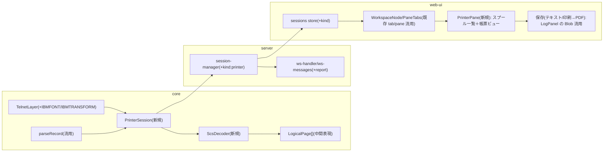

# 仕様: TN5250E プリンターセッション（SCS 受信 → 等幅 HTML 帳票）

## 概要
IBM i のスプール出力を 5250 プリンターセッション（TN5250E）として受信し、SCS を**論理ページ
（行×桁＋改ページ）** にデコードして、web-ui のタブ／ペインに **等幅 HTML 帳票**として表示・保存する。
research.md で SBCS 経路は実機 end-to-end 実証済み（I902 → 実 SCS 778B 受信）。**SBCS を先行実装**し、
DBCS（CCSID 1399・SO/SI）を続けて実機採取しながら仕上げる。表示セッションを壊さず、独立系統で追加する。

## 設計方針

### アーキテクチャ（表示セッションと別系統・既存の tab/pane 枠に差し込む）


- **PrinterSession は Session5250 と別クラス**。research F6 のとおり Session5250 は全 opcode を表示
  `applyDataStream` に通すため再利用できない。telnet 交渉・GDS ヘッダ（`parseRecord`）・print-complete 応答は
  tn5250 準拠で共有し、データ本体は表示バッファではなく **ScsDecoder** に渡す。
- **UI は既存の workspace（分割ツリー: tab=sessionId、split で自由配置）にそのまま乗る**。セッションに
  `kind: "display" | "printer"` を導入し、タブの中身をペインが kind で振り分ける（display→EmulatorPane、
  printer→PrinterPane）。これで**プリンターセッションも 1 タブ＝ペイン分割対応**が既存機構で満たせる
  （将来の SSH/IFS タブも同じ枠に追加できる拡張点）。
- **MCP も PrinterSession の消費者にする**（ユーザー提案）。server は WS と MCP で同じ `session-manager` を
  共有するため、プリンターセッションを **MCP ツール**として公開できる（限界コスト小）。MCP 経路は UI 描画が
  不要で **SCS→論理ページ→テキスト**だけを返すので、**PrinterSession/ScsDecoder の最小消費者＝早期の
  統合検証にも好適**。LLM/自動化から「スプール（帳票・ジョブログ等）を待ち受けてテキストで取得・要約」できる。

### 出力の実現方式（ユーザー確定: 等幅 HTML を基本）
- SCS → **論理ページ中間表現**（行×桁の文字グリッド＋改ページ境界）→ **等幅 HTML/CSS** でページ表示。
  DBCS はブラウザフォントでそのまま出せる（表示グリッドの資産・知見を流用）。
- 保存: まず**テキスト保存**（`LogPanel.vue` の Blob＋`a.download` パターン流用）と、**ブラウザ印刷→PDF**
  （`window.print()` 相当、ユーザー操作起点）。真の PDF ファイル生成はここでは作らない（下記の任意機能で扱う）。

### 推奨レイアウト（ユーザー要望への回答: スプール一覧＋ビュー）
- **マスター/ディテール**を推奨。プリンタータブ内を左右分割:
  - 左＝**受信スプール一覧**（1 行 = 受信時刻・ファイル名・ユーザー・ページ数・状態）。WRKOUTQ 相当の見慣れた形。
  - 右（主領域）＝選択スプールの**等幅帳票ビュー**（複数ページはページ送り／連続スクロール）。
  - 上部ツールバー＝保存（テキスト／印刷→PDF）、（任意機能を入れる場合）自動 PDF トグル。
- タブ自体は既存 workspace のペイン分割対象なので、「一覧を別ペインに、ビューを別ペインに」という更なる
  分割もユーザーが自由にできる（マスター/ディテールは既定レイアウトの提案で、固定ではない）。

### 自動 PDF・自動印刷の実現可否（ユーザーの問いへの回答）
- **指定フォルダに PDF が自動で貯まる**: 
  - **サーバ側なら実現可能・堅牢**（推奨）。Node サーバがコア（プリンターセッション）を保持するので、
    ジョブ完了時にサーバで SCS→PDF 変換し、設定ディレクトリへ書き出せる。**DBCS は CJK フォントを
    サーバに同梱すれば良く、ブラウザの CSP/フォント重量制約を受けない**（クライアント PDF より容易）。
  - クライアント側のみだと **File System Access API**（Chromium・一度フォルダ許可）で可能だが、
    ブラウザ横断性に欠ける。
- **ACS のように物理プリンターへ自動印刷**: ブラウザからの無操作印刷は不可。**サーバ側なら OS の印刷経路
  （lp 等）で実現可能**。ブラウザ単体では `window.print()`（ダイアログ）まで。
- **判断**: これらは**任意機能**とし、本作業（SBCS 対話ビューの確立）では**対象外＝後続増分**にする
  （ユーザーも「必須ではない」）。ただしサーバ側 PDF 変換で実現できる旨を設計に記録し、拡張点を残す。

### 実装順序（ユーザー確定: SBCS 先行）
1. SBCS: 接続 → SCS 受信 → 論理ページ → 等幅 HTML ビュー → テキスト/印刷保存（end-to-end）。
2. DBCS: SO(0x0E)/SI(0x0F) シフト追跡と CCSID 1399 デコードを ScsDecoder に追加、実機 CCSID 1399 スプールで採取・検証。

## 対象範囲（変更/追加するモジュール）
- **core（追加）**: `session/printer-session.ts`（PrinterSession）、`protocol/scs.ts`（ScsDecoder＋論理ページ型）、
  `session/terminal-type.ts`（プリンター端末タイプ分岐）、`telnet/telnet.ts`＋`TelnetOptions`（`ibmFont`/`ibmTransform`）。
- **server（変更）**: `session-manager.ts`（kind=printer）、`ws-messages.ts`（`report` 系）、`ws-handler.ts`（report push）、
  `profiles.ts`（セッション種別）、`mcp-tools.ts`（プリンター用 MCP ツール）。
- **web-ui（追加/変更）**: `stores/sessions.ts`（`kind` 判別＋プリンター状態）、`components/PrinterPane.vue`（新規）、
  `components/ConnectView.vue`（セッション種別）、タブ内容の kind 振り分け（`WorkspaceNode`/`PaneTabs` 周辺）。

## インターフェース / データ構造

### TelnetOptions 追加（research F1: 無いと 8925 で拒否）
```ts
interface TelnetOptions {
  // 既存 …
  ibmFont?: string | undefined;      // 例 "12"（NEW-ENVIRON USERVAR IBMFONT）
  ibmTransform?: string | undefined; // "0"=SCS を受ける / "1"=HPT 変換済み（初期は "0"）
}
```
NEW-ENVIRON 応答に USERVAR `IBMFONT` / `IBMTRANSFORM` を追加（DEVNAME/KBDTYPE 等と同列）。

### PrinterSession（新規・イベント駆動）
```ts
interface PrinterConnectOptions {
  host?; port?; tls?; deviceName?; user?; password?; ccsid?; // 表示と同系
  // 端末タイプは terminalTypeFor(ccsid, "printer") で決定（下記）
}
class PrinterSession {
  static connect(opts): Promise<PrinterSession>;   // 交渉→起動応答(I90x)まで待つ。失敗コードは例外
  on(ev: "report", cb: (r: SpoolReport) => void);  // ジョブ完了ごとに1件
  on(ev: "status", cb: (s: PrinterStatus) => void);
  on(ev: "closed", cb: (reason: string) => void);
  disconnect(): void;
  get startupCode(): string;   // "I902" 等
}
```
- `terminalTypeFor` にプリンター分岐: SBCS=`IBM-3812-1`（実機実証）、DBCS=未定（`IBM-5553-B01` 等を
  DBCS 実装時に実機総当たりで確定＝表示 DBCS と同じ手順。research F5）。

### 論理ページ／レポート（中間表現）
```ts
interface LogicalPage { rows: number; cols: number; lines: string[]; }  // 改ページ単位。lines[r] は桁詰めの1行
interface SpoolReport {
  id: string;            // クライアント採番
  receivedAt: number;    // epoch ms（表示用。core では持たず server/web で付与も可）
  splfName?: string;     // 取得できれば（起動/データから）。無ければ "spool N"
  pages: LogicalPage[];
  raw: Uint8Array;       // 受信 SCS 生バイト（保存/デバッグ/将来 PDF 用）
}
```
- ScsDecoder: `decode(scsBytes, ccsid): LogicalPage[]`。カーソル（行・桁 1 起点）を持ち、制御コードで
  行送り・改ページ・桁移動し、文字は EBCDIC→Unicode（`codecForCcsid`）でグリッドに置く。改ページで次ページへ。

### ws メッセージ（server→client 追加）
```ts
// client→server: open に kind:"printer" を許可
// server→client:
| { type: "report"; sessionId: string; report: SpoolReportWire }  // pages(lines)＋メタ。raw は base64 か別途
| { type: "printer-status"; sessionId: string; status: PrinterStatus }
```
`ws-handler` は PrinterSession の `"report"` を購読し、既存の `"screen"` push と並べて `"report"` を送る。

### MCP ツール（プリンター・ユーザー提案）
既存 `mcp__as400__*`（`open_session`/`get_screen`/`close_session` 等）に倣い、同じ `session-manager` 上に追加する。
```ts
// 待ち受け開始（デバイス名・CCSID・任意サインオン）。起動応答コードを返す
open_printer_session(host?, deviceName?, ccsid?, user?, password?, tls?)
  -> { sessionId, startupCode }               // 失敗コード(8925 等)は意味つきエラー
// 次のスプール（ジョブ完了1件）を待って取得。既受信があれば即返す
wait_spool(sessionId, timeoutMs?)
  -> { spoolId, pages: string[], text, receivedAt } // pages=ページごとの等幅テキスト、text=全体
// これまで受信したスプールの一覧／再取得
list_spools(sessionId) -> [{ spoolId, receivedAt, pages, splfName? }]
get_spool(sessionId, spoolId) -> { pages: string[], text }
// 終了は既存 close_session を再利用（kind 非依存）
```
- MCP は論理ページを**等幅テキスト**（`LogicalPage.lines` を改行連結、改ページは区切り）で返す。UI 用の
  `SpoolReport` と同じ core（PrinterSession/ScsDecoder）を使うため二重実装にならない。

### web-ui セッション状態（kind 判別）
```ts
type SessionKind = "display" | "printer";
// SessionState に kind を追加。display 固有(snapshot/edits/cursor)は display のみ。
interface PrinterSessionState {
  sessionId; label; kind: "printer"; connected; client;
  reports: SpoolReport[];       // 受信順
  selectedReportId?: string;    // ビューで選択中
  autoPdf?: boolean;            // 任意機能を入れる場合のトグル（既定 off／初期は未実装）
}
```

## 振る舞いの詳細（research F1–F4 準拠）
- **交渉**: BINARY/EOR/TERMINAL-TYPE/NEW-ENVIRON に合意（既存 TelnetLayer と同じ）。TERMINAL-TYPE IS に
  プリンター型番、NEW-ENVIRON に DEVNAME＋IBMFONT＋IBMTRANSFORM＋KBDTYPE/CODEPAGE/CHARSET（＋任意サインオン）。
- **起動応答**: 最初の GDS レコードのオフセット `(6+data[6])+5` の 4 バイト EBCDIC を読む。`I901/I902/I906`＝成功、
  それ以外は失敗として接続を確立させず、コードと意味（表）を添えて例外/エラーにする。
- **印刷データ**: `opcode=1` のレコード列。受信ごとに **CLIENTO print-complete**（`00 0a 12 a0 00 12 04 00 00 01`＋IAC EOR）
  を返す。**レコード長 0x11 = Job Complete**：そのジョブのデコード済み論理ページを 1 件の SpoolReport として emit。
  `opcode=2`（CLEAR）はバッファクリアで読み飛ばす。
- **SCS デコード**: 単バイト制御（NL/CR/FF/RNL/LF/PP）と `0x2B` 多バイトオーダー（ページサイズ/密度/CPI/余白）を
  解釈して論理ページを組む。未対応オーダーは**安全に読み飛ばす**（長さを持つものは長さ分スキップ）。
- **フォーム問い合わせ（CPA3394）**: research F2 の実機挙動。**ライターがオペレーター応答待ちになるため、
  応答があるまでプリンターセッションにデータが来ない**。これは表示側/writer 構成の話でプリンター
  クライアントからは制御できない。UI は「ホスト側でスプール待ち（応答待ちの可能性）」の状態表示を出し、
  READMEに writer 構成（例 `FORMTYPE(*ALL)`）での自動化を記す（クライアント実装ではなく運用として扱う）。

## ドメイン固有の考慮
- **対応 SCS オーダー（SBCS 初期集合）**: `NL 0x15`/`CR 0x0D`/`FF 0x0C`/`RNL 0x06`/`LF 0x25`/
  `PP 0x34`(AHPP `C0`/AVPP `C4`/RRPP `C8`/RDPP `4C`)、`0x2B` の SPPS(ページサイズ)/SLD・SSLD(LPI)/SCD(CPI)/
  SHM・SVM(余白)/SIC/SGEA 等は**桁・行・改ページに効く範囲だけ**反映し、他は読み飛ばす（research F4・実採取に準拠）。
- **ページ幾何**: 既定 8.5×11in・CPI10・LPI6 相当（`scs2pdf` 準拠）。実際の行×桁は SPPS/SLD/SCD から算出。
  等幅表示なので 1 桁=1 文字。改ページは FF/RFF 駆動。
- **DBCS（後続）**: `SO 0x0E`/`SI 0x0F` でシフト状態を持ち、DBCS 2 バイトを `decodeDbcsPair` で 1 グリフに、
  等幅表示上は全角=2 桁として扱う（表示 DBCS の知見流用）。tn5250 に参照なし＝自前。CCSID 1399 スプールで実機採取。
- **CCSID**: SBCS=37/273 等、DBCS=1399。`deviceEnvFor` の KBDTYPE/CODEPAGE/CHARSET を流用申告。

## エラー処理 / 異常系
- 起動応答が失敗コード（`8925`=デバイス作成失敗〔IBMFONT 欠落や権限〕/`8917`=権限なし/`8936`=セキュリティ/
  `8940`=自動構成不許可 等）→ **コードと意味を載せて接続失敗**として UI にエラー表示。
- ソケット切断・交渉タイムアウト → 表示セッションと同じくエラー emit・再接続はユーザー操作。
- 未対応 SCS オーダー → 破棄して継続（帳票は可能な範囲で描画）。ログに残す。
- CPA3394 待ち → データ無しで正常。UI に「ホスト側応答待ちの可能性」を出し、ハングと誤認させない。

## 受け入れ基準との対応（requirement）
- [接続・デバイス生成] PrinterSession が I90x で確立（research F1 実証）→ **SBCS で満たす**。
- [SCS 受信] print-complete 応答つきで opcode=1 レコードを受信・Job Complete 検出（F2 実証）→ **SBCS で満たす**。
- [改ページ保持の整形表示] ScsDecoder→論理ページ→等幅 HTML（FF で改ページ）→ **SBCS で満たす**。
- [SBCS/DBCS 双方で文字化けなし] SBCS を先行実証、**DBCS は後続**（SO/SI＋CCSID 1399 採取）で満たす。
- [印刷完了応答でホスト側正常終了] print-complete＋Job Complete(0x11) → **SBCS で満たす**。
- [ブラウザ保存] テキスト保存＋印刷→PDF（`LogPanel` パターン）→ **SBCS で満たす**。
- [MCP] `open_printer_session`/`wait_spool`/`get_spool` でスプールをテキスト取得（ユーザー提案）→ **SBCS で満たす**
  （core を共有するので低コスト。UI より単純＝早期統合検証にも使う）。
- [任意] サーバ側自動 PDF/自動印刷 → **対象外（後続増分）**。実現手段は設計に記録。

## 未確定事項（design/plan で詰める）
- DBCS プリンター端末型番（実機総当たりで確定）と DBCS スプールの実 SCS（SO/SI の具体列）。
- SpoolReport の `raw`（生 SCS）を ws でどう運ぶか（base64 か省略か）。
- PrinterPane の状態を sessions store に相乗りさせるか別 store にするか（kind 判別の実装形）。
- 論理ページの桁詰め規則（AHPP 左移動時の重ね打ち等、scs2pdf の over-strike 相当をどこまで再現するか）。
