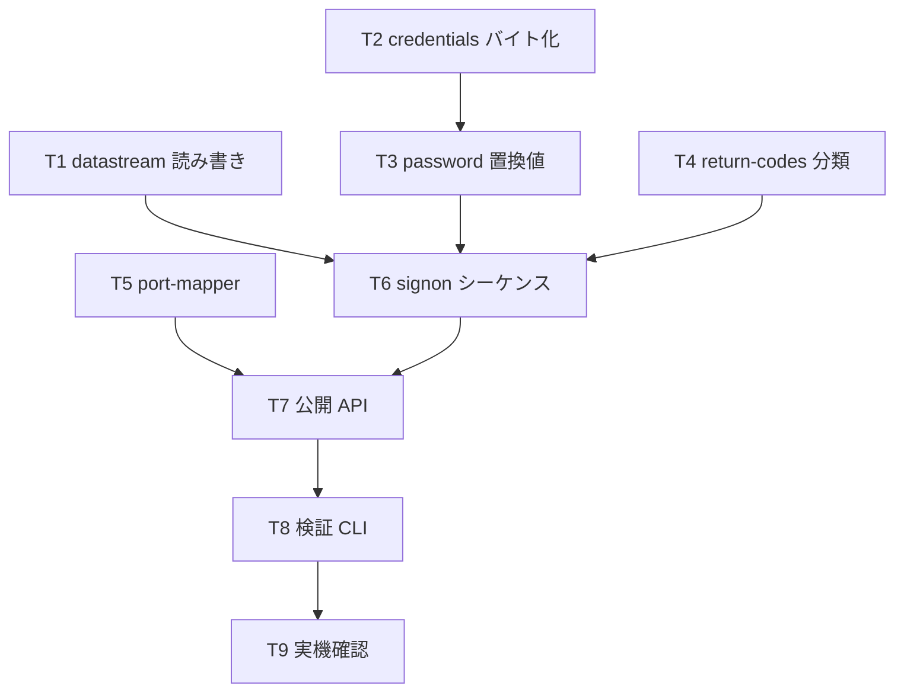

# 計画: ホストサーバー接続基盤と signon 認証

## 実装方針

**純粋関数を先に、I/O を後に。** 認証の難所（パスワード置換・資格情報のバイト化）はすべて
副作用のない純関数として切り出せる（spec D3）。先にこれらを固めて単体テストで縛れば、
実機に触る段階では「配線が正しいか」だけを見ればよくなる。

research F7 で**認証が通ることは実証済み**なので、本作業は探索ではなく書き起こしである。
検証スクリプト（`scratchpad/auth.mjs`）が正解の挙動を示しているので、これを基準に照合できる。

### 固定ベクタの採り方（重要）

`passwordSubstituteSha()` の単体テストには、実機に依存しない固定ベクタが要る。
実パスワードから採ると**テストコードに資格情報が焼き付く**ので、そうしない。

代わりに **架空の資格情報**（例 `TESTUSER` / `testpw`）と固定シードから期待値を計算し、
それをベクタとして埋め込む。アルゴリズムが仕様どおりかは「実機で本物が通ること」（T9）で担保し、
単体テストは**回帰検出**に徹する。

## split 判定

**subtask に分割しない。** 新規 7 ファイル・既存 2 ファイル変更で、1 PR に収まる規模。
`aidev-docs/DESIGN.md` の3層決定木では「不可分」に該当し、単一 tasks.md ＋ コミット分割で足りる。

## 作業順序と依存関係

1. **T1 datastream**（依存なし）— 純粋。ヘッダー＋LL/CP の読み書き
2. **T2 credentials**（依存なし）— 純粋。CCSID 37 / UTF-16BE のバイト化
3. **T3 password**（依存: T2）— 純粋。SHA 経路
4. **T4 return-codes**（依存なし）— 純粋。戻りコード分類
5. **T5 port-mapper**（依存なし）— I/O だが独立
6. **T6 signon**（依存: T1,T3,T4）— I/O。配線
7. **T7 公開 API**（依存: T5,T6）— `index.ts` / `errors.ts`
8. **T8 検証 CLI**（依存: T7）— 実機を叩く手段
9. **T9 実機確認**（依存: T8）— PUB400 で TLS / 平文

## リスク / 留意点

- **同じユーザー ID が用途で別符号化**（spec の表）。T2 で3種を明示的に分け、テストで固定する
- **`0x0003000C` と `0x0003000D` の取り違え**（C が「次で無効化」、D が「期限切れ」）。T4 で原典の表と照合
- **誤パスワードは実機で試さない**（アカウント無効化。research リスク2）。T4 の単体テストで代替
- **パスワードの平文がトレース・エラーに漏れない**こと。T6 で CP `0x1105` のマスクを実装し、T9 で確認
- **LICENSE / NOTICE の整備は別作業**（ユーザー判断: Apache-2.0）。本作業はコード上は依存しないが、
  **マージ順は LICENSE 側を先**にする。本作業では各ファイルの参照コメント（spec D1）だけ守る
- **jtopenlite のソースをリポジトリに入れない**。参照は scratchpad のクローンに留める

## テスト方針

- **単体（実機非依存）**: T1〜T5 はすべて純粋関数／独立 I/O なので単体で覆う
  - datastream: 組み立て→解析の往復、境界（LL=6、長さ不足）
  - credentials: 3種の符号化、CCSID 37 変換不能文字が `CONFIG_ERROR` になること
  - password: 固定ベクタ（架空の資格情報）
  - return-codes: 主要コードと上位16bit レンジ判定
  - port-mapper: 偽サーバー（`net.createServer`）で `0x2B`＋4バイト応答と異常応答
- **実機（T9）**: PUB400 で TLS / 平文の認証成功、ポートマッパー解決、トレースにパスワードが出ないこと
- **回帰**: 既存 633 テストが緑のままであること（TN5250 に触れていないことの担保）
