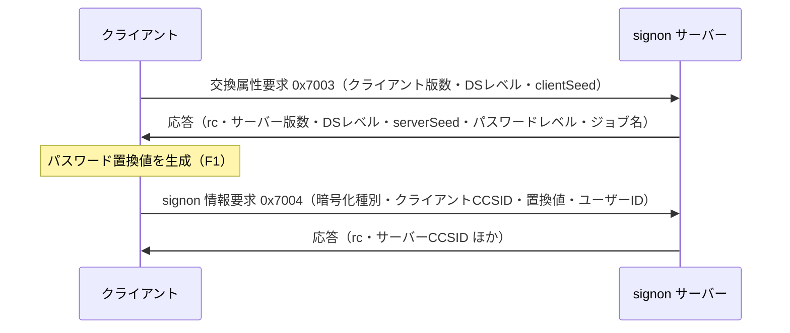

# 調査: ACS データ転送相当（ホストサーバー認証）

## 調査の問い

- Q1: パスワード置換値（password substitute）の生成アルゴリズムと、QPWDLVL による分岐は？
- Q2: ホストサーバーのデータストリーム形式（ヘッダー・LL/CP）は？
- Q3: ポートマッパー（449）の要求/応答フォーマットは？
- Q4: signon サーバーの正確なシーケンスは？
- Q5: **PUB400 の QPWDLVL の値**は？（どちらのアルゴリズムを実装する必要があるか）
- Q6: ユーザー ID / パスワードの文字コード変換は？（CCSID は何か）
- Q7: 移植元 jt400 の入手方法とライセンスは？

## 判明した事実

### F0: 移植元は jtopenlite が本命（規模が 1/7）

`git clone --depth 1 https://github.com/IBM/JTOpen.git` で取得。

| 対象 | ファイル数 | 備考 |
|---|---|---|
| `src/main/java/com/ibm/as400/access/`（本体） | 2364 | 汎用・依存が深い |
| **`archived/jtopenlite/`** | **321** | 自己完結。`database/`（SQL）と `ddm/`（レコードレベル）を含む |

jtopenlite は「軽量再実装」であり、本作業の移植元として本命。以降の事実は特記なき限り jtopenlite に拠る。

### F1: パスワード置換の分岐は QPWDLVL >= 2 で SHA、< 2 で DES

出典: `HostServerConnection.getEncryptedPassword()`

```java
final boolean doSHAInsteadOfDES = passwordLevel >= 2;
```

**SHA 経路**（`EncryptPassword.encryptPasswordSHA`）— SHA-1 を 2 回:

```
token = SHA1( userID || password )
result = SHA1( token || serverSeed || clientSeed || userID || 0x0000000000000001 )
```
→ 20 バイト。`userID` は下記 F5 の 20 バイト UTF-16BE 版。

**DES 経路**（`EncryptPassword.encryptPasswordDES`）— 700 行超の手書き DES。
`generateToken()` でユーザー ID とパスワードからトークンを作り、`generatePasswordSubstitute()` で
DES-CBC 相当の MAC を 5 段掛ける。→ 8 バイト。

> 手書き DES は `enc_des(key, data)`（引数名に反し **key=シフト済みパスワード / data=ユーザー ID**）。
> Node では `crypto.createCipheriv("des-ecb", key, null)` で置き換え可能。

### F2: データストリームは 20 バイトヘッダー ＋ LL/CP 可変長パラメータ

出典: `SignonConnection.sendSignonExchangeAttributeRequest()` / `getInfo()`

```
オフセット 0  : UInt32BE  全体長（ヘッダー含む）
オフセット 4  : UInt16BE  Header ID（ほぼ常に 0）
オフセット 6  : UInt16BE  Server ID（signon = 0xE009）
オフセット 8  : UInt32BE  CS instance（0）
オフセット 12 : UInt32BE  Correlation ID（0）
オフセット 16 : UInt16BE  Template length
オフセット 18 : UInt16BE  ReqRep ID（要求/応答の種別）
オフセット 20〜: パラメータ列  [ UInt32BE LL | UInt16BE CP | 値(LL-6 バイト) ]…
```

応答では**オフセット 20 の UInt32BE が戻りコード**（`in.skipBytes(16); rc = in.readInt();`）で、
パラメータ列はオフセット 24 から始まる。

主な ReqRep ID / CP:

| 値 | 意味 |
|---|---|
| `0x7003` | 交換属性 要求 |
| `0x7004` | signon 情報 要求（＝認証） |
| `0x7001` / `0x7002` | 乱数シード交換 / サーバー開始（signon 以外のサーバー用。F7） |
| CP `0x1101` | サーバー版数 / クライアント版数 |
| CP `0x1102` | データストリームレベル |
| CP `0x1103` | シード（クライアント seed / サーバー seed） |
| CP `0x1104` | ユーザー ID |
| CP `0x1105` | パスワード（置換値） |
| CP `0x1113` | クライアント CCSID（1200 = UTF-16BE を送る） |
| CP `0x1114` | サーバー CCSID（応答） |
| CP `0x1119` | **パスワードレベル**（応答） |
| CP `0x1128` | エラーメッセージ返却要求（データストリームレベル >= 5 のとき付ける） |
| CP `0x111F` | ジョブ名（EBCDIC） |

### F3: ポートマッパー（449）はサービス名を ASCII で投げて 4 バイト整数が返るだけ

出典: `PortMapper.getPort()`

```
送信: サービス名を ISO-8859-1 でそのまま（例 "as-signon"）
受信: 1 バイト目が 0x2B なら成功 → 続く 4 バイト（ビッグエンディアン）がポート番号
      1 リクエストにつき 1 ソケット（使い捨て）
```

サービス名: `as-signon` / `as-database` / `as-rmtcmd` / `as-file` / `drda`

### F4: signon の認証シーケンスは 2 往復

出典: `SignonConnection.getConnection()` → `authenticate()`



`0x7004` の組み立て（`sendSignonInfoRequest`）:

- 全体長 = `37 + 置換値長 + 16`（データストリームレベル >= 5 ならさらに `+7`）
- Template length = `0x0001`、直後に **暗号化種別 1 バイト**（置換値が 8 バイトなら `1`、それ以外は `3`）
- クライアント CCSID は **1200 固定**（UTF-16BE）
- ユーザー ID の LL は 16 固定（= 6 + 10 バイト）

### F5: 資格情報の文字コードは CCSID 37 固定／レベル 2 以上は UTF-16BE

出典: `HostServerConnection.getUserBytes()` / `getPasswordBytes()` / `Conv.blankPadEBCDIC10()`

**これは重要な落とし穴**。`blankPadEBCDIC10()` は `CONV_TO_37` テーブルを使う固定実装で、
**システムの CCSID（PUB400 は 273）とは無関係**。既存の CCSID 273 の知見をここに持ち込むと外す。

| | レベル < 2（DES） | レベル >= 2（SHA） |
|---|---|---|
| ハッシュ入力のユーザー ID | CCSID 37、10 バイト、0x40 詰め、**大文字化** | UTF-16BE、20 バイト、空白詰め、**大文字化** |
| ハッシュ入力のパスワード | CCSID 37、10 バイト、0x40 詰め、**大文字化**。先頭が数字なら `"Q"` を前置 | UTF-16BE、詰めなし、**大文字化しない** |
| 要求 CP `0x1104` に載せるユーザー ID | 上と同じ（CCSID 37） | **CCSID 37 に別途変換したもの**（`getUserBytes(user, 0)`） |

> レベル >= 2 ではパスワードが**大小文字を区別する**（`toUpperCase()` を通さない）。
> レベル >= 2 でも、要求に載せるユーザー ID は UTF-16BE ではなく CCSID 37 である点に注意。

### F6: PUB400 は **パスワードレベル 3** ＝ SHA 経路のみでよい（実測）

認証情報を送らない交換属性要求だけを投げて実測した（`scratchpad/probe.mjs`）。平文 8476 / TLS 9476 の双方で同一。

```
return code: 0x0
  LL= 10 CP=0x1101 server version           0x00070500   → IBM i 7.5
  LL=  8 CP=0x1102 server datastream level  15           → >= 5 なので CP 0x1128 を付ける
  LL= 14 CP=0x1103 server seed              2fa8c1f7f1ce7ce5
  LL=  7 CP=0x1119 PASSWORD LEVEL           3            ← SHA 経路
  LL= 31 CP=0x111f job name (EBCDIC)        657007/QUSER/QZSOSIGN
```

**パスワードレベルはサーバーが応答で教えてくれる**ため、`DSPSYSVAL QPWDLVL` を 5250 で叩く必要はない。

→ **手書き DES 700 行の移植は、PUB400 を相手にする限り不要**。

### F7: 実際に認証が通ることを実機で確認済み（TLS・平文とも）

`scratchpad/auth.mjs` に SHA 経路を実装して PUB400 の実アカウントで実行:

```
connected pub400.com:9476 tls=true user=MARO
password level=3 datastream level=15 serverSeed=a8dafe7558925b5d
encrypted password: 20 bytes (e19c8862a9b554dd…)
=== signon return code: 0x0 ===
*** AUTHENTICATION SUCCEEDED ***
server CCSID: 273
```

- TLS は `rejectUnauthorized` 既定（＝検証あり）のまま成功。証明書の例外扱いは不要
- 応答の CP `0x1114` でサーバー CCSID **273** が返る（既存の知見と一致）
- **本作業の受け入れ基準のうち最難関が、この時点で実証済み**

### F8: 戻りコードは原因を区別できる

出典: `HostServerConnection.getReturnCodeMessage()`

| 戻りコード | 意味 |
|---|---|
| `0x00000000` | 成功 |
| `0x00020001` | ユーザー ID が不明 |
| `0x00020002` | ユーザー ID は有効だが無効化されている |
| `0x00020003` | ユーザー ID が認証トークンと不一致 |
| `0x0003000B` | パスワードが誤り |
| `0x0003000C` | 次に誤るとプロファイルが無効化される |
| `0x0003000D` | パスワードは正しいが期限切れ |
| `0x0003000E` | V2R2 より前の暗号化パスワード |
| `0x00030010` | パスワードが `*NONE` |
| 上位16bit `0x0001` | 要求データのエラー |
| 上位16bit `0x0004` | 一般的なセキュリティエラー |
| 上位16bit `0x0006` | 認証トークンのエラー |

> `0x0003000C` と `0x0003000D` は取り違えやすい（**C が「次で無効化」/ D が「期限切れ」**）。

### F9: signon 以外のサーバーは別シーケンス（次段階の申し送り）

出典: `HostServerConnection.connect()`

signon サーバーは `0x7003`→`0x7004` だが、database 等は **`0x7001`（乱数シード交換）→ `0x7002`（サーバー開始）**。
パスワード置換値の作り方は同じで、`0x7002` には Server ID を載せる。
つまり **F1・F5 の実装はそのまま次段階（database サーバー接続）で再利用できる**。

### F10: ライセンスは **IBM Public License 1.0**（Apache-2.0 ではない）

requirement.md に「Apache-2.0」と書いたのは**誤り**。実際は:

```
LICENSE.md: # IBM Public License Version 1.0
各ファイルヘッダー: licensed under the IBM Public License Version 1.0
```

IPL 1.0 は CPL/EPL 系の**互恵条項つき（コピーレフト寄り）**ライセンスで、二次的著作物を頒布する場合は
同ライセンスでの提供を求める。本リポジトリは:

```
visibility: PUBLIC
licenseInfo: null   （LICENSE ファイルなし・package.json に license フィールドなし）
```

→ **公開リポジトリなので「頒布」に当たる**。ここは判断が要る（下記リスク参照）。

## 影響範囲

- 新規モジュールとして追加でき、既存の TN5250 実装（`packages/core/src/{telnet,protocol}`）には触れない
- 再利用できる既存資産は限定的:
  - TLS 付き TCP トランスポート（`packages/core/src/transport`）の考え方
  - トレース機構（`packages/core/src/trace`）
  - EBCDIC 変換（`packages/core/src/codec`）— ただし **CCSID 37 のテーブルが要る**（F5）。
    既存が 273 系のみなら 37 を足す必要がある
- 認証情報は既存の `profiles.json` / connections の `signon` を再利用する（新規保管場所は作らない）

## 実現性 / リスク

**実現性は実証済み（F7）。** 第1ゴールは達成可能で、規模も小さい。

必要なもの:
- ポートマッパー（〜30 行）
- データストリームの読み書き（〜100 行）
- CCSID 37 変換表（英数字＋記号のみで足りる。ユーザー ID は限られた文字集合）
- SHA 経路のパスワード置換（〜15 行。`node:crypto` の SHA-1）
- signon シーケンス（〜120 行）

### リスク 1（要判断）: IPL 1.0 と公開リポジトリの整合

一次資料が IPL 1.0 である以上、**逐語移植は二次的著作物**になり、公開時に IPL 1.0 での提供を求められる。
取り得る道は 3 つ:

1. **事実に基づく再実装に留める**（推奨）— プロトコルの構造（バイト配置・定数・アルゴリズム手順）は
   事実であり著作物ではない。実際 F1 の SHA 経路は SHA-1 を 2 回呼ぶだけで、創作的表現の余地がない。
   DES は `node:crypto` に置き換えるため、そもそも 700 行を写さない。
   → 出典として jtopenlite の**クラス名・メソッド名を参照コメントで明示**しつつ、コードは書き起こす。
2. **当該モジュールだけ IPL 1.0 で提供**する（サブディレクトリに LICENSE を置く）。
3. リポジトリを非公開にする。

> なお、そもそも本リポジトリに LICENSE ファイルが無い（＝既定では全権利留保）ことも、
> この機会に整理したほうがよい別論点。

### リスク 2: 誤パスワードの検証はアカウント無効化を招きうる

受け入れ基準に「誤ったパスワードでは失敗し区別できるエラーが返る」があるが、
PUB400 で実際に失敗させると `QMAXSIGN` に達してプロファイルが無効化されうる（F8 の `0x0003000C` は
まさに「次に誤ると無効化」の警告）。**実機での誤パスワード検証は行っていない**。
test 工程では、実機を叩かずに戻りコードの分岐を単体テストで検証する方針を推奨する。

### リスク 3: CCSID 37 に無い文字を含むユーザー ID

`blankPadEBCDIC10` は変換表を無条件に引く。日本語環境で `#$@` 等を含むプロファイル名があると
変換表の網羅性が問題になる。ユーザー ID に使える文字は限られる（英数字と `#$@_`）ので、
その範囲を明示的に実装し、範囲外は**明確なエラー**にするのが安全。

## spec への申し送り

- **DES 経路は実装しない**（PUB400 はレベル 3。F6）。ただし
  `getEncryptedPassword` 相当に分岐点は残し、レベル < 2 は「未対応」と明示エラーにする
- パスワードレベルは**サーバー応答から取る**（設定値として持たせない）
- CCSID 37 変換は**ユーザー ID 用の最小テーブル**で足りる。範囲外文字は明確なエラーに
- レベル >= 2 でも **CP `0x1104` に載せるユーザー ID は CCSID 37**（F5 の取り違えやすい点）
- 戻りコードは F8 の表で分類し、上位 16bit のレンジ判定も入れる
- トレースはヘッダー＋CP 単位で出す。**CP `0x1105`（パスワード）の値は必ずマスクする**
- ポートは「明示指定 > ポートマッパー解決 > 既定値（8476/9476）」の優先順で決める
- 次段階（database サーバー）で F1・F5 がそのまま効く（F9）。認証部分は
  signon 専用にせず**ホストサーバー共通**として切り出す
- **ライセンス方針をユーザーに確認してから coding に入る**（リスク 1）
