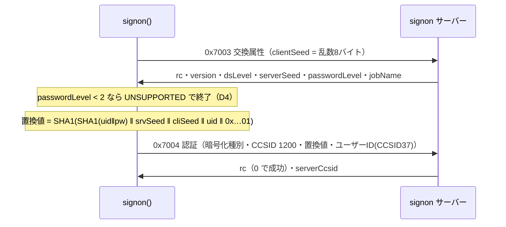

# 仕様: ホストサーバー接続基盤と signon 認証

## 概要

IBM i ホストサーバーへの接続基盤を `packages/core` に新設し、**signon サーバーの認証を貫通**させる。
ACS データ転送（SQL・アップロード）は本作業の対象外だが、**その土台になるよう共通化して切り出す**
（research F9: database サーバーは手順が違うだけで認証の作り方は同一）。

research で PUB400 での認証成功を実証済み（F7）。本作業はそれを**製品コードとして書き起こす**もの。

## 設計方針

### D1: jtopenlite は「事実の出典」として参照し、コードは書き起こす

research F10 のとおり JTOpen は IBM Public License 1.0（互恵条項つき）。本リポジトリは公開のため、
逐語移植すると IPL 1.0 での提供を求められる。IPL 1.0 は「独立モジュールかつ二次的著作物でないもの」を
対象外と明記しているため、**プロトコルの事実（バイト配置・定数・手順）に基づいて書き起こす**。

- 各ファイル冒頭に、対応する jtopenlite のクラス／メソッド名を**参照コメント**で明示する
- **jtopenlite のソースはリポジトリに取り込まない**（同梱頒布を避ける）
- 手書き DES は移植しない（そもそも D4 で実装対象外）

> LICENSE / NOTICE の整備は**別作業**として先に実施する（ユーザー判断: Apache-2.0）。
> 本作業はその成果に依存しないが、マージ順は LICENSE 側を先にする。

### D2: 既存資産を最大限使う（新規実装を増やさない）

| 必要なもの | 使うもの |
|---|---|
| TLS 付き TCP 接続 | 既存 `TcpTransport`（`tls?: boolean \| {rejectUnauthorized, ca}`。検証は既定 ON） |
| CCSID 37 変換 | 既存 `codecForCcsid(37)`。`encode()` の `substituted` で変換不能を検出 |
| エラー | 既存 `Tn5250Error` / `ErrorCode` |
| ログ | 既存 `childLog` |

**CCSID 37 変換表は新規実装しない**（`packages/core/src/codec/tables/ibm37.ts` が既存）。

### D3: 認証は signon 専用にせず「ホストサーバー共通」として切る

research F9 より、database 等は `0x7001`→`0x7002`、signon は `0x7003`→`0x7004` と**枠だけが違う**。
パスワード置換値の生成（F1）と資格情報のバイト化（F5）は完全に共通。
よって `password.ts` / `credentials.ts` を signon から独立させ、次段階でそのまま再利用できる形にする。

### D4: DES 経路（QPWDLVL < 2）は実装しない

research F6 より PUB400 はパスワードレベル 3。DES 経路は 700 行超の手書き実装が必要な一方、
本作業の相手では**一度も通らない**。分岐点だけ残し、レベル < 2 は明確な「未対応」エラーにする
（黙って誤った値を送って認証失敗するより、未対応と言うほうが切り分けやすい）。

### D5: パスワードレベルは設定させず、サーバー応答から取る

research F6 のとおり交換属性応答の CP `0x1119` で得られる。設定項目にすると誤設定で
アルゴリズムを取り違える余地が生まれるため、**設定させない**。

## 対象範囲

新規: `packages/core/src/hostserver/`

| ファイル | 責務 | 出典（参照のみ） |
|---|---|---|
| `datastream.ts` | 20バイトヘッダー＋LL/CP の読み書き | — |
| `frames.ts` | 長さ前置フレームの分割・要求/応答の対応付け | — |
| `port-mapper.ts` | 449 でサービス名→ポート解決 | `PortMapper` |
| `credentials.ts` | ユーザーID/パスワードのバイト化（CCSID 37 / UTF-16BE） | `HostServerConnection.getUserBytes/getPasswordBytes` |
| `password.ts` | パスワード置換値の生成（SHA 経路） | `EncryptPassword.encryptPasswordSHA` |
| `signon.ts` | 交換属性→認証のシーケンス | `SignonConnection` |
| `return-codes.ts` | 戻りコードの分類 | `HostServerConnection.getReturnCodeMessage` |

変更: `packages/core/src/index.ts`（公開 API 追加）、`packages/core/src/errors.ts`（コード追加）

**対象外**: database サーバー / SQL / アップロード / MCP ツール / Web UI / DES 経路 / Kerberos

## インターフェース / データ構造

```ts
/** ホストサーバーの種別（ポートマッパーのサービス名と既定ポートを束ねる） */
export type HostService = "signon" | "database" | "command" | "file" | "ddm";

export interface HostServerOptions {
  host: string;
  /** 明示ポート。未指定なら resolvePort（既定は解決せず既定ポート） */
  port?: number;
  /** TLS。既定 false。true で証明書検証あり */
  tls?: boolean | { rejectUnauthorized?: boolean; ca?: string | string[] };
  /** true でポートマッパー(449)に問い合わせる。既定 false */
  resolvePort?: boolean;
  timeoutMs?: number;
}

/** 交換属性応答から得られるサーバー情報 */
export interface HostServerInfo {
  /** 例 0x00070500 → "7.5.0.0" */
  version: string;
  rawVersion: number;
  datastreamLevel: number;
  /** QPWDLVL 相当。>=2 で SHA 経路 */
  passwordLevel: number;
  /** 例 "657007/QUSER/QZSOSIGN" */
  jobName?: string;
}

export interface SignonResult {
  info: HostServerInfo;
  /** 応答 CP 0x1114。PUB400 では 273 */
  serverCcsid?: number;
}

/** signon サーバーへ接続し認証する。成功でのみ解決する */
export function signon(
  opts: HostServerOptions & { user: string; password: string }
): Promise<SignonResult>;

/** ポートマッパー(449)にサービスのポートを問い合わせる */
export function resolveServicePort(
  host: string, service: HostService, timeoutMs?: number
): Promise<number>;
```

パスワード置換（純関数・テスト可能）:

```ts
/** SHA 経路。userIdUnicode は 20 バイト UTF-16BE、seed は各 8 バイト */
export function passwordSubstituteSha(
  userIdUnicode: Uint8Array, passwordUtf16be: Uint8Array,
  clientSeed: Uint8Array, serverSeed: Uint8Array
): Uint8Array; // 20 バイト
```

データストリームの構造（research F2）:

```
0  : UInt32BE 全体長      4 : UInt16BE HeaderID   6 : UInt16BE ServerID
8  : UInt32BE CS instance 12: UInt32BE CorrelationID
16 : UInt16BE TemplateLen 18: UInt16BE ReqRepID
20〜: [UInt32BE LL | UInt16BE CP | 値(LL-6)]…
応答は 20 が戻りコード、パラメータ列は 24 から
```

## 振る舞いの詳細

### 認証シーケンス



### 資格情報のバイト化（research F5。取り違えやすい）

パスワードレベル >= 2 のとき:

| 用途 | 形式 |
|---|---|
| ハッシュ入力のユーザーID | UTF-16BE 20バイト・空白詰め・**大文字化** |
| ハッシュ入力のパスワード | UTF-16BE・詰めなし・**大文字化しない**（大小を区別） |
| 要求 CP `0x1104` のユーザーID | **CCSID 37 の 10バイト**・0x40 詰め・大文字化 |

> 同じユーザーIDが**用途によって別の符号化**になる。ここを取り違えると認証が通らない。

### クライアントシード

8 バイトの**暗号論的乱数**（`node:crypto` の `randomBytes`）を使う。
jtopenlite は `System.currentTimeMillis()` だが、予測可能な値を使う理由がない。

### ポート決定

`port` 明示 > `resolvePort: true` ならポートマッパー解決 > 既定（TLS 9476 / 平文 8476）。

ポートマッパーの応答（research F3）: 先頭 1 バイトが `0x2B` なら成功、続く 4 バイトがポート。
1 リクエスト 1 ソケットで使い捨てる。

### トレース

ヘッダーと CP 単位で出す。**CP `0x1105`（パスワード置換値）の値は必ずマスク**する。
平文パスワードはそもそもバイト化後に保持しない。

## ドメイン固有の考慮

- **CCSID 37 は固定**（research F5）。システム CCSID（PUB400 は 273）と混同しない。
  既存コードの 273 の知見をここに持ち込まない
- ユーザーIDに CCSID 37 で表せない文字があれば、`encode()` の `substituted > 0` で検出し
  `CONFIG_ERROR` にする（黙って `0x3F` を送らない）
- 既存の TN5250 実装には一切触れない

## エラー処理 / 異常系

`ErrorCode` に追加:

| コード | 用途 |
|---|---|
| `HOST_SERVER_UNSUPPORTED` | パスワードレベル < 2（DES 経路。D4） |

既存コードを再利用:

| 状況 | コード |
|---|---|
| 接続不可・タイムアウト | `CONNECT_FAILED` |
| TLS 証明書エラー | `TLS_CERT_INVALID` |
| 認証失敗（rc != 0） | `UNAUTHENTICATED` |
| フレーム長異常・未知の応答 | `PROTOCOL_ERROR` |
| CCSID 37 変換不能なユーザーID | `CONFIG_ERROR` |

認証失敗は戻りコードを分類して**原因が分かるメッセージ**にする（research F8）:

```
0x00020001 ユーザー ID が不明です
0x00020002 ユーザー ID は有効ですが無効化されています
0x0003000B パスワードが誤っています
0x0003000C パスワードが誤っています（次に誤るとプロファイルが無効化されます）
0x0003000D パスワードは正しいですが期限切れです
0x00030010 パスワードが *NONE です
上位16bit 0x0001 / 0x0004 / 0x0006 → 要求データ / セキュリティ / 認証トークンのエラー
```

`Tn5250Error` に `rc` を載せ、呼び出し側が数値でも分岐できるようにする。

> `0x0003000C`（次で無効化）と `0x0003000D`（期限切れ）は**取り違えやすい**。表を写す際に要注意。

## 受け入れ基準との対応

| requirement の完了条件 | 満たし方 |
|---|---|
| ポートマッパーでポート解決 | `resolveServicePort()`。実機で `as-signon` を解決して確認 |
| PUB400 で認証成功 | `signon()` を実アカウントで実行（research F7 で実証済み） |
| 誤パスワードを区別 | **実機では検証しない**（アカウント無効化リスク。research リスク2）。 `return-codes.ts` の分類を単体テストで検証 |
| TLS と平文の双方 | 9476 / 8476 で実機確認 |
| 実機非依存の単体テスト | `passwordSubstituteSha()` を固定ベクタで検証。ベクタは実機成功時の値を採取して固定 |
| パスワードが平文で出ない | トレース出力を捕捉し、パスワード文字列を含まないことを検証 |
| jt400 との対応が追える | 各ファイル冒頭の参照コメント（D1） |
