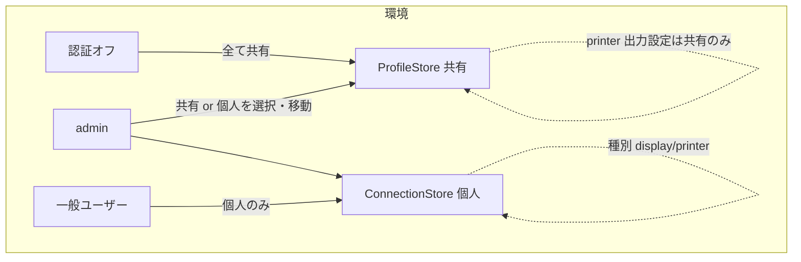

# 設計: 接続設定の所有モデルと種別の整理

## アーキテクチャ概要
2 軸で整理する。
- **種別 (sessionType)**: `display`（エミュレーター）| `printer`。**作成時に決定し、編集では不変**。
- **所有 (ownership)**: 共有（= ProfileStore / profiles.json）| 個人（= ConnectionStore / connections.json）。

既存の 2 ストア構成は維持し、その上に「種別を明示・固定」「所有を環境で出し分け」「admin は所有を移動可」を載せる。

## データモデル

### Profile（profiles.json）
- **`sessionType?: "display" | "printer"` を明示追加**（後方互換: 未設定なら `printer` ブロックの有無から導出）。
  `effectiveType(p) = p.sessionType ?? (p.printer ? "printer" : "display")`。
- printer 出力（`printer` ブロック）は **effectiveType === "printer" のときのみ**保持・受理（display では常に落とす）。
- 種別は作成時に決定、更新時は既存を維持（変更不可）。

### Connection（connections.json）
- 既存 `sessionType` を作成時に確定、更新で不変。printer 出力設定は**持たない**（Q3・信頼境界）。

## インターフェース / API

### 種別の固定・printer 露出（server）
- `profileInputSchema` に `sessionType?` を追加。**新規作成**でのみ採用。**更新では無視**し既存の種別を保つ。
- `buildProfile`: `effectiveType` を決め、`display` なら printer を落とす（`buildPrinter` を type gate 下に）。
- `PublicProfile.sessionType` は effectiveType を返す（露出は現状どおり printer は editor のみ）。
- `ConnectionStore.update`: `sessionType` を既存維持（入力で変更不可）。

### 所有の移動（admin 限定・新規）
- `POST /api/settings/move`（admin のみ。認証オフには個人が無いので不要）:
  - body: `{ kind: "connection" | "profile", id: string, to: "shared" | "personal" }`
  - **personal→shared**: connection を読み（admin は全 owner 可）、Profile を作成（name=connection.name、
    host/port/ccsid/screenSize/deviceName/tls/sessionType を転記、`secretEnc → signon.passwordEnc` として移送
    ＝**同一 AES-256-GCM 形式なので文字列コピー**）、connection を削除。name 衝突は 409/400。
  - **shared→personal**: profile を読み、Connection を作成（owner=呼び出し admin、`signon.passwordEnc → secretEnc`
    移送、`passwordEnv`（env 参照）は個人に移せないので**破棄＝パスワード再入力**（warn）、`printer` 出力は個人に
    持てないので**破棄**）、profile を削除。
- 実装は両ストアを持つルート層（`settings-move.ts` を新設し `app.ts` から登録）。ストアに移送補助メソッドを足す:
  - `ConnectionStore.getOwned(id, user): ConnectionRecord`（owner チェック付き取得）／`addRecord`／`remove`。
  - `ProfileStore.getRaw(name): Profile`／`addRecord(p: Profile)`（サーバー内移送用。ブラウザ JSON 経由の
    passwordEnc 直接注入は不可のまま）。

## UI 振る舞い（ConnectView）

### 環境判定（authStore）
- `authOff = !authStore.enabled`（`/api/me` の enabled=false）
- `isAdmin = authStore.isAdmin`

### 一覧カード
- **認証オフ**: 「共有 / 個人」ラベル（`.src`/`共有`チップ）を**出さない**。全カードは共有プロファイル。
- **認証オン**: 共有（プロファイル）/ 個人（自分の接続）を従来どおりラベルで区別。
- 種別チップ（🖥 5250端末 / 🖨 プリンター）は全環境で表示。

### 新規作成フォーム
- **種別**: エミュレーター / プリンター を**ラジオで選択**（新規時のみ）。
- **所有**: **admin のみ** 共有 / 個人 を選択（ラジオ）。認証オフ・一般ユーザーは選択 UI を出さない
  （認証オフ=常に共有、一般=常に個人）。
- **printer 出力設定**: 種別=プリンター **かつ** 所有=共有 **かつ** editor のときだけ表示。

### 編集フォーム
- **種別は固定**（ラジオを出さず、現在の種別を読み取り専用表示）。エミュレーター側は printer 設定を出さない。
- **所有の変更**: admin のみ「共有にする / 個人にする」操作（`/api/settings/move` 呼び出し）。認証オフ・一般は不可。
- printer 出力設定は「プリンター種別 × 共有 × editor」のときのみ。

## 設計判断
- **D-1: 種別を明示フィールド化**（導出併用で後方互換）。printer 設定の有無に種別を依存させない（鶏卵解消）。
- **D-2: printer 出力は「プリンター種別 × 共有プロファイル」限定**（Q3 決定・信頼境界）。個人はプリンター種別でも
  自動出力を持たない。
- **D-3: 所有の移動はサーバー側の専用操作**（2 ストア間の秘密移送を安全に。secretEnc↔passwordEnc は同形式で移送可、
  passwordEnv は個人へ移せず破棄）。フロントの 2 回叩き（作成+削除）にしない（原子性・name 衝突を server で扱う）。
- **D-4: 認証オフは所有概念を隠す**（単一利用者に共有/個人を見せない）。実装は「authOff なら selector/label を出さず
  新規は profiles へ」。

## plan への申し送り（分割単位の示唆）
1. server: 種別明示・固定・printer 露出 gate（profiles/connections/schema）
2. server: `/api/settings/move`（admin・秘密移送）＋ストア補助メソッド
3. web-ui: 環境判定・カードラベルの出し分け・新規フォーム（種別/所有ラジオ）・printer 露出条件・編集の種別固定
4. web-ui: 所有の変更（move 呼び出し）
5. テスト（server: 種別固定/printer gate/move の秘密移送・name 衝突・admin 限定、web-ui: 出し分け）＋README
- 高結合だが 1 PR に収まる規模。subtask 分割は不要見込み（plan で最終判断）。
