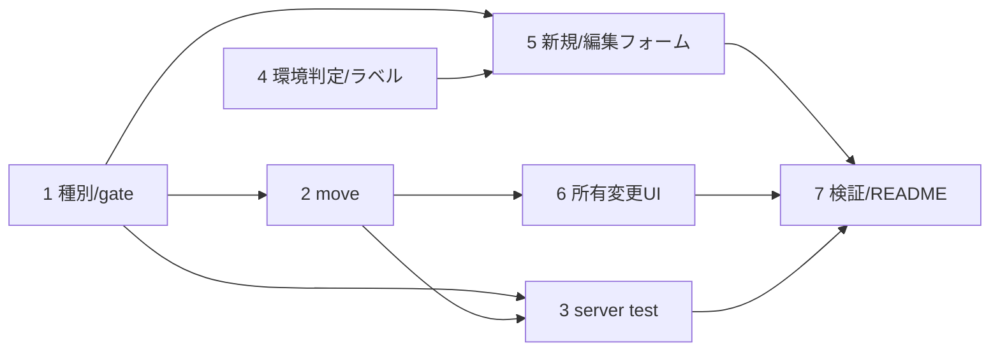

# 計画: 接続設定の所有モデルと種別の整理

## 実装方針
server（種別明示・固定・printer gate → move）→ web-ui（環境判定・出し分け・フォーム）の順。
2 ストア構成は維持。信頼境界（printer/秘密＝共有×editor）を server で担保してから UI を足す。subtask 分割はしない。

## 作業順序と依存関係
1. server: 種別を明示化・固定、printer 露出/受理を「プリンター種別×共有×editor」に gate（profiles/connections/schema）
2. server: `/api/settings/move`（admin 限定・秘密移送）＋ストア補助メソッド＋app 配線
3. server テスト: 種別固定・printer gate・move（移送/衝突/admin 限定/passwordEnv 破棄）
4. web-ui: 環境判定（authStore の enabled/isAdmin）とカードラベルの出し分け
5. web-ui: 新規フォーム（種別/所有ラジオ）・printer 露出条件・編集の種別固定
6. web-ui: 所有変更（move 呼び出し）
7. テスト・ビルド・lint・README

## リスク / 留意点
- **信頼境界**: printer 出力・秘密は「共有プロファイル × editor」限定を維持。個人は printer 種別でも出力設定なし。
- **種別不変**: 更新で sessionType を変えない（server で既存維持）。UI は編集時ラジオを出さない。
- **move の秘密移送**: secretEnc↔passwordEnc は同一 AES-256-GCM 形式でコピー可。passwordEnv は個人へ移せず破棄（warn）。
  name 衝突・admin 限定を server で担保。原子性（作成→削除の順、失敗時ロールバック的扱い）。
- **後方互換**: 既存 profiles/connections は種別を導出（printer 有無）。既存テスト維持。
- 認証オフの一般利用を壊さない（共有だけ・ラベルなし）。

## テスト方針
- server: profile/connection の sessionType 固定（更新で不変）、display で printer 落とす、move の双方向（移送・衝突・
  admin 限定・passwordEnv 破棄・printer 破棄）。
- web-ui: 認証オフでラベル/所有 selector 非表示・新規は共有、admin で所有選択/変更、編集で種別固定、
  printer 欄はプリンター×共有×editor のみ。ビルド（vue-tsc+vite）・既存テスト green。
