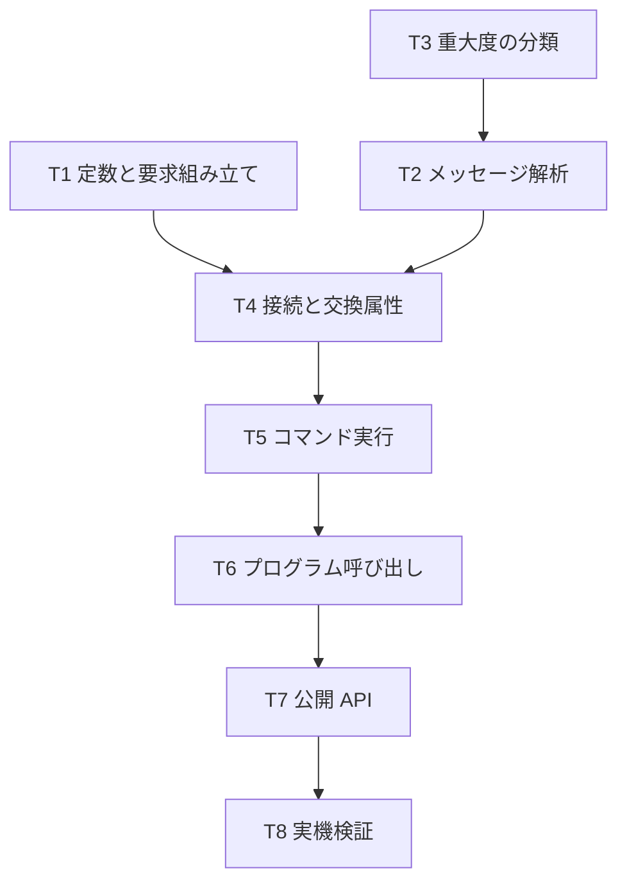

# 計画: コマンドサーバー経由の CL 実行とプログラム呼び出し

## 実装方針

前段 2 件で確立した「純粋関数を先に、I/O を後に」をそのまま使う。
今回は前段より小さい——認証・ヘッダー・EBCDIC がすべて既存で、新規は
「交換属性 → コマンド実行 → メッセージ解析」と「プログラム呼び出し」のみ。

research で成功・失敗の両方を実機で確認済みなので、探索ではなく書き起こし。

## split 判定

**subtask に分割しない。** 新規 3 ファイル・約 600 行の見込みで 1 PR に収まる。

## 作業順序と依存関係

T1〜T3 は純粋関数で相互に独立。T4 以降が I/O。

## リスク / 留意点

- **交換属性を送り忘れると壊れる**（research リスク 1）。接続手順に組み込み、
  公開 API に露出させない。テストで「接続直後にレベルが入っている」ことを確認する
- **成功でもメッセージが返る**（research リスク 2）。成否は戻りコードで判断する。
  「成功かつメッセージあり」のケースを実機で確認する（`ADDLIBLE`）
- **CP 0x1102 は実機で観測できていない**。単体テストのみで担保する旨をコメントに残す
  （spec D4。相手が出すものなので実装はするが、検証は合成バイト列に限られる）
- **`Buffer` 等の Node グローバルを使わない**。前段で 2 回とも指摘対象になっている。
  実装中に意識し、review で機械的に確認する
- **プログラム呼び出しの検証先**は読み取り専用の API にする。副作用のあるものを選ばない

## テスト方針

- **単体（実機非依存）**
  - 要求の組み立て: 交換属性 34 バイト、コマンド実行の長さ計算、プログラム呼び出しの template
  - メッセージ解析: CP 0x1106（実機の生バイト列）と CP 0x1102（合成）
  - 重大度の分類: 0 / 10 / 30 / 40 の境界
  - 異常系: 短いフレーム、想定外の戻りコード、レベル 10 未満
- **実機（T8）**: research F6 の安全なコマンド 4 種。TLS / 平文の双方。
  プログラム呼び出し 1 件。トレースに資格情報が出ないこと
- **回帰**: 既存 823 テストが緑のままであること
