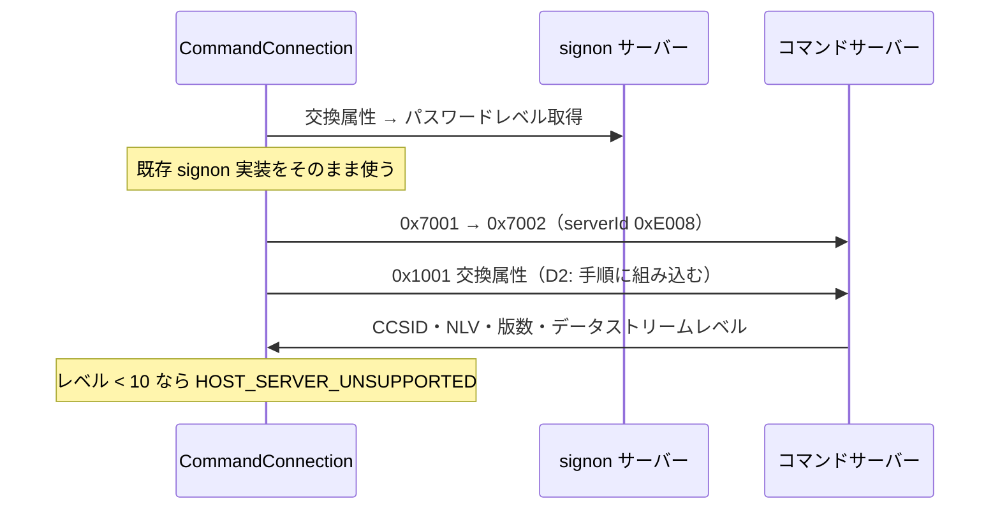

# 仕様: コマンドサーバー経由の CL 実行とプログラム呼び出し

## 概要

コマンドサーバー（`0xE008` / 8475・9475）に接続し、CL コマンドの実行結果を
**構造化して**受け取る。あわせてプログラム呼び出しの足場を作る。

research で成功・失敗の両方を実機で確認済みのため、本作業は書き起こしである。

## 設計方針

### D1: 既存資産をそのまま使う（新規は最小限）

| 必要なもの | 使うもの |
|---|---|
| 認証（`0x7001`/`0x7002`） | 既存 `hostserver/server-connect.ts`。**サーバー ID を渡すだけ** |
| ヘッダー・LL/CP | 既存 `hostserver/datastream.ts`（20 バイト形式。database の 40 バイトではない） |
| ソケット | 既存 `transport/host-connection.ts` |
| EBCDIC | 既存 `codec`（CCSID 37） |

前段 2 件で土台が固まっているため、新規は「交換属性 → コマンド実行 → メッセージ解析」と
「プログラム呼び出し」だけ。

### D2: 交換属性を接続手順に組み込む（呼び出し側に忘れさせない）

データストリームレベルが分からないとコマンドの書式を決められない。
research で、交換属性を送らずにコマンドを投げると応答が解釈不能になることを確認した。

→ `CommandConnection.connect()` の中で必ず送り、レベルを保持する。**公開 API に露出させない**。

### D3: コマンド送信はレベル 10 以上のみ対応。未満は明示的に失敗させる

research F3 のとおり、レベル 10 未満は CCSID 37 / CP 0x1101 の別経路になる。
PUB400 は 11 で、**10 未満を実機で確認する手段が無い**。

前段の DES 経路と同じ方針を採る——**分岐点は残し、未対応であることを明示的に伝える**。
黙って誤った書式を送ると「コマンドが見つからない」等の紛らわしい失敗になる。

### D4: メッセージの解析は 2 形式とも実装する（送信とは扱いを変える）

送信（D3）は**こちらが出すもの**なので、検証できない経路は塞ぐ。
解析は**相手が出すもの**を受ける側であり、想定外の形式で落ちるより読めた方がよい。

CP `0x1106`（長さ前置）と `0x1102`（固定長）の両方を実装する。
`0x1102` は実機で観測できていないため、**単体テストのみで担保**する旨をコメントに残す。

### D5: 成否は戻りコードで判断する。メッセージの有無ではない

research F6 で、**成功時にも情報メッセージ（重大度 0）が返る**ことを確認した
（`CPC2101 "Library list changed."` 等）。
メッセージ件数で成否を判断する実装にしない。

## 対象範囲

新規: `packages/core/src/hostserver/command/`

| ファイル | 責務 |
|---|---|
| `command-datastream.ts` | サーバー ID・要求 ID・メッセージ CP の定義、要求の組み立て |
| `command-message.ts` | メッセージ解析（CP 0x1106 / 0x1102）と重大度の分類 |
| `command-connection.ts` | 接続・交換属性・コマンド実行・プログラム呼び出し |

変更: `index.ts`（公開 API 追加）、`hostserver/port-mapper.ts`（`command` は定義済み・変更なし）

**対象外**: 具体的な API ラッパ（スプール等）、MCP、Web UI、対話型コマンド、サービスプログラム

## インターフェース / データ構造

```ts
export interface CommandConnectOptions {
  host: string;
  user: string;
  password: string;
  port?: number;
  tls?: boolean | HostServerTlsOptions;
  resolvePort?: boolean;
  timeoutMs?: number;
}

/** IBM i が返したメッセージ */
export interface HostMessage {
  /** 例 "CPF2110" */
  id: string;
  text: string;
  /** 0=情報 / 10=警告 / 20-30=エラー / 40 以上=重大 */
  severity: number;
  /** severity から導いた分類。文言ではなく値で分岐できるように */
  kind: "info" | "warning" | "error" | "severe";
  file?: string;
  library?: string;
  help?: string;
}

export interface CommandResult {
  /** 戻りコードが 0 か（メッセージの有無ではない。D5） */
  success: boolean;
  returnCode: number;
  messages: HostMessage[];
}

/** プログラム呼び出しのパラメータ */
export type ProgramParameter =
  | { type: "in"; data: Uint8Array }
  | { type: "out"; length: number }
  | { type: "inout"; data: Uint8Array; length: number }
  | { type: "null" };

export class CommandConnection {
  static connect(opts: CommandConnectOptions): Promise<CommandConnection>;
  /** CL コマンドを実行する。失敗しても例外にせず CommandResult で返す */
  run(command: string): Promise<CommandResult>;
  /** 失敗したら例外にする版（呼び出し側で分岐したくない場合） */
  runOrThrow(command: string): Promise<CommandResult>;
  /** プログラムを呼び出し、出力パラメータを受け取る */
  call(
    program: string, library: string, params: ProgramParameter[]
  ): Promise<{ result: CommandResult; outputs: (Uint8Array | undefined)[] }>;
  /** サーバー情報（交換属性で得たもの） */
  readonly info: { ccsid: number; datastreamLevel: number; version: string };
  close(): void;
}
```

## 振る舞いの詳細

### 接続手順



### コマンド実行（要求 0x1002）

```
template 長 1、その 1 バイトがメッセージオプション（レベル>=10 は 4＝全件返却）
パラメータ: LL(4)=10+バイト長, CP(2)=0x1104, CCSID(4)=1200, コマンド（UTF-16BE）
応答: オフセット20(2)=戻りコード, 22(2)=メッセージ件数, 24〜=メッセージ列
```

### 重大度の分類

| 重大度 | kind |
|---|---|
| 0 | `info` |
| 1〜19 | `warning` |
| 20〜39 | `error` |
| 40 以上 | `severe` |

実機で 0 / 30 / 40 を観測済み。

## ドメイン固有の考慮

- **対話型コマンドは使えない**。`SNDPGMMSG` は `CPD0031 "Command ... not allowed in this setting."`
  で弾かれる（research F6）。この制約をドキュメントに明示する
- メッセージ ID・テキストは **CCSID 37 の EBCDIC**（ジョブの CCSID ではない）
- 前段の非機能要件を踏襲: ピュア層は Node API 非依存、**`Buffer` 等のグローバルも使わない**

## エラー処理 / 異常系

| 状況 | 扱い |
|---|---|
| コマンド失敗（rc=0x0400） | **例外にせず** `CommandResult.success=false` で返す（`run`） |
| 想定外の戻りコード | `PROTOCOL_ERROR` |
| データストリームレベル < 10 | `HOST_SERVER_UNSUPPORTED` |
| 接続不可・証明書 | 既存の `CONNECT_FAILED` / `TLS_CERT_INVALID` |
| 認証失敗 | 既存の `UNAUTHENTICATED` |

`runOrThrow` は失敗時に `CommandError extends Tn5250Error` を投げ、
**メッセージを型として公開**する（前段で `Object.assign` を must 指摘したため最初から型で持つ）。

## 受け入れ基準との対応

| requirement の完了条件 | 満たし方 |
|---|---|
| 接続・認証（TLS/平文） | 実機で双方確認 |
| 副作用のない CL が成功 | `CHGJOB CCSID(273)` / `ADDLIBLE`→`RMVLIBLE`（research F6 の安全なコマンド） |
| 存在しないコマンドが失敗しメッセージ ID が取れる | `NOSUCHCMD` → `CPD0030` |
| 実行時エラーのメッセージ | `DSPLIB LIB(NOSUCHLIB)` → `CPF2110` 重大度 40 |
| プログラム呼び出しと出力受け取り | 読み取り専用の API を実機で呼ぶ |
| メッセージ解析の単体テスト | 固定バイト列（0x1106 / 0x1102 の両形式） |
| 資格情報が平文で出ない | トレース出力をテストで検証 |
| jt400 との対応 | 各ファイルの参照コメント |
