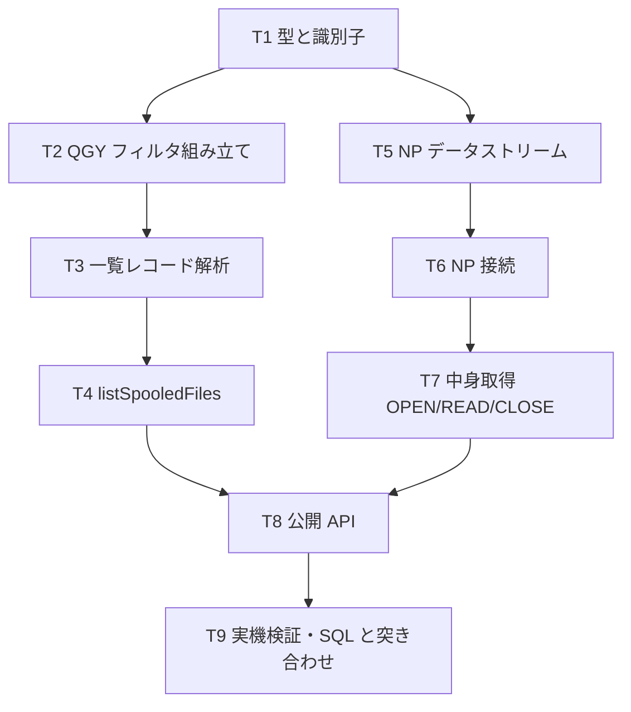

# 計画: スプールファイルの一覧・取得

## 実装方針

「純粋関数を先に、I/O を後に」。ただし今回は**未知の度合いが経路で違う**:

- **一覧（QGY）**: research で実機成功済み。書き起こすだけ
- **中身（ネットワーク印刷サーバー）**: 未実証。**探索を伴う**

そこで一覧を先に固め、中身は「小さく試して確かめる」を挟む。

## split 判定

**subtask に分割しない。** 新規 4 ファイル・約 700 行の見込み。
経路は 2 つだが、識別子（`SpoolId`）で繋がる 1 つの機能であり、分けると
「一覧できるが中身が取れない」中途半端な状態が PR に残る。

## 作業順序と依存関係

## リスク / 留意点

- **レコード配置（OSPL0300・136 バイト）は原典を読んで確定させる**。
  research F5 で「推測でバイト配置を組んで 5 往復無駄にした」反省がある。
  実機で確認できたのは先頭 36 バイトのみ
- **中身取得は未実証**。OPEN→READ→CLOSE の各段でコードポイントの構成が要る。
  最初から通しで書かず、OPEN が通るかを先に確かめる
- **フィルタは各配列に最低 1 件**（`GUI0011`/`GUI0012`）。修飾ジョブ名は**空白**（`*ALL` 不可）
- **他人のスプールは見えない**のが正常（PUB400 の権限）。検証は自分のスプールで行う
- **`Buffer` 等の Node グローバルを使わない**。前段で 2 回とも指摘対象
- 既存 `PrinterSession`（push 型）に触れない

## テスト方針

- **単体（実機非依存）**
  - フィルタの組み立て（連続配置・最低 1 件）
  - 一覧レコードの解析（実機の生バイト列を固定値に）
  - NP データストリームの組み立て（20+12+LL/CP）
  - 異常系: 短いフレーム、想定外の戻りコード
- **実機（T9）**
  - 一覧が取れる（research で確認済みの 3 件）
  - 中身が取れる
  - **同じスプールを SQL で読んだ結果と一致する**（採用しない経路を検証に使う）
  - 一覧の識別子をそのまま中身取得へ渡せる
- **回帰**: 既存テストが緑のまま
