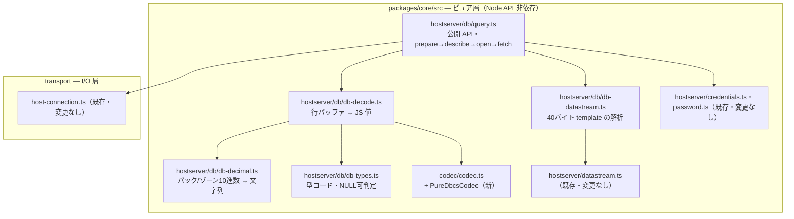
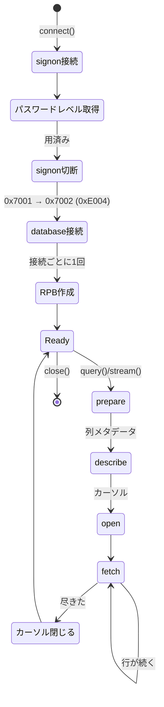

# 設計: ホストサーバー経由の SQL 実行

## アーキテクチャ概要



**既存 4 モジュールは変更しない**。追加と、codec への 1 クラス追加だけで足りる。

## コンポーネント / モジュール

| モジュール | 責務 | 依存 |
|---|---|---|
| `db/db-types.ts` | DB2 型コード定義、NULL 可（最下位ビット）判定、型名 | なし（純データ） |
| `db/db-decimal.ts` | パック / ゾーン 10 進数 → 文字列 | なし |
| `db/db-decode.ts` | 列メタ＋行バッファ → `DbValue` | db-types, db-decimal, codec |
| `db/db-datastream.ts` | database の template 解析、要求組み立て | hostserver/datastream |
| `db/db-connection.ts` | 接続・RPB・要求往復 | transport, hostserver/signon |
| `db/query.ts` | prepare→describe→open→fetch、公開 API | 上記すべて |
| `codec/pure-dbcs.ts` | 純 DBCS コーデック（新） | codec/table-types |

## 設計判断

### DD1: 16684 の変換表は**既に手元にある**（新規生成しない）

調査で、既存 `codec/tables/ibm1399.ts` の **DBCS 部が CCSID 16684 そのもの**だと確認した。
ICU の `ibm-16684_P110-2003.ucm` と突き合わせて一致を検証済み:

```
ICU ibm-16684 : 0x4260→U+2212  0x426A→U+00A6  0x43A1→U+301C  0x444A→U+2014  0x447C→U+2016
既存 ibm1399  : 0x4260→U+2212  0x426A→U+00A6  0x43A1→U+301C  0x444A→U+2014  0x447C→U+2016
subchar        : 双方 0xFEFE
```

これは偶然ではなく、**CCSID 1399 = SBCS 5123 + DBCS 16684** という構成そのもの。

→ **`gen-tables` の拡張も ICU の追加ダウンロードも不要**。spec D4 で想定していた作業が消える。
`ibm1399.dbcs` を CCSID 16684 として公開する薄いモジュールを足すだけでよい。

> 将来 1399 を「5123 と 16684 の合成」として組み直す余地はあるが、
> 既存の TN5250 側に影響するため**この作業では行わない**（要件の「既存に影響を与えない」に従う）。

### DD2: CCSID 300 は 16684 ＋ **15 箇所の差分**（jt400 と同じ結果にする）

JTOpen 本体の `ConvTable300 extends ConvTable16684` に倣う。IBM 自身がコメントで理由を書いている——
300 の表を独立生成すると「マップされなくなるコードポイントが数千個」出て、既存アプリの挙動が変わる。

差分は**波ダッシュ・全角チルダ問題**そのもの:

| バイト | 16684（Unicode 規格寄り） | 300（jt400 / ACS 互換） |
|---|---|---|
| `0x4260` | U+2212 `−` MINUS SIGN | U+FF0D `－` FULLWIDTH HYPHEN-MINUS |
| `0x426A` | U+00A6 `¦` BROKEN BAR | U+FFE4 `￤` FULLWIDTH BROKEN BAR |
| `0x43A1` | U+301C `〜` WAVE DASH | U+FF5E `～` FULLWIDTH TILDE |
| `0x444A` | U+2014 `—` EM DASH | U+2015 `―` HORIZONTAL BAR |
| `0x447C` | U+2016 `‖` DOUBLE VERTICAL LINE | U+2225 `∥` PARALLEL TO |

逆方向（Unicode→バイト）は 10 箇所。合計 15。

**採用理由**: このプロジェクトは ACS の代替であり、**ACS と同じ結果を返すことが正しさ**。
ICU から独立生成すると規格的には正しいが、ACS・jt400 と違う文字が出る。

### DD3: 純 DBCS は既存の型を再利用する（新しいテーブル型を作らない）

既存 `StatefulTable.dbcs` が、純 DBCS に必要な形と**完全に一致**している。

```ts
dbcs: {
  ebcdicToUnicode: ReadonlyMap<number, number>;  // (b1<<8|b2) → コードポイント
  unicodeToEbcdic: ReadonlyMap<number, number>;
  sub: number;
}
```

→ この内側の型を `DbcsPart` として切り出し、`PureDbcsCodec` が受け取る形にする。
新しい生成物も新しいテーブル形式も要らない。

純 DBCS は**状態を持たない**（SO/SI がない）ため、実装は既存 `DbcsCodec` より単純:

```ts
decode(bytes) {  // 2 バイトずつ引くだけ
  for (let i = 0; i + 1 < bytes.length; i += 2) { ... }
}
```

### DD4: 10 進数は文字列。BIGINT は bigint（spec D2 の再確認）

原典でも `packedDecimalToString` / `zonedDecimalToString` が使われており、
**`double` を経由しない経路が正**であることを確認した（jtopenlite `Column.java`）。

### DD5: jtopenlite が実装していない機能を作る（参照コメントの書き分け）

**jtopenlite は純 DBCS の GRAPHIC を実装していない**（UTF-16 の CCSID 以外は例外を投げる）。
本実装はそれを超えるため、参照コメントは**本体 JTOpen の `ConvTable300` / `ConvTable16684`** を指す。

AGENTS.md の規約どおり、jtopenlite と本体で実装が違う箇所は**どちらを見たかを書き分ける**。

## インターフェース / データモデル

```ts
// codec/table-types.ts に追加
export interface DbcsPart {
  readonly ebcdicToUnicode: ReadonlyMap<number, number>;
  readonly unicodeToEbcdic: ReadonlyMap<number, number>;
  readonly sub: number;
}
export interface PureDbcsTable {
  readonly ccsid: number;
  readonly name: string;
  readonly part: DbcsPart;
}

// codec/pure-dbcs.ts
export class PureDbcsCodec implements Codec {
  readonly isDbcs = true;
  constructor(readonly table: PureDbcsTable);
  decode(bytes: Uint8Array): string;              // 2 バイト固定
  encode(text: string): { bytes; substituted };
}
/** GRAPHIC 列用。16684 / 300 に対応。未知の CCSID は例外 */
export function pureDbcsCodecForCcsid(ccsid: number): PureDbcsCodec;
```

型変換の割り当て（`db-decode.ts`）:

```ts
type Decoder = (buf: Uint8Array, off: number, meta: ColumnMeta) => DbValue;
const DECODERS: ReadonlyMap<number, Decoder>;  // 型コード → 変換関数
```

## 処理フロー / シーケンス



## リスク / 留意点

- **NULL 指標の実バイト形式は未確認**。`newIndicator(row, column, data)` という
  コールバック形状しか分かっていない。coding 時に実機のバイト列で確かめる
- **ブロッキング係数の既定値**が不明。小さすぎると往復が増え、大きすぎるとメモリを食う。
  実機で挙動を見て決める
- `MARO1.SQLTYPES` の `G_V`（CCSID 300）は `UX'30A230A4'`（アイ）を入れてある。
  DD2 の差分位置の文字ではないため、**差分そのものは単体テストで検証**する
  （実機に差分位置の文字を入れるのは、投入経路の CCSID 変換が絡んで検証が濁る）

## plan への申し送り

規模は前段（1,066 行）より大きいが、**DD1 で `gen-tables` 拡張が消えた**ため spec 時点の想定より縮んだ。

分割の目安（subtask にするかは plan で判断）:

1. **codec の純 DBCS 対応** — `DbcsPart` / `PureDbcsCodec` / 16684・300。他と独立して検証可能
2. **型変換** — `db-types` / `db-decimal` / `db-decode`。純関数。固定バイト列でテストできる
3. **プロトコル** — `db-datastream` / `db-connection` / `query`。I/O を伴う
4. **実機検証** — `MARO1.SQLTYPES` との突き合わせ

1 と 2 は**純粋で相互に独立**。3 が 1・2 に依存し、4 が全体に依存する。
前段と同じ「純粋関数を先に、I/O を後に」の順序が使える。
