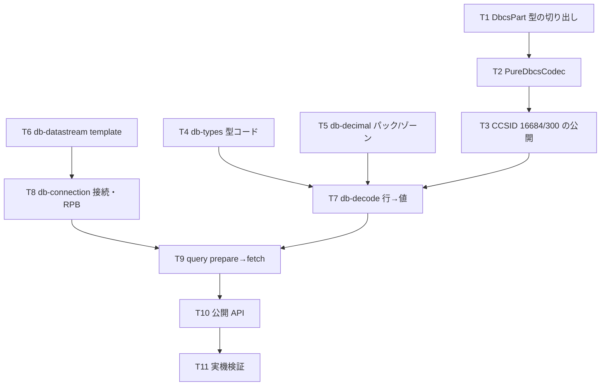

# 計画: ホストサーバー経由の SQL 実行

## 実装方針

**純粋関数を先に、I/O を後に。** 前段（signon）で手戻り 0・差し戻し 0 を達成した順序をそのまま使う。

今回の本体は型変換であり、その大半は副作用のない純関数として切り出せる。
固定バイト列で単体テストを固めてから実機に触れば、実機では「配線が正しいか」だけを見ればよい。

design DD1 で `gen-tables` の拡張と ICU の追加取得が不要になったため、
spec 時点の想定より作業が縮んでいる。

### 検証データの二段構え

| 段階 | データ | 目的 |
|---|---|---|
| 単体 | 手で組んだ固定バイト列 | 変換ロジックの正しさ・回帰検出 |
| 実機 | `MARO1.SQLTYPES`（research F11） | プロトコルの配線・実際の型表現 |

**CCSID 300 の差分（DD2）は単体テストで検証する。** 実機に差分位置の文字を入れると、
投入経路（5250 端末・RUNSQL）の CCSID 変換が絡んで何を検証しているのか濁るため。

## split 判定

**subtask に分割しない。** 1,300 行前後で 1 PR に収まる規模。
`codec` の純 DBCS 対応は単独でも検証可能だが、この機能のためだけに存在するので別 work にはしない。
design の 4 段階を**コミット単位**で分ける。

## 作業順序と依存関係

- **T1〜T3（codec）** と **T4〜T5（型定義・10進数）** は相互に独立。どちらから着手してもよい
- **T6（template）** も独立。既存 `parseReply` の上に database 用の解析を足すだけ
- **T7（db-decode）** が codec と 10 進数を束ねる最初の合流点
- **T9（query）** がプロトコルと変換の合流点
- **T11（実機）** で初めて PUB400 に触れる

## リスク / 留意点

- **NULL 指標の実バイト形式が未確認**（design のリスク）。T9 で実機のバイト列を見て確定する。
  ここだけは単体テストを先に書けないため、**実機の観測結果からテストを起こす**順序になる
- **ブロッキング係数の既定値が不明**。T11 で挙動を見て決める。小さすぎると往復増、大きすぎるとメモリ
- **符号の位置がパックとゾーンで違う**（パックは最終ニブル / ゾーンは最終バイトの上位ニブル）。
  T5 で両方のテストを並べて取り違えを防ぐ
- **`Buffer` 等の Node グローバルを使わない**。前段のレビューで lint をすり抜けて must になった。
  `no-restricted-imports` は import しか見ないため、**目視とレビューで担保する**
- **参照コメントの書き分け**（design DD5）。純 DBCS は jtopenlite が実装していないため、
  本体 JTOpen の `ConvTable300` / `ConvTable16684` を指す
- 既存の TN5250 側に影響を与えない。`ibm1399.ts` は**変更しない**（読み取って再利用するだけ）

## テスト方針

- **単体（実機非依存）**
  - `PureDbcsCodec`: 2 バイト固定の往復、奇数長バイト列、マップ不能文字
  - **CCSID 300 の 15 箇所の差分**: 16684 と 300 で結果が変わることを明示的に固定
    （波ダッシュ `0x43A1` → 16684 は U+301C、300 は U+FF5E）
  - `db-decimal`: パック / ゾーンの正負・小数・境界（桁数が偶数/奇数）。
    **`-12345678.91` が文字列で正確に出ること**
  - `db-types`: 型コードと NULL 可（最下位ビット）判定
  - `db-decode`: 固定の行バッファから各型の値。可変長の 2 バイト前置、CHAR の末尾空白保持
  - `db-datastream`: 40 バイト template の解析、`rcClass` によるエラー判定
- **実機（T11）**: `MARO1.SQLTYPES` の既知の値と突き合わせ（spec の受け入れ基準の表）。
  SQL エラー 2 ケース（構文誤り・存在しない表）。TLS / 平文の双方
- **回帰**: 既存 709 テストが緑のままであること（TN5250・signon に触れていないことの担保）
