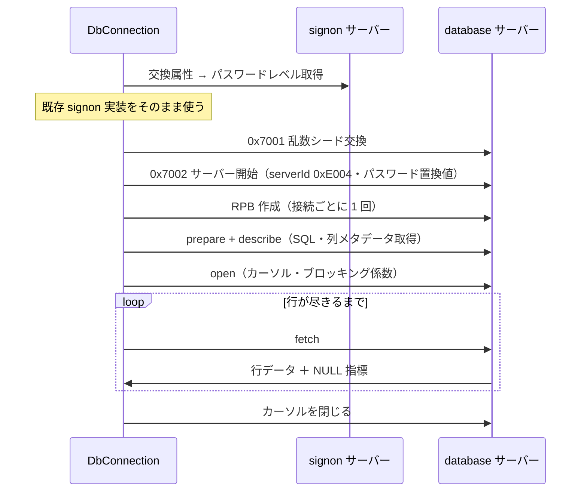

# 仕様: ホストサーバー経由の SQL 実行（ダウンロード）

## 概要

database ホストサーバー（8471 / TLS 9471）へ接続し、SELECT の結果を実用的なデータ型で取得する。
認証は前段（`20260718-acs-data-transfer`）の実装をそのまま再利用する。

作業の実質的な本体は**データ型変換**であり、プロトコルの往復そのものではない。

## 設計方針

### D1: 既存資産を最大限使い、差分だけを足す

| 必要なもの | 使うもの |
|---|---|
| 認証（パスワード置換値・資格情報） | 既存 `hostserver/password.ts` / `credentials.ts`（**変更なしで再利用**） |
| ソケット・フレーム分割 | 既存 `transport/host-connection.ts` |
| データストリームの解析 | 既存 `hostserver/datastream.ts` の `parseReply`（research F2） |
| EBCDIC 変換 | 既存 `codec`。ただし純 DBCS は拡張が要る（D4） |

`parseReply` はパラメータ開始位置を `HEADER_LEN + templateLen` で求める作りなので、
database の 40 バイトヘッダーでもそのまま動く（前段 decisions D4 の修正が効く）。

**ただし template の中身は signon と別物**（先頭 4 バイトは戻りコードではなく ORS bitmap）。
database 用の template パーサを新設し、`rcClass` / `rcClassReturnCode` でエラー判定する。

### D2: 10 進数は**文字列**で返す（この作業で最も重要な API 判断）

`DECIMAL` / `NUMERIC` は `string` で返す。理由:

- JavaScript の `number` は 2^53 を超えると精度を失う。
  検証表の `N_BIG = 9007199254740993` はまさにこれに当たる
- `DECIMAL(11,2)` のような金額列で精度が落ちるのは業務データとして許容できない
- 参照実装にも `packedDecimalToString` / `zonedDecimalToString` があり、
  **`double` を経由しない変換経路が確立している**（research F9）

退けた案:
- `number` — 実装は楽だが精度が落ちる。**静かに誤った値を返す**のが最悪
- `BigInt` — 整数は正確だが小数を扱えない
- 専用 Decimal 型 — 正確だが依存が増え、core の「依存を持たない」方針に反する

**`BIGINT` は `bigint` で返す**（整数なので `bigint` が自然かつ正確）。
`INTEGER` / `SMALLINT` / `REAL` / `DOUBLE` は `number`（精度の問題がない範囲）。

> 「数値なのに文字列が返る」ことは利用者の驚きになりうるため、
> 列メタデータに型を含めて**利用側が判断できる**ようにする。

### D3: 日付・時刻は**書式を明示的に固定して要求**する

research F7 のとおり、日付時刻は行バッファに**書式化された固定長文字列**として入り、
書式は結果セット単位の設定（`dateFormat` / `dateSeparator`）に従う。

受け取り側で書式を推測せず、**接続時に ISO 形式を要求**して固定する。
返す値は `Date` ではなく**文字列**とする（タイムゾーンを持たない IBM i の値に
`Date` を当てると、ローカルタイムゾーン解釈で日付がずれる）。

### D4: 純 DBCS CCSID に対応するため codec を第3のクラスに拡張する

GRAPHIC / VARGRAPHIC 列は**純 DBCS の CCSID**（16684 / 300）を返す。
既存の codec は 2 種類しか扱わない:

```
SBCS             mb_cur 1..1   既存（37 / 273）
EBCDIC_STATEFUL  mb_cur 1..2   既存（930 / 939 / 1399）— SO/SI で切替
DBCS             mb_cur 2..2   ★新規（300 / 16684）— 常に 2 バイト・SO/SI なし
```

ICU に `ibm-300_P110-1997.ucm` と `ibm-16684_P110-2003.ucm` の**両方が存在することを確認済み**
（`uconv_class "DBCS"` / `mb_cur_max 2` / `mb_cur_min 2`）。
既存の `tools/gen-tables` に DBCS クラスを追加して生成する。

純 DBCS は状態を持たないため、実装は EBCDIC_STATEFUL より**単純**（2 バイトずつ引くだけ）。

### D5: 行の取得は逐次を既定にする

`fetch` はブロッキング係数を指定でき、全件を一度にメモリへ載せない。
公開 API は**非同期イテレータ**を基本とし、全件配列は利便のための薄いラッパとする。

## 対象範囲

新規: `packages/core/src/hostserver/db/`

| ファイル | 責務 |
|---|---|
| `db-datastream.ts` | database の 40 バイト template の解析、要求の組み立て |
| `db-connection.ts` | database サーバーへの接続・RPB 管理・要求の往復 |
| `db-types.ts` | DB2 型コードの定義と、NULL 可（+1）の判定 |
| `db-decode.ts` | **行バッファ → JavaScript 値**（この作業の本体） |
| `db-decimal.ts` | パック / ゾーン 10 進数 → 文字列 |
| `query.ts` | prepare→describe→open→fetch の流れと公開 API |

変更:
- `codec/codec.ts` / `codec/table-types.ts` — DBCS クラス（`DbcsPureCodec`）を追加
- `tools/gen-tables/` — `uconv_class "DBCS"` に対応、300 / 16684 を生成
- `hostserver/port-mapper.ts` — 既存の `database` エントリを使う（変更なし）
- `index.ts` — 公開 API 追加

**対象外**: INSERT/UPDATE/DELETE、CSV 出力、MCP、Web UI、LOB、ストアドプロシージャ

## インターフェース / データ構造

```ts
export interface DbConnectOptions {
  host: string;
  user: string;
  password: string;
  port?: number;
  tls?: boolean | HostServerTlsOptions;
  resolvePort?: boolean;
  timeoutMs?: number;
}

/** 列のメタデータ。利用側が値の型を判断できるようにする */
export interface ColumnMeta {
  name: string;
  /** DB2 型コード（NULL 可の +1 を除いた値） */
  type: number;
  typeName: string;
  /** バイト長 */
  length: number;
  /** 小数点以下桁数 */
  scale: number;
  precision: number;
  ccsid: number;
  nullable: boolean;
  /** この列が返す JavaScript の型 */
  jsType: "string" | "number" | "bigint" | "null";
}

/** 1 行。列名でも添字でも引ける */
export type Row = Record<string, DbValue>;
export type DbValue = string | number | bigint | null;

export interface QueryResult {
  columns: ColumnMeta[];
  rows: Row[];
}

export class DbConnection {
  static connect(opts: DbConnectOptions): Promise<DbConnection>;
  /** 全件を配列で返す（小さい結果セット向け） */
  query(sql: string): Promise<QueryResult>;
  /** 逐次取得（大きい結果セット向け）。既定 */
  stream(sql: string, opts?: { blockSize?: number }): AsyncIterableIterator<Row> & {
    columns(): Promise<ColumnMeta[]>;
  };
  close(): Promise<void>;
}
```

型ごとの返却:

| DB2 型 | JavaScript | 備考 |
|---|---|---|
| CHAR / VARCHAR | `string` | 列の CCSID で復号。末尾空白は**保持**（切らない） |
| GRAPHIC / VARGRAPHIC | `string` | 純 DBCS コーデック（D4） |
| **DECIMAL / NUMERIC** | **`string`** | 精度を落とさない（D2） |
| SMALLINT / INTEGER | `number` | |
| **BIGINT** | **`bigint`** | 2^53 を超えうる（D2） |
| REAL / DOUBLE | `number` | |
| DATE / TIME / TIMESTAMP | `string` | ISO 形式。`Date` にしない（D3） |
| NULL | `null` | 指標で判定（research F8） |

## 振る舞いの詳細

### 接続と問い合わせの流れ



**signon 接続はパスワードレベル取得のためだけ**に張り、取得後は閉じる（research F1）。

### 行の切り出し

```
・行は固定長レコード。列ごとに固定オフセットを持つ
・CHAR / GRAPHIC       … 長さ前置なし
・VARCHAR              … 先頭 2 バイトが【バイト長】
・VARGRAPHIC           … 先頭 2 バイトが【文字数】。バイト長は ×2
・NULL 指標は行データと別に届く（ビットマップではない）
```

### パック / ゾーン 10 進数

```
パック: 1 バイト 2 桁。最終【ニブル】が符号（0x0B/0x0D が負）
        バイト長 = 桁数/2 + 1（桁数は奇数へ切り上げ）
ゾーン: 1 バイト 1 桁（下位ニブルが数字）。最終【バイトの上位ニブル】が符号
```

**符号の位置がパックとゾーンで違う**（ニブル単位かバイトの上位か）。取り違えやすい。

## ドメイン固有の考慮

- **CCSID は列ごと**に返る。接続やシステムの CCSID を使い回さない
- GRAPHIC 列の CCSID は**純 DBCS**（16684 / 300）で、混在 CCSID（1399 等）とは別物。
  実機でも `CCSID 1399` は GRAPHIC に指定できず拒否された（research F12）
- CHAR 列の末尾空白は**保持する**。DB2 の CHAR は固定長であり、
  切り詰めるかは利用側の判断（勝手に `trimEnd` しない）
- 前段の非機能要件を踏襲: ピュア層は Node API 非依存。
  **`Buffer` 等のグローバルも使わない**（前段のレビューで lint をすり抜けた実績があるため）

## エラー処理 / 異常系

`ErrorCode` に追加:

| コード | 用途 |
|---|---|
| `SQL_ERROR` | SQL の実行エラー（構文誤り・存在しない表・権限不足） |

`SqlError extends Tn5250Error` を定義し、**型として**公開する
（前段のレビューで `Object.assign` による後付けを must 指摘したため、最初から型で持つ）。

```ts
export class SqlError extends Tn5250Error {
  readonly sqlCode: number;
  readonly sqlState: string;
}
```

既存コードを再利用: 接続不可 `CONNECT_FAILED` / 証明書 `TLS_CERT_INVALID` /
認証失敗 `UNAUTHENTICATED`（`SignonError`）/ 解析不能 `PROTOCOL_ERROR` /
未対応の型 `HOST_SERVER_UNSUPPORTED`

## 受け入れ基準との対応

| requirement の完了条件 | 満たし方 |
|---|---|
| database に接続・認証（TLS/平文） | `DbConnection.connect()`。実機で双方確認 |
| `SELECT *` で全行・全列 | `MARO1.SQLTYPES`（2 行）を実機で取得 |
| 各型が期待どおりの値 | 検証表の既知の値と突き合わせ（下表） |
| 10 進数の精度 | `N_DEC = -12345678.91` が文字列で一致。`N_BIG = 9007199254740993` が `bigint` で一致 |
| NULL と空文字の区別 | 行 2（全列 NULL）と行 1 の `C_CHAR='ABC'` を比較 |
| 列メタデータ | `ColumnMeta` を実機で確認（CCSID 16684 / 300 を含む） |
| SQL エラー | 構文誤り・存在しない表の 2 ケースを実機で確認 |
| 型変換の単体テスト | 固定バイト列 → 期待値（実機非依存） |
| 資格情報が平文で出ない | トレース出力をテストで検証 |
| jt400 との対応 | 各ファイルの参照コメント |

実機検証で突き合わせる既知の値（research F11）:

```
ID=1: C_CHAR='ABC       ' C_VAR='hello' N_DEC='-12345678.91' N_NUM='1.234'
      N_INT=2147483647 N_BIG=9007199254740993n N_DBL=1.5
      D_DATE='2026-07-18' D_TIME='12.34.56' D_TS=(現在時刻)
      G_GR='日本'(CCSID 16684) G_V='アイ'(CCSID 300)
ID=2: ID 以外すべて null
```
