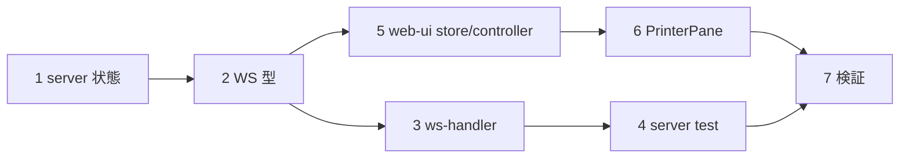

# 計画: プリンター出力エラーの可視化と実行時 ON/OFF

## 実装方針
server（状態＋通知）→ WS プロトコル → web-ui（受信・表示・操作）の順。既存の受信処理を壊さない
（出力失敗は従来どおり受信を妨げない）。subtask 分割はしない（1 PR 規模）。

## 作業順序と依存関係
1. server: PrinterEntry に output/outputEnabled/outputWarnings/onOutputWarn、noteOutputWarn、report ハンドラを entry 参照へ、setPrinterOutputEnabled
2. WS メッセージ型（printer-opened 拡張・printer-warn・printer-output-state・printer-output）
3. ws-handler: onOutputWarn 配線・printer-opened 拡張・printer-output 処理・dispose で解除
4. server テスト（トグルで停止/再開・警告履歴・owner 制御）
5. web-ui: SessionState 拡張・session-controller（受信ハンドラ＋setPrinterOutput）
6. PrinterPane: トグル（hasOutput のときのみ）＋警告バー
7. web-ui テスト・README・全体検証

## リスク / 留意点
- report ハンドラが closure の `opts.output` を見ているため、**entry 参照へ変えないとトグルが効かない**。
- `onOutputWarn` は切断時に解除（リーク防止）。警告履歴は上限 20 件。
- 出力失敗は受信を妨げない（既存 catch を維持）。サーバーログは継続。
- 信頼境界: ON/OFF のみで出力設定の値はブラウザから変更しない。

## テスト方針
- server: 出力設定ありで既定有効→handleReport 相当が走る／無効化で走らない／再有効で再開、警告が履歴に積まれる、
  他 owner の切替は FORBIDDEN。
- web-ui: hasOutput のときだけトグル表示、警告バーの表示。ビルド（vue-tsc+vite）・既存テスト green。
