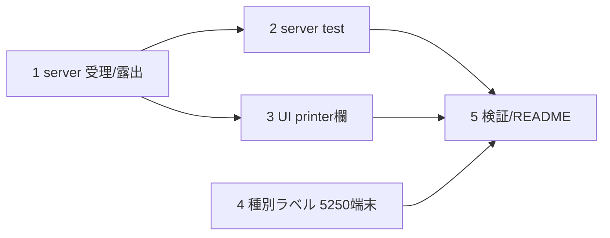

# 計画: PDF 自動蓄積・自動印刷の UI 設定

## 実装方針
サーバー（受理・露出）→ web-ui（フォーム）→ ラベル変更、の順。printer 受理は editor 限定ルート下でのみ、
露出は editor のみ、を server で担保してから UI を足す。subtask 分割はしない（1 PR 規模）。

## 作業順序と依存関係
1. server: `PublicProfile.printer`・`profileInputSchema.printer`・`buildProfile`/`buildPrinter`・listPublic 露出 — 依存: なし
2. server テスト: editor 受理 / 一般 403 / editor のみ露出 / クリア — 依存: 1
3. web-ui: ConnectView に printer 出力欄（isProfileForm）＋prefill＋save 組み立て — 依存: 1
4. web-ui: 種別ラベル「表示」→「5250端末」（チップ/infoRows/SessionInfo/form option）＋チップ配色 — 依存: なし
5. テスト・ビルド・lint・README 追記 — 依存: 全部

## リスク / 留意点
- **信頼境界**: printer を受理するのは canEditProfiles ルートのみ。一般/未認証は不可（server テストで固定）。
- printer を一般公開一覧に出さない（editor のみ露出）。
- クリア semantics（全空で printer ブロック削除）を buildPrinter で正規化。
- 既存の profile 編集・signon 編集・PDF 受信機能を壊さない。既存テスト維持。

## テスト方針
- server: editor(auth-off/admin) の PUT で printer 保存 → profiles.json 反映。一般ユーザー PUT は 403。
  GET は editable 時のみ printer 露出。printer 全空でブロック消去。
- web-ui: ビルド（vue-tsc+vite）通過、種別ラベルが「5250端末/プリンター」で出る、既存テスト green。
