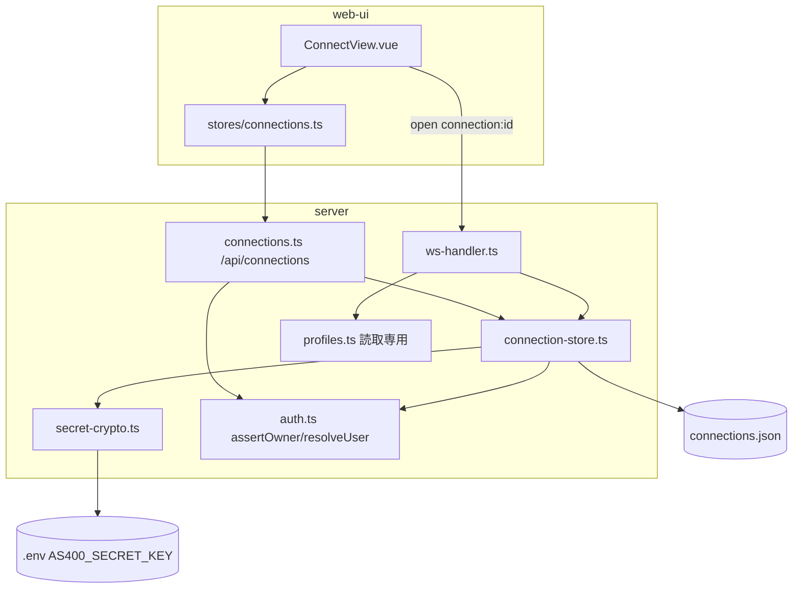
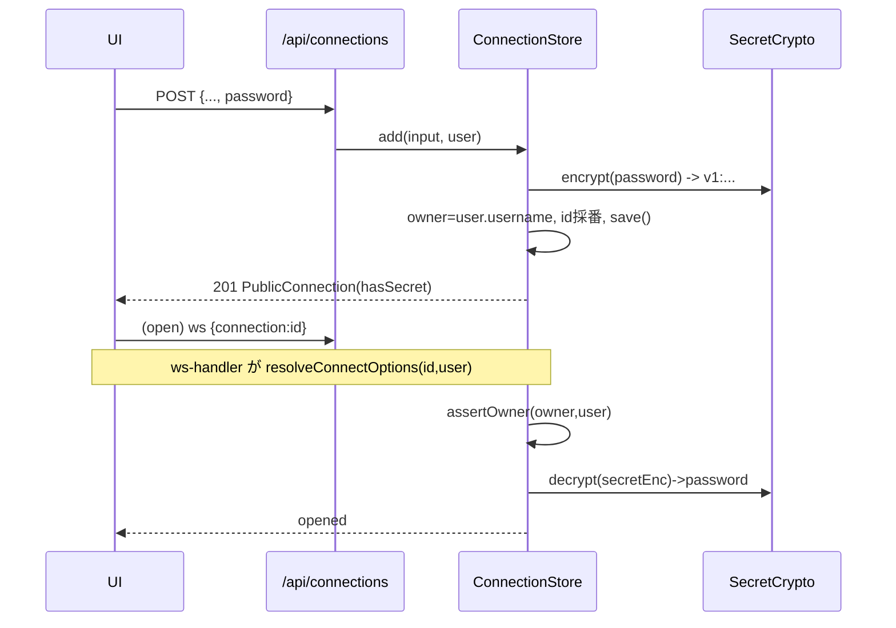
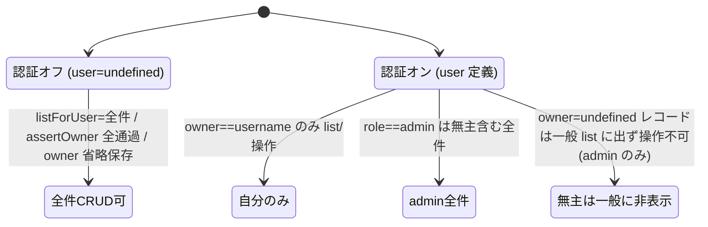

# 設計: 接続設定のサーバー一元管理

## アーキテクチャ概要
サーバーに「ユーザー接続ストア」を新設し、既存の認証（`UserStore`/`assertOwner`）と open 経路
（`resolveConnectOptions`）に合流させる。パスワードは AES-256-GCM 暗号文としてレコードに同居保存し、復号は
サーバー内 resolve のみ。web-ui は localStorage をやめ `/api/connections` を単一の真実とする。



## コンポーネント / モジュール
- **secret-crypto.ts**（新）: `SecretCrypto`。master key ロード＋AES-256-GCM encrypt/decrypt。他に依存しない純粋モジュール。
- **connection-store.ts**（新）: `ConnectionStore`＋zod スキーマ。`assertOwner` で認可、`SecretCrypto` で暗復号、atomic save。
- **connections.ts**（新）: hono ルート `registerConnectionRoutes(app, { connections })`。CRUD。認可は `c.get("user")`。
- **app.ts / main.ts / ws-handler.ts / mcp-tools.ts**（変更）: 配線・open 解決・deps 拡張。
- **web-ui/stores/connections.ts**（新）: fetch ベースの reactive ストア（`settings.ts` の接続 CRUD を置換）。
- **web-ui/ConnectView.vue**（変更）: 一覧の出所を API に、開くを ID 参照に、パスワードを値送信＋`hasSecret` 表示に。

## インターフェース / データモデル

### 暗号文フォーマット（鍵バージョン付き）
```
v1:<ivB64>:<tagB64>:<ctB64>
```
- `v1` = 鍵/方式バージョン（前方拡張の余地。将来 v2 で鍵ローテーション識別に使える）。
- AES-256-GCM、IV 12byte 乱数、認証タグ 16byte。base64 で連結。

### SecretCrypto
```ts
class SecretCrypto {
  static fromEnv(envName = "AS400_SECRET_KEY"): SecretCrypto | undefined; // 未設定→undefined、長さ不正→throw(起動時)
  encrypt(plain: string): string;   // "v1:iv:tag:ct"
  decrypt(blob: string): string;    // v1 のみ対応。復号失敗は throw（呼び側で握る）
}
```
- master key 受理: **hex 64 文字**または **base64 44 文字**＝ decode 後 32byte。それ以外は起動時 throw。

### ConnectionStore（認可・暗復号を内包）
`spec.md` の I/F を踏襲。追加確定:
- コンストラクタに `SecretCrypto | undefined` を保持。未設定時は `password` 付き add/update を
  `FORBIDDEN`（→API 400 に写像）で拒否。
- `resolveConnectOptions(id, user)`: `assertOwner` 後、`secretEnc` があれば `decrypt`。復号 throw 時は
  **password 無しで続行**（レコードは壊さず、呼び側 ws-handler が監査 warn）。
- `update` の password 規則: `password` 未指定→`secretEnc` 据え置き / 空文字 `""`→`secretEnc` 削除（自動サインオン解除）/
  非空→再暗号化。

### WsClientMessage open（型の扱い）
```ts
// 既存の open に 1 フィールド追加（optional のまま。厳密 union にはしない＝既存スタイル維持）
{ type: "open"; connection?: string; profile?: string; host?: string; /* ...既存... */; kind?: "printer" }
```
- **解決優先順位: `connection` > `profile` > direct(host)**。ws-handler で分岐。
- 排他は型ではなく実装の優先順位で表現（既存 `profile`/`host` 併存 optional に合わせる。過剰な型分割を避ける）。

## 処理フロー / シーケンス
### 認証オン: 作成〜接続


### 認可・可視性の状態


## 設計判断
- **D-1: secretEnc はレコード同居（別ストアにしない）**。暗号文のみなので同居でも「平文非保存(C1)」を満たす。
  別ストアは owner/id の二重管理・整合・二重 atomic save のコストが勝る。API 露出面の秘匿は `PublicConnection` が
  `secretEnc` を落とすことで担保。→ 単純さを採用。
- **D-2: 鍵ローテーションは最小方針＋バージョン識別**。旧鍵を保持しないため自動再暗号化はしない。master key を
  変えたら既存 `secretEnc` は復号失敗→**その接続は自動サインオンなしで開く（signon 画面）**＋ユーザーが再入力。
  暗号文に `v1:` を付け、将来の複数鍵運用に備える（今は v1 のみ）。
- **D-3: open の参照は optional フィールド＋優先順位**（`connection`>`profile`>direct）。既存 `profile`/`host` の
  併存 optional スタイルに合わせ、厳密な discriminated union を導入しない（差分最小・可読性）。
- **D-4: 無主(owner=undefined)レコードは認証オン時 admin のみ可視・操作**。既存 `assertOwner`/owner 一致フィルタが
  そのままこの挙動になる（一般ユーザーの list に無主は出ず、操作は FORBIDDEN、admin は全件）。認証オフ時代に作った
  設定が、認証オン後に一般ユーザーへ漏れない安全側の既定。
- **D-5: deps 拡張**。`ToolDeps` に `connections: ConnectionStore` を追加（未指定時は空ストアで後方互換）。
  ws-handler/mcp-tools は `deps.connections` を参照。`--connections` 未指定なら空（機能オフ相当）。

## plan への申し送り
- 分割単位（依存順）:
  1. `secret-crypto.ts`（純粋・単体テスト容易）
  2. `connection-store.ts`（1 に依存。CRUD＋認可＋暗復号）
  3. `connections.ts`＋`app.ts` 配線（2 に依存。REST）
  4. open 経路（ws-handler / mcp-tools / 型 `connection?`＋deps 拡張）
  5. `main.ts` 配線（`--connections`／master key ロード）
  6. web-ui `stores/connections.ts`＋`ConnectView.vue`（API 化・ID 参照・パスワード UX）＋`settings.ts` 接続 CRUD 撤去
  7. ドキュメント（README／`.env` の `AS400_SECRET_KEY`・`--connections`）
- 1 PR に収まる規模（subtask 分割は不要見込み）。テストは各層で: crypto 往復・store 認可/暗復号・API owner 分離・
  open ID 参照・web-ui ストア。
- 信頼境界（printer フィールド拒否）と owner 分離は**必ずテストで固定**する。
