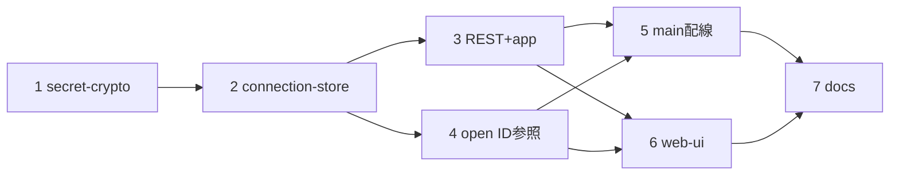

# 計画: 接続設定のサーバー一元管理

## 実装方針
design の依存順（下→上）で組み上げる。純粋モジュール（暗号）から始め、ストア→REST→open 経路→配線→
web-ui→docs の順。各層で検証可能な単位に刻み、信頼境界（printer フィールド拒否）と owner 分離は必ずテストで固定する。
subtask 分割はしない（高結合だが 1 PR に収まる規模。design 判定）。

## 作業順序と依存関係
1. secret-crypto（純粋・単体テスト容易）— 依存: なし
2. connection-store（CRUD＋認可＋暗復号）— 依存: 1
3. REST `/api/connections`＋app 配線 — 依存: 2
4. open ID 参照（型 `connection?`＋ws-handler＋mcp-tools＋deps 拡張）— 依存: 2
5. main 配線（`--connections`／master key ロード）— 依存: 2,3,4
6. web-ui（stores/connections＋ConnectView＋settings 撤去）— 依存: 3,4
7. ドキュメント（README／.env）— 依存: 5,6

## リスク / 留意点
- **信頼境界**: ユーザー接続スキーマに printer 出力系を入れない。zod `.strict()` で未知キー拒否をテストで固定。
- **owner 分離**: 認証オン=自分のみ / admin=全件 / 無主=admin のみ、を API テストで固定。
- **鍵未設定/不正**: 起動時 throw（不正）と password 保存 400（未設定）、復号失敗時の password 無し続行を検証。
- **後方互換**: `--connections` 未指定・master key 未設定でも既存機能（profiles/direct）が壊れないこと。
- **web-ui 撤去の巻き戻し注意**: 既存作業を消さないよう、settings.ts の接続 CRUD 撤去はストア置換と同一コミットで。

## テスト方針
- 1: 暗号往復（encrypt→decrypt 一致）、改ざん検知（tag 不正で throw）、鍵長不正で fromEnv throw、未設定で undefined。
- 2: add/update/remove/get の認可（assertOwner）、listForUser の owner フィルタ、password→secretEnc 暗号化、
  update の password 据え置き/削除/再暗号化、printer フィールド混入を strict で拒否、atomic save。
- 3: REST の 201/200/403/404/400、PublicConnection が secret を返さないこと、認証オン/オフの一覧差。
- 4: open `connection` 参照の解決と owner 拒否、優先順位（connection>profile>direct）。
- 5: `--connections` 配線と master key ロードの起動挙動（未設定/不正）。
- 6: web-ui ストアの fetch CRUD、ConnectView が localStorage を使わないこと（既存 web-ui テスト green 維持）。
- 全体: `npm run build` / `npm test` / `npm run lint` green。
