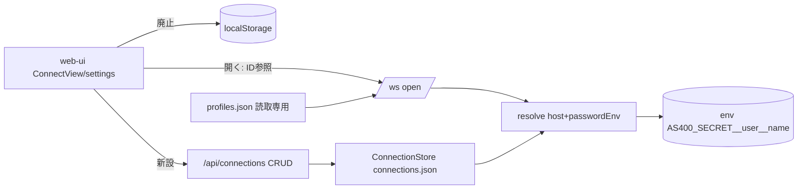

# 調査: 接続設定のサーバー一元管理

## 調査の問い
- Q5: ユーザー別 `passwordEnv`（他ユーザー・サーバーの任意環境変数を参照できない）をどう実装・保存するか。
  「平文をサーバーに残さない」「任意 env 参照口にしない」を両立する方式。
- Q5b: 接続ストアのファイル形式・キー設計（ID / owner / 認証オフ時の owner 値）。既存 `users.json` /
  `owner` モデルの挙動。
- Qi: web-ui の接続フローをサーバー保存に切り替える際の影響範囲（開く経路・資格情報の流れ）。

## 判明した事実

### F1: 既存の「open」経路は profile 参照で資格情報をサーバー内解決している（passwordEnv の受け皿が既にある）
- `ws-handler.ts` の `onOpen`（L70-）は、open メッセージが `msg.profile` を持つ場合
  `deps.profiles.resolveConnectOptions(msg.profile)` でサーバー内解決し、`origin: msg.profile` を刻む。
  `msg.profile` が無い場合のみ `msg.host` 等のクライアント値を使う（`fromDirect`, L219-）。
- `profiles.ts` `resolveConnectOptions`（L98-）が `passwordEnv` を解決する:
  `const password = p.signon.passwordEnv ? process.env[p.signon.passwordEnv] : p.signon.password`（L110-112）。
  **パスワードはここでサーバー内に解決され、クライアントへ返らない**（D13 の設計）。
- 現状ブラウザ接続は逆に、クライアントが `host`/`user`/`password` を raw で WS に送っている
  （`ConnectView.connectSaved` → `openSession` → `client.send({...open})`）。→ サーバー保存に移すと、この raw 送信を
  **「保存済み接続を ID 参照 → サーバーで解決」**に置き換えられる（profile と同じ経路に寄せられる）。

### F2: 認証・per-user モデル（そのまま接続ストアに転用できる）
- 認証は `--users <file>` 指定時のみ有効（`main.ts`）。**未指定＝認証オフ**（= 要件の「ユーザー管理なし」）。
- `UserStore`（`auth.ts` L75-）は `users.json` を JSON で読み、`byName` マップで保持、
  **tmp→rename の atomic save**（L140-146）。接続ストアはこの構造をそのまま鏡写しにできる。
- `owner` スコープは `assertOwner(owner, user)`（L219-）:
  - `user === undefined`（認証オフ）→ **常に許可**
  - `user.role === "admin"` → 許可
  - `owner === user.username` → 許可
  - それ以外 → `FORBIDDEN`
  → 接続一覧の絞り込み・CRUD 認可はこの関数で一貫させられる。
- 認証ユーザーは `resolveUser`（Bearer→Cookie）で解決し、`c.get("user")` で取得（`app.ts` L46, L59, L90）。
  REST ルート追加時もこの `c.get("user")` を owner に使えばよい。

### F3: 信頼設定（printer 出力系）の境界は profiles 側にのみ存在
- `profiles.ts` の `printerSchema`（`autoPdfDir`/`autoPrint`/`pdfFontPath` 等, L7-14）は**プロファイル専用**。
  `resolvePrinterOutput(msg.profile)` は profile 参照時のみ呼ばれる（`ws-handler` L111）。
  → ユーザー接続ストアのスキーマにこれらを**入れなければ**、既存の信頼境界は自動的に保たれる。
  クライアント直値（`fromDirect`）にも printer 出力系は存在しない。

### F4: REST ルートの追加点
- `app.ts` L52 に `/api/profiles`（読み取り専用一覧）がある。ここに並べて
  `/api/connections`（CRUD・owner スコープ）を追加するのが素直。認可は `c.get("user")` + `assertOwner`。
- `Tn5250Error` の `FORBIDDEN`→403 / `SESSION_NOT_FOUND`→404 の変換パターンは L69-72 が既存例。

## Q5 の検討（passwordEnv のユーザー別分離）
2つの硬い制約に対して候補方式を評価する。制約: **(C1) 平文をサーバーに永続化しない**／
**(C2) 他ユーザーのシークレット・サーバーの任意環境変数を読めない**。

| 方式 | 仕組み | C1 | C2 | 自己完結（UIで値設定） | 備考 |
|---|---|---|---|---|---|
| (a) 名前空間付き env（**推奨**） | 接続には**シークレット名だけ**保存。解決時に `process.env['AS400_SECRET__' + user + '__' + name]` を読む。prefix と user はサーバー側（認証セッションの username）で合成 | ✅ 値は env のみ | ✅ prefix 固定＋user はサーバー由来で他者/任意 env に触れない | △ 値は運用者が env 提供 | passwordEnv 思想の自然な拡張。実装が最小・鍵管理不要 |
| (b) 暗号化シークレットストア | ユーザーが値を入力→サーバーが master key で暗号化して per-user 保存。解決時に復号 | △ 暗号文のみ（master key は env） | ✅ user スコープ保存 | ✅ | 鍵管理（AS400_SECRET_KEY 等）が増える。earlier ゲートで (c) 暗号化は非採用寄り |
| (c) 実行時メモリのみ | 接続時に都度入力→セッション内キャッシュ | ✅ 永続化なし | ✅ | ✅（都度入力） | 自動サインオンの「保存して再利用」体験にはならない |

- **推奨は (a)**。要件の文言「passwordEnv をユーザーごとに作成・分離」に最も忠実で、**値をサーバーに一切保存しない**。
  ユーザーは接続に「自分のシークレット名（suffix）」だけを紐付け、実値は運用者が
  `AS400_SECRET__<username>__<name>` という env で provision する。`<username>` は**リクエスト本文ではなく認証セッション
  から取る**ため、他ユーザー名を騙って他人の env を読むことはできない（C2 を型ではなく解決経路で保証）。
- **自己サービスで「値の入力」まで求める**なら (a) では足りず (b) が要る（鍵管理コストとのトレードオフ）。
  ここは design 前にユーザー意向の最終確認が要る点（下記「申し送り」）。
- 認証オフ時: username が無いため名前空間の user 部を固定トークン（例 `__local__`）にするか、自動サインオン自体を
  認証オン時のみの機能とするか、を design で決める。

## Q5b の検討（接続ストア設計・facts ベースの素案）
- ファイル: `connections.json`（`--connections <file>`）。`UserStore` と同じく JSON＋`byId` マップ＋atomic save。
- レコード（案）: `{ id, owner, name, host, port?, ccsid?, screenSize?, deviceName?, tls?, sessionType,
  autoSignon?, signonUser?, secretName? }`。**printer 出力系フィールドは持たない**（F3）。
  - `owner`: 認証オン=username。認証オフ=省略 or `"*"`（`assertOwner` は owner=undefined でも user=undefined なら通す）。
  - `secretName`: Q5(a) のシークレット名（suffix のみ）。実値は保持しない。
- open 経路: 保存済み接続は**ID 参照で開く**（`msg.connection` を新設 or `msg.profile` を拡張）。サーバーが
  owner を検証してから host/passwordEnv を解決する（F1 の profile 経路に合流）。クライアントが raw host/パスワードを
  送る現行経路は、ユーザー保存接続では使わない方向。

## 影響範囲

- server: `connection-store.ts`（新）, `app.ts`（`/api/connections` 追加）, `ws-handler.ts` / `mcp-tools`（ID 参照解決）,
  `main.ts`（`--connections` 配線）。
- web-ui: `stores/settings.ts`（localStorage→API 置換）, `ConnectView.vue`（保存/編集/削除を API に）, 型共有。
- core: 変更なし見込み。

## 実現性 / リスク
- **実現可能**。新規依存なし（既存 `UserStore` パターン＋`assertOwner`＋既存 open 経路の再利用）。
- リスク1（passwordEnv 参照口）: 分離は「username を認証セッションから取り、prefix を固定合成する」ことで担保。
  **クライアント入力の env 名を `process.env` にそのまま渡さない**ことが設計上の必須ガード。
- リスク2（認証オフ時の owner）: 全員が全接続を触れる前提（Q2 決定）と整合。owner 無しレコードの一覧・削除挙動を
  design で明確化。
- リスク3（互換）: localStorage 廃止で既存ブラウザ接続は消える（Q4=破棄で合意済み）。

## 決定（research ゲート）: 方式 (b) 暗号化シークレットストア
- **採用 = (b)**。ユーザーが UI でパスワード値を入力し、サーバーが **master key で暗号化**して per-user 保存、
  接続時に復号して signon に使う。**master key は `.env`（環境変数）から読む**（レコード・コードに鍵を持たない）。
- 接続レコードにパスワード平文は保存しない（暗号文のみ。C1 を満たす）。他ユーザーの復号は owner スコープで拒否（C2）。

### design で確定すべき点（(b) 採用に伴う）
- **暗号方式**: Node 標準 crypto の **AES-256-GCM**（新規依存なし）。per-secret に乱数 IV、GCM 認証タグを付す。
  保存形式（例 `ivHex:tagHex:ciphertextHex` or base64）を決める。
- **master key の読み込み**: `.env` の環境変数名（例 `AS400_SECRET_KEY`＝32byte を hex/base64）。
  起動時に長さ検証。**鍵未設定時の挙動**（自動サインオン機能を無効化 or 起動エラー）を決める。
- **保存レイアウト**: 暗号文を接続レコード内に持つ（`secretEnc`）か、`users.json` 同様の別シークレットストアに分けるか。
  暗号文のみなので接続ストア同居でも C1 は満たすが、責務分離の観点で design 判断する。
- **鍵ローテーション**: master key 変更時の既存暗号文の扱い（再暗号化 or 失効させ再入力）を最小限方針で定める。
- 保存済み接続は **ID 参照で開く**設計に寄せる（raw 資格情報・平文パスワードをクライアントから送らない。復号はサーバー内のみ）。
- ユーザー接続スキーマに printer 出力系を**含めない**（信頼境界）。
- 認証オフ時の owner 値の扱い（owner 無しレコードの一覧・削除・暗号文の帰属）を design で確定する。
