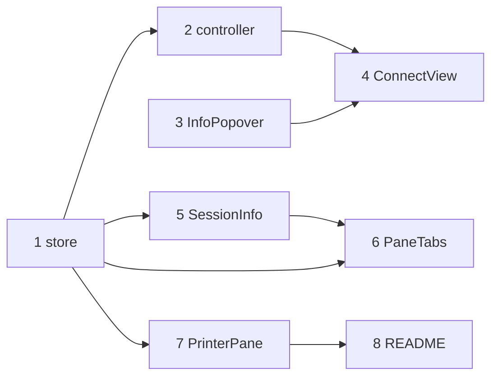

# 計画: 接続・セッション情報表示とプリンター UX 改善

## 実装方針
土台（store・controller・汎用ポップオーバー）から作り、各コンポーネントへ展開する。すべて web-ui。
subtask 分割はしない（1 PR に収まる UI 改善）。各段でビルド（vue-tsc/Vite）とテストを維持する。

## 作業順序と依存関係
1. store（SessionMeta/unread/markSpoolRead）— 依存: なし
2. session-controller（meta 引数）— 依存: 1
3. InfoPopover（汎用・バックドロップ）— 依存: なし
4. ConnectView（デバイス名・カード ⓘ・接続時 meta 供給）— 依存: 2,3
5. SessionInfo（バックドロップ・接続メタ統合）— 依存: 1
6. PaneTabs（バックドロップ配線・未読バッジ）— 依存: 1,5
7. PrinterPane（MSGW 案内・サイドバー/フィルタ・未読クリア）— 依存: 1
8. README（FORMTYPE(*ALL)）— 依存: 7
9. テスト・ビルド・lint — 依存: 全部

## リスク / 留意点
- meta 欠損時（直叩き接続）に情報表示が壊れないこと（持つ項目のみ表示）。
- 未読クリアのタイミング（PrinterPane 表示中は即クリア＝バッジは非アクティブ時のみ）。
- バックドロップの z-index とクリック伝播（ポップオーバー本体は `@click.stop`）。
- 既存 web-ui テスト（258）とビルド（vue-tsc）を壊さない。

## テスト方針
- store: `addReport` で unread++、`markSpoolRead` で 0。meta 保存。
- ConnectView: デバイス名表示、カード ⓘ で全情報が出る/バックドロップで閉じる（可能な範囲で）。
- SessionInfo: meta の接続情報が出る、バックドロップ close。
- PaneTabs: unread>0 でバッジ、アクティブ化でクリア。
- PrinterPane: フィルタで絞り込み、サイドバー開閉、MSGW ヒント表示。
- 全体: `npm run build -w @as400web/web-ui`（vue-tsc+vite）・`npm test`・lint green。
