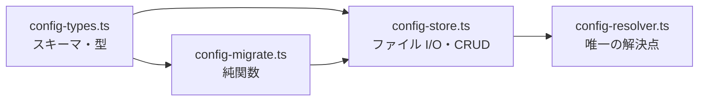

# 計画: 10-config-core（型・移行・ストア・解決点）

親 plan が確定した割れ目のうち、**producer 側**の slice。
型と解決点を提供し、`20-server-surfaces` がそれを 3 系統に配線する。

scope は親 plan で確定済みのため、ここでは再分割しない。

## 実装方針

依存が一方向になるよう、**純関数 → I/O → 解決**の順に積む。

`config-migrate.ts` を先に緑にする。移行規則は**実データの期待結果**という動かない基準があるので、
ここが固まれば後段の前提が安定する。

## 作業順序と依存関係

1. `config-types.ts`（依存: なし）— スキーマ 2 本立てが要点
2. `config-migrate.ts`（依存: 1）— 純関数。I/O を持たない
3. `config-migrate` のテスト（依存: 2）— **実データの期待結果を固定**
4. `config-store.ts`（依存: 1, 2）— 読み書き・CRUD・所有者
5. `config-store` のテスト（依存: 4）
6. `config-resolver.ts`（依存: 4）— 解決の 5 ケース
7. `config-resolver` のテスト（依存: 6）
8. 旧ストアの削除（依存: 6）— **この slice では消すだけ。参照の付け替えは `20`**

## リスク / 留意点

- **8 で `profiles.ts` / `connection-store.ts` を消すと、この slice の時点でサーバーがビルド不能になる。**
  参照元（`ws-handler` / `mcp-tools` / `host-lists` / `app.ts`）は `20` で直すため。
  → **8 は「消す」のではなく `@deprecated` を付けて残し、削除は `20` の最後に回す**。
  この slice を単独でビルド可能に保つ（test 工程が成立しなくなるのを避ける）
- 移行規則 3（誤結合の回避）は分岐が細かい。0 個 / ちょうど 1 個 / 2 個以上の 3 ケースを個別に固定する
- `enhanced` は現行 `connection-store` に無く `profiles` にのみある（research F2）。
  新スキーマでは**両方が持つ**ので、移行時に個人設定側は `undefined` になる。これは仕様どおり
- `lastConnectedAt` は移行で落とす（design の判断）。テストで「落ちること」を確認する

## テスト方針

| 対象 | 確認 |
|---|---|
| 移行・規則 1 | 資格情報ありの設定が `(host,port,tls,user)` で束ねられる。別ユーザーなら別システム |
| 移行・規則 2 | 資格情報なしの設定が、同 `(host,port,tls)` のシステムがちょうど 1 つなら吸収される |
| 移行・規則 3 | 0 個 / 2 個以上のとき別システムになり、`warn` が呼ばれる |
| 移行・実データ | `profiles.local.json` 相当の 3 件が **1 システム + 3 セッション**になる（親 spec B2 の期待結果） |
| 移行・命名 | システム名は host。同 host 複数なら `<host> (<user>)`。セッション名は元の設定名を継承 |
| 移行・暗号 | `passwordEnc` / `secretEnc` が**再暗号化されず**そのまま移ること |
| 移行・欠落 | `lastConnectedAt` が落ちること |
| スキーマ | 個人セッションに `printer` を与えると parse が失敗すること（**信頼境界 1 層目**） |
| ストア | 所有者チェック（他人の設定を読めない / 無主レコードを一般ユーザーが読めない） |
| ストア | 読み込みだけでは書き出さないこと（`dirty` を持たない設計の確認） |
| 解決 | `session` のみ / `system` のみ / 両方一致 / 両方不一致 / 該当なし の 5 ケース |
| 解決 | ファイル外のシステムを参照したら `CONFIG_ERROR` |
| 解決 | 復号失敗時に `warn` が呼ばれ、自動サインオンなしで継続すること |
