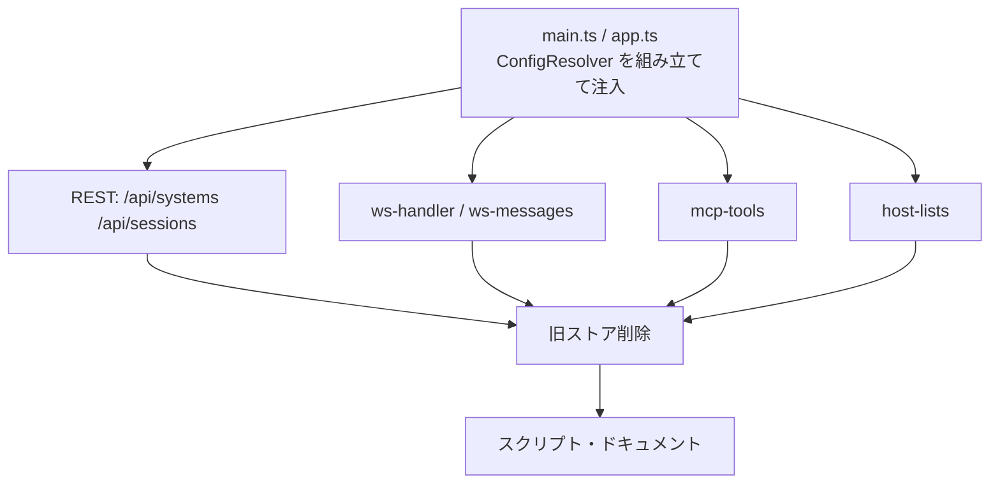

# 計画: 20-server-surfaces（WS / MCP / REST の切り替え）

`10-config-core` が提供した `ConfigResolver` に、3 系統の消費者を配線する。
この slice の完了で**サーバー側は新モデルに一本化**され、旧ストアが消える。

scope は親 plan で確定済み。再分割はしない。

## 実装方針

**3 系統を 1 つの slice に入れているのは、分けると命名が食い違うため**（research A3）。
`profile` / `connection` → `system` / `session` の置換は、MCP・WebSocket・REST が同時でなければ、
`verify-mcp.mjs` / `verify-ws.mjs` が壊れたまま残る。

配線の順序は「解決点の注入 → 消費者の書き換え → 旧ストア削除」。
削除を最後に置くことで、途中でビルド不能にならない。

## 作業順序と依存関係

1. `main.ts` / `app.ts` — 2 ストアと `ConfigResolver` を組み立てて配る（依存: なし）
2. REST — `/api/systems` と `/api/sessions` の CRUD。旧 `/api/profiles` `/api/connections` を置換（依存: 1）
3. `ws-messages.ts` / `ws-handler.ts` — `open` メッセージを `system` / `session` に（依存: 1）
4. `mcp-tools.ts` — `open_session` / `open_printer_session` / `signon` / 一覧ツール（依存: 1）
5. `host-lists.ts` — `sourceSchema` を `system` 参照に（依存: 1）
6. 旧ストア（`profiles.ts` / `connection-store.ts`）と旧テストの削除（依存: 2-5）
7. `verify-mcp.mjs` / `verify-ws.mjs` の引数更新（依存: 4, 3）
8. ドキュメント更新（依存: 6, 7）
9. 実機確認（PUB400）— 5250 / プリンター / 一覧（依存: すべて）

## リスク / 留意点

- **信頼境界 2〜4 層目がこの slice の担当**（1・5 層目は `10` で確認済み）。
  - 2 層目: `canEditProfiles` 相当のルートゲート。**サーバー設定の書き込みは admin のみ**
  - 3 層目: display 種別では printer 出力を落とす
  - 4 層目: `validatePrinter` の保存前検証（`autoPdfDir` の存在確認）
  これらは旧 `/api/profiles` に付いていたので、**新ルートへ移し替える際に落とさない**
- **`open_printer_session` の `deviceName` バグ**（親 spec B8-1）をここで直す。
  解決結果の装置名を使い、引数指定があればそれを優先する
- **一覧ツールの不変条件**: 資格情報と信頼設定を返さない。`mcp-list-connections.test.ts` の
  検証観点（`printer` / `signonUser` キー不在、特定文字列が JSON に出ない）を新ツールへ引き継ぐ
- **この slice の完了時点で Web UI が壊れる**（`30` で追従）。test のサマリに明記して deliver へ引き継ぐ
- 実機確認は CI では走らない。skip 件数を記録する

## テスト方針

| 対象 | 方法 |
|---|---|
| REST の CRUD | 既存 `app-profiles.test.ts` / `app-connections.test.ts` を新ルートへ書き換え |
| 認可 | `profiles-admin-only.test.ts` 相当。サーバー設定の読み書きが admin のみ |
| 信頼境界 2 層目 | 一般ユーザーが `/api/systems`（サーバー側）を書けないこと |
| 信頼境界 3 層目 | display セッションに printer を送っても保存されないこと |
| 信頼境界 4 層目 | 不正な `autoPdfDir` が保存前に弾かれること |
| WS | `ws-handler.test.ts` を `system` / `session` へ |
| MCP | `mcp-list-connections.test.ts` を新ツールへ（資格情報の非露出を維持） |
| MCP 引数 | `system` のみ / `session` のみ / 両方不一致 の 3 ケース |
| deviceName バグ | セッションの装置名が MCP 経由でも使われること |
| E2E | `verify-mcp.mjs` / `verify-ws.mjs` |
| 実機 | 5250 表示 / プリンター / ジョブ一覧（PUB400） |
