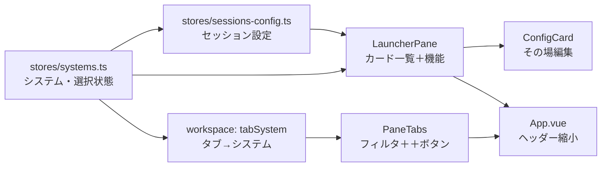

# 計画: 30-web-ui（ランチャー・その場編集・タブのフィルタ）

`20-server-surfaces` が提供した `/api/systems` `/api/sessions-config` に UI を追従させ、
`ui-proposal.html`（第 3 版）の構成を実装する。**この slice の完了で Web UI の破損が解消する。**

scope は親 plan で確定済み。再分割はしない。

## 実装方針

**データ層から積む**。ストアが正しくなるまで画面を作らない——
現状 `stores/connections.ts` が存在しない API を叩いており、ここが直らないと何も動かない。

## 作業順序と依存関係

1. `stores/systems.ts` — システム一覧・**選択中システム**・接続本数（依存: なし）
2. `stores/sessions-config.ts` — セッション設定の CRUD（依存: 1）
3. `session-controller.ts` — `open` の送信を `session` / `system` 参照に（依存: 1, 2）
4. `stores/workspace.ts` — `tabSystem` と `lastActiveBySystem` を追加（依存: なし）
5. `ConfigCard.vue` — カード ⇄ その場編集フォーム。システム / セッション両用（依存: 1, 2）
6. `LauncherPane.vue` — 未選択＝システム一覧 / 選択後＝セッション + 機能 7 枚（依存: 5）
7. `PaneTabs.vue` — `tabSystem` によるフィルタ、`＋` ボタン、`list:*` のラベル（依存: 4, 6）
8. `App.vue` — ヘッダーをシステム選択＋利用者名だけに。機能ナビを削除（依存: 6, 7）
9. `HostListPane.vue` — 接続元 `<select>` を削除し選択中システムを使う。`fetch` 直叩きをストア経由へ（依存: 1）
10. `ConnectView.vue` の削除（ランチャーへ吸収）（依存: 6, 8）
11. テスト（依存: 1-10）
12. ブラウザでの実操作確認（依存: 11）

## リスク / 留意点

- **タブのフィルタは描画側の派生に限る**（design の判断）。`GroupNode.tabs` を書き換えると
  「隠す」が「閉じる」に化ける。実体を触らなければ失われようがない
- **`admin:*` / `list:*` タブはセッションを持たない**ため、現状はシステムへの紐付け先が無い。
  開いた時点の選択中システムを `tabSystem` に記録することで解決する（design 済み）
- **既存 289 件の web-ui テスト**が通ること。特に `workspace` のタブ操作は既存テストが厚い
- `ConnectView.vue` は 875 行あり、フォームの検証ロジックが埋まっている。
  削除ではなく**必要な部分を `ConfigCard` へ移す**。落とすと入力検証が消える
- パスワード欄は空送信で既存維持（`20` の M1 修正と対になる挙動）。UI 側で空を送ることを保証する
- プリンター出力の欄は**サーバー設定のセッションかつ編集可能なときだけ**表示する

## テスト方針

| 対象 | 方法 |
|---|---|
| `stores/systems` | 一覧取得・選択・CRUD の単体テスト |
| `stores/workspace` | `tabSystem` の記録と、フィルタが `tabs` を変更しないこと |
| タブのフィルタ | システム切り替えでタブが**消えず隠れる**こと、戻すと現れること |
| `ConfigCard` | システム / セッションの両モード、パスワード空送信 |
| `LauncherPane` | 未選択＝システム一覧、選択後＝セッション + 機能 |
| `PaneTabs` | `list:*` のラベルが正しいこと（親 spec B8-2） |
| 既存 | web-ui の既存 289 件が緑のままであること |
| ブラウザ | 起動して実操作（システム選択 → セッション接続 → 一覧 → 切り替え） |
