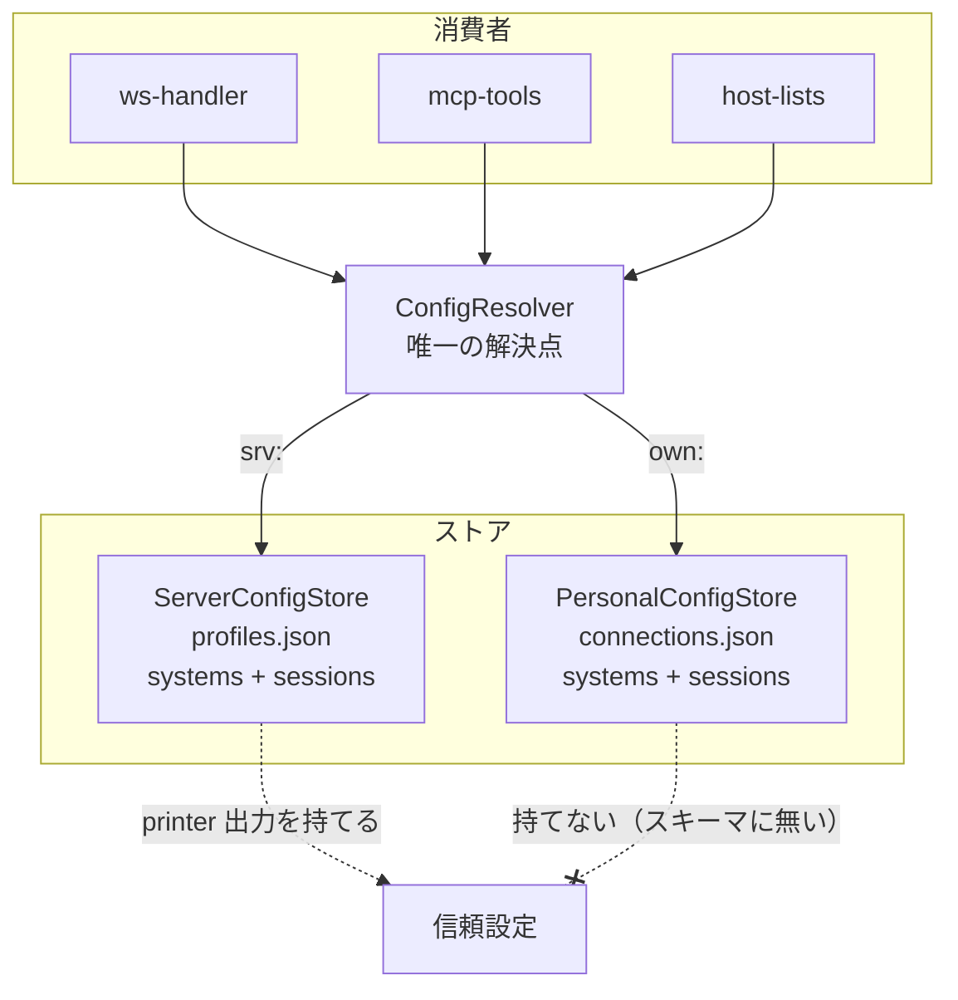
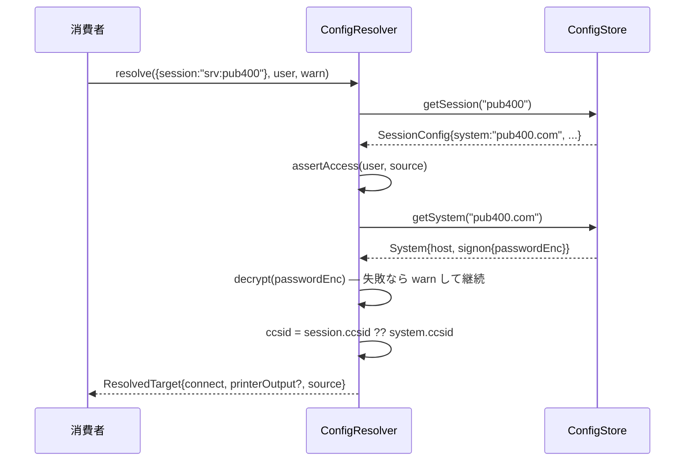
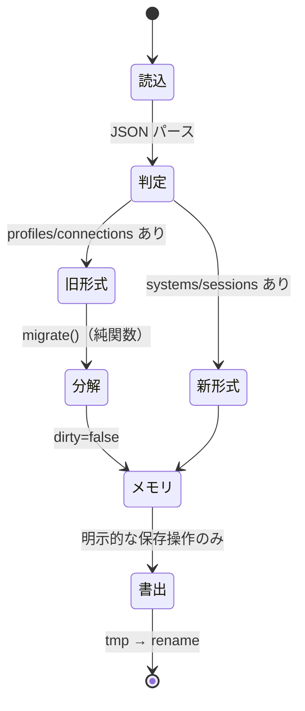
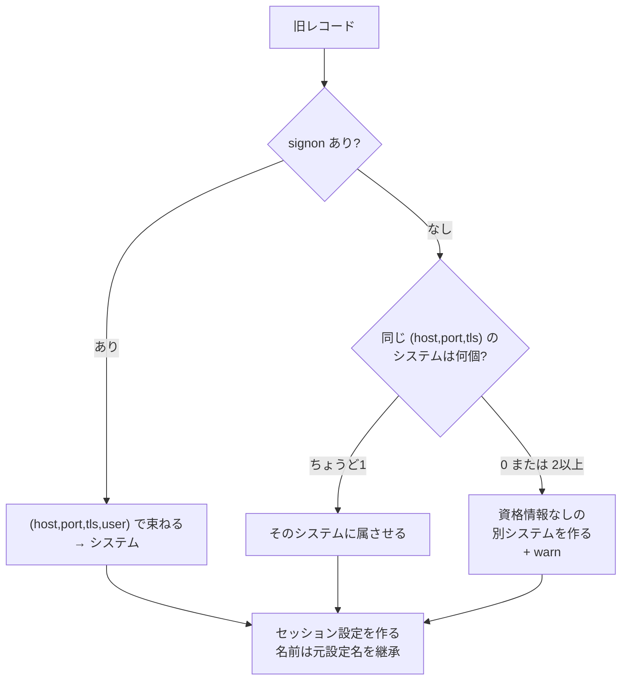
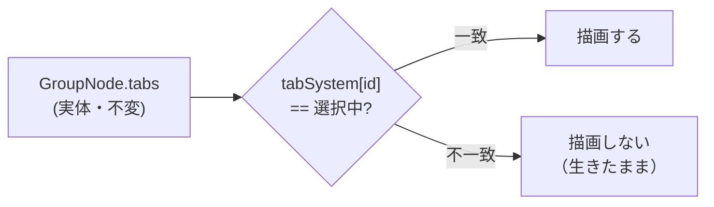

# 設計: 接続設定の分離（システム / セッション設定）

## アーキテクチャ概要

現在は「保管場所」で分かれた 2 つのストアが、それぞれ独立に接続情報を解決している。
これを「**保管場所**（サーバー設定 / 個人設定）」と「**階層**（システム / セッション）」の
2 軸に整理し、解決を 1 点に集約する。



**現状との差**: いま `ws-handler` / `host-lists` / `mcp-tools`（2 箇所）が
「connection なら A、profile なら B」の三項分岐を各自で書いている（research F2）。
`ConfigResolver` を挟むことで分岐が 1 箇所になり、`warn` の配線漏れ・`enhanced` の欠落・
排他チェックの有無といった**挙動の食い違いが構造的に消える**。

## コンポーネント / モジュール

| モジュール | 責務 | 依存 |
|---|---|---|
| `config-types.ts` | `System` / `SessionConfig` の zod スキーマと型。**サーバー用と個人用でセッションスキーマを分ける** | zod |
| `config-migrate.ts` | 旧形式 → 新形式の分解（純関数。I/O を持たない） | config-types |
| `config-store.ts` | ファイル読み書き・CRUD・所有者チェック。`ServerConfigStore` / `PersonalConfigStore` の共通基底 | config-types, config-migrate, secret-crypto |
| `config-resolver.ts` | 参照の解決。**唯一の解決点** | config-store, auth |
| （既存）`secret-crypto.ts` | 変更なし。形式・鍵とも不変 | — |

`profiles.ts` / `connection-store.ts` は上記に置き換えて削除する。

### 分割の理由

- **`config-migrate.ts` を純関数に切る**のは、移行規則（spec B2 の 3 段階）を
  ファイル I/O なしで単体テストするため。実データの期待結果（1 システム + 3 セッション）を
  そのままテストケースにできる。
- **`config-resolver.ts` を独立させる**のは、消費者が 3 系統（WS / MCP / REST）あり、
  そのどれもが同じ規則で解決すべきだから。ストアに解決を持たせると現状の重複が再発する。

## インターフェース / データモデル

### セッションスキーマは 2 種類に分ける（信頼境界の 1 層目）

```ts
// 共通部分
const sessionBase = {
  id: z.string().min(1),
  name: z.string().min(1),
  system: z.string().min(1),
  sessionType: z.enum(["display", "printer"]),
  deviceName: z.string().optional(),
  screenSize: z.enum(["24x80", "27x132"]).optional(),
  ccsid: z.number().int().optional(),
  enhanced: z.boolean().optional()
};

// サーバー設定（profiles.json）— printer 出力を持てる
export const serverSessionSchema = z.object({
  ...sessionBase,
  printer: printerSchema.optional()
}).strict();

// 個人設定（connections.json）— printer を「持てない」ことをスキーマで表現する
export const personalSessionSchema = z.object({
  ...sessionBase,
  owner: z.string().optional()
}).strict();
```

**この 2 本立てが、`autoPdfDir` によるサーバー上の任意パスへの書き込みを止める 1 層目**である
（`printer-output.ts:71` は設定値をそのまま `join` に渡すため、ここが唯一の入口制御になる）。
**共通スキーマ 1 本にして `printer` を optional にしてはならない。** 個人設定でも通ってしまう。

### 解決の型

```ts
interface ResolvedTarget {
  connect: ConnectOptions;                 // host/port/tls/ccsid/user/password/deviceName/screenSize/enhanced
  printerOutput?: PrinterOutputConfig;     // サーバー設定由来のセッションのときのみ
  source: "server" | "personal";
}

class ConfigResolver {
  resolve(
    ref: { system?: string; session?: string },
    user: AuthUser | undefined,
    warn: (m: string) => void          // ← optional にしない。配線漏れを型で防ぐ
  ): ResolvedTarget;
}
```

**`warn` を必須引数にする**のが設計上の要点。現状 5 経路中 3 経路で渡し忘れており、
パスワード復号の失敗が無言で握り潰されている（research F2）。optional をやめれば同じ漏れは起きない。

### 参照トークン

```
srv:<name>    サーバー設定
own:<id>      個人設定
```

`ConfigResolver` が接頭辞でストアを選ぶ。接頭辞なしは**受け付けない**（曖昧な解決をしない）。

## 処理フロー / シーケンス

### 解決（`session` 指定が基本形）



`system` と `session` の両方が来た場合は、`session` の親と一致しなければ `CONFIG_ERROR`。
現行の「黙って片方が勝つ」は採らない（spec B1）。

### 移行（読み込み時・書き戻さない）



**`dirty` を持たない設計にする。** 「移行したから書く」という経路を作らないことで、
勝手な書き換えが構造的に起きない（spec B3）。書き出しは CRUD ハンドラからの呼び出しに限る。

### 移行規則（spec B2 の実装）



## Web UI の設計

### タブ → システムの対応（新設）

`GroupNode.tabs` は `string[]` のまま変えない（research F8）。`workspaceStore` に対応表を足す。

```ts
tabSystem: Record<string, string>   // タブ ID → システム参照
```

| タブ種別 | 紐付け |
|---|---|
| セッション | そのセッション設定の親システム |
| `list:*` | 開いた時点の選択中システム |
| `admin:*`（接続状況 / ログ） | 開いた時点の選択中システム |
| アカウント / API トークン | **タブにしない**（利用者名メニューへ移動。spec B6） |

**フィルタは描画側（`PaneTabs.vue`）でのみ行い、`tabs` 配列自体は触らない。**
配列を書き換えると「隠す」が「閉じる」に化ける。ここは意図的に読み取り専用の派生とする。



`activeTab` がフィルタ外になった場合は、そのシステムの**最後に見ていたタブ**へ寄せる
（`lastActiveBySystem: Record<string, string>` を持つ。先頭固定より復帰が自然）。

### コンポーネントの責務

| コンポーネント | 変更 |
|---|---|
| `App.vue` | ヘッダーをシステム選択＋利用者名のみに。機能ナビを削除 |
| `LauncherPane.vue`（新規） | システム未選択＝システム一覧、選択後＝セッション + 機能 7 枚 |
| `ConfigCard.vue`（新規） | カード表示 ⇄ その場編集フォームの切り替え。システム / セッション両用 |
| `PaneTabs.vue` | `tabSystem` によるフィルタ、`＋` ボタン、`list:*` のラベル追加（spec B8-2） |
| `ConnectView.vue` | ランチャーに吸収して削除 |
| `HostListPane.vue` | 接続元 `<select>` を削除（選択中システムを使う）。`fetch` 直叩きをストア経由に統一 |
| `stores/systems.ts`（新規） | システム一覧・選択中システム・接続本数 |

## 設計判断

### 採用: セッションスキーマを 2 本立てにする

**代替案**: 共通スキーマ 1 本 + 保存時に個人側で `printer` を落とす。
**退けた理由**: 落とし忘れが 1 箇所でもあれば境界が破れる。型で表現できるものを実行時チェックに
落とすのは弱くなる方向。研究で確認したとおり `printer-output.ts:71` は設定値をそのまま
`join` に渡しており、入口の制御が唯一の防御になっている。

### 採用: `warn` を必須引数にする

**代替案**: 現行どおり optional。
**退けた理由**: 現に 5 経路中 3 経路で漏れている。同じ設計を残せば同じ漏れが起きる。

### 採用: `dirty` フラグを持たない

**代替案**: 移行時に `dirty=true` を立て、次の保存でまとめて書く。
**退けた理由**: 「いつ書かれるか」が状態に依存すると、勝手な書き換えが起きうる。
書き出しを CRUD からの明示呼び出しに限れば、経路が読んで分かる。

### 採用: タブのフィルタは描画側の派生のみ

**代替案**: 切り替え時に `tabs` から外し、戻ったら復元する。
**退けた理由**: 復元漏れが「閉じた」と区別できない。実体を触らなければ、そもそも失われない。

### 保留: `lastConnectedAt`

死んでいる（research F3）。移行では**落とす**。必要になったら別作業で実装する
（今回の分離とは独立した機能追加のため）。

## plan への申し送り

分割の単位と順序（依存が一方向になるように）:

1. **`config-types.ts` + `config-migrate.ts`** — 純関数。実データの期待結果を単体テストで固定できる。
   ここが緑になるまで先へ進まない
2. **`config-store.ts` + `config-resolver.ts`** — 1 に依存。既存 2 ストアの置き換え
3. **サーバー消費者の切り替え**（`ws-handler` / `host-lists` / `mcp-tools` / REST）— 2 に依存。
   **3 系統は同時に変える**（片方だけでは命名が食い違う。research A3）
4. **Web UI** — 3 の API に依存。`stores/systems.ts` → `LauncherPane` → `PaneTabs` フィルタの順
5. **スクリプトとドキュメント** — 最後。`verify-mcp.mjs` / `verify-ws.mjs` は実行される E2E なので、
   3 の完了時点で壊れる。3 と同じコミットで直す
6. **実機確認**（PUB400）— 5250 / プリンター / 一覧 / SQL の 4 経路

信頼境界の 5 層は、**移行後にそれぞれ独立した受け入れ確認**を持たせること（spec の受け入れ基準）。
特に 1 層目（個人設定に `printer` を送ると 400）は、スキーマを 2 本立てにした効果を直接確かめる。
