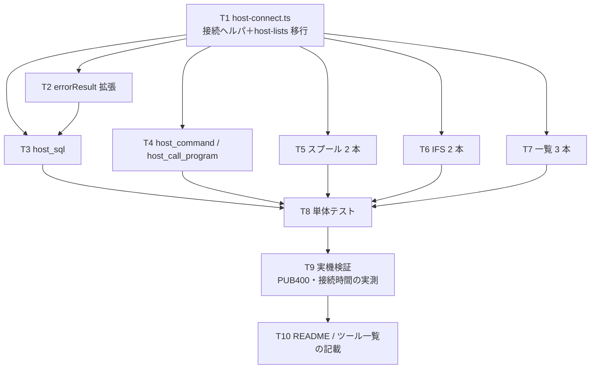

# 計画: ホストサーバー機能の MCP ツール公開

## 分割の判定（subtask にするか）

**しない。** 1 PR に収まる。理由:

- 新規プロトコル層の実装が無い。**core の既存 API を MCP スキーマで包むだけ**
- 変更は `packages/server/src` の 4 ファイルに閉じる（web-ui・core は触らない）
- 10 ツールは数こそ多いが構造は同型（解決 → 接続 → 呼ぶ → 閉じる）で、
  割っても得られる独立レビュー価値が小さい

protocol「2.8」の「spec＋plan で 1 PR に収まるなら subtask 化しない（過剰分割の禁止）」に該当。

## 依存関係

**T1 が全体の土台**。ここで資格情報の検証と接続生成を 1 箇所に集約するので、
以降のツールは同じ形の繰り返しになる。

## 方針メモ

- **`host-lists.ts` の `openCommand` は移設であって複製ではない**。移設後、
  `host-lists.ts` は `host-connect.ts` を import する。重複実装を残さない
- ツール登録は `host-server-tools.ts` に集約し、`mcp-tools.ts` からは 1 行呼ぶだけにする
- 各ツールは `withAudit` を通す（D1 の監査要件）
- description は薄めでよい（AGENTS.md「スキーマ等で自己説明的な箇所（MCP ツール登録など）は
  薄くてよい」）。ただし**経路の区別・SELECT 専用・非対話のみ**の 3 点は必ず書く

## リスク

| リスク | 兆候 | 対応 |
|---|---|---|
| 接続の所要時間が実用に耐えない（D2） | T9 の実測で判明 | plan に戻し、実測値を根拠にプール導入を再検討 |
| PUB400 の権限で叩けないツールがある | T9 で `CPF…` | 権限起因と切り分けて記録。**実装の欠陥と混同しない** |
| `exactOptionalPropertyTypes` による型エラー | T1〜T7 で頻出見込み | `host-lists.ts` の `compact()` を再利用する |
| 既存 19 ツールへの回帰 | 既存テスト | T8 で明示的に確認 |

## 未確定（test で判明したら記録）

- ホストサーバー接続 1 回の所要時間（D2 の前提）
- PUB400 で `host_call_program` が通るか（`QGYOLSPL` 等は一覧経由で実績があるが、
  任意プログラム呼び出しは未確認）
