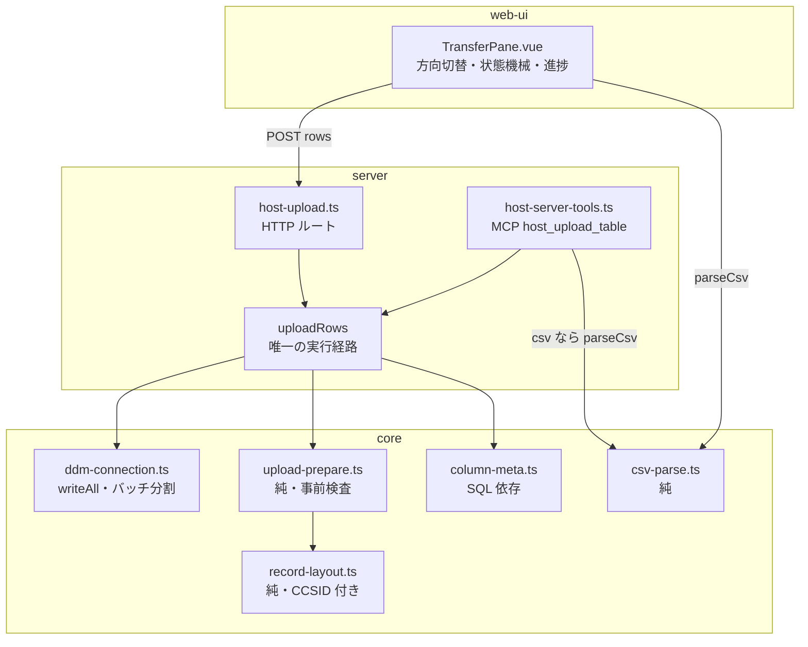
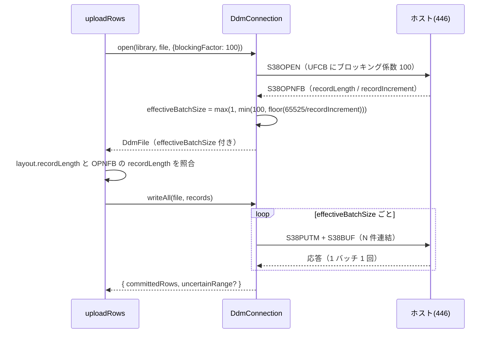
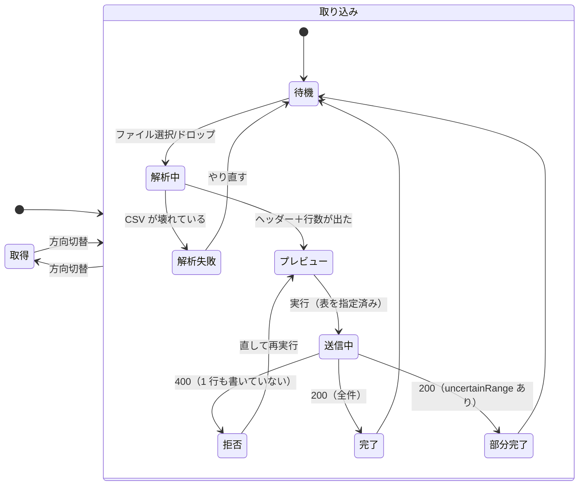
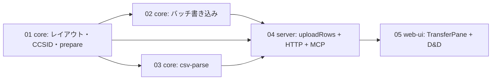

# 設計: CSV を IBM i の物理ファイルへ取り込む

spec の設計方針（D1〜D7）を、plan で分解できる構造に落とす。
中心にある判断は **「I/O を伴わない判断をすべて純関数に寄せる」** ことで、
これにより事前検査・バッチ分割・CSV 解析が実機なしで単体テストできる（AGENTS.md「実機検証を
単体テストの代替にしない」への直接の答え）。

## アーキテクチャ概要



**要点**: HTTP ルートと MCP ツールは**入口が違うだけ**で、実行は `uploadRows` の 1 経路に集約する。
入口ごとに検査や順序が分岐すると、片方だけ緩い経路が生まれる（AGENTS.md「認可はサーバーで担保する」の
「受理は 1 か所に閉じる」と同じ理由）。

## コンポーネント / モジュール

| モジュール | 責務 | 依存 | 純度 |
|---|---|---|---|
| `core/csv-parse.ts` | CSV テキスト → ヘッダー＋行 | なし | **純** |
| `core/hostserver/ddm/record-layout.ts` | 列情報 → バイト配置（CCSID 込み） | codec | **純**（変更） |
| `core/hostserver/ddm/upload-prepare.ts` | **新規**。列突き合わせ・型/CCSID 検査・全行の符号化 | record-layout, codec | **純** |
| `core/hostserver/ddm/column-meta.ts` | **新規**。SYSCOLUMNS から列情報 | DbConnection | I/O |
| `core/hostserver/ddm/ddm-connection.ts` | open(blockingFactor) / writeAll（バッチ分割） | transport | I/O（変更） |
| `server/host-upload.ts` | **新規**。ルート＋`uploadRows` | core, host-connect | I/O |
| `server/host-server-tools.ts` | MCP ツール（`uploadRows` を呼ぶだけ） | 同上 | I/O |
| `web-ui/components/TransferPane.vue` | 方向切替・ファイル受け取り・プレビュー・進捗・結果 | csv-parse | UI |

### 責務の線引き（設計の核）

- **`upload-prepare.ts` が「書く前に分かることを全部やる」**。ここを通れば、あとは送るだけ。
  戻り値は「送信可能なレコード列」か「拒否理由」のいずれかで、**中間状態を返さない**。
- **`ddm-connection.ts` は判断しない**。渡されたレコードをバッチに割って送るだけ。
  検査を持ち込むと、I/O のあるクラスにテストしたいロジックが埋まる。
- **`uploadRows` は順番を決めるだけ**（メタ取得 → 検査 → 接続 → 送信 → 後始末）。

## インターフェース / データモデル

### 拒否理由は判別可能な型で表す

全層（core → server → HTTP → UI）を同じ形で流し、UI で日本語に組み立てる。
文字列メッセージだけを返すと、UI が行番号や列名を再抽出できない。

```ts
export type UploadRejection =
  | { kind: "column-missing";    columns: string[] }          // 表にあるが CSV に無い（非 NULL）
  | { kind: "column-unknown";    columns: string[] }          // CSV にあるが表に無い
  | { kind: "type-unsupported";  column: string; dataType: string }
  | { kind: "ccsid-unsupported"; column: string; ccsid: number }
  | { kind: "value-too-long";    row: number; column: string; bytes: number; max: number }
  | { kind: "value-unencodable"; row: number; column: string; chars: string[] }
  | { kind: "value-not-numeric"; row: number; column: string; value: string };

export type PrepareResult =
  | { ok: true;  records: DdmRecord[]; layout: RecordLayout }
  | { ok: false; rejections: UploadRejection[] };
```

`row` は **CSV のデータ行番号（1 始まり・ヘッダーを含めない）**。UI が表示する番号と一致させる。

**複数の拒否をまとめて返す**（最初の 1 件で止めない）。100 行の CSV を直しては叩き直す往復を減らす。
ただし件数上限（例 100 件）で打ち切り、`truncated` を添える。

### 主要シグネチャ

```ts
// core/hostserver/ddm/upload-prepare.ts
export function prepareUpload(args: {
  columns: readonly ColumnLayoutInput[];   // 表の列（宣言順）
  header: readonly string[];               // CSV のヘッダー
  rows: readonly (readonly (string | null)[])[];
  emptyAsNull?: boolean;                   // 空文字を NULL として扱うか（既定 false）
}): PrepareResult;

// core/hostserver/ddm/ddm-connection.ts
async writeAll(file: DdmFile, records: readonly DdmRecord[]): Promise<WriteAllResult>;

// server/host-upload.ts
export async function uploadRows(deps: HostUploadDeps, args: {
  opts: ConnectOptions; library: string; file: string; member?: string;
  header: string[]; rows: (string | null)[][];
  blockingFactor?: number; emptyAsNull?: boolean;
}): Promise<UploadOutcome>;

export type UploadOutcome =
  | { ok: true;  committedRows: number; uncertainRange?: { from: number; to: number }; batchSize: number; ms: number }
  | { ok: false; rejections: UploadRejection[]; truncated: boolean };
```

### バッチ分割の位置づけ



**`effectiveBatchSize` は open 応答後にしか決まらない**（要求と応答で順序が逆）。
宣言値以下に丸めるのは安全側なので、要求は希望値、実際の詰め込みは丸めた値、という二段構えにする。

### TransferPane の構成と状態遷移（D1 で変更）

データ転送は **取得（表 → CSV）と取り込み（CSV → 表）を持つ 1 つのアプリ**（`transfer:data`）。
SQL ペイン（`sql:query`）は ACS の Run SQL Scripts の位置づけで据え置き、
実行結果の CSV エクスポートもそのまま残す（詳細は `decisions.md` D1）。

方向は排他の状態として持ち、**取り込み側だけが状態機械を持つ**（取得は SQL 実行と同じ単純な往復）。



**「部分完了」を「完了」と同じ見せ方にしない**。巻き戻せない以上、利用者が次に何をすべきか
（重複投入の危険・確認すべき行範囲）が変わるため、状態として分ける。

### 画面上の決めごと（HTML モックで合意済み）

- **列の突き合わせ表に CCSID を出す**。本作業の核心が列単位 CCSID なので、
  投入前に「この列に日本語を入れられるか」を利用者が判断できる。数値列は「該当なし」として淡く落とす。
- **想定往復数をステータスバーに出す**（例: 142 行 / バッチ 100 → 2 往復）。
  ただし待ち時間の内訳は「**接続 4〜7 秒** ＋ 往復数 × 1 秒未満」で、**支配的なのは接続**
  （`decisions.md` D2。当初「1 往復 4〜7 秒」としていたのは誤り）。
  よって進捗表示では、往復数だけでなく**接続に数秒かかること**を先に伝える。
- **拒否はまとめて出す**（先頭 100 件・打ち切りを明示）。行番号は CSV のデータ行番号
  （ヘッダーを除く 1 始まり）で、利用者がエディタで見る番号と揃える。
- **部分完了は「確定した範囲」と「不明な範囲」を分けて出す**。単一の行番号を作らない（DD4）。
- **取得側に SQL エディタを出さない**。表と絞り込み条件だけ受ける。SQL を書きたい人は SQL ペインへ行く。

### 取得側の実装（D1 の帰結）

取得は**サーバーの新規実装を要しない**。既存の `POST /api/host/sql` に
`SELECT * FROM <lib>.<file> WHERE <条件>` を組み立てて投げ、結果を既存の `csv.ts` で CSV 化する。
ただし**ライブラリ名・表名の検証は取り込み側と同じ関数を使う**（`column-meta.ts` の識別子検証を共有し、
2 つの検証規則が並立しないようにする）。

## 設計判断

### DD1: 事前検査を core の純関数に置く（server ではなく）

**採用**: `upload-prepare.ts` を core に置き、`DbConnection` も socket も触らせない。

- 理由: 検査の中身（列突き合わせ・CCSID・長さ・数値変換）は**実機と無関係の純粋な判断**で、
  ここが本作業のロジックの大半を占める。純関数なら 100% 単体テストで固められる。
- 理由: MCP と HTTP の両方から同じ検査が通る（入口で緩い経路を作らない）。
- **退けた案**: server のルート内で検査する。実装は短いが、テストに Hono のリクエストが要り、
  検査の網羅テストが書きにくくなる。

### DD2: 「全行を符号化してから送る」——ストリーミングしない

**採用**: `prepareUpload` が全行を `DdmRecord[]` に変換し、それが済んでから接続する。

- 理由: requirement の「**1 行も書かずに中止する**」を構造的に保証できる。
  途中で符号化に失敗しうる設計だと、この保証はコメントでしか守れない。
- 代償: 全行がメモリに載る。ただし 1 レコードは高々数百バイトで、
  数万行でも数十 MB。**サーバー側に行数上限を設けて上界を固定する**（spec の上限と別に、
  API の受理段階で `rows.length` を検査）。
- **退けた案**: 行を読みながら送る（ストリーミング）。メモリは減るが、
  「途中まで書けてしまう」ケースが**正常系に入り込む**。巻き戻せない以上、
  異常系を増やす設計は取らない。

### DD3: `write`（1 件）は残し、`writeAll` を足す

**採用**: 既存 `write(file, record)` はそのまま。`writeAll` を新設し、内部でバッチ分割。

- 理由: 既存の検証スクリプトと単体テストが `write` を使っている。壊さない。
- 理由: `writeAll` を `write` の繰り返しとして実装**しない**（それではバッチにならない）。
  両者は別のフレーム組み立てを持つ。共通部分は `buildS38Buf(records)` に括り、
  `write` は `writeAll` に 1 件渡す薄い委譲にする。

### DD4: 部分失敗は「範囲」で返し、単一の行番号を作らない

spec D5 の再掲だが、設計上の帰結を明示する。`WriteAllResult.uncertainRange` は
**バッチ境界から機械的に導ける**（`committedBatches * effectiveBatchSize + 1` 〜 次のバッチ末尾）。
推測で 1 行に絞り込む処理は**書かない**。

### DD5: ファイル D&D は TransferPane だけが受け、既存ハンドラは `Files` を無視する

- `WorkspaceNode.vue` の `onDragOver` / `onDrop` と `PaneTabs.vue` の各ハンドラの先頭で、
  `ev.dataTransfer?.types.includes("Files")` なら**何もせずに戻る**（`preventDefault` しない）。
- こうすると、ファイルをワークスペースの余白に落としてもブラウザ既定（何もしない／別タブで開く）に
  委ねられ、**分割やタブ移動が誤発火しない**。
- TransferPane 内のドロップ領域だけが `Files` を受ける。

**退けた案**: ワークスペース全体でファイルを受け、落とした位置のペインに渡す。
どのペインが受けたか曖昧になり、複数の Upload ペインがある場合に破綻する。

### DD6: `host-sql.ts` の不変条件コメントを訂正する（削除しない）

spec D6 の実装。**コメントを消さずに範囲を狭める**。
「なぜ読み取り専用だったか」の説明は依然として `/api/host/sql` に対して有効で、
消すと次の変更で同じ検討をやり直すことになる。追記の形で
「アップロードは別ルート（`/api/host/upload`）で、そちらは書き込みを行う」と繋ぐ。

## plan への申し送り

### 分割の単位（subtask 化の判断材料）

依存の向きが一方向で、層ごとに切れる。



- **01 と 03 は独立**（並行可）。02 は 01 の型変更に乗る。04 は 01〜03 が揃ってから。
- **実機検証は 02 の直後に 1 回入れる**のが要点。spec の「残る不確実性」にあるとおり
  **バッチ書き込みの実機挙動は未確認**で、ここが崩れると 04・05 の前提が変わる。
  UI まで作ってから発覚すると手戻りが大きい。
- protocol §2.8 の subtask 化は**このサイズなら不要と考える**（1 PR に収まり、
  層をまたぐ変更が型定義を通じて連動するため、分けると往復が増える）。
  ただし判定は plan の役割なので、ここでは推奨に留める。

### 順序上の注意

1. `ColumnLayoutInput` に `ccsid` を足す変更が**全体の起点**。ここが決まらないと下流が書けない。
2. `column-meta.ts` を作る際、**現行の `tools/hostserver-check/src/ddm.ts` を置き換える**
   （2 つの SYSCOLUMNS クエリが残らないようにする）。
3. 実機検証は `MARO1.TESTPF`（CHAR(5)×4・CCSID 273）と `MARO1.CSVUPJP`
   （CCSID 5035/930・**ID=2 に既知の日本語**）を使う。後者は research で仕込み済み。
4. エラー写像（`HOST_SERVER_UNSUPPORTED` → 400）は既存 SQL 経路にも影響する。
   **既存テストへの影響を確認する**こと。
