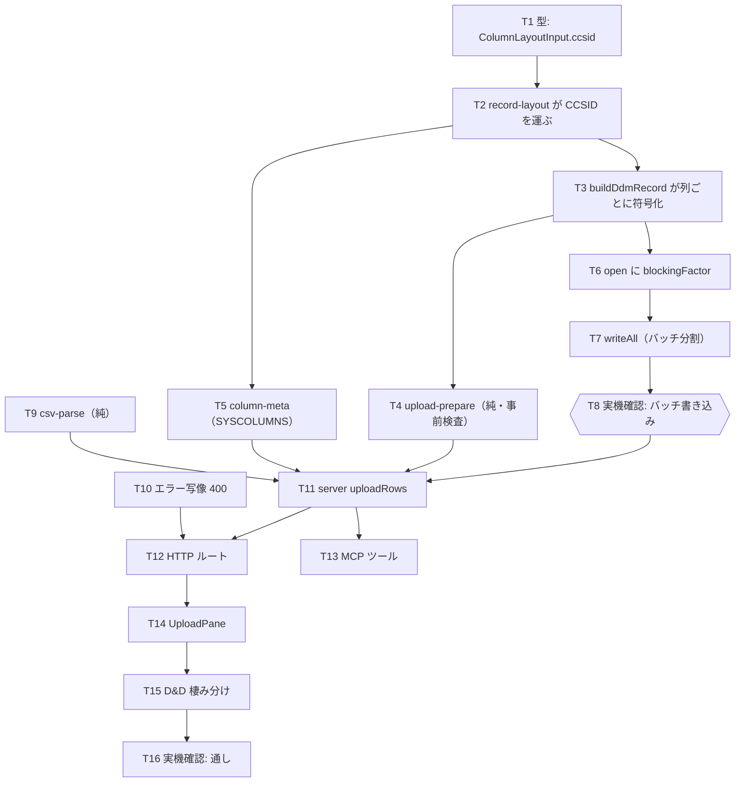

# 計画: CSV を IBM i の物理ファイルへ取り込む

## split 判定（protocol §2.8）

**分割しない**（単一 `tasks.md`）。

判定の discriminator「そのピースは単独で検証・デリバリ可能か」を当てると:

- **単独でデリバリ可能な層は無い**。`ColumnLayoutInput.ccsid` と `UploadRejection` という
  2 つの型が全層を貫いており、core だけ変えても利用者価値は無く、server は core 無しでは型が通らない。
  → 高結合。
- **漸進レビューの価値があるほど大規模ではない**。新規 5 ファイル・変更 8 ファイル程度で 1 PR に収まる。
  subtask に割ると、子どうしが型定義の完成を待ち合うことになり往復が増える。

→ 「不可分」に該当。単一 `tasks.md` ＋ コミットを層ごとに分ける構成で進める。

## 実装方針

design の構造（純関数へ寄せる）をそのまま作業順序に写す。**型を先に決め、純関数を固め、
実機で裏を取ってから上位層へ**という順序を守る。

要点は 3 つ。

1. **`ColumnLayoutInput` への `ccsid` 追加が全体の起点**。ここが決まらないと下流が書けないので最初に置く。
2. **バッチ書き込みの実機確認を、上位層に着手する前に済ませる**。spec の「残る不確実性」のとおり
   実機挙動は未確認で、崩れると server/web-ui の前提が変わる。UI まで作ってから発覚すると手戻りが大きい。
3. **純関数（prepare / csv-parse / バッチ分割）は単体テストで固めてから実機に行く**
   （AGENTS.md「実機検証を単体テストの代替にしない」）。

## 作業順序と依存関係

1. **T1〜T3**（core 型・符号化）依存: なし → 順に
2. **T4**（prepare）依存: T3 — 本作業のロジックの中心。単体テストを厚く
3. **T5**（column-meta）依存: T2 — `tools/hostserver-check` の重複クエリを置き換える
4. **T6〜T7**（バッチ）依存: T3
5. **T8 実機確認（ゲート）** 依存: T7 — **ここを通るまで上位層に進まない**
6. **T9**（csv-parse）依存: なし — T1〜T8 と並行可
7. **T10**（エラー写像）依存: なし — 既存 SQL 経路への影響確認を含む
8. **T11〜T13**（server・MCP）依存: T4, T5, T7, T9
9. **T14〜T15**（web-ui）依存: T12
10. **T16 通し確認** 依存: 全部

## リスク / 留意点

| リスク | 度合い | 対応 |
|---|---|---|
| **バッチ書き込みの実機挙動が原典どおりでない** | 中 | T8 をゲートにし、上位層より前に潰す。崩れたら spec に差し戻す |
| レイアウト計算が「仮説に基づく実装」 | 中 | `recordLength` 照合を実行時ガードとして維持（T11）。CCSID を跨ぐ表で確認（T16） |
| `HOST_SERVER_UNSUPPORTED` → 400 が既存 SQL 経路に波及 | 小 | T10 で既存テストの期待値を確認してから変更 |
| 全行メモリ保持（DD2） | 小 | API 受理段階で行数上限（T12） |
| 部分書き込みは巻き戻せない | 仕様 | `uncertainRange` で正直に返す（T7・T11）。UI で「部分完了」を別状態に（T14） |
| 既存 D&D の誤動作 | 小 | T15。コンポーネントテストで回帰資産化 |

## テスト方針

**単体（実機不要・ここで大半を固める）**

- `upload-prepare`: 列不足/余剰・対応外の型・未対応 CCSID・65535・長さ超過・表現できない文字・
  数値でない値。**複数の拒否がまとめて返ること**と `row` が 1 始まりであること。
- `csv-parse`: 引用符・埋め込み改行・二重引用符・BOM・CRLF/LF・末尾改行・空行。
- バッチ分割: `effectiveBatchSize` の丸め（`floor(65525/recordIncrement)` と 32767 と要求値の最小）。
  境界値（recordIncrement が大きく 1 件しか入らない場合／割り切れる・割り切れない件数）。
- `record-layout`: CCSID を運ぶこと。混在 CCSID でも `LENGTH` をバイトとして扱うこと（research F8）。
- server: 認証オフ / admin / 一般ユーザーの 3 パターン（AGENTS.md）。行数上限。
- web-ui: UploadPane の状態遷移、`Files` ドラッグで分割・タブ移動が発火しないこと。

**実機（PUB400・上の代替にしない）**

- T8: バッチで複数件書けること。往復回数が件数でなくバッチ数になっていること。
- T16 通し: `MARO1.TESTPF`（CHAR(5)×4・CCSID 273）へ CSV から投入し、**SQL で読み返して一致**。
- T16 日本語: `MARO1.CSVUPJP`（CCSID 5035/930）へ投入し読み返して一致。
  **既知の基準行 ID=2（`日本語` / `パス`）と突き合わせる**（research F10 で仕込み済み）。
- T16 拒否: CCSID 273 の列に日本語を入れた CSV が、**1 行も書かずに**拒否されること。
- T16 性能: 100 行の取り込みで、1 行 1 往復の場合より明確に速いこと（往復回数と実時間を記録）。

**注意**: 日本語の期待値を CL/RUNSQL の通常リテラルで仕込むことはできない（research F9）。
`UX''`（UTF-16 16 進リテラル）を使うか、DDM で書いて SQL で読み返す形にする。
