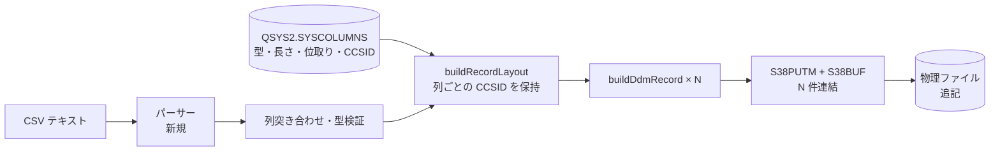

# 調査: CSV を IBM i の物理ファイルへ取り込む

requirement の「未確定事項」のうち、**原典・実機で確かめるべき**もの（バッチ書き込みの要求形式 /
CCSID の決定方法 / DBCS 列の扱い）を潰す。コード内の事実確認も併せて行う。

**原典照合は主エージェントが直読した**（protocol「2.6」。委譲していない）。
出典は `git clone --depth 1 https://github.com/IBM/JTOpen.git` の
`archived/jtopenlite/com/ibm/jtopenlite/ddm/`。実機確認は PUB400（`srv:pub400.com`）。

## 調査の問い

- Q1: バッチ書き込み（ブロッキング係数 > 1）の要求形式は？ 上限は？
- Q2: 書き込み時の CCSID はどう決めるのが正しいか？
- Q3: 日本語を書くことは実際に可能か（対象外としている DBCS 列に踏み込まずに済むか）？
- Q4: 現在の実装は何を固定していて、どこを変えれば可変になるか？
- Q5: 出力先の仕様（server API / MCP ツール / CSV / UI）は何に準拠すべきか？

## 判明した事実

### F1: バッチ書き込みは「open 時にブロッキング係数を宣言し、S38BUF に N 件連結する」

出典: `DDMConnection.java:863-883`（`write`）と `:1604-1631`（`sendS38BUFRequest`）。

```java
int blockingFactor = file.getBatchSize();
int batchSize = numRecords > blockingFactor ? blockingFactor : numRecords;
while (startingRecordNumber < numRecords) {
  if (startingRecordNumber+batchSize >= numRecords) batchSize = numRecords-startingRecordNumber;
  sendS38PUTMRequest(out_, file.getDCLNAM(), id);
  sendS38BUFRequest(file, out_, id, file.getRecordIncrement(), listener, ..., batchSize);
  out_.flush();
  handleReply(file, "ddmS38PUTM", null);   // ← 応答待ちは 1 バッチにつき 1 回
  startingRecordNumber += batchSize;
}
```

S38BUF の組み立て（`:1606-1630`）:

```java
final int total = batchSize*recordIncrement;
out.writeShort(total+10);   // 外側 LL
out.write(0xD003);          // GDS ＋ フォーマット
out.writeShort(correlationID);
out.writeShort(total+4);    // S38BUF LL
out.writeShort(0xD405);     // S38BUF CP
for (int i=startingRecordNumber; i<limit; ++i) {
  out.write(data, offset, length);              // レコード本体 recordLength バイト
  for (int j=0; j<recordIncrement-length; ++j)  // 残りは NULL 指標
    out.write(nullFieldValues[j] ? 0xF1 : 0xF0);
}
```

**要点**: 1 件送るときと構造は同じで、`recordIncrement` 刻みで N 件並べ、LL を `N*recordIncrement`
基準にするだけ。**フレーム形式の新規解析は不要**で、既存 `write` の一般化で足りる。

ブロッキング係数は open 時の UFCB に載る（`:1732-1801`）:

```java
if (batchSize < 1 || (doRead && doWrite)) batchSize = 1;   // 読み書き両用は必ず 1
batchSize = batchSize & 0x7FFF;
...
out.writeShort(batchSize); // Blocking factor.
```

### F2: バッチ上限は「LL が 2 バイト」で決まる

- `out.writeShort(total+10)` より **`batchSize * recordIncrement + 10 ≤ 65535`**。
- 加えて `batchSize & 0x7FFF` で **32767 件**が形式上の上限。
- 実効上限は `floor(65525 / recordIncrement)`。例えば `recordIncrement = 105`（CHAR(100) 系）なら
  **約 624 件**が 1 バッチの上限になる。
- 原典の既定は **preferred batch size = 100**（`:386`, `:394`）。`DDMConnection` は
  「状況により別の値を選んでよい」と明記している（`:411`）。

### F3: CCSID は **列単位**で、`QSYS2.SYSCOLUMNS.CCSID` から取れる

原典は CCSID を**フィールド単位**で持つ（`DDMField.java:54,143-148`。`WHCCSID`）。
ファイル単位の CCSID ではない。

本 PJ は `DDMField`(1,220 行) を移植せず SQL で列レイアウトを得る方式を採ったため、
同じ情報を SQL から取る必要がある。**実機で `QSYS2.SYSCOLUMNS` に `CCSID` 列が実在することを確認した**
（INTEGER・nullable）。数値列では NULL、文字列系で値が入る。

現在の取得クエリ（`tools/hostserver-check/src/ddm.ts:62-73`）は `CCSID` を**選択していない**ので、
列を足すだけで済む。

### F4: PUB400 の実データは CCSID 273 で、**37 固定は明確に誤り**

`MARO1` の全 CHAR 列を実機で確認した結果:

| 表 | 列 | 型 | CCSID |
|---|---|---|---|
| `TESTPF` | TEST1〜TEST4 | CHAR(5) | **273** |
| `QCLSRC` ほかソース物理ファイル | SRCDTA | CHAR(100) | **273** |
| `SQLTYPES` | C_CHAR | CHAR(10) | **273** |
| `SQLTYPES` | G_GR / G_V | GRAPHIC(4) | 16684 / 300 |

数値列（NUMERIC/INTEGER/SMALLINT/BIGINT/FLOAT）は CCSID が NULL。

システム全体の分布も取った（上位）: `37` が 3,783,856 列、**`273` が 1,424,751 列**、以下 500 / 870 /
1025 / 280 …。**日本語 CCSID（5026 / 5035 / 930 / 939 / 1399）は上位 20 に存在しない**（290＝日本語
カタカナ SBCS が 13,887 列あるのみ）。

→ 現在の CCSID 37 直書きは、**このホストの自分の表に対してさえ誤った文字コードで書く**。
F3 の列単位 CCSID を使えば正しくなる。

### F5: 日本語を書くには「日本語 CCSID の列」が要る。PUB400 には実質存在しない

CCSID 273 はドイツ語圏の SBCS EBCDIC で、**日本語を表現できない**。
core の `encodeChar` は表現できない文字があると置換せず例外を投げる（`encode.ts:139-146`）ので、
壊れたデータは書かれないが、**273 の列に日本語は入らない**——これはこちらの実装の制約ではなく
対象列の定義そのもの。

core の対応 CCSID（`codec.ts:184-190`, `tables/`）:

- SBCS: **37 / 273**
- DBCS（混在）: **930 / 939 / 1399**、エイリアス **5026→930 / 931,5035→939**

したがって日本語を書くには、対象列が 5026/5035/930/939/1399 のいずれかである必要がある。
PUB400 上にそういう列は事実上無いため、**検証には日本語 CCSID の列を持つ表を新規に作る必要がある**
（例 `CREATE TABLE ... (C CHAR(20) CCSID 5035)`）。これは実機への DDL であり、ユーザーの承認が要る。

> **未解決の技術的懸念**: 5026/5035/930/939 は SBCS/DBCS 混在で、符号化時に SO/SI が入る。
> 固定長 CHAR 列に対する長さ会計は**文字数ではなくバイト数**でなければならない。
> 現在の `ColumnLayoutInput.length` は「文字なら文字数」と説明されており（`record-layout.ts:15-22`）、
> 混在 CCSID で `SYSCOLUMNS.LENGTH` がバイトを返すなら**意味がずれる**。実表で未検証。

### F6: 現在の実装が固定している箇所（変更点は 2 か所）

- **ブロッキング係数**: `ddm-connection.ts:510-511` — `SEQONLY = 0xC0` の直後に `ufcb.u16(1)`。
  原典と同じく open 時の宣言なので、`open()` の引数に引き上げれば足りる。
- **CCSID**: `ddm-connection.ts:48-50` で CCSID 37 のコーデックを生成し、`:395` の `encodeChar` に渡す。
  `buildDdmRecord` の外から差し替える手段が無い。`RecordLayout` の各フィールドが自分の CCSID を
  持てば、F3 の情報がそのまま流れる。

### F7: 出力先の仕様（準拠すべき既存の型・規約）

- **server ルート**: `host-sql.ts:110` の `registerHostSqlRoutes` と同じ形。リクエストは
  `sourceSchema`（`host-api.ts:20-28`。`{system?, session?}` の `.strict()`）で始まる `.strict()` zod。
  解決は `resolveSource(deps.resolver, source, user)` → `ConnectOptions`。
  ホスト系ルートは **admin ゲートを掛けていない**（`app.ts:102-104`）。
- **エラー写像**: `statusOf`（`host-api.ts:39-52`）は `HOST_SERVER_UNSUPPORTED` を既定分岐の
  **502** に落とす。「対応外の列型」は利用者側の誤りなので **400 が適切**。写像の追加が要る。
- **接続の再利用**: SQL には `DbPool` があるが、**DDM 接続にプールは無い**。
  1 回の取り込みで signon ＋ 446 の 2 接続を張る（`ddm-connection.ts:99`）。
- **MCP ツール**: `host-server-tools.ts` に `host_sql` / `host_command` / `host_write_file` 等が並ぶ。
  `host_write_file` は **IFS のストリームファイル書き込みであって DDM ではない**ので、名前が紛らわしい。
- **CSV**: `web-ui/src/csv.ts` は**生成専用**（`toCsv` / `csvBlob` / `csvFileName` / `isLob`）。
  `escapeField` は非公開で、対になる解析関数は無い。**パーサーはリポジトリ内に存在しない**
  （`parseCsv|papaparse|fromCsv` いずれも該当なし。依存にも無い）。
  RFC 4180 の引用符・埋め込み改行・BOM 除去はすべて新規。
- **ファイル D&D**: `web-ui` に `<input type="file">` も `FileReader` も無い。既存の D&D は
  ペイン分割（`WorkspaceNode.vue:42-60`）とタブ移動（`PaneTabs.vue:65-157`）が
  同じ `dragover`/`drop` を使う。ファイルドラッグは `dataTransfer.types` に `Files` が入るため
  判別自体は可能だが、**どちらのハンドラが勝つかを決める必要がある**。

### 取り込み経路（確定した流れ）



## 影響範囲

- `packages/core/src/hostserver/ddm/`: `ddm-connection.ts`（open のブロッキング係数・write の複数件化・
  コーデック受け渡し）、`record-layout.ts`（CCSID をレイアウトに載せる）、`encode.ts`（呼び出し側の変更のみ）。
- `packages/core/src/index.ts`: 公開型の変更（`ColumnLayoutInput` に CCSID）。
- `packages/server/src/`: 新規アップロードルート、`host-api.ts` のエラー写像、`host-server-tools.ts` の新ツール。
- 列メタデータ取得は現在 `tools/hostserver-check/` にしか無く、**製品コードへ移す必要がある**。
- `packages/web-ui/src/`: `csv.ts`（解析の追加）、新規ペイン、`WorkspaceNode.vue` / `PaneTabs.vue`（D&D の棲み分け）。

## 実現性 / リスク

- **バッチ書き込みは実現可能**。形式は F1 で確定し、既存 `write` の一般化で足りる。上限は F2 の式で機械的に決まる。
- **CCSID 可変も実現可能**。必要な情報源（`SYSCOLUMNS.CCSID`）と変換器（`codecForCcsid`）が
  どちらも既にあり、繋ぐだけ。
- **日本語の受け入れ条件は「対象列が日本語 CCSID であること」**。requirement の完了条件
  「日本語を含む行が書け、読み返して一致する」は、**検証用の表を実機に作らないと満たせない**。
- **リスク（中）**: 混在 CCSID での長さ会計（F5 の注記）。バイト長で扱わないと固定長列からあふれる。
- **リスク（中）**: `record-layout.ts` は自ら「仮説に基づく実装」と明記しており、ホスト申告の
  `recordLength` との一致でしか裏が取れていない。CCSID を跨ぐと仮説の適用範囲が広がる。
- **リスク（小）**: 部分書き込み。巻き戻せないため、失敗位置の報告が仕様上の要求になる（requirement 済み）。
- **リスク（小）**: DDM 接続にプールが無く、取り込みごとに 2 接続。バッチ化で往復は減るが接続確立は残る。

## spec への申し送り

1. **`ColumnLayoutInput` に CCSID を持たせ、フィールド単位で符号化する**（原典と同じ粒度）。
   ファイル単位・接続単位の CCSID にはしない。
2. **ブロッキング係数は open の引数**にする。上限は `min(32767, floor(65525 / recordIncrement))` で
   機械的に丸める。既定値は原典に倣い 100 を出発点とし、上限で切る。
3. **`SYSCOLUMNS` 問い合わせを製品コードへ移す**際、`CCSID` を選択列に加え、
   `ORDER BY ORDINAL_POSITION` を維持し（レイアウトが宣言順に依存）、ライブラリ名・表名の
   **文字列連結をやめる**。
4. **`HOST_SERVER_UNSUPPORTED` を 400 に写像**する（対応外の列型は利用者側の誤り）。
5. **混在 CCSID の長さ会計をバイト基準に統一**し、`SYSCOLUMNS.LENGTH` の意味を実表で確かめてから確定する。
6. **日本語の検証方法を決める**。日本語 CCSID の列を持つ表を PUB400 に作る必要があり、
   **実機への DDL はユーザー承認が要る**。承認が得られない場合、requirement の完了条件
   「日本語を含む行が書ける」を検証できないため、条件の見直しが必要になる。
7. **ファイル D&D と既存 D&D の優先順位を決める**（`dataTransfer.types` に `Files` を含むかで判別可能）。
8. **CSV パーサーの受け入れ範囲を決める**（引用符・埋め込み改行・BOM・文字コード）。
   既存 `toCsv` と対称になる形が望ましいが、`escapeField` が非公開なので公開範囲の整理が要る。

### 残った未確定事項（spec では決められないもの）

- **バッチ書き込みの実効速度**。requirement の完了条件「100 行が明確に速い」は実測が要る。
- **CSV の入力文字コード**（UTF-8 のみか、Shift_JIS も受けるか）はユーザー判断。

---

## 追記（spec 着手前・実機で追加検証）

ユーザーの承認を得て PUB400 に検証用の表を作り、申し送り 5・6 を実測で解消した。

```sql
CREATE TABLE MARO1.CSVUPJP (
  ID SMALLINT NOT NULL,
  C_SBCS CHAR(20) CCSID 273,
  C_JP   CHAR(20) CCSID 5035,   -- 混在（→ core では 939 のエイリアス）
  C_JP2  CHAR(20) CCSID 930     -- 混在
)
```

### F8: 混在 CCSID でも `LENGTH` は**バイト**（申し送り 5 を解消）

`QSYS2.SYSCOLUMNS` の実測値:

| 列 | 型 | CCSID | `LENGTH` | `CHARACTER_MAXIMUM_LENGTH` | `CHARACTER_OCTET_LENGTH` |
|---|---|---|---|---|---|
| `C_SBCS` | CHAR(20) | 273 | 20 | 20 | **20** |
| `C_JP` | CHAR(20) | 5035 | 20 | 20 | **20** |
| `C_JP2` | CHAR(20) | 930 | 20 | 20 | **20** |

混在 CCSID でも 3 つとも一致した。**`CHAR(n)` の `n` はバイト数**であり、
現在の「`LENGTH` をそのままフィールドサイズにする」レイアウト計算は**混在 CCSID でも正しい**。

→ 懸念していた「文字数とバイト数のずれ」は**存在しない**。ただし SO/SI はこの n バイトを消費するため、
**符号化後のバイト長で収まり判定をする**必要はある（現在の `encodeChar` は既にバイト長で判定している）。
`CHARACTER_OCTET_LENGTH` を使えば意図がより明示的になるが、値は同じ。

### F9: **CL/RUNSQL 経由では日本語が 0x3F に置換される**（検証手順を縛る事実）

`RUNSQL SQL('INSERT INTO MARO1.CSVUPJP VALUES(1, ''abc'', ''日本語テスト'', ''カナ'')')` の結果:

- 戻り: `SQL0335 Character conversion resulted in substitution characters.`（警告）
- 読み返し: `HEX(C_JP)` = `3F3F3F3F3F3F4040…` — **全文字が 0x3F（置換文字）**。
  同じ行の `C_SBCS`（ASCII の `abc`）は正しく入った。

つまり**コマンドサーバー経由の CL では日本語リテラルを運べない**。これは DDM 側の問題ではなく
CL 経路の文字変換の問題。

**検証手順への影響（重要）**: 日本語の受け入れ確認は
**「DDM で書く → `host_sql`(SELECT) で読み返す」以外の経路を使えない**。
RUNSQL で期待値を仕込んだり比較したりする方法は取れない。
逆に言えば、この経路で日本語が一致すれば DDM 書き込みの正しさが示せる（比較対象が
CL 経由で汚染されないため、むしろ検証として素直）。

> 検証用の行は削除済み（表は残してある。以降の test 工程で使う）。

### F10: **取得（SQL）側は最初から DBCS 対応**。読み書きが非対称だった

`db-decode.ts` は列の CCSID で分岐している。

- `decodeText`（`:173-176`）→ `codecForCcsid(meta.ccsid)`。混在 CCSID（930/939/1399）は SO/SI を解釈。
- `decodeGraphic`（`:179-185`）→ 純 DBCS（`pureDbcsCodecForCcsid`）と UTF-16 系を個別に処理。
  未対応 CCSID は例外にする。

**実機で往復させて確認した**（コード読解だけで済ませていない）:

| 列 | CCSID | 読み取り結果 | `HEX()` |
|---|---|---|---|
| `C_JP` | 5035（混在） | `日本語` | `0E 4562 4566 48E7 0F` ＋ 空白 |
| `C_JP2` | 930（混在） | `パス` | `0E 43D5 438E 0F` ＋ 空白 |

→ **読み取り側は列単位 CCSID で正しく動いており、書き込み側だけが CCSID 37 固定だった。**
本作業は新機能の追加というより、**書き込みを読み取りに追いつかせる**性質の変更である。

**F9 の訂正**: 「CL 経由では日本語を運べない」は不正確だった。正しくは
**通常の文字リテラルでは運べない**。`UX'65E5672C8A9E'`（UTF-16 の 16 進リテラル）なら
ASCII 文字だけで構成されるため CL 経路を通り、ホスト側で対象 CCSID に変換されて正しく入る
（上表はこの方法で仕込んだ）。

→ 検証手順が広がる: 期待値を `UX''` で仕込んでおき、**DDM で書いた行と SQL で読み比べる**ことができる。
`MARO1.CSVUPJP` の ID=2 をその基準行として残してある。
