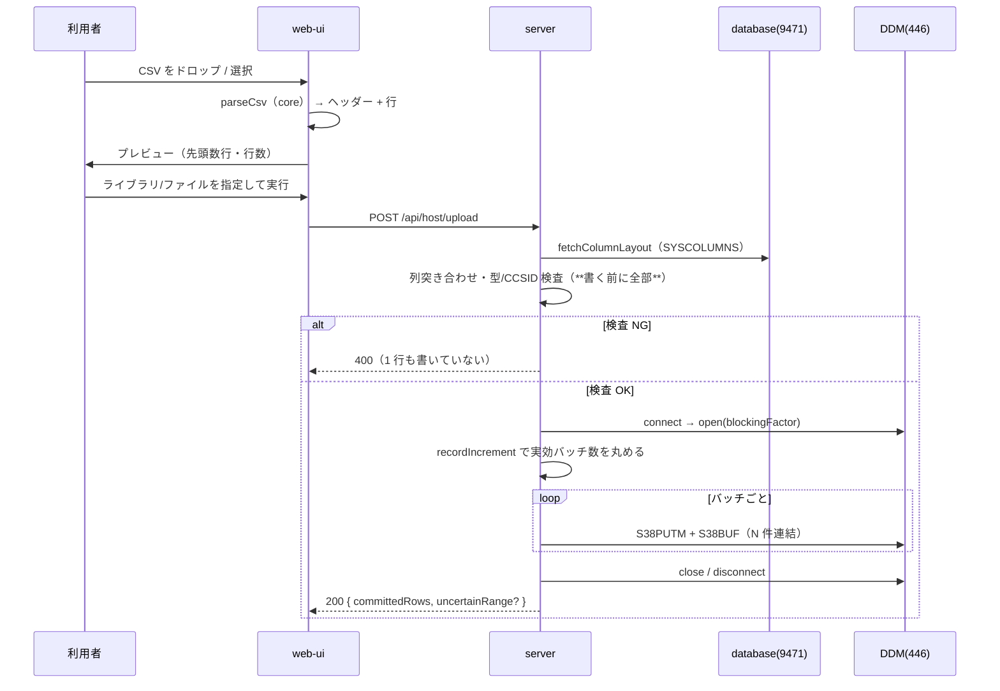

# 仕様: CSV を IBM i の物理ファイルへ取り込む（Web UI / MCP）

## 概要

既に core にある DDM 追記（`20260719-hostserver-upload-ddm`）を、**列単位 CCSID**と**バッチ書き込み**に
対応させたうえで、server API・MCP ツール・Web UI から使えるようにする。

research で確定した事実に全面的に依拠する。特に:

- バッチは open 時にブロッキング係数を宣言し、S38BUF に `recordIncrement` 刻みで N 件並べる（F1）。
  上限は LL が 2 バイトであることから決まる（F2）。
- CCSID は**列単位**で、`QSYS2.SYSCOLUMNS.CCSID` から取れる（F3）。現在の 37 固定は誤り（F4）。
- 混在 CCSID でも `CHAR(n)` の `n` はバイト数（F8）。**既存のレイアウト計算は正しい**。
- CL/RUNSQL 経由では日本語が 0x3F に置換される（F9）。検証は「DDM で書く → SQL で読み返す」に限る。

## 設計方針

### D1: CCSID はフィールド単位で持つ（接続単位・ファイル単位にしない）

原典が `DDMField.getCCSID()`（`WHCCSID`）でフィールド単位に持っている（research F3）。
同じ表に CCSID 273 の列と 5035 の列が同居しうる（検証表 `MARO1.CSVUPJP` が実例）。
接続やファイル単位にすると**表現できるデータの範囲を実際より狭める**。

→ `ColumnLayoutInput` / `FieldLayout` に `ccsid` を持たせ、`buildDdmRecord` が
フィールドごとに `codecForCcsid(field.ccsid)` で符号化する。

**退けた案**: 接続に 1 つの CCSID を持たせる（現在の 37 固定の自然な拡張）。
実装は小さいが、混在した表を扱えない。原典が持っている情報を捨てる理由が無い。

### D2: ブロッキング係数は open の引数。上限は式で丸める

`open()` に `blockingFactor?: number` を足す。実効値は次で決める（F2）:

```
effective = max(1, min(requested, 32767, floor((65535 - 10) / recordIncrement)))
```

`recordIncrement` は S38OPNFB の応答で分かるが、**ブロッキング係数は open 要求に載せる**ため
順序が逆になる。よって:

- 要求時は利用者指定（既定 100。原典の preferred batch size に倣う）を `min(requested, 32767)` で送る。
- 応答で `recordIncrement` が判明した時点で `floor(65525 / recordIncrement)` を計算し、
  **実際に 1 バッチへ詰める件数はこちらで丸める**（宣言値以下に収める分には安全）。

→ `DdmFile` に `effectiveBatchSize` を持たせ、`write` がそれを使う。

### D3: 列メタデータ取得は core に置き、`DbConnection` を受け取る

現在 `tools/hostserver-check/src/ddm.ts` にしか無い `QSYS2.SYSCOLUMNS` 問い合わせを、
`packages/core/src/hostserver/ddm/column-meta.ts` として製品コード化する。

- `DbConnection` を引数に取る（core 内で完結し、`node:*` に依存しない＝AGENTS.md の
  「core のピュアロジック層は Node API 非依存」を守れる）。
- **`CCSID` を選択列に加える**。
- **`ORDER BY ORDINAL_POSITION` を維持**する（レイアウトが宣言順に依存するため。research F7）。
- **ライブラリ名・表名を SQL に文字列連結しない**。現行は連結しており注入経路になる。
  パラメータマーカーが使えない箇所は `^[A-Z0-9_$#@.]{1,128}$` の検証を課したうえで用いる。

### D4: HTTP API は「解析済みの行」を受ける。CSV 解析は core の純関数に置く

- **HTTP API は `rows`（値の二次元配列）を受ける**。CSV 文字列は受けない。
  サーバーを「データ投入 API」として素直に保ち、ファイル形式の都合を持ち込まない。
- **CSV パーサーは `packages/core/src/csv-parse.ts` に純関数として置く**。
  web-ui（送信前の解析・プレビュー・行番号の提示）と MCP ツール（CSV 文字列受け口）の
  **両方が同じ実装を使う**。パーサーが 2 つある状態を作らない。
- web-ui の既存 `csv.ts` は生成専用のまま残す（UI 都合の Blob/ファイル名を持つため core に移さない）。

**退けた案**: HTTP API が CSV 文字列を受ける。UI 側はプレビューと行番号提示のためにどのみち
解析するので、**同じ解析が 2 回**走る。行番号のズレも生みやすい。

### D5: 部分書き込みの報告は「バッチ境界」で正直に返す

コミットメント制御が無いため巻き戻せない（requirement 済み）。さらにバッチ書き込みでは
**1 バッチの途中で失敗したとき、そのバッチの何件目まで確定したかをホスト応答から特定できない**。

→ 嘘をつかない形にする。応答は:

- `committedRows`: **成功が確定したバッチ**までの累計行数（確実に書けた下限）。
- `uncertainRange`: 失敗したバッチの行範囲 `{ from, to }`（1 始まり・CSV のデータ行番号）。
  この範囲は**書けたか書けなかったか不明**であることを明示する。

「n 行目で失敗した」と単一の数字で言い切らない。言い切れる情報を持っていないため。

### D6: 認可は既存のホスト API を踏襲する（判断の記録）

requirement のとおり「接続を持つユーザーなら誰でも」を採る。ただし `host-sql.ts` が明文化していた
「この API は構造的に読み取り専用」という不変条件を本作業が破るため、**再検討の結論をここに残す**。

- **踏襲する理由**: 書ける範囲は IBM i 側のオブジェクト権限が決める。アプリ側で追加の制限を掛けると、
  ホストで許された操作を UI が勝手に禁じることになり、既存の設計思想（`app.ts:102-104`）と食い違う。
- **ただし不変条件は失われる**ので、`host-sql.ts` の冒頭コメントを更新し
  「**読み取り専用なのは `/api/host/sql` であって、ホスト API 全体ではない**」と範囲を狭めて明記する。
  古い記述を残すと、次に読む人が誤った安心を得る。
- 接続の解決は既存どおり `resolveSource(deps.resolver, source, user)` を通す（所有チェックが働く）。
- `decisions.md` にもこの判断を記録する。

### D7: ファイルの D&D は `dataTransfer.types` で分岐し、**ファイルが勝つ**

既存の D&D（ペイン分割 `WorkspaceNode.vue`・タブ移動 `PaneTabs.vue`）と衝突する（research F7）。

- ファイルのドラッグは `ev.dataTransfer.types` に `"Files"` を含む。
- **タブの D&D は `"text/session"` を使う**ので、両者は判別できる。
- ペイン分割・タブ移動の各ハンドラは、**`Files` を含むドラッグを無視する**（`preventDefault` しない）。
- CSV 取り込みペインだけがファイルドロップを受ける。ワークスペース全体では受けない
  （どのペインへ落としたのか曖昧になるため）。

## 対象範囲

| 層 | ファイル | 変更 |
|---|---|---|
| core | `hostserver/ddm/record-layout.ts` | `ColumnLayoutInput` / `FieldLayout` に `ccsid` |
| core | `hostserver/ddm/ddm-connection.ts` | open の blockingFactor、write の複数件化、列 CCSID での符号化 |
| core | `hostserver/ddm/column-meta.ts` | **新規**。SYSCOLUMNS からの列取得 |
| core | `csv-parse.ts` | **新規**。CSV → 行 の純関数 |
| core | `index.ts` | 公開追加 |
| server | `host-upload.ts` | **新規**。`POST /api/host/upload` |
| server | `host-api.ts` | `HOST_SERVER_UNSUPPORTED` → 400 |
| server | `host-sql.ts` | 冒頭コメントの範囲を訂正（D6） |
| server | `host-server-tools.ts` | MCP ツール `host_upload_table` |
| server | `app.ts` | ルート登録 |
| web-ui | `components/TransferPane.vue` | **新規**。データ転送 UI（取得 ⇄ 取り込み） |
| web-ui | `components/WorkspaceNode.vue` / `PaneTabs.vue` | Files ドラッグを無視 |
| web-ui | `paneLabels.ts` ほか | `transfer:` タブ種別の追加 |

## インターフェース / データ構造

### core

```ts
// record-layout.ts（変更）
export interface ColumnLayoutInput {
  name: string;
  dataType: string;
  /** CHAR は**バイト数**、数値は精度（research F8 で確認） */
  length: number;
  scale: number;
  nullable: boolean;
  /** 文字列列の CCSID。数値列は undefined */
  ccsid?: number;
}
export interface FieldLayout {
  name: string; kind: FieldKind; offset: number; size: number;
  precision: number; scale: number; nullable: boolean;
  /** char のときのみ。符号化に使う */
  ccsid?: number;
}

// column-meta.ts（新規）
export async function fetchColumnLayout(
  db: DbConnection, library: string, table: string
): Promise<ColumnLayoutInput[]>;

// ddm-connection.ts（変更）
open(library, file, opts?: {
  member?: string; recordFormat?: string;
  /** 1 バッチの希望件数。既定 100。実効値は recordIncrement で丸める */
  blockingFactor?: number;
}): Promise<DdmFile>;

interface DdmFile { /* 既存 */ readonly effectiveBatchSize: number; }

/** 複数レコードを効率よく書く。内部で effectiveBatchSize ごとに分割送信する */
writeAll(file: DdmFile, records: readonly DdmRecord[]): Promise<WriteAllResult>;

export interface WriteAllResult {
  /** 成功が確定したバッチまでの累計 */
  committedRows: number;
  /** 失敗したバッチの範囲（1 始まり）。成功時は undefined */
  uncertainRange?: { from: number; to: number };
}

// csv-parse.ts（新規）
export interface CsvParseResult { header: string[]; rows: string[][] }
/** RFC 4180 準拠。BOM 除去、CRLF/LF 両対応、引用符内の改行・二重引用符に対応 */
export function parseCsv(text: string): CsvParseResult;
```

既存 `write(file, record)` は残す（1 件書きは `writeAll` の特殊ケースだが、
既存の検証スクリプトと単体テストが使っている）。

### server

```
POST /api/host/upload
{
  source: { system? , session? },     // 既存 sourceSchema
  library: string,                     // ^[A-Z0-9_$#@]{1,10}$
  file: string,                        //  同上
  member?: string,                     // 既定 *FIRST
  columns: string[],                   // CSV ヘッダー（表の列名と対応づける）
  rows: (string | null)[][],           // 値。型変換はサーバーが列型に従って行う
  blockingFactor?: number              // 既定 100
}
→ 200 { committedRows, uncertainRange?, batchSize, ms }
→ 400 { error, code }   // 列型が対応外 / CCSID 未対応 / 列名不一致 / 値が長すぎる 等
```

### MCP

```
host_upload_table {
  system?, session?, library, file, member?,
  csv?: string,                 // ← csv か rows のどちらか
  columns?: string[], rows?: (string|null)[][]
}
```

`csv` が来たら **core の `parseCsv` で解析**してから同じ内部関数に渡す（D4）。

## 振る舞いの詳細



### 事前検査（1 行も書く前に全部行う）

requirement の「取り込みを開始する前に中止する」を満たすため、以下を**接続前**または
**open 直後・書き込み前**に行う。

1. 列名の突き合わせ。CSV ヘッダーが表の列に対応しない、または表の非 NULL 列が CSV に無い → 拒否。
2. 列型。`record-layout.ts` の対応集合（CHAR/DECIMAL/NUMERIC/SMALLINT/INTEGER/BIGINT）外 → 列名を添えて拒否。
3. CCSID。`codecForCcsid` が対応しない値、および **65535（変換なし＝バイナリ）** → 拒否。
   65535 を 37 等で代替しない（何を書くか決められないため）。
4. 全行の符号化を**メモリ上で先に行う**（`buildDdmRecord` は純粋な関数）。
   長さ超過・表現できない文字はここで検出でき、**1 行も送らずに**拒否できる。
5. `layout.recordLength` と S38OPNFB の `recordLength` の一致を確認（research のレイアウトは
   「仮説に基づく実装」であり、この照合が唯一の裏付け。実行時ガードとして維持する）。

### 値の変換

- 空文字と NULL の区別: CSV では表現できないため、**空文字は空文字**、`nullable` 列に対しては
  UI で「空欄を NULL として扱う」を選べるようにする（既定は空文字）。
- 数値列に非数値が来たら、行番号と列名を添えて拒否（事前検査 4 で検出）。

## ドメイン固有の考慮

- **AGENTS.md「原典を直読してから設計する」**: research で jtopenlite の `DDMConnection.java` を直読済み。
  実装には出典（クラス名・メソッド名）を参照コメントで明示し、**逐語移植はしない**（IPL 1.0 のため）。
- **AGENTS.md「core は Node API 非依存」**: `csv-parse.ts` / `column-meta.ts` とも純粋な TS で書く。
  ファイル読み込みは web-ui（`File.text()`）と MCP 呼び出し側の責務。
- **AGENTS.md「実機検証を単体テストの代替にしない」**: バッチ分割・レイアウト計算・CSV 解析・
  事前検査は**単体テストで固める**。実機は「実際に書けて読み返せる」ことの確認に使う。
- **AGENTS.md「認可はサーバーで担保する」**: UI の出し分けは補助。受理側で `resolveSource` を通す。
  認証オフ / admin / 一般ユーザーの 3 パターンでテストする。
- **UI デザインガイド**: 取り込みペインは既存ペイン（SQL・一覧）と同じ「特殊なタブ ID」方式
  （`transfer:data`）で開く。表を持つので列見出し固定の規約（`docs/UI-DESIGN.md`）に従う。

## エラー処理 / 異常系

| 事象 | 扱い | HTTP |
|---|---|---|
| 対応外の列型 | 列名を添えて拒否。1 行も書かない | 400 |
| 未対応 CCSID / 65535 | 列名と CCSID を添えて拒否 | 400 |
| 表現できない文字 | 行番号・列名を添えて拒否（置換しない） | 400 |
| 値が列長を超える | 行番号・列名を添えて拒否（切り詰めない） | 400 |
| 列名の不一致 | 不足/余剰の列名を添えて拒否 | 400 |
| `recordLength` 不一致 | レイアウト仮説が崩れているので中止 | 502 |
| バッチ送信中の失敗 | `committedRows` と `uncertainRange` を返す | 200 |
| 認証・権限（CPF/MCH） | 既存の `statusOf` 写像に従う | 403/502 |

`HOST_SERVER_UNSUPPORTED` は現在 502 に落ちるが、上表の「対応外」は利用者側の入力の問題なので
**400 に写像し直す**（research F7）。

## 受け入れ基準との対応

| requirement の完了条件 | 満たし方 |
|---|---|
| CSV を渡して行が追記され、SQL で読み返して一致 | 実機。`MARO1.TESTPF`（CHAR(5)×4・CCSID 273） |
| 日本語を含む行が書け、読み返して一致 | 実機。検証表 `MARO1.CSVUPJP`（CCSID 5035/930 列）。**CL 経由は使えない**（F9） |
| 表現できない文字は置換せず失敗 | 事前検査 4。単体テスト（273 の列に日本語） |
| 対応外の型は 1 行も書かずに拒否 | 事前検査 2。単体テスト |
| 100 行が 1 行 1 往復より明確に速い | 実機で往復回数と実時間を計測（100 行・バッチ 100 なら 1 往復） |
| 何行目まで書けたか伝わる | `committedRows` / `uncertainRange`（D5） |
| MCP から同じ取り込みができる | `host_upload_table`。`csv` 受け口は同じ `parseCsv` |
| 既存 D&D が誤動作しない | D7。web-ui のコンポーネントテスト |
| 既存テストが通り、追加分の自動テストがある | 各層の単体テスト |

## 残る不確実性

- **バッチ書き込みの実機挙動は未確認**。原典の形式は直読で確定した（F1）が、
  **実機で N 件まとめて書いた経験はまだ無い**。coding で最初に確かめる。
- 100 行 1 バッチが `recordIncrement` の制約に収まるかは表による
  （`TESTPF` は 20 バイト強なので余裕、`QCLSRC` の CHAR(100) 系でも約 624 件まで可）。
