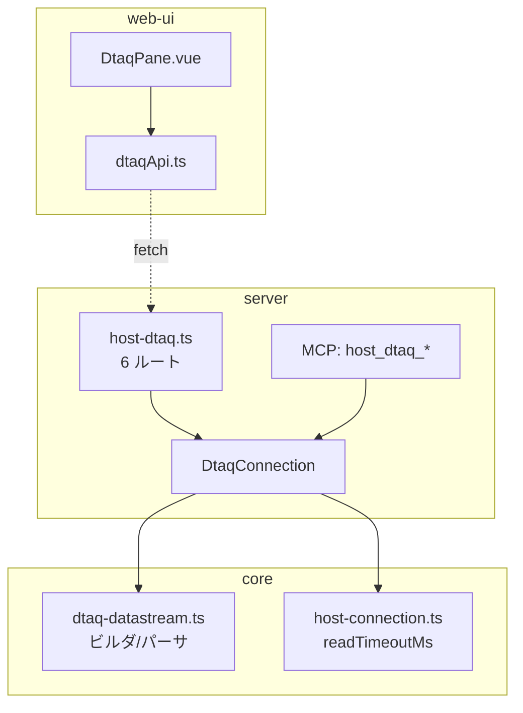
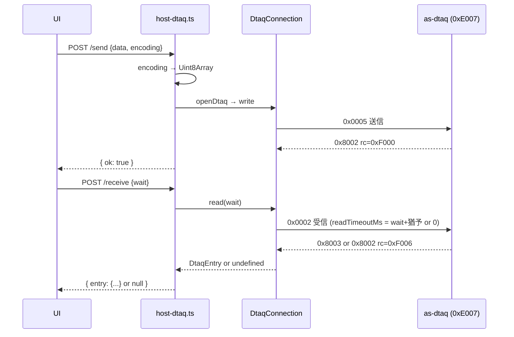

# 設計: データ待ち行列サーバー

## アーキテクチャ概要



研究の spike で core の土台（datastream・connection・port-mapper）は実装済み。
design で固めるのは **(1) transport の read タイムアウト制御**、**(2) UI の一覧方式**、
**(3) 型と層の境界**、**(4) rc → エラーコードの写像**。

## コンポーネント / モジュール

| モジュール | 責務 |
|---|---|
| `transport/host-connection.ts` | `request(frame, {readTimeoutMs})`。1 往復だけタイムアウトを変える |
| `dtaq/dtaq-datastream.ts` | ビルダ/パーサ（純粋関数）。rc → `As400Error` の `dtaqFailure` |
| `dtaq/dtaq-connection.ts` | 接続・送受信・属性。無限待ちで transport にタイムアウト無効を渡す |
| `dtaq/dtaq-types.ts` | `DtaqEntry` / `DtaqAttributes` / `ReadOptions`（純粋な型、browser 共有） |
| `server/host-dtaq.ts` | 6 ルート。encoding 変換・wait 上限 |
| `web-ui/dtaqApi.ts` | API 層。encoding 変換の入口 |
| `web-ui/DtaqPane.vue` | キュー指定・一覧・送受信・ピーク |

## 設計判断

### 判断 1: read タイムアウトは「一時変更して元に戻す」

`socket.setTimeout` は接続全体に効く。1 往復だけ変えるには、request の中で
**開始時に設定 → 応答受信 or reject 時に元へ戻す**。

```ts
request(frame, opts?): Promise<Uint8Array> {
  return new Promise((res, rej) => {
    if (rejectIfUnusable(rej)) return;
    // この往復だけタイムアウトを変える。0 は「無効」
    if (opts?.readTimeoutMs !== undefined) {
      socket.setTimeout(opts.readTimeoutMs); // 0 で無効化
    }
    pending = {
      resolve: (f) => { socket.setTimeout(defaultTimeoutMs); res(f); },
      reject: (e) => { socket.setTimeout(defaultTimeoutMs); rej(e); }
    };
    socket.write(Buffer.from(frame));
  });
}
```

- **`readTimeoutMs: 0` で無限待ち**（Node の `setTimeout(0)` はタイマー無効）
- 応答/失敗のたびに `defaultTimeoutMs`（20 秒）へ戻す。次の要求は従来どおり
- **`opts` 省略時は何もしない** → 既存の全呼び出しは影響を受けない（後方互換）
- 退けた案: request ごとに新しいソケット → 接続コストが重い。
  `Promise.race` でアプリ側タイムアウト → ソケットは生きたままで、次の要求とフレームがずれる

**理由**: 既存の `pending` 機構（resolve/reject で状態を戻す）に、タイムアウトの復元を
1 行足すだけで済む。ソケットの寿命に触らない。

### 判断 2: 受信の wait とタイムアウトの対応

`DtaqConnection.read` が transport に渡す `readTimeoutMs`:

| `wait`（秒） | `readTimeoutMs` |
|---|---|
| `< 0`（無限） | `0`（無効） |
| `>= 0` | `(wait + 猶予) * 1000`。猶予は既定 10 秒 |

猶予を足すのは、ホスト側が `wait` 秒ちょうどで「空」を返すのを、
ソケットが先に切らないため。`wait=0`（即時）でも `10秒` のタイムアウトは付く
（応答は即返るので実害なし、異常時の歯止めになる）。

### 判断 3: UI の一覧は「peek を繰り返さず、SQL サービスを使う」

spec の未確定。自前プロトコルには「全エントリを覗く」操作が無い（peek は 1 件）。

**決定: 一覧は SQL サービス `QSYS2.DATA_QUEUE_ENTRIES` を使う。**
- 自前プロトコルの peek を繰り返す案は退ける — peek は「先頭 1 件」しか見えず、
  2 件目以降を覗く手段が無い（キー付きなら key 検索できるが FIFO/LIFO では不可）
- `DATA_QUEUE_ENTRIES` は全エントリをスナップショットで返せる（research で確認済み）
- **一覧は「観測」、送受信は「自前プロトコル」** と役割を分ける。
  UI の一覧は `host_sql` 経由（既存の SQL ルート）を叩く。DTAQ 専用ルートは送受信・管理のみ

これは「一覧の取得手段が 2 系統（SQL と自前）に分かれる」ことを意味するが、
自前プロトコルに無い機能を無理に作らない方が素直。**decisions に残す。**

### 判断 4: rc → エラーコード（IFS の fileFailure と同じ手）

`dtaq-datastream.ts` に `dtaqFailure(what, rc, messageId?)`:

| 条件 | As400Error |
|---|---|
| rc=0xF001 + CPF9801/CPF2105（オブジェクトなし） | `NOT_FOUND` |
| rc=0xF001 + CPF9802/CPF2189（権限） | `ACCESS_DENIED` |
| rc=0xF001 + CPF9870（既存） | `ALREADY_EXISTS` |
| rc=0xF002/CPF9502（キー不整合） | `CONFIG_ERROR` |
| rc=0xF006（データなし） | — （read で undefined に写す。エラーにしない） |
| その他 | `PROTOCOL_ERROR` |

共通応答 0x8002 のメッセージ（offset22 の LL/CP、CPFxxxx が先頭 7 バイト）を EBCDIC でデコードして
CPF ID を得る。**server の `statusOf` は IFS で追加済みのコード（NOT_FOUND 等）をそのまま使える**
（DTAQ 用の追加は不要）。

## インターフェース / データモデル

### 型（`dtaq-types.ts`、browser 共有）

```ts
export interface DtaqEntry {
  data: Uint8Array;
  senderInfo?: Uint8Array;
}
export interface DtaqAttributes {
  maxEntryLength: number;
  type: "FIFO" | "LIFO" | "KEYED";
  keyLength: number;
  saveSender: boolean;
}
export type SearchOrder = "EQ" | "NE" | "LT" | "LE" | "GT" | "GE";
```

HTTP 応答はこれらを encoding 変換して JSON にする（core の生バイトはそのまま JSON に載せない）。

### 属性取得（spike 未実装、design で確定）

属性応答 0x8001 のレイアウト（原典）: maxEntryLength@22(4B), saveSender@26(0xF1),
type@27 下位4bit(0/1/2), keyLength@28(2B)。
**coding 中に実機で採取して確定**（受信応答と同じく、宣言長から導かない）。

## 処理フロー / シーケンス

### 送信 → 受信（自前プロトコル）



## plan への申し送り

### 分割単位

IFS と同じ 3 層構成だが、**core の土台が research の spike で実装済み**なので IFS より軽い。
分割の候補:

1. **core**: transport の readTimeoutMs / dtaq の正式化（spike 整理・LIFO/キー付き/属性/dtaqFailure）
2. **server**: 6 ルート + MCP ツール
3. **web-ui**: DtaqPane（送受信・ピーク・SQL 経由の一覧）

subtask に割るか単一 tasks.md にするかは plan の split 判定で決める
（IFS より小さいので、割らない選択もありうる）。

### 注意

- research の spike が作業ツリーにある（`dtaq-datastream.ts` / `dtaq-connection.ts` /
  `tools/hostserver-check/src/dtaq.ts` / port-mapper の追加）。**未コミット**。
  core は spike を正式化する作業で、ゼロから書くのではない
- `DtaqConnection.rawRequest` は spike 用の露出。正式実装で削除
- transport 改修は**既存の全ホストサーバーが共有**。`opts` 省略時の後方互換をテストで固定
- 属性取得（0x0001/0x8001）と LIFO・キー付きは spike 未検証。coding 中に実機採取
- UI の一覧は SQL サービス経由（判断 3）
