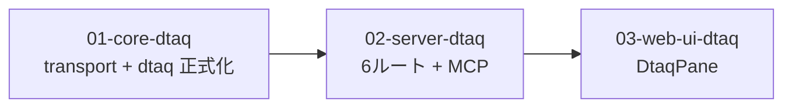

# 計画: データ待ち行列サーバー（メタ plan）

subtask に分割する。本ファイルは割れ目と順序を定義するメタ plan で、
各 subtask の詳細な `tasks.md` はその subtask の plan 工程で作る。

## 分割判定

3 層横断で、各層が**単独で検証可能**（core は spike で実機検証済み、server は curl、
web-ui は E2E）。IFS と同じ 3 分割にする。core が research の spike で大半実装済みなので、
IFS より各 subtask は軽い。

## 割れ目（subslug 境界）

### 01-core-dtaq

**範囲**: transport の `readTimeoutMs`（無限待ち対応・後方互換）、
dtaq の spike を正式化（`rawRequest` 削除、LIFO/キー付き read・write の実装、
属性取得 0x0001/0x8001、`dtaqFailure` で rc → エラーコード）、`dtaq-types.ts`、
実機で LIFO/キー付き/属性を採取して確定。

**単独で検証できる理由**: `tools/hostserver-check` の `dtaq` spike で実機に当てられる。
transport の後方互換はユニットテスト（偽サーバー）で固定。

**この subtask が負う設計上の要点**:
- read タイムアウトは往復ごとに変えて戻す（`opts` 省略で従来どおり）
- 受信応答は固定オフセット（送信者情報 22-57、エントリ 58〜）
- 空は undefined、rc → 区別できるコード

### 02-server-dtaq（依存: 01）

**範囲**: `host-dtaq.ts`（send/receive/create/clear/delete/attributes の 6 ルート）、
MCP ツール、`app.ts` 登録、encoding 変換（utf8/base64/ebcdic）、wait 上限。

**単独で検証できる理由**: `buildApp()` + `app.request()` で入力検証とステータス固定。
実機は curl で 6 ルートを叩き、QSYS2 の SQL サービスと突き合わせる。

### 03-web-ui-dtaq（依存: 02）

**範囲**: `DtaqPane.vue`（キュー指定・送受信・ピーク）、SQL サービス経由の一覧、
パネル登録 4 箇所、`dtaqApi.ts`。

**注意**: 一覧は自前プロトコルではなく `host_sql` で `DATA_QUEUE_ENTRIES` を叩く（design 判断 3）。

## 作業順序と依存関係

1. **01-core-dtaq**（依存: なし）
2. **02-server-dtaq**（依存: 01）
3. **03-web-ui-dtaq**（依存: 02）

## リスク / 留意点

- **research の spike が未コミットで作業ツリーにある**。01 はそれを正式化する
  （transport 改修 / dtaq-datastream / dtaq-connection / port-mapper / tools の dtaq）
- **transport 改修は既存の全ホストサーバーが共有**。後方互換を最優先で守る
- LIFO / キー付き / 属性取得は spike 未検証。01 の coding 中に実機採取
- UI の一覧が SQL 経由になるので、UI は 2 系統（自前=送受信、SQL=観測）を扱う

## テスト方針

| 層 | 実機なし | 実機 |
|---|---|---|
| 01 core | transport の後方互換（偽サーバー）、datastream ビルダの固定、dtaqFailure の写像 | 送受信・LIFO・キー付き・属性・無限待ち・ピーク。SQL サービスと突き合わせ |
| 02 server | 入力検証・ステータス・encoding 変換 | 6 ルートを curl。SQL と一致 |
| 03 web-ui | mount + fetch 差し替え | 実ブラウザで送受信・一覧 |

## 親 work の完了条件

3 subtask が deliver 済みになり、requirement の受け入れ基準が満たされること。
