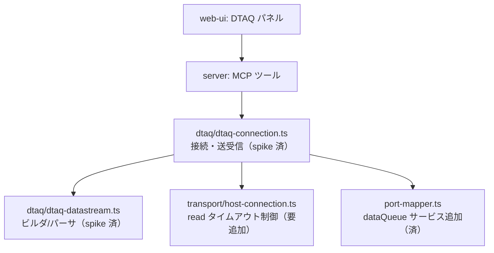

# 調査: データ待ち行列サーバー

requirement.md の未確定事項を、原典（JTOpen）と実機（PUB400）で潰す調査。
**推測で埋めた項目は無い。** 原典で確認したもの、実機で採取したものを分けて書く。

## 調査の問い

- Q1: 受信正常応答 0x8003 のレイアウト（送信者情報とエントリの実オフセット）
- Q2: 無限待ち wait=-1 が自前実装で成立するか（ソケット read タイムアウトとの関係）
- Q3: 空キューの応答
- Q4: エントリデータの文字コード
- Q5: FIFO/LIFO/キー付きの区別
- Q6: 接続手順が既存パターンで通るか

## 調査方法

research 段階で **spike を実装**した（IFS の ifs-list spike と同じ流儀）。
`packages/core/src/hostserver/dtaq/`（datastream ビルダ + 接続クラス）と
`tools/hostserver-check/src/dtaq.ts`（実機採取コマンド `npm run dtaq`）。
**この spike は coding 工程で正式実装に整える**（ゼロから書くのではない）。

原典は JTOpen の `DQ*DataStream` クラス群（`scratchpad/dtaq/` に保存済み）。

---

## F1: 接続は既存パターンで一発で通った（実機で確認）

`DtaqConnection.connect`（`packages/core/src/hostserver/dtaq/dtaq-connection.ts`）:
signon → `resolveServicePort(host, "dataQueue", {tls})` → `startHostServer(conn, 0xE007)` → 交換属性。
**command / ifs と同じ 4 ステップがそのまま動いた。**

- サーバー ID **0xE007**、サービス名 `as-dtaq`（TLS `as-dtaq-s`）を `port-mapper.ts` に追加
- 交換属性（0x0000）に正常応答 0x8000 が返り、以降の要求が通る
- `writeHeader()`（20 バイトヘッダ）はそのまま流用できた

---

## F2: 受信応答 0x8003 のレイアウト（実機の hex で確定）

`MARO1/DTAQSPK`（FIFO, saveSender）に `first` を送って peek した応答 **69 バイト**:

```
     0  00 00 00 45 00 00 e0 07 00 00 00 00 00 00 00 00   ← 全長0x45=69, ServerID 0xe007
    16  00 26 80 03 f0 00 d8 e9 c8 d8 e2 e2 d9 e5 40 40   ← templateLen 0x26, ReqRep 0x8003
    32  d8 e4 e2 c5 d9 40 40 40 40 40 f9 f7 f7 f2 f1 f1
    48  d4 c1 d9 d6 40 40 40 40 40 40 00 00 00 0b 50 01   ← offset58: LL=0x0b, CP=0x5001
    64  66 69 72 73 74                                     ← offset64: "first"
```

自分で数えて確定した配置:

| 位置 | 内容 | 実測での裏付け |
|---|---|---|
| offset 18-19 | ReqRep ID | `80 03` |
| offset 20 | キー指示 | `f0`（非キー） |
| offset 21 | （未使用） | `00` |
| **offset 22-57** | **送信者情報 36 バイト** | `d8 e9 c8 d8...`（QZHQSSRV）が offset 22 から。原典の仮定どおり |
| **offset 58** | **エントリ LL/CP** | `00 00 00 0b`(LL=11) + `50 01`(CP=0x5001) |
| offset 64 | エントリデータ | `first`（5 バイト）。`58 + 11 = 69` でフレーム長ちょうど |

**原典（JTOpen）の仮定（送信者情報 offset22、エントリ offset58）が実機で正しかった。**
IFS のように食い違うことはなかったが、**宣言 templateLength（0x26=38）からは導けない**
（20+38=58 でエントリ開始と一致するのは偶然に近く、送信者情報 36B の固定配置に依存する）。
コードは実測した固定オフセットを使う。

### F2-1: 送信者情報 36 バイトの中身

`QZHQSSRV  QUSER     977211MARO`（EBCDIC）。
- サーバープログラム名 `QZHQSSRV`
- ユーザープロファイル `QUSER`（サーバージョブのユーザー）
- ジョブ番号 `977211`
- （末尾の)ユーザー `MARO`

**構造分解はしない**（requirement の対象外。原典 JTOpen も 36 バイトを文字列化するだけ）。
先頭が 0x40（スペース）なら「送信者情報なし」として扱う。

---

## F3: 無限待ちは成立するが、ソケットタイムアウトを無効化しないと切れる（実機で確認）

**最も設計に効く発見。**

- **成立する**: `wait=-1` で受信を張り、**7.6 秒後に別接続から送られたデータを受信できた**
  （先にタイムアウトで切れなかった）
- **ただし 20 秒で切れる**: 送信を 25 秒後にずらすと、
  **`host server timed out after 20000ms` でソケットが切れた**（`host-connection.ts:103` の
  `socket.setTimeout(20_000)` が発火）

ホストサーバーは待機中に何も送らない（キープアライブ無し）ので、`socket.setTimeout` が先に発火する。

**spec への含意（必須の設計事項）**:
- 受信のときだけ、ソケットの read タイムアウトを**無効化する**か、
  **待機時間 + 余裕に合わせて延長する**必要がある
- `wait=-1`（無限待ち）はソケットタイムアウトを無効化しないと使えない
- transport（`host-connection.ts`）に「この要求は長く待つ」を伝える口が要る。
  IFS の `requestStream` を足したのと同種の、トランスポート層への追加になる

---

## F4: 空キューは undefined として扱えた（実機で確認）

`wait=0` で空のキューを受信 → **共通応答 0x8002 で rc=0xF006（データなし）→ undefined**。
requirement の「空はエラーではなく空として扱う」が成立。
`DtaqConnection.read` は `0x8002 && rc=0xF006` を `undefined` に写す。

---

## F5: FIFO の順序・ピークが実機で正しい（実機で確認）

- **FIFO 順**: `first → second → third` の順に送って、同じ順で取り出せた
- **ピーク**: `peek: true`（data[47]=0xF1）で覗いた後、**3 件とも残っていた**
  （覗いただけで消えていない）

LIFO / キー付きは spec 以降で実装・検証する（今回の spike は FIFO のみ）。
プロトコル上の区別は create の type バイト（0xF0/0xF1/0xF2）と read/write のキー指示
data[40]（0xF0/0xF1）で、原典どおり。

---

## F6: 文字コード（原典 + 実機）

- **名前・ライブラリ・検索タイプ・説明・送信者情報・エラーメッセージは EBCDIC**。
  spike は `codecForCcsid(273)` で変換した（PUB400 の CCSID）。送信者情報が正しくデコードできた
- **エントリ本体は CCSID 宣言なしの生バイト**。spike は UTF-8 の `first` をそのまま送って
  そのまま受け取れた（ASCII 範囲なので化けない）
- **日本語などマルチバイトを送るときは、システム CCSID での変換が要る**かは spec で決める
  （QSYS2 の SEND_DATA_QUEUE_UTF8 / SEND_DATA_QUEUE_BINARY が使い分けを示唆）。
  IFS のテキストと同じ論点で、**エントリは「バイト列」を基本とし、テキスト変換は UI/呼び出し側**に置く方針が素直

---

## 影響範囲



**トランスポートまで波及する**のは IFS と同じ構図（IFS は連鎖応答のため `requestStream`、
DTAQ は無限待ちのため read タイムアウト制御）。

---

## 実現性 / リスク

- **実現可能。プロトコルは実機で往復を確認済み。** IFS より素直
  （名前が固定長 EBCDIC で、ページングやワイルドカードのような複雑さが無い）
- **最大のリスクは無限待ちのタイムアウト制御**（F3）。transport に手を入れる必要があり、
  既存の全ホストサーバーが同じ transport を共有するので後方互換を保つこと
- 受信応答レイアウトは実測で確定済み（F2）。IFS で踏んだ罠は今回は原典が正しかったが、
  **固定オフセットを使う**（宣言長から導かない）方針は同じ

---

## spec への申し送り

- **接続 4 ステップと datastream ビルダは spike で実装済み**。coding で正式な形に整える
  （`rawRequest` は spike 用の露出なので整理する）
- **無限待ちのためトランスポートに read タイムアウト制御の口を足す**（F3。設計の核心）。
  受信要求のときだけタイムアウトを無効化/延長できる形
- **受信応答は固定オフセット**（送信者情報 offset22-57、エントリ offset58〜）。宣言長から導かない（F2）
- **エントリはバイト列を基本に**。テキスト変換（システム CCSID / UTF-8）の方針を決める（F6）
- **送信者情報は分解しない**（36 バイトを EBCDIC 文字列として持つ。F2-1）
- 空は undefined（F4）、ピークは消費しない（F5）、FIFO 順は保たれる（F5）
- LIFO / キー付き / クリア / 属性取得は spike 未検証。coding 中に実機で確かめる
- **実機検証手段**: `npm run dtaq`（spike）と QSYS2 の SQL サービス
  （`DATA_QUEUE_ENTRIES` 等）で自前プロトコルと突き合わせられる。
  PUB400 の MARO1 ライブラリにキューを作れる（確認済み・都度片付ける）
