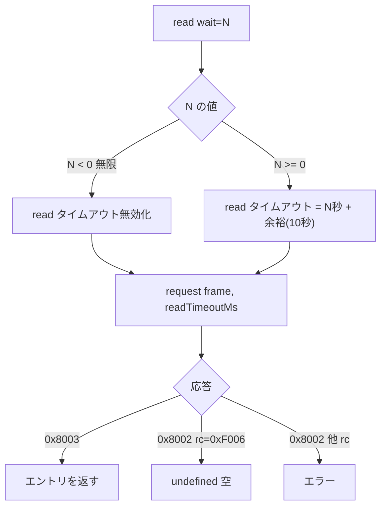

# 仕様: データ待ち行列サーバー

## 概要

IBM i のデータ待ち行列（DTAQ）を core → server → web-ui の 3 層で扱えるようにする。
プロトコルは research 工程で**実機採取して確定済み**（`research.md`）。本仕様は推測を含まない。

土台は research の spike で実装済み（`packages/core/src/hostserver/dtaq/`）。
coding ではそれを正式な形に整え、無限待ちのための transport 改修・LIFO/キー付き・
MCP ツール・Web UI を足す。

## 設計方針

### 接続は既存パターンに乗せる（実装済み）

`DtaqConnection.connect` は command/ifs と同じ 4 ステップ（signon → ポート解決 →
`startHostServer(0xE007)` → 交換属性）。research で一発で通った。

### 無限待ちのため transport に read タイムアウト制御を足す（設計の核心）

research F3 で判明: `wait=-1`（無限待ち）や長い待機は、**ソケットの read タイムアウト
（既定 20 秒）が先に切る**。ホストサーバーは待機中に何も送らない。

`HostConnection.request` に**この 1 往復だけ read タイムアウトを変える口**を足す:

```ts
request(frame: Uint8Array, opts?: { readTimeoutMs?: number }): Promise<Uint8Array>;
```

- `readTimeoutMs: 0`（または未指定の特別値）で**タイムアウト無効**（無限待ち用）
- 受信要求のときだけ、`wait` に応じてタイムアウトを設定する
  - `wait < 0`（無限）→ タイムアウト無効
  - `wait >= 0` → `wait 秒 + 余裕`（例 +10 秒）を read タイムアウトに
- **既存の全呼び出し（signon/SQL/IFS/command）は `opts` 省略で従来どおり 20 秒**。後方互換

これは IFS の `requestStream` と同じ「トランスポートに機能を足す」改修。既存挙動は変えない。

### エントリは「バイト列」を基本にする

research F6。プロトコルはエントリ本体を CCSID 宣言なしの生バイトで扱う。
core は `Uint8Array` を送受信し、**テキスト⇄バイトの変換は呼び出し側（MCP/UI）に置く**。
IFS のテキストと同じ方針（core は生バイト、変換は上の層）。

### 送信者情報は分解しない

research F2-1。36 バイトを EBCDIC 文字列として持つだけ（原典 JTOpen も同じ）。

## 対象範囲

### core

| ファイル | 変更 |
|---|---|
| `transport/host-connection.ts` | `request` に `readTimeoutMs` オプション（**新規改修**） |
| `hostserver/port-mapper.ts` | `dataQueue` サービス（**spike 済**） |
| `hostserver/dtaq/dtaq-datastream.ts` | ビルダ/パーサ（**spike 済**、整理） |
| `hostserver/dtaq/dtaq-connection.ts` | 接続・送受信（**spike 済**、無限待ち対応・`rawRequest` 削除） |

### server

| ファイル | 変更 |
|---|---|
| `host-dtaq.ts` | **新規**。`/api/host/dtaq/*` ルート |
| `host-server-tools.ts` | MCP ツール追加 |
| `app.ts` | ルート登録 |

### web-ui

| ファイル | 変更 |
|---|---|
| `components/DtaqPane.vue` | **新規** |
| `paneLabels.ts` / `WorkspaceNode.vue` / `LauncherPane.vue` | パネル登録（4 箇所） |
| `dtaqApi.ts` | API 層 |

## インターフェース / データ構造

### core: 送受信

```ts
/** 受信の結果。空なら undefined */
interface DtaqEntry {
  data: Uint8Array;         // エントリ本体（生バイト）
  senderInfo?: Uint8Array;  // 送信者情報 36 バイト（save sender 有効時）
}

class DtaqConnection {
  static connect(opts: DtaqConnectOptions): Promise<DtaqConnection>;
  write(name, library, entry: Uint8Array, key?: Uint8Array): Promise<void>;
  read(opts: ReadOptions): Promise<DtaqEntry | undefined>;  // 空は undefined
  create(opts: CreateOptions): Promise<void>;
  clear(name, library, key?): Promise<void>;
  deleteQueue(name, library): Promise<void>;
  attributes(name, library): Promise<DtaqAttributes>;  // 新規（spike 未実装）
  close(): void;
}

interface ReadOptions {
  name: string; library: string;
  wait: number;               // 秒。-1=無限 / 0=待たない / 正=秒数
  peek?: boolean;             // 消費せず覗く
  key?: Uint8Array; search?: SearchOrder;  // キー付き
}

interface DtaqAttributes {
  maxEntryLength: number;
  type: "FIFO" | "LIFO" | "KEYED";
  keyLength: number;
  saveSender: boolean;
}
```

### HTTP API

すべて POST・JSON。`source` は既存の `sourceSchema`。zod は `.strict()`。
認可は既存のホスト API と同じ（`c.get("user")` を `resolveSource()` に渡すのみ）。
接続は単発完結（`try { openDtaq } finally { close }`）。

| ルート | 要求 | 応答 |
|---|---|---|
| `POST /api/host/dtaq/send` | `{ source, library, name, data, encoding, key?, keyEncoding? }` | `{ ok: true }` |
| `POST /api/host/dtaq/receive` | `{ source, library, name, wait, peek?, key?, search?, encoding? }` | `{ entry: {...} \| null }` |
| `POST /api/host/dtaq/create` | `{ source, library, name, maxEntryLength, type, keyLength?, saveSender?, description? }` | `{ ok: true }` |
| `POST /api/host/dtaq/clear` | `{ source, library, name, key? }` | `{ ok: true }` |
| `POST /api/host/dtaq/delete` | `{ source, library, name }` | `{ ok: true }` |
| `POST /api/host/dtaq/attributes` | `{ source, library, name }` | `{ maxEntryLength, type, keyLength, saveSender }` |

- **`data` / `key` は encoding で解釈**（`utf8` / `base64` / `ebcdic`）。
  テキストは utf8、バイナリは base64。EBCDIC のシステムキューには ebcdic
- **受信の応答**: `entry` が `null` なら空（エラーではない）。
  `entry.data` は要求の `encoding` に従って返す。`senderInfo` は EBCDIC をデコードした文字列

### 待機時間の上限

**HTTP ルートの `wait` には上限を設ける**（既定 60 秒、CLI で変更可）。
無限待ち（-1）を HTTP から無制限に許すと、接続が張りっぱなしになる。
UI/MCP からは「最大 N 秒待つ」に制限し、無限待ちは core API のみ。

## 振る舞いの詳細

### 受信の read タイムアウト（research F3）



### 受信応答の解析（research F2 の実測値）

- 送信者情報: **offset 22〜57（36 バイト固定）**。先頭が 0x40 なら情報なし
- エントリ: **offset 58 から** LL(4)/CP(0x5001)/データ。**宣言テンプレート長から導かない**

### キー付き

- create で `type: "KEYED"` と `keyLength`
- write でキーを付ける（CP=0x5002）
- read で `key` と `search`（EQ/NE/LT/LE/GT/GE）。検索タイプは EBCDIC 2 バイト
- clear は特定キーだけのクリアも可

## ドメイン固有の考慮

- **名前・ライブラリ・検索タイプ・説明・送信者情報は EBCDIC**（システム CCSID）。
  PUB400 は 273。variant 文字（@#$）が化ける論点は IFS の CCSID273 と同型
- **最大エントリ長 64512 バイトの歯止め**（プロトコル上限）
- **MSGW（netprint 配下）とは別物**。混同しないこと
- transport 改修は**既存の全ホストサーバーが共有**するので、`opts` 省略時は従来挙動を厳守

## エラー処理 / 異常系

| 状況 | 扱い |
|---|---|
| キューが存在しない（rc=0xF001 + CPF9801/2105） | `NOT_FOUND` → 404 |
| 権限が無い（CPF9802/2189） | `ACCESS_DENIED` → 403 |
| 作成で既存（CPF9870） | `ALREADY_EXISTS` → 409 |
| キー付きでないのにキー指定（rc=0xF002/CPF9502） | `CONFIG_ERROR` → 400 |
| 空／タイムアウト（rc=0xF006） | エラーにせず `entry: null` |
| 上流の通信失敗 | `statusOf` に従い 502 |

core は rc → 区別できる `As400Error` に投げ分ける（IFS の `fileFailure` と同じ手）。

## 受け入れ基準との対応

| requirement の完了条件 | 満たし方 |
|---|---|
| 送信して同じ内容が受信できる | **research で確認済み**（FIFO first→second→third） |
| 応答レイアウトが実測で確定 | **research F2 で完了** |
| ピークで残る | **research F5 で確認済み** |
| キー付きでキー検索 | coding で実装・実機検証 |
| FIFO/LIFO の順序 | FIFO は research 済み、LIFO は coding |
| 無限待ちで後から積まれたデータを受信 | **research F3 で確認**（transport 改修が前提） |
| 空はエラーでなく空 | **research F4 で確認済み** |
| 作成・クリア・削除・属性取得 | coding で実装・実機検証 |
| MCP から送受信 | `host_dtaq_*` ツール |
| Web UI で一覧・送受信 | `DtaqPane.vue` |
| 既存テストが壊れていない | transport 改修は後方互換 |
| SQL サービスと結果が一致 | test 工程で突き合わせ |

## 未確定事項

- **UI の主目的**（requirement の未確定）: デバッグ用の覗き見を主とする。
  「キューを指定 → エントリ一覧（DATA_QUEUE_ENTRIES 相当の表示）→ 送信/受信/ピーク」。
  一覧は自前プロトコルに「全部覗く」操作が無い（peek は 1 件）ため、
  **一覧表示は SQL サービス（`DATA_QUEUE_ENTRIES`）を使うか、peek を繰り返すか**を design で決める
