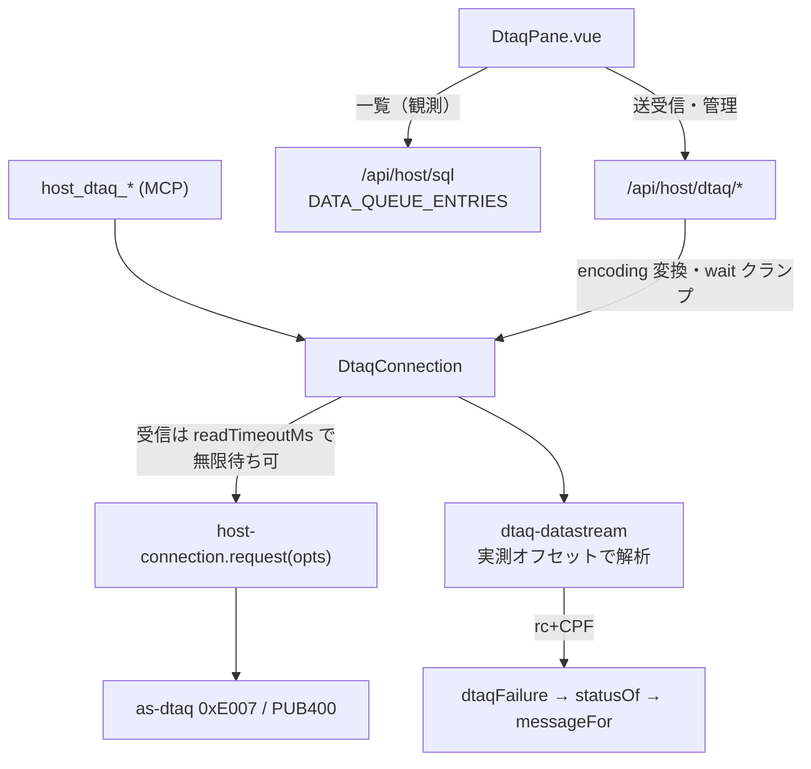

# レビューガイド: データ待ち行列サーバー（DTAQ）

## 変更概要 / 目的

IBM i のデータ待ち行列（DTAQ / QZHQSSRV / as-dtaq, サーバー ID 0xE007）を、
**core → server → web-ui の 3 層**で新規実装する。SSH ではなくホストサーバー直結。
送信・受信（FIFO/LIFO/キー付き・ピーク・無限待ち）・作成・クリア・削除・属性取得を、
HTTP・MCP・Web UI から扱えるようにする。プロトコルは research 工程で**実機採取して確定**済み。

規模: 新規 11 ファイル + 既存 15 ファイル修正、約 1,560 行（実装）。3 モジュール横断。

## 重要ポイント（特に見てほしい所）

### 1. トランスポート改修（**既存の全ホストサーバーが共有**・最重要）
`packages/core/src/transport/host-connection.ts` の `request(frame, opts?)` に `readTimeoutMs` を追加。
無限待ち `wait=-1` のため。**`opts` 省略時は一切ソケットに触らない**＝signon/SQL/IFS/command は従来どおり。
- research F3 で「無限待ちは 20 秒のソケットタイムアウトで切れる」と判明したのが動機。
- `frame-trace.ts` の `traced()` も `opts` を素通しする（落とすとトレース有無で挙動が変わる）。
- 後方互換は偽サーバーのテスト（`test/host-connection-timeout.test.ts`）で固定。

### 2. 応答レイアウトは実機の実測値（宣言長から導かない）
`dtaq-datastream.ts` の `parseReadReply`（送信者情報 offset22-57 / エントリ offset58）・
`parseAttributesReply`（maxLen@22 / saveSender@26 / type@27 nibble / keyLen@28）は
**実機の hex で確定**（research.md F2 / decisions）。IFS で踏んだ「宣言長≠データ開始位置」の轍を踏まない。

### 3. エラーの CPF は「位置非依存の走査」で拾う
`parseCpfId` は 0x8002 フレームを走査して CPF/CPD/CPC/MCH+4桁 を探す（固定オフセットを決め打ちしない）。
エラー応答のレイアウトは実機で採れていなかったための保険だが、**02 の実機 e2e で CPF9801 を実際に拾えた**
（削除済みキュー → 404 NOT_FOUND）。

### 4. エラーコードの 3 層往復
core `dtaqFailure`（NOT_FOUND 等）→ server `statusOf`（404/403/409/400/502）→ web-ui `messageFor`（日本語）。
**`statusOf` は IFS で追加済みのコードで足り、DTAQ 用の追加は不要**。

### 5. 一覧だけ SQL サービス経由（役割分離）
自前プロトコルに「全エントリを覗く」操作が無い（peek は 1 件）ため、**一覧は `/api/host/sql` で
`QSYS2.DATA_QUEUE_ENTRIES`**（design 判断 3）。送受信・管理は自前プロトコル。
- **SQL に library/name を埋めるのでインジェクション対策**: `dtaqApi.ts` の `assertObjectName` で
  埋め込み前に厳格検証（独立レビューで悪用不可を確認）。
- **CCSID の限界**: サーバー SQL デコーダが CCSID 1208(UTF-8) 非対応。一覧 text は EBCDIC 解釈の
  best-effort、真値は HEX 列。UI に注記（IFS の CCSID 決定表未対応と同型）。

### 6. HTTP/MCP の挙動を揃える（review で修正）
- wait 上限は HTTP も MCP も同じ（`--dtaq-max-wait`）。無限待ちは core API のみ。
- base64 は黙って切り詰めず明示的に弾く（`toBytes`）。
- MCP create も KEYED/keyLength 整合を HTTP と同じく弾く。

## 処理フロー

## 主要な変更箇所

- `packages/core/src/transport/host-connection.ts:198` — `request(frame, opts?)` の 1 往復タイムアウト上書き
- `packages/core/src/hostserver/dtaq/dtaq-datastream.ts` — ビルダ/パーサ/`dtaqFailure`/`parseCpfId`
- `packages/core/src/hostserver/dtaq/dtaq-connection.ts:120` — `read` の wait→readTimeoutMs、`attributes`
- `packages/server/src/host-dtaq.ts` — 6 ルート・encoding 変換・wait クランプ・base64 厳格検査
- `packages/server/src/host-server-tools.ts` — MCP 6 ツール（HTTP と同じ検証）
- `packages/web-ui/src/dtaqApi.ts:200` — `listEntries` の SQL 組み立て＋名前検証
- `packages/web-ui/src/components/DtaqPane.vue` — パネル本体
- `scripts/verify-browser-dtaq.mjs` — 実ブラウザ E2E（7 項目）

## リスク / 確認してほしい点

- **トランスポート改修が全ホストサーバー共有**。`opts` 省略時の後方互換が最重要（テストで固定済み）。
- **一覧の CCSID 限界**（UTF-8/バイナリの text 化け）は既知の制約。hex か「受信」で正確に見る運用。
- **E2E は web-ui の vite ビルドが前提**（ルートの `tsc -b` はバンドルを作らない。走らせる前に
  `npm run build -w @as400web/web-ui`）。
- 検証: 全 1716 テスト / lint / tsc・vite build / `aidev verify` / 実ブラウザ E2E 7/7、
  属性は QSYS2.DATA_QUEUE_INFO と独立に一致確認。
