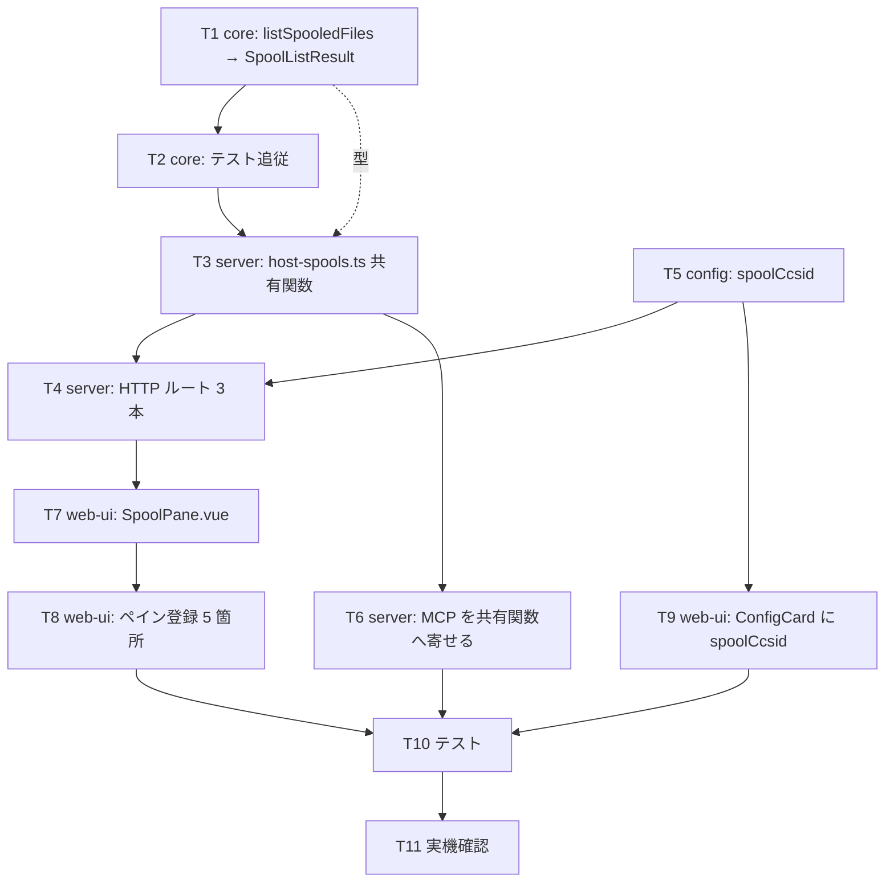

# 計画: pull 型スプール取得の Web UI 対応

## split 判定

**分割しない**（単一 `tasks.md`、1 PR）。

判定の discriminator は「そのピースは単独で検証・デリバリ可能か」:

- **server 層だけをデリバリしても requirement を満たさない**——ブラウザから使えなければ
  「MCP 境界で止まっている」という課題そのものが解消しない。よって低結合ではない。
- 一方、変更は core 3 / server 6 / web-ui 6 ファイル程度で **1 PR に収まる規模**であり、
  subtask に割って工程を 3 周する利得が分割コストを上回らない。
- → **不可分**として単一 tasks.md ＋ コミット構成で漸進性を担保する。

## 実装方針

**下から上へ 1 層ずつ、各層で検証可能な状態を保ちながら積む。**
上の層は下の層が緑になってから着手する（型で受け取る先が確定してから書く）。

**T5（設定）は T4 より前に必要**——ルートが `spoolCcsid` を解決済み `ConnectOptions` から読むため、
先にスキーマと resolver を通しておく。

## 作業順序と依存関係

| # | 作業 | 依存 | 層 |
|---|---|---|---|
| T1 | `listSpooledFiles` の戻りを `SpoolListResult`（`entries` ＋ `total`）に | なし | core |
| T2 | `spool-list.test.ts` を新シグネチャに追従＋`total` のテスト追加 | T1 | core |
| T3 | `host-spools.ts` に共有関数（`listSpools` / `readSpoolPages` ＋定数） | T1 | server |
| T4 | HTTP ルート 3 本＋`app.ts` 登録 | T3, T5 | server |
| T5 | `spoolCcsid` を config スキーマ〜resolver まで通す | なし | server |
| T6 | MCP スプールツールを共有関数へ寄せる（外部仕様は不変） | T3 | server |
| T7 | `SpoolPane.vue` | T4 | web-ui |
| T8 | ペイン登録 5 箇所 | T7 | web-ui |
| T9 | `ConfigCard.vue` にスプール CCSID | T5 | web-ui |
| T10 | テスト（ユニット / コンポーネント / 回帰） | T2,T6,T8,T9 | 全体 |
| T11 | 実機確認（PUB400） | T10 | 全体 |

## リスク / 留意点

### R1: `total` の実機挙動が未検証（最重要）

`LIST_INFO.total`（`spool-list.ts:30`）は**定義済みだが一度も読まれたことがない**。
QGYOLSPL の総件数フィールドが期待どおりの値を返すかは**実機でしか確かめられない**。

- 対応: T1 ではユニットテストで**バイト位置の読み取り**を固め、
  T11 で実機の値と突き合わせる。
- **もし total が使えないと判明したら** `max + 1` 方式（spec 方針 5 の代替案）へ退避する。
  この退避は共有関数 `listSpools` の内部に閉じるため、**HTTP/UI の契約は変えずに済む**。

### R2: 設定の転記漏れ

`spoolCcsid` はスキーマ → `config-routes.ts:73` の whitelist → `config-store.ts` の公開形 →
`config-resolver.ts` → `openNetPrint` と**5 箇所を通る**。
AGENTS.md は「解決を `ConfigResolver` 一箇所に集約」せよと定め、
過去に**転記漏れで `warn` の配線漏れ・`enhanced` の欠落が実際に起きた**と記録している。

- 対応: T5 を独立タスクにし、**端から端まで値が届くテスト**を書く（スキーマ単体では不十分）。

### R3: ペイン登録の漏れ

`paneLabels.ts:5-7` は、**`list:*` の登録漏れでタブを閉じるとセッション切断側に落ちた**過去のバグを記録している。

- 対応: T8 を独立タスクにし、5 箇所を明示的にチェックリスト化する。

### R4: MCP の非退行

T6 は内部を差し替えるだけだが、`host_list_spools` の戻りが `SpoolEntry[]` から
`SpoolListResult` に変わるため**取り出し方を間違えると静かに壊れる**。

- 対応: MCP の出力スキーマ（`{ items, count }`）は変えず、既存テストで確認する。

### R5: `renderSpoolPdf` のフォント依存

既定フォント（`/usr/share/fonts/opentype/noto/NotoSansCJK-Regular.ttc`）が無い環境では
Courier にフォールバックし **DBCS が化ける**。エラーにはならないため気づきにくい。

- 対応: `warn` コールバックを `childLog` に配線し、T11 で実際の PDF を目視確認する。

## テスト方針

AGENTS.md「ビルド・テスト」に従う。

- **ビルド**: `npm run build -w @as400web/web-ui`（`vue-tsc -b && vite build`）。
  `vite build` 単体はテンプレートの型チェックをしないため必ず vue-tsc を通す。
- **web-ui のテスト**: `cd packages/web-ui && npx vitest run`。
  ルートから実行すると vue plugin が効かず `.vue` の解析に失敗する。
- **core / server のテスト**: 各パッケージの既存手順。

検証項目:

| 種別 | 内容 |
|---|---|
| ユニット（core） | `total` のバイト位置読み取り、`returned < total` の応答 |
| ユニット（server） | `truncated` 境界（`total == max` は偽 / `total > max` は真）、上限超過で `CONFIG_ERROR`、CCSID 引き回し |
| 設定（server） | `spoolCcsid` がスキーマ→resolver→`openNetPrint` まで届く（R2） |
| コンポーネント | `SpoolPane` の未選択ガード・エラー表示・`truncated` 表示・改ページ連結 |
| 回帰 | 既存 MCP スプールツール、`PrinterPane`、既存 PDF ルート |
| **実機**（PUB400） | 一覧 → テキスト → PDF。`total` の実値（R1）、PDF の DBCS 目視（R5） |

**実機観点を単体テストで代替しない**（AGENTS.md「実機検証を単体テストの代替にしない」）。
MARO は特殊権限 `*NONE` のため、**自分が所有する OUTQ を作って**検証する
（`20260718-hostserver-msgw` の収穫。`CPF3464` 回避）。
