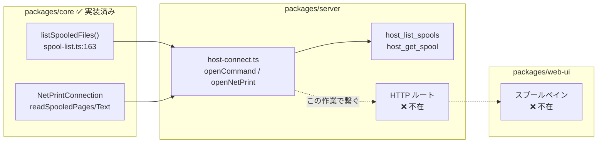

# 要件: pull 型スプール取得の Web UI 対応

## 背景 / 課題

この PJ には**スプール機構が 2 系統**あり、Web UI から使えるのは片方だけになっている。

| | pull 型（既存スプール / OUTQ） | push 型（プリンターセッション） |
|---|---|---|
| バックエンド | ✅ 実装済み | ✅ 実装済み |
| HTTP/WS API | ❌ **なし** | ✅ あり |
| Web UI | ❌ **なし** | ✅ PrinterPane |
| MCP ツール | `host_list_spools` / `host_get_spool` | `list_spools` / `get_spool` / `get_spool_pdf` 他 |

pull 型のバックエンドは `20260718-hostserver-spool` で完成し（`packages/core/src/hostserver/spool/`）、
`host-connect.ts` に接続ファクトリまで通っているが、**MCP ツール境界で止まっている**。
続く `20260719-hostserver-web-ui` で他のホストサーバー機能は Web 化されたものの、スプールは対象外だった。

その結果、ブラウザから使う利用者は**過去に出たスプールを一切参照できない**。
届くのは「開いているプリンターセッションが、開いている間に受信した帳票」だけで、
これはコード自身が区別している通りの制約である（`host-server-tools.ts:352-355`）。

> ホストサーバー経由で**既存の**スプールファイルを任意の出力待ち行列から検索する（pull 型）。
> 5250 の list_spools とは別物——あちらはプリンターセッションで受信済みの帳票（push 型）で、
> セッションを開いておく必要があり過去のスプールは取れない。

backlog はこの機能を「**この PJ の中心用途に直結**」と位置づけ（`.aidev/backlog/hostserver.md:122`）、
pull 型の価値を「**過去のスプールを後から PDF 化する**」と明記している（同 82 行）。
その価値が、今は MCP を叩ける利用者にしか届いていない。

## 目的 / ゴール

ブラウザの利用者が、MCP を経由せずに**既存スプールを検索し、中身を読み、PDF として保存できる**状態にする。

## スコープ

### 対象

- pull 型スプールの**一覧**（任意の OUTQ / ユーザー等で検索）
- 選択したスプールの**テキスト表示**
- 選択したスプールの **PDF ダウンロード**
- 上記を担う HTTP API と、新規の**スプールペイン**
- SCS デコード用 CCSID を接続設定から引くための設定項目追加

### 対象外

- push 型（PrinterPane / プリンターセッション）の変更。**別系統として並存させる**（置き換えない）
- スプールの**操作**（保留 / 解放 / 削除 / 移動）。今回は参照のみ
- MCP ツール側の仕様変更（`host_list_spools` / `host_get_spool` は現状維持）
- スプールの一覧・中身のサーバー側キャッシュ / 永続化

## 機能要件

### 一覧

- 次の条件で絞り込める（`SpoolListFilter` が受け付ける全項目）。いずれも任意指定。
  - `user`（既定は `*CURRENT` = 接続ユーザー）
  - `outputQueue` / `outputQueueLibrary`
  - `status`（`*READY` / `*HELD` 等）
  - `formType` / `userData`
- 一覧には `SpoolEntry` の実用的な項目を表示する
  （ファイル名・ジョブ・ユーザー・OUTQ・状態・ページ数・作成日時・サイズ）。
- 状態は数値コードではなく名前で表示する（`statusName()` が 12 種を変換済み。未知コードも情報を落とさない）。
- 取得件数に上限を設け、上限に達した場合は**その旨を利用者に示す**（黙って切り詰めない）。

### 中身の取得

- 一覧で選んだスプールのテキストを画面上で読める。
- 同じスプールを PDF としてダウンロードできる。
- 見える範囲は**資格情報の権限が決める**（一般ユーザーは自分のスプールのみ）。
  権限で見えない場合は、エラーとして利用者に分かる形で返す。

### CCSID

- SCS デコードの CCSID は**接続設定から引く**（ペインでは都度選ばせない）。
- 既定は 273。日本語環境（930 / 939 / 5035）を設定で選べること。
  ※ 273 決め打ちだと日本語環境で化ける、というのは pull 型バックエンド実装時の実測知見。
- **スプール専用の設定項目を新設する**（research D1 で確定）。
  既存の system/session `ccsid` は**流用しない**——あれは 5250 画面の文字変換用で、
  スプールの SCS とは別の設定であると `host-connect.ts:64-70` が明示している
  （`20260718-hostserver-spool` の決定）。

### UI 配置

- **新規のスプールペイン**として独立させる（`PANE_PREFIXES` に追加）。
- 既存の list ペイン（jobs/objects/users）には**寄せない**。
  理由: pull 型は「一覧 → 選択 → 中身取得」の 2 段構造で、一覧を返すだけの list ペインの想定に収まらない。
- PrinterPane にも**統合しない**。
  理由: push 型と pull 型は接続要件も取得経路も別物で、同居させると利用者に「同じもの」と誤解させる。

## 非機能要件 / 制約

- **接続種別が一覧と取得で異なる**。一覧は**コマンドサーバー**（`openCommand`）、
  中身取得は**ネットワークプリントサーバー**（`openNetPrint`）を使う。
  API 設計はこの非対称を吸収する必要がある（`host-server-tools.ts:374` / `:408`）。
- 既存の pull 型バックエンド（`packages/core/src/hostserver/spool/`）は**変更しない**前提で載せる。
  変更が必要と判明した場合は、その理由を spec で明示する。
- 既存の MCP ツールと**同じ core 実装を共有**し、ロジックを二重化しない。
- 認証は既存のホストサーバー系ルートの流儀に合わせる（`/api/` 接頭辞で自動的に保護されるため個別配線は不要）。
  認可は追加しない——可視範囲は IBM i のオブジェクト権限が決める（既存ルートと同じ方針）。
- **監査は行わない**（research D2 で確定）。
  ※ 当初「`withAudit` 相当の記録を欠かさない」と書いたが**事実誤認**だった。
  `withAudit` の呼び出し元は MCP ツールと WS ハンドラのみで、
  既存の HTTP ルート（`host-lists` / `host-sql` / `host-upload`）は**いずれも監査していない**。
  「既存の流儀に合わせる」と「監査を欠かさない」は両立しないため、前者を採る。
  HTTP ルート全体への監査導入は、今回のスコープを超える別課題とする。

## 完了条件 (受け入れ基準)

- [ ] ブラウザからスプールペインを開き、OUTQ を指定して既存スプールの一覧が表示される
- [ ] `user` / `outputQueue` / `outputQueueLibrary` / `status` / `formType` / `userData` の各条件で絞り込める
- [ ] 一覧の状態欄が数値コードでなく名前（READY / HELD 等）で表示される
- [ ] 一覧から選んだスプールのテキストが画面上で読める
- [ ] 同じスプールを PDF としてダウンロードでき、開いて内容が読める
- [ ] CCSID が接続設定から引かれ、日本語環境の設定で文字化けしない
- [ ] 取得件数が上限に達した場合、その事実が画面に示される
- [ ] 権限不足で見えないスプールに対し、原因の分かるエラーが表示される
- [ ] 既存の PrinterPane（push 型）の挙動が変わっていない
- [ ] 既存の MCP ツール `host_list_spools` / `host_get_spool` の挙動が変わっていない

## 未確定事項 / 確認したいこと

いずれも **research で実物を確かめて解消する**（推測で spec を書かない）。

- **PDF 生成を再利用できるか**。`packages/server/src/pdf.ts:26` の `renderSpoolPdf()` は
  push 型のプリンターセッションが組み立てたページ構造を前提にしている。
  pull 型の `readSpooledPages()` の返す形（`{rows, cols, lines}[]`）がそのまま渡せるのか、
  変換が要るのか、別実装が要るのかは**未検証**。ここが実装量を最も大きく左右する。
- **API の形**。一覧（コマンドサーバー）と取得（ネットワークプリントサーバー）で接続種別が違うため、
  1 ルートにまとめるか分けるか。既存 `host-lists.ts` / `app.ts:115` のどちらの流儀に寄せるのが自然か。
- **接続設定に CCSID を足す位置**。`ConfigCard.vue` の既存のプリンター系設定
  （auto PDF dir / auto print）との関係。push 型の CCSID 設定が既にあるなら共用するのか別立てか。
- **上限件数の既定値**。MCP 側は `max: 100` 既定・`MAX_LIMIT` 上限。Web でも同じでよいか。
- **実機での確認可否**。PUB400 の MARO ユーザーは特殊権限 `*NONE` で、
  過去に OUTQ 権限（`CPF3464`）で詰まった実績がある。自分所有の OUTQ なら回避できることは確認済み。
  受け入れ基準のうちどこまでを実機で検証できるかを見極める必要がある。
