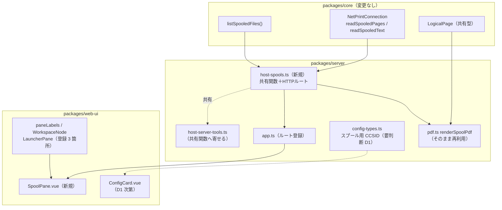

# 調査: pull 型スプール取得の Web UI 対応

requirement.md の「未確定事項」を潰すための事前調査。**事実（F）と推測を明確に分ける**。

## 調査の問い

- Q1: `renderSpoolPdf()` は pull 型の `readSpooledPages()` の返す形をそのまま受けられるか
- Q2: 一覧＝コマンドサーバー / 取得＝ネットワークプリントサーバーの非対称を、HTTP API でどう切るか
- Q3: CCSID を「接続設定から引く」は実現できるか。既存の設定項目を共用できるか
- Q4: 上限件数の既定値は何に揃えるべきか
- Q5: 認証・監査の既存の流儀は何か
- Q6: PUB400 の MARO で受け入れ基準のどこまで実機検証できるか

---

## 判明した事実

### F1: PDF は変換不要でそのまま渡せる（Q1）✅ 最大のリスクが消えた

**同じ型**である。しかも偶然ではなく設計意図。

- `readSpooledPages(id, opts): Promise<LogicalPage[]>` — `packages/core/src/hostserver/spool/netprint-connection.ts:249`
- `renderSpoolPdf(pages: LogicalPage[], opts, warn): Promise<Buffer>` — `packages/server/src/pdf.ts:26`
- `LogicalPage { rows, cols, lines }` は両者が共有する単一定義 — `packages/core/src/protocol/scs.ts:15`

`netprint-connection.ts:243-245` のコメントが意図を明言している:

> **push 型（`PrinterSession`）と同じ `ScsDecoder` を使う**——同じ SCS を同じ規則で解釈するため、
> 経路が違っても結果が揃う。

**帰結**: PDF 生成は既存関数の再利用のみ。変換層も別実装も不要。
requirement で「実装量を最も左右する」と置いたリスクは**消滅**した。

### F2: HTTP ルートの確立された型（Q2）

`packages/server/src/host-lists.ts` が参照実装。全ホストサーバー系ルートが同型:

- **形**: `POST /api/host/<機能>`、`registerXxxRoutes(app, deps)` で登録（`app.ts:105`）
- **検証**: zod `.strict()` + `safeParse` → 失敗は 400（`host-lists.ts:105-108`）
- **資格情報は body に載せない**。`source: { system?, session? }`（`host-api.ts:20-28`）を
  `resolveSource(deps.resolver, body.source, c.get("user"))` で解決し、**サーバー側に留める**（`host-lists.ts:110-114`）
- **接続**: `let conn` を try の外で宣言 → `finally { conn?.close(); }`。プール無し・リクエストごとに開閉
- **エラー**: `statusOf(err)` で HTTP 化（`host-api.ts:39-55`）。FORBIDDEN→403 / SESSION_NOT_FOUND→404 /
  CONFIG_ERROR・CONNECT_FAILED→400 / 既定 502

`host-connect.ts:7-9` が単発利用を義務づけている（「呼び出し側は必ず `try { … } finally { conn.close() }` の形にする」）。
`host-sql.ts` の `DbPool` だけが文書化された例外。

**`openNetPrint` を呼ぶ HTTP ルートは現在ゼロ**（`host-server-tools.ts:407` の MCP のみ）。今回が最初になる。

### F3: HTTP と MCP の実装を共有する先例がある（Q2）

`host-upload.ts` が最も近い先例。`uploadRows()` / `uploadCsv()` を**唯一の実行経路**として export し
（`:87-92`）、HTTP ルート（`:182-211`）は薄いアダプタ、MCP も同じ関数を呼ぶ。

重要な副次事実: **上限は zod だけでなく共有関数側でも検査**している（`:56` と `:96-98` の二重）。
理由は明記されており、**MCP 経路は zod スキーマを通らないため**。
requirement の「ロジックを二重化しない」はこの型で満たせる。

### F4: 打ち切りの通知は host-sql の流儀に倣うべき（Q4）

**既存で割れている**:

| | 上限 | 既定 | 打ち切り通知 |
|---|---|---|---|
| `host-lists.ts`（HTTP） | `.max(1000)` 直書き（`:43`） | **200**（`:116`、3 種とも） | ❌ **無し**。`{ items }` のみ（`:122`） |
| `host-sql.ts`（HTTP） | `MAX_ROWS = 1000`（`:52`） | `DEFAULT_ROWS = 200` | ✅ `truncated` / `rowCount`（`:215-219`） |
| `host_list_spools`（MCP） | `MAX_LIMIT = 1000`（`host-server-tools.ts:36`） | **100**（`:376`） | △ `count` のみ（`:381`） |

requirement の受け入れ基準「上限に達した事実が画面に示される」を満たすには
**`host-lists.ts` ではなく `host-sql.ts` の流儀**（`truncated` を返す）に倣う必要がある。

※ 既定値が MCP（100）と HTTP list（200）で既に食い違っている（`jobs` で顕在）。今回は揃える判断が要る。

### F5: 認証は自動、監査は HTTP 側に存在しない（Q5）⚠ requirement の記述が誤り

- **認証**: `auth.ts:270-282` のミドルウェアが `app.use("*")`（`app.ts:48-51`）で前置され、
  `/api/` 接頭辞を持つものは自動で保護される。**新ルートに個別配線は不要**。
- **認可**: ホストサーバー系ルートは**追加制限を一切かけない**。可視範囲は IBM i のオブジェクト権限が決める
  （`host-lists.ts:4-6` / `host-upload.ts:8-10` に明記）。
- **監査**: `withAudit`（`audit.ts:66-87`）の呼び出し元は **MCP ツールと WS ハンドラのみ**。
  `host-lists.ts` / `host-sql.ts` / `host-upload.ts` は**いずれも監査していない**（`childLog` のみ）。

> ⚠ **requirement.md の「認証・監査は既存のホストサーバー系ルートの流儀に合わせる（`withAudit` 相当の記録を欠かさない）」は
> 事実に反する**。既存 HTTP ルートに監査は無い。「流儀に合わせる」と「監査を欠かさない」は両立しない。
> spec でどちらを採るかを決める必要がある（新しい慣習を作るか、既存に倣って監査しないか）。

### F6: CCSID の設定項目は既にあるが、**流用は過去に明示的に否定されている**（Q3）⚠ 要判断

**設定項目は存在する**。system と session の両方に `ccsid` があり、session が system を上書きする:

- `config-types.ts:50`（system）/ `:69`（session）
- 解決: `config-resolver.ts:125-127` → `opts.ccsid`
- UI: `ConfigCard.vue:337-342`（既定 CCSID）/ `:377-383`（CCSID、「システムの既定」選択肢つき）
- 選択肢: `hostCodePages.ts:24-31`（37 / 273 / 930 / 939 / 1399 / 5026 / 5035）、`DEFAULT_CCSID = 37`

**しかしこの ccsid をスプールに流用することは、前作業で明示的に否定されている**。
`host-connect.ts:64-70` の原文:

> `ccsid` は SCS のデコードに使う（既定 273）。5250 側の `ccsid` を既定に流用**しない**——
> 5250 の CCSID は画面の文字変換用で、スプールの SCS とは別の設定である
> （`20260718-hostserver-spool` で「経路によって扱いが違う」と指摘され、明示指定できるようにした経緯）。

この分離は**コードでも強制されている**。`openNetPrint(opts, ccsid?)` は第2引数だけを見ており、
`hostAuthFrom(opts)` が拾うのは host / user / password / tls のみ＝`opts.ccsid` は netprint に届かない。

補足事実:
- `PrinterConfig`（`config-types.ts:19-26`: `autoPdfDir` / `autoPrint` / `pdfFontPath` / `pdfFontName` /
  `pageSize` / `fontSize`）に **ccsid は無い**。
- 現状 pull 型の ccsid は **MCP の都度指定のみ**（`host-server-tools.ts:397`）。
  **スプール専用の永続設定は存在しない**。
- 既定値も食い違う: web-ui `DEFAULT_CCSID = 37` に対し `openNetPrint` の既定は **273**。

> ⚠ **requirement の「CCSID は接続設定から引く」は、そのままでは前作業の決定と衝突する。**
> 既存の system/session `ccsid` は 5250 画面用であり、流用は否定済み。
> 「設定から引く」を活かすなら**スプール専用の設定項目を新設**する必要がある（後述の申し送り D1）。

### F7: スプールペインの追加には 5 箇所の登録が要る（Q2/UI）

`paneLabels.ts:11` の `PANE_PREFIXES` は単一レジストリで、コメントに「新しい種類を足すときはここに追加する」とある。
ヘッダコメント（`:5-7`）は、**`list:*` の登録漏れでタブを閉じるとセッション切断側に落ちた過去のバグ**を記録している。

追加が必要な箇所:

1. `paneLabels.ts:11`（`PANE_PREFIXES` に `"spool:"`）＋ `:19-28`（`PANE_LABELS` にラベル）
2. `WorkspaceNode.vue:84-85`（`activeIsSpool` computed）＋ `:113-128`（`v-else-if` 分岐）＋ import
3. `LauncherPane.vue:39-49`（`FEATURES` 配列）— **ユーザーが開く唯一の入り口**
4. `PaneTabs.vue:21`（ラベル導出。`PANE_LABELS` 経由で自動）
5. `App.vue:53`（`isPaneTab` によるセッション扱いの除外。自動）

**コマンドパレットもメニューバーも存在しない**。ペインを開く手段はランチャーのみ
（`LauncherPane.vue:84-95` `openFeature`）。既定の `scoped = true` で `systemsStore.selected` に紐づく＝
pull 型スプール一覧が欲しい挙動そのもの。

### F8: 参照実装は 2 つあり、新しいのは SqlPane（Q2/UI）

`HostListPane.vue`（284 行）が骨格の基準:

- `defineProps<{ tabId: string }>()`、種別は `tabId.replace(/^list:/, "")` で導出（`:15`）
- 状態は `rows` / `useDelayedLoading()` / `error` の三点セット（`:40-42`）
- 接続は自分で選ばず `{ system: systemsStore.selected }`（`:61-63`）、未選択なら
  `"システムを選んでください"`（`:66-69`）
- エラー表記は `data.error ?? "取得に失敗しました"`（`:88-92`）
- システム切替時は**行を捨てるが自動再取得しない**（`:138-152` に理由コメントあり）

`SqlPane.vue`（692 行）が導入したより新しい慣習:

- **列幅**: `useColumnWidths()`（`:342-348`）＋グリップ（`:466-476`）＋ダブルクリックでリセット
- **テーブル**: `width: auto; table-layout: auto` ＋ `max-width: 40ch` の省略（`:590-596`）。
  HostListPane の `width: 100%` とは**異なる**
- **2 軸 sticky**: ヘッダ（`:610`）に加え行番号列も sticky（`:637-649`）、交点は `z-index: 2`（`:651`）
- **ページング**: `resultSetId` / `hasMore` / `loadMore()`（`:225-267`）、スクロール近接と End/PageDown で発火
- **明示的な解放**: `DELETE /api/host/sql/:id` を再実行前と `onUnmounted` で（`:139-147`）

**新規ペインは SqlPane 側の慣習（列幅・sticky）に倣うのが自然**（直近作業 `20260720-pane-maximize-sticky-headers` /
`20260720-sql-extended-format` の到達点であるため）。

### F9: PDF ダウンロードの既存パターンは流用できるが、**既存ルートは pull 型を返せない**（Q2）

クライアント側（`PrinterPane.vue:147-160`）は fetch → blob → `createObjectURL` → 合成 `<a>` → revoke。
CSV 側（`SqlPane.vue:376-388` / `csv.ts`）も同型。**このパターンはそのまま使える**。

サーバー側 `GET /api/spool/:sessionId/:spoolId/pdf`（`app.ts:115-133`）は流用**できない**:

- **セッション内メモリの `entry.reports` を引く**実装で、pull 型のスプール id を解決できない
- `/api/host/` ではなく `/api/spool/` 配下、`app.ts` に直書き（register 関数ではない）
- `assertOwner(entry.owner, ...)` によるセッション所有者チェック（`:119`）— pull 型には所有者の概念が違う
- エラー写像が独自（FORBIDDEN→403、他はすべて 404）で `statusOf` を使っていない

なお既存実装の細部に 2 つの粗さがある（新ルートでは繰り返さない方がよい）:
- `Content-Disposition` の `filename` に `spoolId` をエスケープ無しで埋めている（`:126`）
- クライアントが `!res.ok` で**黙って return** し、失敗が利用者に見えない（`PrinterPane.vue:149`）

### F10: 実機検証の見通し（Q6）— **未確認のまま**

**確定している事実**（過去作業からの持ち越し。今回の調査で新たに実機に当ててはいない）:

- PUB400 の MARO は特殊権限 `*NONE`（`*JOBCTL` / `*SPLCTL` なし）
- `QUSRSYS/PRT_MARO` は QTCP 所有・`AUTCHK(*OWNER)` で、過去に `CPF3464` で詰まった
- **自分が所有する OUTQ を作れば `CPF3464` は回避できる**（`20260718-hostserver-msgw` の収穫）
- ただし writer が常駐せずスプールは `READY` のまま
- PUB400 の既定 CCSID は 273

**未確認**: 上記の条件下で、受け入れ基準のうち「一覧」「テキスト取得」「PDF 生成」が
実際に通るかは**確かめていない**。pull 型バックエンド自体は `20260718-hostserver-spool` で完成しているので
通る見込みは高いが、**見込みであって検証ではない**。

---

## 影響範囲

**変更しないもの**: `packages/core/src/hostserver/spool/`（requirement の前提どおり手を入れる必要が無いことを確認）、
`PrinterPane.vue` と push 型の経路、既存 MCP ツールの外部仕様。

## 実現性 / リスク

| 項目 | 判定 | 根拠 |
|---|---|---|
| PDF 生成の再利用 | ✅ **変換不要** | F1（同一型・設計意図） |
| 一覧 API | ✅ 既存型に素直に載る | F2（`host-lists.ts` と同型） |
| 取得 API（netprint） | ⚠ **前例なし** | F2（HTTP から `openNetPrint` を呼ぶのは初） |
| HTTP/MCP のロジック共有 | ✅ 先例あり | F3（`host-upload.ts`） |
| 打ち切り通知 | ✅ 先例あり | F4（`host-sql.ts` の `truncated`） |
| ペイン追加 | ✅ 手順が確立 | F7（5 箇所。登録漏れは既知のバグ源） |
| CCSID を設定から引く | ⚠ **要設計判断** | F6（既存 ccsid の流用は否定済み） |
| 監査 | ⚠ **要方針決定** | F5（HTTP 側に前例が無い） |
| 実機検証 | ⚠ **未確認** | F10 |

**最大の残リスクは CCSID（F6）と監査方針（F5）**。いずれも技術的困難ではなく、
**過去の決定・既存慣習との整合をどう取るかという判断**であり、spec で明示的に決める必要がある。

## spec への申し送り

### D1: CCSID をどこから引くか ✅ **D1-a に決定**（2026-07-20）

**スプール専用の設定項目を新設する。** requirement.md の非機能要件を修正済み。
既存 `ccsid` は流用しない（前作業の分離原則を守る）。
波及先: `config-types.ts`（system への項目追加）/ `config-routes.ts:73` の whitelist /
`config-store.ts` の公開形 / `ConfigCard.vue` / `config-resolver.ts` / `openNetPrint` への受け渡し。
選択肢 UI は既存の `hostCodePages.ts` を再利用できる（ただし既定値は 37 ではなく **273** に揃えること）。

検討した案

requirement は「接続設定から引く」と決めたが、既存の system/session `ccsid` は 5250 画面用で
**流用は前作業で明示的に否定されている**（F6）。取り得る案:

- **D1-a（推奨）**: スプール専用の設定項目を新設する（例: system に `spoolCcsid`）。
  requirement の意図（都度選ばせない）を満たしつつ、前作業の分離原則も守る。
  代償は config スキーマ・`ConfigCard.vue`・resolver への波及。
- **D1-b**: 既存 `ccsid` を流用する。実装は最小だが `host-connect.ts:64-70` の決定を覆すことになるため、
  **覆す理由を spec に書く必要がある**（書けないなら採らない）。
- **D1-c**: 都度指定に戻す。requirement のユーザー判断に反するため、選ぶなら要再確認。

### D2: 監査するか ✅ **監査しない**に決定（2026-07-20）

既存 HTTP ルート（`host-lists` / `host-sql` / `host-upload`）に倣い、監査は入れない。
一貫性を保ち、今回のスコープを膨らませないため。
**HTTP ルート全体への監査導入は別課題として切り出す**（backlog 候補）。
requirement.md の該当記述（両立不能だった）は修正済み。

### D3: API の切り方

接続種別の非対称（F2）から、素直な形は 2 ルート:

- `POST /api/host/spools`（一覧、`openCommand`）— `host-lists.ts` と同型
- 中身取得（`openNetPrint`）— テキストは JSON、PDF はバイナリ。
  既存 `/api/spool/:sessionId/:spoolId/pdf` は**流用不可**（F9）。`/api/host/` 配下に新設する。
  スプール id は 5 要素の複合キー（`SpoolId`: jobName/jobUser/jobNumber/fileName/fileNumber）なので
  **パスパラメータではなく POST body で渡すのが自然**。
  ただし PDF ダウンロードを `<a>` クリックで行う既存パターン（F9）は GET 前提なので、
  **POST + blob** で実装するか別の手当てが要る（`PrinterPane.vue` の fetch→blob は POST でも成立する）。

### D4: 上限件数

`host-sql.ts` に倣い**名前付き定数＋ `truncated` 返却**（F4）。既定値は MCP の 100 と HTTP list の 200 が
食い違っているため、どちらかに揃える判断が要る（推奨: スプールは 1 件が重いので **100**）。

### D5: 実装配置

`host-upload.ts` の型（F3）に倣い、`packages/server/src/host-spools.ts` に共有関数を置き、
HTTP ルートと MCP ツールの双方から呼ぶ。**上限検査は共有関数側にも置く**（MCP は zod を通らないため）。

### D6: ペイン実装の基準

骨格は `HostListPane.vue`、表の作りは `SqlPane.vue`（列幅・2 軸 sticky）に倣う（F8）。
登録は 5 箇所すべて（F7。漏れは既知のバグ源）。
`!res.ok` の握り潰し（F9）は**繰り返さない**。

### D7: 実機検証の計画

F10 のとおり未確認。test 工程で、MARO 所有の OUTQ にスプールを作って
一覧 → テキスト → PDF を通す手順を組む。CCSID は PUB400 が 273 のため既定で足りる見込み。
**「見込み」であって検証ではない点を test まで持ち越さないこと。**
