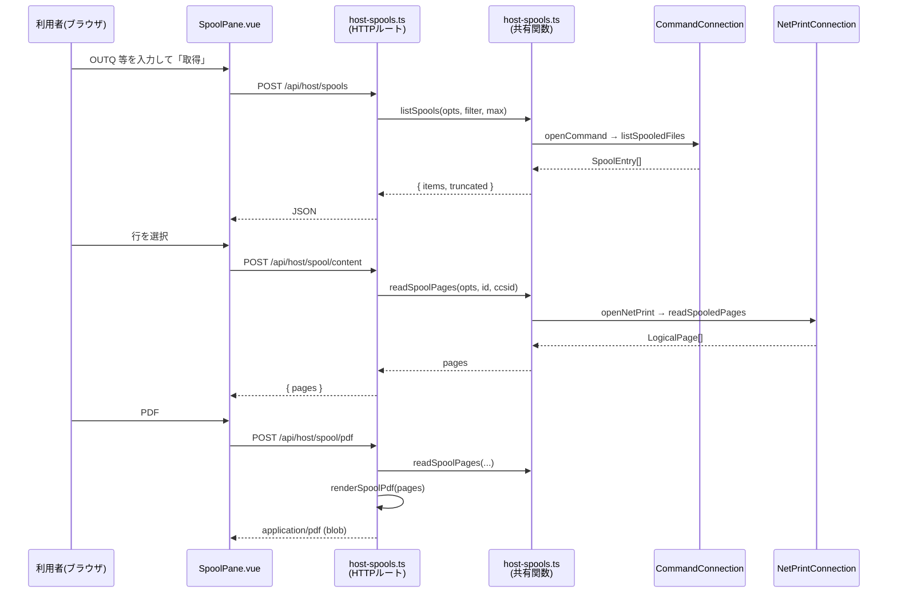

# 仕様: pull 型スプール取得の Web UI 対応

## 概要

完成済みの pull 型バックエンド（`packages/core/src/hostserver/spool/`）を、
**共有関数 → HTTP ルート → 新規スプールペイン**の 3 層で Web UI に接続する。
core には手を入れない。PDF 生成は既存の `renderSpoolPdf()` をそのまま再利用する（research F1）。



## 設計方針

### 方針 1: 共有関数を単一の実行経路にする（research D5）

`host-upload.ts` の先例（`uploadRows()` / `uploadCsv()` が HTTP と MCP の唯一の経路）に倣い、
`packages/server/src/host-spools.ts` に共有関数を置き、HTTP ルートと MCP ツールの双方から呼ぶ。

**上限検査は zod だけでなく共有関数側にも置く。** `host-upload.ts:96-98` が同じ二重化をしており、
理由も明記されている——**MCP 経路は zod スキーマを通らないため**。

### 方針 2: CCSID はシステム階層に新設する（research D1 ＋ AGENTS.md）

AGENTS.md「アカウント・権限設計 §2」の階層規約:

> **システム** = どこへ・誰として（`host` / `port` / `tls` / `ccsid` 既定 / `signon`）
> **セッション設定** = どう使うか（`system` / `sessionType` / `deviceName` / `screenSize` / `ccsid` 上書き / `enhanced` / `printer`）

pull 型スプールは**セッションに紐づかない**（ペインは `systemsStore.selected` にバインドし、
プリンターセッションを開かない）。よって**システム階層**が正しい置き場である。
→ `systemSchema` に `spoolCcsid` を追加する。

**既存の `ccsid` は流用しない。** `host-connect.ts:64-70` が
「5250 の CCSID は画面の文字変換用で、スプールの SCS とは別の設定」と明記しており、
`20260718-hostserver-spool` の決定である。この分離は `hostAuthFrom()` が
host/user/password/tls しか拾わないことで**コードでも強制**されている。

**AGENTS.md §6 追加時チェックリストの適用**:

| 項目 | 判定 |
|---|---|
| 信頼設定か（パス書込・コマンド実行・秘密に触るか） | **いいえ**。コードページ番号のみ。よって `printer` のような「サーバー設定限定」にはしない |
| 受理と露出の両方でスコープを絞ったか | 信頼設定でないため追加ゲート不要。ただし `config-routes.ts:73` の whitelist と `config-store.ts` の公開形への**転記漏れがないこと**を要確認 |
| 認証オフ / admin / 一般ユーザーの 3 パターン | ルート自体は既存ホストサーバー系と同じ「接続を持つ者は誰でも可」。可視範囲は IBM i の権限が決める |
| UI は環境に応じて概念を隠すか | `spoolCcsid` は信頼設定でないため常時露出でよい |

`systemSchema` は profiles.json / connections.json の**両方が共有する単一スキーマ**なので、
1 箇所の追加で両保存先に効く（信頼境界の分割は不要）。

### 方針 3: 監査しない（research D2）

既存 HTTP ルート（`host-lists` / `host-sql` / `host-upload`）はいずれも監査していない。
一貫性のため倣う。HTTP ルート全体への監査導入は別課題（backlog へ）。

### 方針 4: API は用途ごとに 3 ルートに分ける（research D3 を解決）

`SpoolId` は 5 要素の複合キー（`jobName` / `jobUser` / `jobNumber` / `fileName` / `fileNumber`）で
パスに載せるのは無理があるため、**すべて POST + body** とする。

一覧・本文・PDF で**応答の型が根本的に異なる**（JSON / JSON / バイナリ）ため、
`host-lists.ts` の `:kind` whitelist 方式ではなく**独立したパス**にする。
`:format` で分岐させると 1 ハンドラ内で `c.json` と生 `Response` を出し分けることになり、
エラー写像も二重になる。

**既存の `GET /api/spool/:sessionId/:spoolId/pdf` は流用しない**（research F9）——
セッション内メモリの `entry.reports` を引く実装で pull 型 id を解決できない。
新ルートは `/api/host/` 配下に置き、既存ルートには触れない。

### 方針 5: 打ち切りは `max + 1` 方式で判定する（core は無改修）

> ⚠ **当初の方針は実機で否定され、差し替えた**（test ラウンド1 → decisions.md D4）。
> 経緯を残すのは、次に同じ推測をしないため。

#### 当初の案（採用しない）

QGYOLSPL のリスト情報の先頭 4 バイト（`spool-list.ts:30` の `LIST_INFO.total`）を
「条件に一致した総件数」とみなし、`1234 件中 100 件を表示` と出す設計にしていた。
定数は定義済みで未使用だったため「想定内の拡張」と判断した。

**この判断は誤りだった。** 実機（PUB400・スプール 3 件）で計測した結果:

| 要求 `max` | `returned` | `total` |
|---|---|---|
| 1 | 1 | **1** |
| 2 | 2 | **2** |
| 3 | 3 | 3 |

`total` は常に `returned` と同値で、一致総数ではない。オープンリスト API は非同期に構築するため、
要求分しか作られていない時点では総数が確定しないと思われる。
**定数が定義されていることは、その値が期待どおりであることを何ら保証しない。**

#### 採用する方式

`host-sql.ts:219` の流儀に倣い、**`max + 1` 件を要求して超過を見る**。

```ts
const entries = await listSpooledFiles(conn, filter, { max: max + 1 });
const truncated = entries.length > max;
return { items: truncated ? entries.slice(0, max) : entries, truncated };
```

- **core は無改修**（requirement の前提どおりに戻った）。`listSpooledFiles` は `SpoolEntry[]` のまま
- 代償: **総件数を出せない**。UI は「1234 件中」ではなく「**先頭 N 件のみ表示しています**」と断る
- `LIST_INFO` には**この値を打ち切り判定に使ってはいけない理由**をコメントで残す
  （偽陰性＝「全件見た」と誤解させる害があるため）

QGYGTLE でハンドルを使った継続取得なら総数が確定する可能性はあるが、
原典（JTOpen）の確認からやり直しになりスコープを超えるため見送る（backlog 候補）。

## 対象範囲

### 追加

| ファイル | 内容 |
|---|---|
| `packages/server/src/host-spools.ts` | 共有関数 ＋ HTTP ルート登録（新規） |
| `packages/web-ui/src/components/SpoolPane.vue` | スプールペイン（新規） |

### 変更

| ファイル | 内容 |
|---|---|
| `packages/server/src/app.ts` | `registerHostSpoolRoutes(app, deps)` の登録 |
| `packages/server/src/config-types.ts` | `systemSchema` に `spoolCcsid` / `PublicSystem` に露出 |
| `packages/server/src/config-routes.ts:73` | `toSystemRecord` の whitelist に `spoolCcsid` 追加 |
| `packages/server/src/config-store.ts` | 公開形（`:146` / `:163` 付近）に `spoolCcsid` 転記 |
| `packages/server/src/host-server-tools.ts` | `host_list_spools` / `host_get_spool` を共有関数へ寄せる（**外部仕様は変えない**） |
| `packages/web-ui/src/components/ConfigCard.vue` | システム編集に「スプール CCSID」を追加 |
| `packages/web-ui/src/stores/systems.ts` | `SystemForm.spoolCcsid?: number` |
| `packages/web-ui/src/paneLabels.ts` | `PANE_PREFIXES` に `"spool:"` / `PANE_LABELS` にラベル |
| `packages/web-ui/src/components/WorkspaceNode.vue` | `activeIsSpool` ＋ `v-else-if` 分岐 ＋ import |
| `packages/web-ui/src/components/LauncherPane.vue` | `FEATURES` にエントリ追加 |

### 変更（core）

| ファイル | 内容 |
|---|---|
| `packages/core/src/session/session.ts` | `ConnectOptions` に `spoolCcsid`（方針2 の受け皿。decisions D1） |
| `packages/core/src/hostserver/spool/spool-list.ts` | `LIST_INFO.total` を打ち切り判定に使ってはいけない旨のコメントのみ（**動作は変更しない**。方針5） |

### 変更しない

- `packages/core/src/hostserver/spool/` の**動作**（`listSpooledFiles` は `SpoolEntry[]` のまま）
- `packages/server/src/pdf.ts`（`renderSpoolPdf` をそのまま呼ぶ）
- `PrinterPane.vue` と push 型の経路一式
- `app.ts:115` の既存 PDF ルート
- MCP ツールの**外部仕様**（入出力スキーマ）

## インターフェース / データ構造

### 設定スキーマ

```ts
// config-types.ts systemSchema に追加
/**
 * スプール（SCS）のデコードに使う CCSID。既定 273。
 * 5250 の `ccsid` とは**別物**——あちらは画面の文字変換用（host-connect.ts:64-70 / spec 方針2）。
 */
spoolCcsid: z.number().int().optional(),
```

`PublicSystem` にも `spoolCcsid?: number` を追加する。**信頼設定ではないので露出制限は付けない。**

### 共有関数（`host-spools.ts`）

```ts
/** 一覧の既定件数。スプールは 1 件が重いので MCP 側（100）に揃える */
export const DEFAULT_SPOOLS = 100;
/** 一覧の上限。host-sql の MAX_ROWS と同じ水準 */
export const MAX_SPOOLS = 1000;

/** SCS デコードの既定 CCSID（openNetPrint の既定と揃える） */
export const DEFAULT_SPOOL_CCSID = 273;

export async function listSpools(
  opts: ConnectOptions,
  filter: SpoolListFilter,
  max: number
): Promise<{ items: SpoolEntry[]; truncated: boolean }>;
// max + 1 件要求し、超過なら truncated（方針 5）。総件数は返せない

export async function readSpoolPages(
  opts: ConnectOptions,
  id: SpoolId,
  ccsid?: number
): Promise<LogicalPage[]>;
```

- 両関数とも `try { … } finally { conn.close() }` で単発利用（`host-connect.ts:7-9` の義務）
- `max` は関数内でも `MAX_SPOOLS` に対して検査し、超過は
  `As400Error("CONFIG_ERROR", …)` を投げる（→ `statusOf` で 400）
- **打ち切りは `max + 1` 件要求して判定する**（方針 5）

### HTTP ルート

いずれも `POST`、`source` は既存の `sourceSchema`（`host-api.ts:20-28`）を再利用し、
資格情報は body に載せず `resolveSource(deps.resolver, body.source, c.get("user"))` で解決する。

```ts
// zod スキーマ（すべて .strict()）
const spoolIdSchema = z.object({
  jobName: z.string().min(1),
  jobUser: z.string().min(1),
  jobNumber: z.string().min(1),
  fileName: z.string().min(1),
  fileNumber: z.number().int()
}).strict();

const spoolFilterSchema = z.object({
  user: z.string().optional(),
  outputQueue: z.string().optional(),
  outputQueueLibrary: z.string().optional(),
  status: z.string().optional(),
  formType: z.string().optional(),
  userData: z.string().optional()
}).strict();
```

| ルート | body | 応答 |
|---|---|---|
| `POST /api/host/spools` | `{ source, filter?, max? }` | `{ items: SpoolEntry[], count: number, truncated: boolean }` |
| `POST /api/host/spool/content` | `{ source, id }` | `{ pages: LogicalPage[] }` |
| `POST /api/host/spool/pdf` | `{ source, id }` | `application/pdf`（バイナリ） |

- `max` は `z.number().int().positive().max(MAX_SPOOLS).optional()`、既定 `DEFAULT_SPOOLS`
- CCSID は body で受けない。**解決済み `ConnectOptions` の `spoolCcsid`** を使う
  （resolver が `system.spoolCcsid` を転記する。セッション上書きは持たない＝システム階層のため）
- PDF の応答は `PrinterPane` 側と違い**クライアントがファイル名を決める**が、
  サーバーも `Content-Disposition` を付ける。**`fileName` はサニタイズしてから埋める**
  （既存 `app.ts:126` はエスケープしていない。同じ粗さを繰り返さない）

### ペイン登録

- タブ id: `spool:files`
- `PANE_LABELS["spool:files"] = "スプール"`
- `LauncherPane.vue` の `FEATURES` に
  `{ id: "spool:files", name: "スプール", desc: "出力待ち行列の既存スプールを検索して取得" }`
  — **desc で push 型（プリンターセッション）と区別できるようにする**

## 振る舞いの詳細

### 一覧

- システム未選択時は取得せず `"システムを選んでください"`（`HostListPane.vue:66-69` と同文）
- 絞り込み 6 項目はすべて任意。空欄は送らない（core 側が `*ALL` を補う。`spool-types.ts:47-49`）
- `user` の既定は core 側の `*CURRENT`。UI では空欄＝既定とし、
  **プレースホルダで「空欄＝自分」と明示**する
- 状態列は `statusName()` の結果をそのまま表示（数値コードは出さない）
- `truncated` が真なら一覧上部に「**先頭 {count} 件のみ表示しています**（条件を絞り込んでください）」を出す
  （総件数は出せない。方針 5 参照）
- システム切替時は行を捨て、**自動再取得はしない**（`HostListPane.vue:138-152` の既存判断に倣う）

### 中身の表示

- 行を選ぶと `content` を取得し、`<pre>` に描画
- 複数ページは `PrinterPane.vue:119-124` と**同じ改ページ区切り**で連結する
  （`"─".repeat(20) + " (改ページ) " + "─".repeat(20)`）——push 型と見え方を揃えるため
- 等幅フォント指定も `PrinterPane.vue:504-510` に合わせる

### PDF

- クライアントは fetch(POST) → `res.blob()` → `createObjectURL` → 合成 `<a download>` → `revokeObjectURL`
- ファイル名は `${fileName}-${jobName}-${fileNumber}.pdf`
- **`!res.ok` を握り潰さない**——`PrinterPane.vue:149` は黙って return しており、
  失敗が利用者に見えない。本ペインでは応答 body の `error` を読んでエラー表示に出す

### 表の作り（UI-DESIGN.md 準拠）

- ペイン根を `flex-direction: column` にし、**ペイン自体はスクロールさせない**。
  スクロールは内側 1 枚に閉じ込める（UI-DESIGN「一覧表の列見出し」）
- sticky `th` には**背景色 `--card` が必須**、罫線は `border-bottom` ではなく
  `box-shadow: inset 0 -1px 0 var(--line)`（`border-collapse: collapse` だと sticky で罫線が消えるため）
- 列幅は `SqlPane.vue` の `useColumnWidths()` を再利用（グリップ＋ダブルクリックでリセット）
- 配色は CSS 変数のみ。**生の色コードを使わない**。light / dark 両テーマで確認する

## ドメイン固有の考慮

- **push 型と混同させない**（requirement のスコープ）。ランチャーの説明文とペインラベルで区別し、
  PrinterPane には一切手を入れない。
- **可視範囲は IBM i のオブジェクト権限が決める**。アプリ側で追加制限を掛けない
  （`host-lists.ts:4-6` の既存方針）。
- **CCSID の既定値が食い違っている**点に注意（research F6）:
  web-ui の `DEFAULT_CCSID` は 37、`openNetPrint` の既定は 273。
  `spoolCcsid` の UI 既定は **273** とし、`hostCodePages.ts` の選択肢一覧は再利用する。
- ログは `console.*` 禁止。`childLog({ component: "host-spools" })` を使う（AGENTS.md コーディング規約）。
- コメントは why 中心。CCSID を分けた理由・上限二重検査の理由には
  **`spec 方針2` / `spec 方針1` の参照を書く**（AGENTS.md コメント規約）。

## エラー処理 / 異常系

| 状況 | 扱い |
|---|---|
| zod 検証失敗 | 400 `{ error: 最初の issue }`（既存イディオム） |
| 資格情報未登録 | `hostAuthFrom` が `CONFIG_ERROR` → **400** |
| 接続失敗 | `CONNECT_FAILED` → **400** |
| 権限不足で見えない | ホスト側エラーを `statusOf` 経由で返す。**エラーメッセージを握り潰さない** |
| スプールが存在しない／消えた | ホスト側エラーをそのまま伝える（一覧取得後に削除される競合はあり得る） |
| `max` 超過 | 共有関数が `CONFIG_ERROR` → 400（MCP 経路も同じ） |
| 上限で打ち切り | エラーではない。`truncated: true` を返し UI に表示 |
| PDF フォント読込失敗 | `renderSpoolPdf` の `warn` コールバックを `childLog` に配線。**PDF 生成自体は継続**（Courier にフォールバック） |
| クライアント fetch 失敗 | `data.error ?? "取得に失敗しました"`（既存イディオム）。**黙殺しない** |

## 受け入れ基準との対応

| requirement の完了条件 | 実現方法 |
|---|---|
| OUTQ 指定で一覧が出る | `POST /api/host/spools` ＋ `SpoolPane` の絞り込みフォーム |
| 6 条件で絞り込める | `spoolFilterSchema` の 6 項目をフォームに 1:1 で対応 |
| 状態が名前で表示 | `statusName()` の結果を表示（`SpoolEntry.status` は既に名前） |
| テキストが読める | `POST /api/host/spool/content` → `<pre>`（改ページ区切りつき） |
| PDF が保存でき開ける | `POST /api/host/spool/pdf` → `renderSpoolPdf`（**変換不要**。research F1） |
| CCSID が設定から引かれ化けない | `system.spoolCcsid` → resolver → `readSpoolPages` → `openNetPrint` |
| 打ち切りが画面に示される | `truncated` を返し一覧上部に表示（`host-sql.ts` の流儀） |
| 権限不足で原因が分かる | `statusOf` ＋ ホスト側メッセージをそのまま表示 |
| PrinterPane が非退行 | 一切変更しない。回帰テストで確認 |
| MCP ツールが非退行 | 内部を共有関数に寄せるのみ。**入出力スキーマは変更しない**。既存テストで確認 |

## テスト方針（AGENTS.md「ビルド・テスト」準拠）

- **ビルドは `vue-tsc` を含める**: `npm run build -w @as400web/web-ui`
  （`vite build` 単体ではテンプレート型エラーが潜伏する）
- **web-ui のテストはパッケージ dir から**: `cd packages/web-ui && npx vitest run`
  （ルートからだと vue plugin が効かず `.vue` の解析に失敗する）
- ユニット: `listSpools` の `truncated` 判定境界（**ちょうど `max` は偽 / `max + 1` は真** / 未満・0 件は偽）、
  上限超過で `CONFIG_ERROR`、`readSpoolPages` の CCSID 引き回し
- コンポーネント: `SpoolPane` の未選択ガード・エラー表示・`truncated` 表示・改ページ連結
- 回帰: 既存 MCP スプールツールのテスト、`PrinterPane` のテスト
- **実機観点**（AGENTS.md）: モックでは出ない欠陥があるため、
  PUB400 で一覧 → テキスト → PDF を通す（research D7。**未検証のまま test に持ち越さない**）
