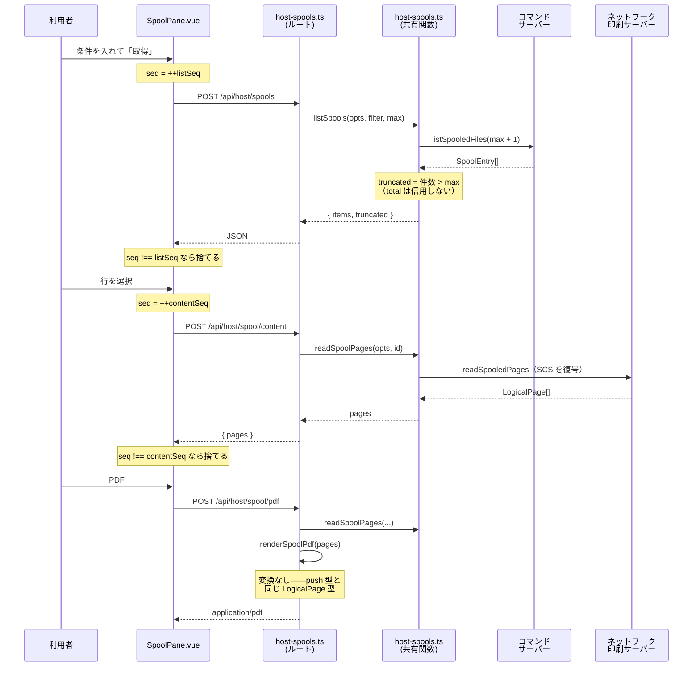
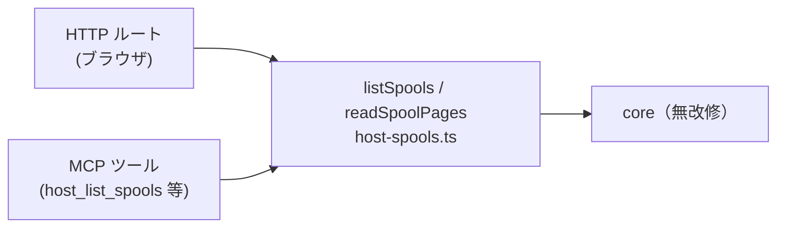

# レビューガイド: pull 型スプール取得の Web UI 対応

## 変更概要 / 目的

**ブラウザから既存スプールを検索・閲覧・PDF 化できるようにする。**

pull 型のバックエンドは `20260718-hostserver-spool` で完成していたが、**MCP ツール境界で止まっており**、
ブラウザ利用者は過去のスプールを一切参照できなかった。今回それを HTTP ルートと専用ペインで繋いだ。

### 前提: スプール機構は 2 系統ある（ここを取り違えると差分が読めない）

| | **push 型**（既存） | **pull 型**（今回） |
|---|---|---|
| 取得元 | プリンターセッションが**開いている間に受信した**帳票 | 任意の OUTQ にある**既存の**スプール |
| 過去のスプール | **取れない** | 取れる |
| 経路 | TN5250E プリンターセッション | ホストサーバー（コマンド／ネットワーク印刷） |
| UI | `PrinterPane.vue` | `SpoolPane.vue`（新規） |
| ルート | `GET /api/spool/:sessionId/:spoolId/pdf` | `POST /api/host/spool*`（新規） |

**両者は並存する。** push 型には一切手を入れていない。
既存 PDF ルートを流用しなかったのは、あれがセッション内メモリの `entry.reports` を引く実装で
pull 型の識別子を解決できないため。

---

## 重要ポイント（特に見てほしい所）

### ① `LIST_INFO.total` は「使ってはいけない」フィールド ← **最重要**

`packages/core/src/hostserver/spool/spool-list.ts:29-38`

当初の設計（spec 方針5）は、QGYOLSPL のリスト情報 offset 0 を「一致総数」とみなし、
UI に `1234 件中 100 件を表示` と出すものだった。定数 `LIST_INFO = { total: 0, … }` が
**定義済みで未使用**だったため「想定内の拡張」と判断した。

**実機で否定された。** PUB400（スプール 3 件）での実測:

| 要求 `max` | `returned` | `total` |
|---|---|---|
| 1 | 1 | **1** |
| 2 | 2 | **2** |
| 3 | 3 | 3 |

`total` は常に `returned` と同値だった。オープンリスト API は非同期に構築するため、
要求分しか作られていない時点では総数が確定していないと思われる。

これを信じると **`truncated` が常に false** になり、利用者は
「先頭 N 件しか見ていない」ことに気づけない——**黙って害が出る偽陰性**である。

→ `max + 1` 件要求して超過を見る方式へ退避した（`host-sql.ts:219` と同じ流儀）。
→ core には**この値を使ってはいけない理由**をコメントで残した。次に同じ推測をしないため。

**core の差分はこのコメントだけ**（動作は変更していない）。詳細は decisions.md D4。

### ② 接続種別が用途で違う（このモジュールの肝）

`packages/server/src/host-spools.ts:63,88`

- **一覧** → コマンドサーバー（`openCommand`）
- **本文・PDF** → ネットワーク印刷サーバー（`openNetPrint`）

この非対称はサーバー側で吸収しており、UI からは見えない。
なお **HTTP から `openNetPrint` を呼ぶのは本 PR が初**（従来は MCP のみ）。

### ③ `spoolCcsid` は 5250 の `ccsid` と**別物**（流用が禁止されている）

`packages/server/src/config-types.ts:51`

`host-connect.ts:64-70` が明記している——「5250 の CCSID は画面の文字変換用で、
スプールの SCS とは別の設定」。`20260718-hostserver-spool` の決定であり、
`hostAuthFrom()` が host/user/password/tls しか拾わないことで**コードでも強制**されている。

そのため既存 `ccsid` を流用せず、**システム階層に新設**した
（AGENTS.md §2「システム＝どこへ・誰として」。pull 型はセッションに紐づかないため）。
**信頼設定ではない**（コードページ番号のみ）ので `printer` のようなサーバー設定限定ゲートは付けていない。

`config-resolver.ts:128-130` で `ccsid` からのフォールバックを**意図的にしていない**点に注目。

### ④ 応答の追い越しガード（トークン方式）

`packages/web-ui/src/components/SpoolPane.vue:67-68,133,199,275`

一覧も本文も毎回ホストへ新規接続する（秒単位）ため、続けて操作すると**応答が逆順で返りうる**。
素朴に書くと「見出しは B なのに本文は A」という、**別のスプールの中身を別のファイル名で見せる**
状態になり、しかもエラーが出ないので気づけない。

単調増加の通し番号で最新以外を捨てている。**`watch` でも番号を進めている**のが要点
（`:275-276`）——ここを進めないと、システム切替時に飛んでいる応答が旧システムの行を書き戻し、
その行を押すと**新システムに旧システムの id を送る**ことになる。

---

## 処理フロー

### 共有関数を単一経路にしている理由

`host-upload.ts` の先例に倣った（spec 方針1）。ロジックを二重に持つと片方だけ直す事故が起きる。

---

## 主要な変更箇所

### core（実質ほぼ無改修）

- `packages/core/src/hostserver/spool/spool-list.ts:29-38` — **コメントのみ**。`total` を使うなという警告
- `packages/core/src/session/session.ts:25-31` — `ConnectOptions.spoolCcsid`（decisions D1）

### server

- `packages/server/src/host-spools.ts`（**新規**）— 共有関数＋ルート 3 本
  - `:68` `assertMax` を `openCommand` の**前**に置く（失敗経路で接続を作らない）
  - `:74-76` `max + 1` 方式の打ち切り判定
  - `:93` CCSID の解決順（引数 → `spoolCcsid` → 273）
  - `:110-117` `assertMax` の理由——**HTTP と MCP は別々の zod スキーマを持つので、
    将来ずれても上限をここ 1 か所で守る**ため（「MCP は zod を通らない」ではない。
    `registerTool` は `inputSchema` を検証する）
  - `:214-233` PDF。ファイル名を**サニタイズしてから** `Content-Disposition` に埋める
- `packages/server/src/host-server-tools.ts` — MCP を共有関数へ寄せた。**外部スキーマは不変**
- config 5 箇所（`config-types` / `config-routes` / `config-store` / `config-resolver` ＋ web-ui）

### web-ui

- `packages/web-ui/src/components/SpoolPane.vue`（**新規**）
  - `:290,311` 列幅は `<th>` と `<td>` の**両方**に当てる
    （片方だけだと `max-width` が既定のままで、広げても隠れた文字が出ない。
    `useColumnWidths.ts:42-44` が明記している落とし穴）
  - `:241-247` PDF 失敗を**黙らせない**（`PrinterPane.vue:152` の無言 `return` を繰り返さない）
- ペイン登録 5 箇所（`paneLabels` / `WorkspaceNode` / `LauncherPane`）——
  **登録漏れは既知のバグ源**（`paneLabels.ts:5-7` が過去のバグを記録）

---

## リスク / 確認してほしい点

### 実機で確認済み

PUB400 の既存スプール 3 件（`QGPL/MARO`）に対して検証した。**新規オブジェクトは作成していない**。

| 項目 | 結果 |
|---|---|
| 打ち切り（max=1/2/3/100） | `truncated` が正しく true/true/false/false |
| 本文 | 3 ページ・62 行 × 130 桁、桁揃いも保持 |
| PDF | 13,330 バイト・3 ページ |
| エラー伝播 | `502 PROTOCOL_ERROR`（`rc=0x0009`）でホストの理由がそのまま出る |
| MCP 非退行 | `{items, count}` のまま（`truncated` を漏らしていない） |

### 未検証（既知の制限）

- **DBCS の PDF 目視** — 実機で使えたスプールが全て SBCS（英数字の Data Description リスト）で、
  **日本語を含む PDF を確認できていない**。CJK フォントの読み込み自体は成功している
  （`renderSpoolPdf` の warn なし）が、「日本語が正しく出る」ことは未確認。
- **権限不足（FORBIDDEN）の実機再現** — PUB400 で他人のスプールに触れる手段がなく未実施。
  存在しないスプールでのエラー伝播は確認済み。

### 判断を仰ぎたい点

- **総件数を出せない**ことの受け入れ可否。`truncated` は正確だが「あと何件あるか」は言えない。
  QGYGTLE でハンドルを使った継続取得なら確定する可能性はあるが、
  原典（JTOpen）の確認からやり直しになるため見送った（backlog 候補）。
- **見送った nit**（review.md 参照）:
  - `.error` の生色 `#c62828` — リポジトリ全体の既存の逸脱（`HostListPane` 等 4 箇所が同値）。
    本 PR だけ直すと不揃いになるため別課題とした
  - `host-upload.ts:96-98` の「MCP は zod を通らない」という記述も同様に誤りだが、本作業のスコープ外

### レビューの観点として

**テストが空振りしていないことを確認済み。** 競合状態の回帰テストはガードを一時的に外して
実際に失敗することを確かめた。`total` の件で「実機では起こらない状態を前提にしたテストが
緑になる」失敗をしているため、この確認を必須にしている。
