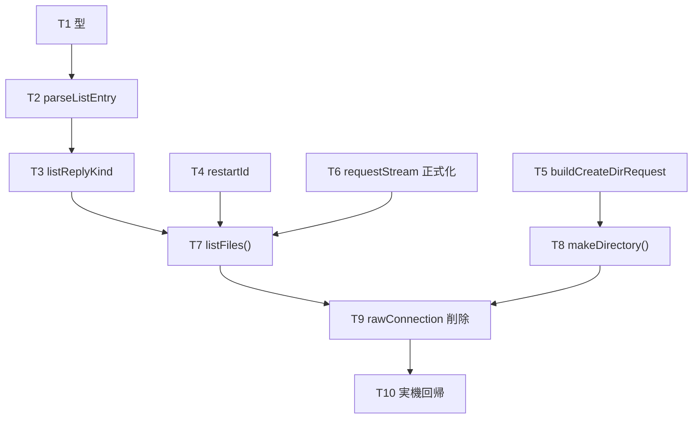

# 計画: 01-core-listfiles（プロトコル層 + 接続層）

親 plan（`../plan.md`）が確定させた割れ目のうち、**core だけ**を担う。
scope は親で凍結済みなので、ここでは自分の slice の分解だけを行う。

## 実装方針

**解析（I/O なし）を先に、接続（I/O あり）を後に。** 解析は `research.md` F1-3 の実機 hex ダンプを
固定データにして単体テストできるため、実機に触れずに緑にできる。接続層はその上に乗せる。

spike で既に入っているものは**ゼロから書かない**。次の状態から始める。

| 対象 | spike の状態 | この subtask ですること |
|---|---|---|
| `transport/host-connection.ts` の `requestStream` | 実装済み | 連鎖の規約をコメントで明文化し、テストを足す |
| `frame-trace.ts` の追従 | 実装済み | テストを足す |
| `buildListFilesRequest` | 実装済み | `restartId` の追加とテスト |
| `IfsConnection.rawConnection` | spike 用に露出 | **削除する** |
| `parseListEntry` / `listReplyKind` | 未実装 | 新規 |
| `buildCreateDirRequest` / `makeDirectory` | 未実装 | 新規 |
| `listFiles()` | 未実装（spike は生接続で代用） | 新規 |

## 作業順序と依存関係

T5 は他と独立なので、いつ着手してもよい。

## リスク / 留意点

design.md が定めた規約を実装で守ること。**どれも実機で確かめた事実に基づく**。

- **終端は `0x8001`（rc=18）で判定する。連鎖指示では判定しない** — 最後のエントリでも
  連鎖指示は `0x0001` のままで 0 に落ちない。連鎖ビットで書くと**来ないフレームを待ってハングする**
- **`templateLength` は宣言値を読む。92 を埋め込まない** — 実機は 93 を返す。
  固定値だと LL を 1 バイトずれて読み、名前が空になる
- **固定属性は offset 50 の 4 バイト** — 2 バイトで読むと全エントリ 0 になる
- **mkdir の CP は `0x0001`**（ファイル名の `0x0002` ではない）。形が似た `buildDeleteRequest` からの
  コピペで壊れる
- **`0x8001` は mkdir では正常応答**（rc=0 が成功）。既存 `replyReturnCode` の使い方と噛み合わない
- **連鎖は必ず終端まで読み切る。途中で放棄したら接続を破棄する** — 残骸が次の要求の応答として
  読まれ、症状が別の場所に出る
- **`.` と `..` を除外する**

## テスト方針

- `parseListEntry` は `research.md` F1-3 の実機 hex ダンプ（`hello.txt` / `subdir` / `link.txt`）を
  固定データにして、種別・サイズ・更新日時・symlink・名前を検証する
- 終端判定は `0x8001` rc=18 のフレーム（同じくダンプにある 24 バイト）を使う
- `requestStream` は偽の `HostConnection` ではなくソケットの `data` を模したテストで、
  **連鎖の残骸が次の要求に混ざらないこと**を確かめる
- 実機確認（T10）は `npm run ifs-list` を `listFiles()` 経由に切り替えて再実行し、
  spike と同じ 4 エントリ（`.`/`..` 除外後）が返ることを見る
