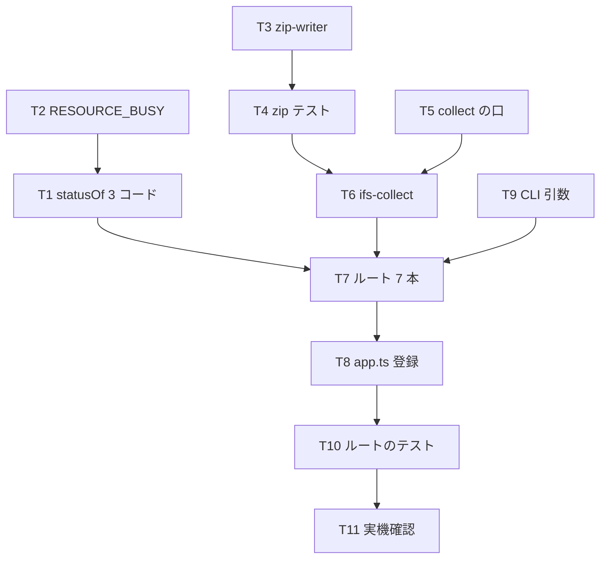

# 計画: 02-server-api（zip-writer + /api/host/ifs/*）

親 plan（`../plan.md`）が確定させた割れ目のうち、**server だけ**を担う。
scope は親で凍結済みなので、ここでは自分の slice の分解だけを行う。

## 実装方針

**IFS を知らない部品から先に作る。** `zip-writer.ts` は「名前とバイト列の配列 → ZIP」だけを担い、
実機どころか IFS の型にも触れない。`unzip -t` で正しさを確かめられるので、01 の完了を待たずに単体で緑にできる。

その上に「集める」層（`ifs-collect.ts`）、さらに上に「公開する」層（`host-ifs.ts`）を重ねる。

### `ifs-collect` は `IfsConnection` を直接受け取らない

必要なのは `listFiles` と `readFile` の 2 つだけ。具象クラスを要求すると、
テストのたびに実接続かそれに準ずるものを用意することになる。
**必要な操作だけを表す narrow な interface を受け取る**形にして、
プレーンなオブジェクトで再帰収集と上限判定をテストできるようにする。

01 の review で「`listFiles` が単体テストできない構造だった」ことが最大の指摘だったので、
同じ轍を踏まない。

## 作業順序と依存関係

T3〜T4（zip-writer）は他と独立なので、いつ着手してもよい。

## リスク / 留意点

### 申し送りの前提に誤りがあった（D11 の訂正が要る）

D11 は「rc=1（使用中）/ 32（共有違反）/ 33（ロック違反）の写像は 02 で決める」としていたが、
**core はこれらを `PROTOCOL_ERROR` で投げており、`statusOf()` は `e.code` で分岐する**。
02 の中だけでは区別できない。写像するなら core にコードを足す必要がある（T2）。

### 01 から引き継いだ、誤用しやすい点

- **`hasMore` が true でも `entries` が空になりうる**（`.` と `..` が件数上限を消費する）。
  「空 = 終わり」と解釈すると、ディレクトリが空に見える
- **`canContinue` を見ずに `nextRestartId` を渡し続けると `/QSYS.LIB` で無限ループする**。
  `ifs-collect` の再帰はここを踏みやすい

### zip の上限は「読む前」に効かせる

実効スループット約 100KB/s。500MB を読み切ってから「大きすぎます」と言うのは
利用者を 80 分待たせてから断ることになる。**一覧が返すサイズを積算して、
中身を 1 バイトも読まずに拒否する**（design の判断）。

### ZIP の非対応を明示する

zip64 は実装しない。`--ifs-zip-max-bytes` に 4GB 以上を指定したら**起動時に弾く**
（実行時に壊れた ZIP を作るより、起動時に落とす方が安全）。

### 01 の教訓

- 実機のプロトコルの事実は**類推で決めない**。01 では成功応答の ID を揃っていると思い込んで
  書き込みを全滅させた
- **テストが本体を通っているか変異させて確かめる**。判定式をテストに写すと、本体を壊しても緑になる

## テスト方針

| 層 | 実機なしで確かめること | 実機で確かめること |
|---|---|---|
| `zip-writer` | 生成した ZIP を **`unzip -t` に通す**。非 ASCII 名、空ディレクトリ、圧縮が効かないデータ、格納への切り替え | — |
| `ifs-collect` | 偽の口で再帰収集・上限超過の拒否・`hasMore`/`canContinue` の扱い | — |
| ルート | `buildApp()` + `app.request()` で入力検証とステータス固定。413 の中身 | 7 ルートすべてを実 IFS に当てる |
| 全体 | — | zip を落として展開し、中身が一致すること |
